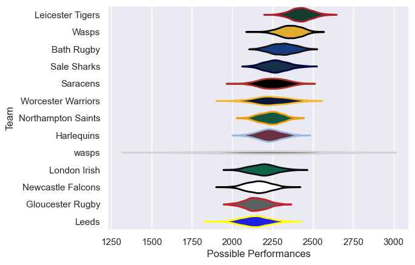

---  
title: "Gallagher Premiership 04/05 Status"  
date: 2025-07-28 6:00:00 -0500  
categories: model review projection  
layout: article  
aside:  
    toc: true  
---
# Current Team Rankings

# Standings

## Current Standings

| Club               |   Played |   Wins |   Point Differential |   Losing Bonus Points | Try Bonus Points   |   Competition Points |
|:-------------------|---------:|-------:|---------------------:|----------------------:|:-------------------|---------------------:|
| Wasps              |       23 |     16 |                  144 |                     5 |                    |                   71 |
| Leicester Tigers   |       23 |     15 |                  317 |                     3 |                    |                   69 |
| Saracens           |       24 |     14 |                  -18 |                     2 |                    |                   62 |
| Bath Rugby         |       22 |     12 |                   41 |                     5 |                    |                   57 |
| Sale Sharks        |       23 |     13 |                   50 |                     4 |                    |                   56 |
| Gloucester Rugby   |       24 |     11 |                  -81 |                     2 |                    |                   48 |
| Newcastle Falcons  |       23 |      9 |                 -128 |                     5 |                    |                   45 |
| Leeds              |       22 |      9 |                  -51 |                     6 |                    |                   42 |
| Worcester Warriors |       23 |      9 |                 -146 |                     5 |                    |                   41 |
| London Irish       |       22 |      8 |                  -43 |                     7 |                    |                   39 |
| Northampton Saints |       22 |      8 |                  -63 |                     6 |                    |                   38 |
| Harlequins         |       22 |      6 |                  -43 |                     9 |                    |                   35 |
| wasps              |        1 |      1 |                   21 |                     0 |                    |                    4 |

# Completed Match Review

| Model | Percent Correct Predictions | Spread Error |
| ------ | ------ | ------ |
| Club Level | 57.7% | 10.9 |
| Player Level: Lineup | nan% | nan |
| Player Level: Minutes | nan% | nan |

