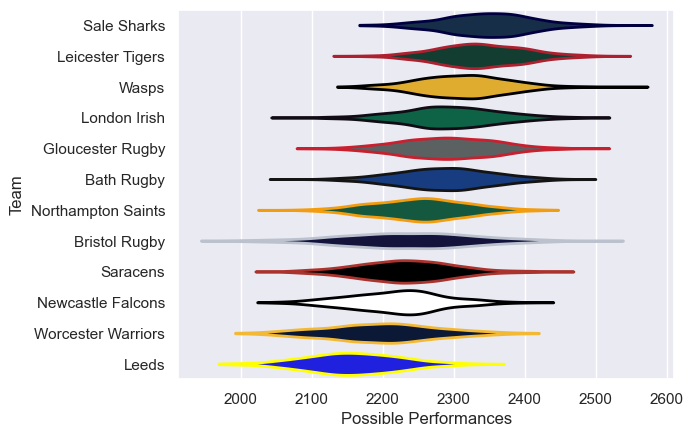

---  
title: "Gallagher Premiership 05/06"  
date: 2025-07-29 6:00:00 -0500  
categories: model review projection  
layout: article  
aside:  
    toc: true  
---
# Current Team Rankings

# Standings

## Current Standings

| Club               |   Played |   Wins |   Point Differential |   Losing Bonus Points |   Try Bonus Points |   Competition Points |
|:-------------------|---------:|-------:|---------------------:|----------------------:|-------------------:|---------------------:|
| Sale Sharks        |       24 |     18 |                  164 |                     2 |                  1 |                   77 |
| Leicester Tigers   |       24 |     15 |                  110 |                     1 |                    |                   67 |
| London Irish       |       23 |     14 |                    7 |                     4 |                    |                   60 |
| Wasps              |       23 |     12 |                   70 |                     3 |                    |                   57 |
| Gloucester Rugby   |       22 |     11 |                   98 |                     9 |                    |                   55 |
| Northampton Saints |       22 |     10 |                  -24 |                     7 |                    |                   49 |
| Newcastle Falcons  |       22 |      9 |                  -17 |                     6 |                    |                   44 |
| Worcester Warriors |       22 |      9 |                  -43 |                     6 |                    |                   44 |
| Bath Rugby         |       22 |      9 |                  -53 |                     5 |                    |                   43 |
| Saracens           |       22 |      8 |                  -50 |                     7 |                    |                   41 |
| Bristol Rugby      |       22 |      8 |                  -52 |                     7 |                    |                   41 |
| Leeds              |       22 |      5 |                 -210 |                     7 |                    |                   27 |

# Completed Match Review

| Model | Percent Correct Predictions | Spread Error |
| ------ | ------ | ------ |
| Club Level | 59.3% | 10.2 |
| Player Level: Lineup | nan% | nan |
| Player Level: Minutes | nan% | nan |

