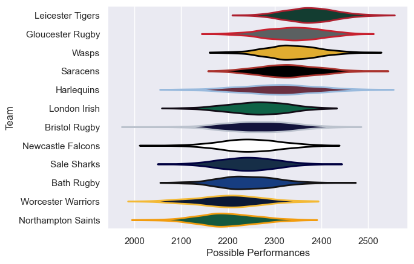

---  
title: "Gallagher Premiership 06/07"  
date: 2025-07-29 6:00:00 -0500  
categories: model review projection  
layout: article  
aside:  
    toc: true  
---
# Current Team Rankings

# Standings

## Current Standings

| Club               |   Played |   Wins |   Point Differential |   Losing Bonus Points |   Try Bonus Points |   Competition Points |
|:-------------------|---------:|-------:|---------------------:|----------------------:|-------------------:|---------------------:|
| Leicester Tigers   |       24 |     16 |                  153 |                     5 |                  1 |                   72 |
| Gloucester Rugby   |       24 |     16 |                  140 |                     4 |                    |                   72 |
| Bristol Rugby      |       23 |     14 |                   -8 |                     3 |                    |                   61 |
| Saracens           |       23 |     12 |                   99 |                     4 |                    |                   56 |
| Wasps              |       22 |     12 |                   73 |                     6 |                    |                   56 |
| London Irish       |       22 |     12 |                   -9 |                     2 |                    |                   50 |
| Harlequins         |       22 |     10 |                   65 |                     6 |                    |                   46 |
| Bath Rugby         |       22 |      8 |                  -64 |                     7 |                    |                   43 |
| Newcastle Falcons  |       22 |      9 |                  -93 |                     6 |                    |                   42 |
| Sale Sharks        |       22 |      8 |                  -86 |                     6 |                    |                   40 |
| Worcester Warriors |       22 |      6 |                 -113 |                     8 |                    |                   34 |
| Northampton Saints |       22 |      6 |                 -157 |                     6 |                    |                   32 |

# Completed Match Review

| Model | Percent Correct Predictions | Spread Error |
| ------ | ------ | ------ |
| Club Level | 68.1% | 9.2 |
| Player Level: Lineup | nan% | nan |
| Player Level: Minutes | nan% | nan |

