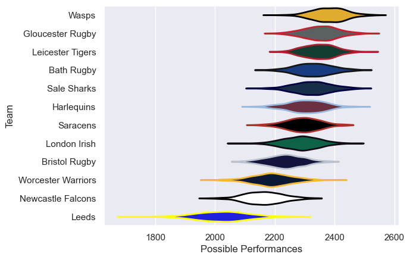

---  
title: "Gallagher Premiership 07/08"  
date: 2025-07-29 6:00:00 -0500  
categories: model review projection  
layout: article  
aside:  
    toc: true  
---
# Current Team Rankings

# Standings

## Current Standings

| Club               |   Played |   Wins |   Point Differential |   Losing Bonus Points | Try Bonus Points   |   Competition Points |
|:-------------------|---------:|-------:|---------------------:|----------------------:|:-------------------|---------------------:|
| Wasps              |       24 |     16 |                  161 |                     3 |                    |                   71 |
| Gloucester Rugby   |       23 |     15 |                  173 |                     8 |                    |                   68 |
| Bath Rugby         |       23 |     15 |                  128 |                     3 |                    |                   63 |
| Leicester Tigers   |       24 |     14 |                  102 |                     6 |                    |                   62 |
| Sale Sharks        |       22 |     14 |                  107 |                     3 |                    |                   59 |
| London Irish       |       22 |     13 |                   51 |                     5 |                    |                   57 |
| Harlequins         |       22 |     12 |                   40 |                     8 |                    |                   56 |
| Saracens           |       22 |     11 |                    8 |                     5 |                    |                   49 |
| Bristol Rugby      |       22 |      7 |                  -80 |                     5 |                    |                   35 |
| Worcester Warriors |       22 |      6 |                  -85 |                     7 |                    |                   35 |
| Newcastle Falcons  |       22 |      7 |                 -209 |                     5 |                    |                   33 |
| Leeds              |       22 |      2 |                 -396 |                     2 |                    |                   12 |

# Completed Match Review

| Model | Percent Correct Predictions | Spread Error |
| ------ | ------ | ------ |
| Club Level | 67.4% | 9.9 |
| Player Level: Lineup | nan% | nan |
| Player Level: Minutes | nan% | nan |

