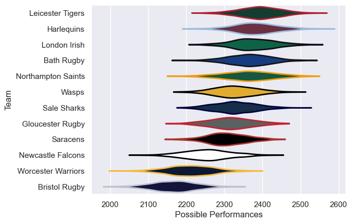

---  
title: "Gallagher Premiership 08/09 Status"  
date: 2025-07-28 6:00:00 -0500  
categories: model review projection  
layout: article  
aside:  
    toc: true  
---
# Current Team Rankings

# Standings

## Current Standings

| Club               |   Played |   Wins |   Point Differential |   Losing Bonus Points |   Try Bonus Points |   Competition Points |
|:-------------------|---------:|-------:|---------------------:|----------------------:|-------------------:|---------------------:|
| Leicester Tigers   |       24 |     17 |                  196 |                     4 |                  5 |                   79 |
| London Irish       |       24 |     13 |                  181 |                    10 |                  7 |                   71 |
| Harlequins         |       23 |     14 |                  115 |                     3 |                  5 |                   66 |
| Bath Rugby         |       23 |     13 |                   84 |                     5 |                  4 |                   65 |
| Sale Sharks        |       22 |     13 |                   37 |                     5 |                  4 |                   61 |
| Gloucester Rugby   |       22 |     12 |                  -13 |                     4 |                  5 |                   57 |
| Wasps              |       22 |     11 |                   15 |                     7 |                  2 |                   53 |
| Northampton Saints |       22 |     10 |                    9 |                     5 |                  2 |                   49 |
| Saracens           |       22 |      9 |                  -10 |                     8 |                  3 |                   47 |
| Newcastle Falcons  |       22 |      9 |                  -94 |                     4 |                  2 |                   44 |
| Worcester Warriors |       22 |      7 |                 -182 |                     2 |                    |                   34 |
| Bristol Rugby      |       22 |      2 |                 -338 |                     6 |                  1 |                   17 |

# Completed Match Review

| Model | Percent Correct Predictions | Spread Error |
| ------ | ------ | ------ |
| Club Level | 71.1% | 9.0 |
| Player Level: Lineup | nan% | nan |
| Player Level: Minutes | nan% | nan |

