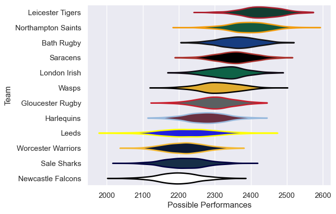

---  
title: "Gallagher Premiership 09/10 Status"  
date: 2025-07-28 6:00:00 -0500  
categories: model review projection  
layout: article  
aside:  
    toc: true  
---
# Current Team Rankings

# Standings

## Current Standings

| Club               |   Played |   Wins |   Point Differential |   Losing Bonus Points |   Try Bonus Points |   Competition Points |
|:-------------------|---------:|-------:|---------------------:|----------------------:|-------------------:|---------------------:|
| Leicester Tigers   |       24 |     17 |                  231 |                     4 |                  5 |                   79 |
| Saracens           |       24 |     16 |                  109 |                     6 |                  2 |                   74 |
| Northampton Saints |       23 |     16 |                  148 |                     6 |                  2 |                   72 |
| Bath Rugby         |       23 |     12 |                   75 |                     4 |                  5 |                   61 |
| Wasps              |       22 |     13 |                   -5 |                     3 |                  1 |                   56 |
| London Irish       |       22 |     10 |                   85 |                     3 |                  3 |                   52 |
| Gloucester Rugby   |       22 |     10 |                   13 |                     4 |                  2 |                   48 |
| Harlequins         |       22 |      9 |                  -64 |                     3 |                  3 |                   46 |
| Newcastle Falcons  |       22 |      6 |                 -112 |                     4 |                  1 |                   37 |
| Leeds              |       22 |      7 |                 -210 |                     6 |                    |                   36 |
| Sale Sharks        |       22 |      6 |                 -162 |                     6 |                    |                   32 |
| Worcester Warriors |       22 |      3 |                 -108 |                     8 |                    |                   28 |

# Completed Match Review

| Model | Percent Correct Predictions | Spread Error |
| ------ | ------ | ------ |
| Club Level | 65.9% | 9.7 |
| Player Level: Lineup | nan% | nan |
| Player Level: Minutes | nan% | nan |

