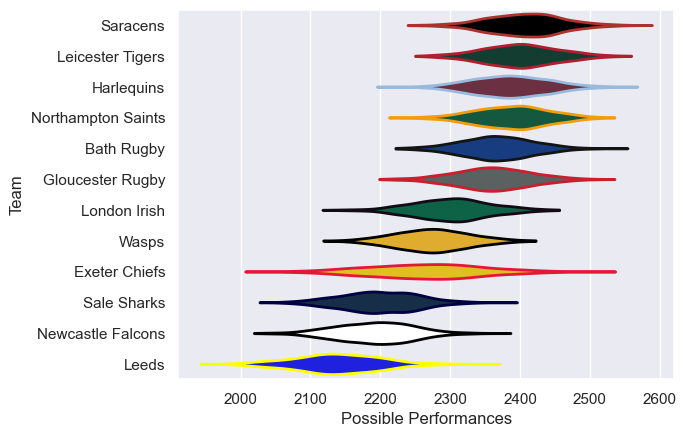

---  
title: "Gallagher Premiership 10/11"  
date: 2025-07-29 6:00:00 -0500  
categories: model review projection  
layout: article  
aside:  
    toc: true  
---
# Current Team Rankings

# Standings

## Current Standings

| Club               |   Played |   Wins |   Point Differential |   Losing Bonus Points |   Try Bonus Points |   Competition Points |
|:-------------------|---------:|-------:|---------------------:|----------------------:|-------------------:|---------------------:|
| Saracens           |       24 |     20 |                  172 |                     2 |                  2 |                   84 |
| Leicester Tigers   |       24 |     17 |                  195 |                     5 |                  7 |                   82 |
| Gloucester Rugby   |       23 |     14 |                   74 |                     5 |                  5 |                   68 |
| Northampton Saints |       23 |     14 |                   95 |                     3 |                  6 |                   65 |
| Bath Rugby         |       22 |     13 |                   60 |                     3 |                  5 |                   62 |
| London Irish       |       22 |     11 |                   64 |                     4 |                  6 |                   54 |
| Harlequins         |       22 |      9 |                   98 |                     8 |                  3 |                   51 |
| Exeter Chiefs      |       22 |     10 |                  -32 |                     5 |                    |                   45 |
| Wasps              |       22 |      9 |                  -72 |                     4 |                  1 |                   43 |
| Sale Sharks        |       22 |      6 |                 -186 |                     5 |                  1 |                   32 |
| Newcastle Falcons  |       22 |      4 |                 -193 |                     5 |                    |                   23 |
| Leeds              |       22 |      4 |                 -275 |                     7 |                    |                   23 |

# Completed Match Review

| Model | Percent Correct Predictions | Spread Error |
| ------ | ------ | ------ |
| Club Level | 68.1% | 9.7 |
| Player Level: Lineup | nan% | nan |
| Player Level: Minutes | nan% | nan |

