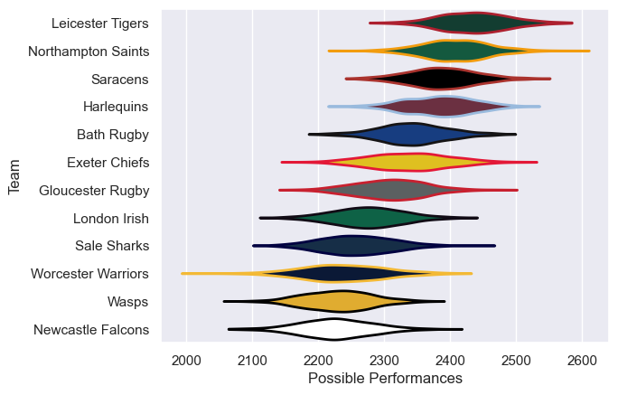

---  
title: "Gallagher Premiership 11/12 Status"  
date: 2025-07-28 6:00:00 -0500  
categories: model review projection  
layout: article  
aside:  
    toc: true  
---
# Current Team Rankings

# Standings

## Current Standings

| Club               |   Played |   Wins |   Point Differential |   Losing Bonus Points |   Try Bonus Points |   Competition Points |
|:-------------------|---------:|-------:|---------------------:|----------------------:|-------------------:|---------------------:|
| Harlequins         |       24 |     19 |                  146 |                     1 |                  4 |                   83 |
| Leicester Tigers   |       24 |     16 |                  174 |                     4 |                  9 |                   79 |
| Saracens           |       23 |     16 |                  130 |                     4 |                  3 |                   73 |
| Northampton Saints |       23 |     14 |                  163 |                     5 |                  5 |                   66 |
| Exeter Chiefs      |       22 |     12 |                   15 |                     8 |                  3 |                   59 |
| Sale Sharks        |       22 |     10 |                  -85 |                     7 |                  2 |                   49 |
| London Irish       |       22 |      8 |                   -2 |                     9 |                  2 |                   45 |
| Gloucester Rugby   |       22 |      8 |                  -51 |                     9 |                  1 |                   44 |
| Bath Rugby         |       22 |      9 |                  -47 |                     6 |                  1 |                   43 |
| Worcester Warriors |       22 |      7 |                 -126 |                     6 |                    |                   36 |
| Wasps              |       22 |      6 |                 -139 |                     8 |                  1 |                   33 |
| Newcastle Falcons  |       22 |      6 |                 -178 |                     4 |                    |                   32 |

# Completed Match Review

| Model | Percent Correct Predictions | Spread Error |
| ------ | ------ | ------ |
| Club Level | 63.0% | 9.0 |
| Player Level: Lineup | nan% | nan |
| Player Level: Minutes | nan% | nan |

