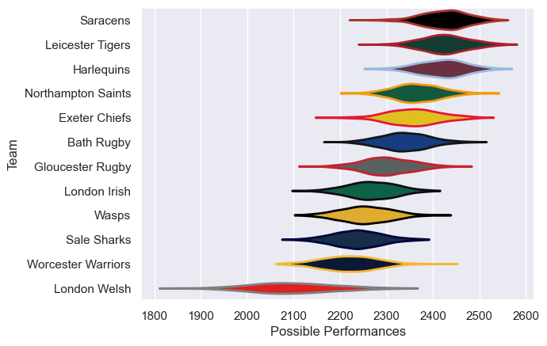

---  
title: "Gallagher Premiership 12/13 Status"  
date: 2025-07-28 6:00:00 -0500  
categories: model review projection  
layout: article  
aside:  
    toc: true  
---
# Current Team Rankings

# Standings

## Current Standings

| Club               |   Played |   Wins |   Point Differential |   Losing Bonus Points |   Try Bonus Points |   Competition Points |
|:-------------------|---------:|-------:|---------------------:|----------------------:|-------------------:|---------------------:|
| Leicester Tigers   |       25 |     16 |                  210 |                     5 |                  7 |                   82 |
| Saracens           |       23 |     17 |                  180 |                     2 |                  4 |                   76 |
| Harlequins         |       23 |     15 |                   90 |                     4 |                  5 |                   69 |
| Northampton Saints |       23 |     15 |                   82 |                     3 |                  5 |                   68 |
| Gloucester Rugby   |       22 |     12 |                   34 |                     8 |                  2 |                   60 |
| Exeter Chiefs      |       22 |     12 |                   96 |                     5 |                  4 |                   59 |
| Bath Rugby         |       22 |     10 |                   18 |                     7 |                  3 |                   52 |
| Wasps              |       22 |      9 |                  -17 |                     8 |                  4 |                   48 |
| London Irish       |       22 |      7 |                 -142 |                     3 |                  2 |                   35 |
| Sale Sharks        |       22 |      7 |                 -219 |                     3 |                  2 |                   35 |
| Worcester Warriors |       22 |      5 |                 -125 |                     8 |                  3 |                   33 |
| London Welsh       |       22 |      5 |                 -207 |                     7 |                  1 |                   28 |

# Completed Match Review

| Model | Percent Correct Predictions | Spread Error |
| ------ | ------ | ------ |
| Club Level | 71.1% | 9.5 |
| Player Level: Lineup | nan% | nan |
| Player Level: Minutes | nan% | nan |

