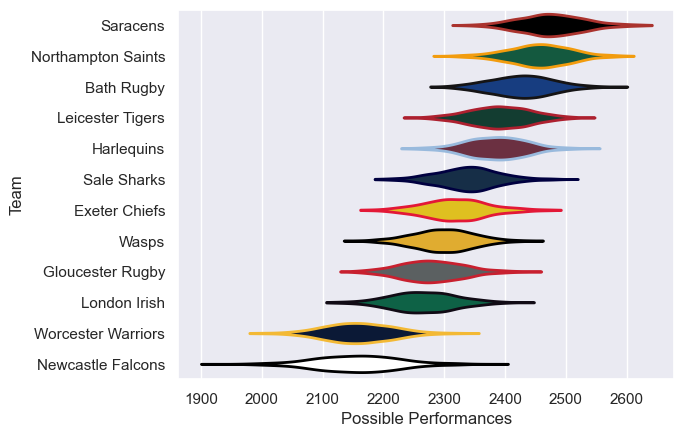

---  
title: "Gallagher Premiership 13/14 Status"  
date: 2025-07-28 6:00:00 -0500  
categories: model review projection  
layout: article  
aside:  
    toc: true  
---
# Current Team Rankings

# Standings

## Current Standings

| Club               |   Played |   Wins |   Point Differential |   Losing Bonus Points |   Try Bonus Points |   Competition Points |
|:-------------------|---------:|-------:|---------------------:|----------------------:|-------------------:|---------------------:|
| Saracens           |       24 |     20 |                  286 |                     2 |                  9 |                   91 |
| Northampton Saints |       24 |     18 |                  259 |                     3 |                  7 |                   86 |
| Leicester Tigers   |       23 |     15 |                  111 |                     4 |                  6 |                   74 |
| Bath Rugby         |       22 |     14 |                  107 |                     3 |                  4 |                   67 |
| Harlequins         |       23 |     15 |                   58 |                     3 |                  4 |                   67 |
| Sale Sharks        |       22 |     12 |                   33 |                     6 |                  3 |                   57 |
| Wasps              |       22 |      9 |                  -82 |                     9 |                  4 |                   49 |
| Exeter Chiefs      |       22 |      9 |                  -54 |                     7 |                  2 |                   45 |
| Gloucester Rugby   |       22 |      8 |                  -99 |                     8 |                  4 |                   44 |
| London Irish       |       22 |      7 |                 -100 |                     6 |                  2 |                   36 |
| Newcastle Falcons  |       22 |      3 |                 -263 |                     8 |                  2 |                   22 |
| Worcester Warriors |       22 |      2 |                 -256 |                     7 |                  1 |                   16 |

# Completed Match Review

| Model | Percent Correct Predictions | Spread Error |
| ------ | ------ | ------ |
| Club Level | 69.6% | 9.0 |
| Player Level: Lineup | nan% | nan |
| Player Level: Minutes | nan% | nan |

