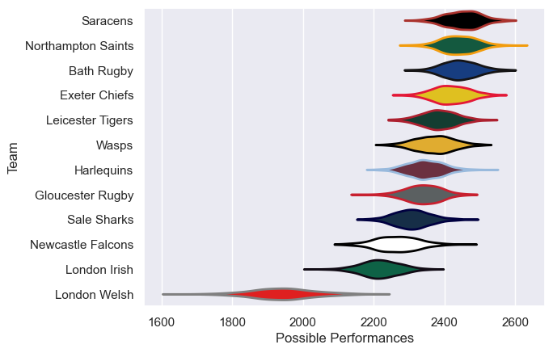

---  
title: "Gallagher Premiership 14/15 Status"  
date: 2025-07-28 6:00:00 -0500  
categories: model review projection  
layout: article  
aside:  
    toc: true  
---
# Current Team Rankings

# Standings

## Current Standings

| Club               |   Played |   Wins |   Point Differential |   Losing Bonus Points |   Try Bonus Points |   Competition Points |
|:-------------------|---------:|-------:|---------------------:|----------------------:|-------------------:|---------------------:|
| Bath Rugby         |       25 |     17 |                  248 |                     2 |                 10 |                   84 |
| Northampton Saints |       23 |     16 |                  216 |                     3 |                  7 |                   76 |
| Saracens           |       23 |     15 |                  251 |                     5 |                  4 |                   71 |
| Exeter Chiefs      |       22 |     14 |                  226 |                     7 |                  5 |                   68 |
| Leicester Tigers   |       23 |     15 |                   -5 |                     2 |                  4 |                   68 |
| Wasps              |       22 |     11 |                  145 |                     4 |                  8 |                   60 |
| Sale Sharks        |       22 |     11 |                   15 |                     4 |                  5 |                   53 |
| Harlequins         |       22 |     10 |                  -70 |                     5 |                  4 |                   49 |
| Gloucester Rugby   |       22 |      9 |                  -22 |                     6 |                  4 |                   48 |
| London Irish       |       22 |      7 |                 -136 |                     6 |                  4 |                   40 |
| Newcastle Falcons  |       22 |      5 |                  -70 |                     8 |                  4 |                   34 |
| London Welsh       |       22 |      0 |                 -798 |                     0 |                  1 |                    1 |

# Completed Match Review

| Model | Percent Correct Predictions | Spread Error |
| ------ | ------ | ------ |
| Club Level | 74.8% | 11.0 |
| Player Level: Lineup | nan% | nan |
| Player Level: Minutes | nan% | nan |

