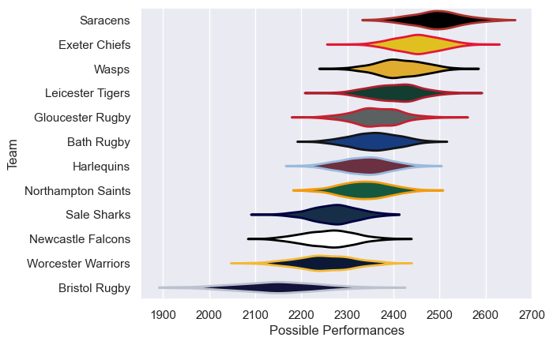

---  
title: "Gallagher Premiership 16/17 Status"  
date: 2025-07-28 6:00:00 -0500  
categories: model review projection  
layout: article  
aside:  
    toc: true  
---
# Current Team Rankings

# Standings

## Current Standings

| Club               |   Played |   Wins |   Point Differential |   Losing Bonus Points |   Try Bonus Points |   Competition Points |
|:-------------------|---------:|-------:|---------------------:|----------------------:|-------------------:|---------------------:|
| Exeter Chiefs      |       24 |     17 |                  220 |                     3 |                 13 |                   90 |
| Wasps              |       24 |     18 |                  189 |                     2 |                 12 |                   88 |
| Saracens           |       23 |     16 |                  232 |                     4 |                  8 |                   78 |
| Leicester Tigers   |       23 |     14 |                  121 |                     5 |                  5 |                   66 |
| Bath Rugby         |       22 |     12 |                   46 |                     6 |                  4 |                   58 |
| Harlequins         |       22 |     11 |                    6 |                     3 |                  5 |                   52 |
| Northampton Saints |       22 |     10 |                  -14 |                     7 |                  5 |                   52 |
| Newcastle Falcons  |       22 |     10 |                 -151 |                     4 |                  5 |                   49 |
| Gloucester Rugby   |       22 |      7 |                   -4 |                     8 |                  5 |                   45 |
| Sale Sharks        |       22 |      7 |                 -124 |                     4 |                  6 |                   40 |
| Worcester Warriors |       22 |      5 |                 -196 |                     4 |                  5 |                   33 |
| Bristol Rugby      |       22 |      3 |                 -325 |                     6 |                  2 |                   20 |

# Completed Match Review

| Model | Percent Correct Predictions | Spread Error |
| ------ | ------ | ------ |
| Club Level | 71.9% | 9.6 |
| Player Level: Lineup | nan% | nan |
| Player Level: Minutes | nan% | nan |

