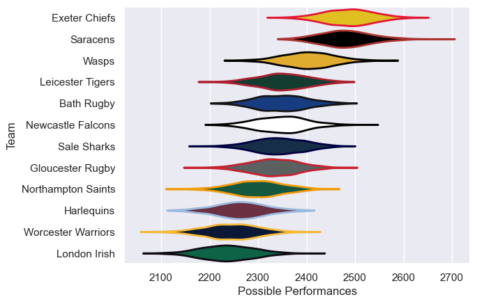

---  
title: "Gallagher Premiership 17/18 Status"  
date: 2025-07-28 6:00:00 -0500  
categories: model review projection  
layout: article  
aside:  
    toc: true  
---
# Current Team Rankings

# Standings

## Current Standings

| Club               |   Played |   Wins |   Point Differential |   Losing Bonus Points |   Try Bonus Points |   Competition Points |
|:-------------------|---------:|-------:|---------------------:|----------------------:|-------------------:|---------------------:|
| Saracens           |       24 |     18 |                  422 |                     3 |                 12 |                   87 |
| Exeter Chiefs      |       24 |     18 |                  278 |                     4 |                 11 |                   87 |
| Wasps              |       23 |     14 |                   90 |                     3 |                 11 |                   72 |
| Newcastle Falcons  |       23 |     14 |                  -82 |                     0 |                  7 |                   63 |
| Leicester Tigers   |       22 |     13 |                   65 |                     6 |                  4 |                   62 |
| Bath Rugby         |       22 |     11 |                   41 |                     4 |                  8 |                   56 |
| Gloucester Rugby   |       22 |     11 |                 -107 |                     2 |                  8 |                   56 |
| Sale Sharks        |       22 |     10 |                   25 |                     5 |                  9 |                   54 |
| Northampton Saints |       22 |      8 |                 -136 |                     6 |                  5 |                   43 |
| Harlequins         |       22 |      7 |                 -161 |                     3 |                  5 |                   36 |
| Worcester Warriors |       22 |      7 |                 -169 |                     3 |                  5 |                   36 |
| London Irish       |       22 |      3 |                 -266 |                     7 |                  3 |                   22 |

# Completed Match Review

| Model | Percent Correct Predictions | Spread Error |
| ------ | ------ | ------ |
| Club Level | 64.4% | 12.5 |
| Player Level: Lineup | nan% | nan |
| Player Level: Minutes | nan% | nan |

