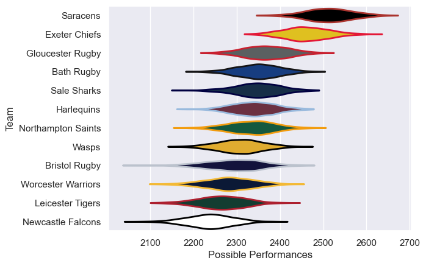

---  
title: "Gallagher Premiership 18/19 Status"  
date: 2025-07-28 6:00:00 -0500  
categories: model review projection  
layout: article  
aside:  
    toc: true  
---
# Current Team Rankings

# Standings

## Current Standings

| Club               |   Played |   Wins |   Point Differential |   Losing Bonus Points |   Try Bonus Points |   Competition Points |
|:-------------------|---------:|-------:|---------------------:|----------------------:|-------------------:|---------------------:|
| Exeter Chiefs      |       24 |     18 |                  219 |                     5 |                 13 |                   90 |
| Saracens           |       24 |     18 |                  232 |                     4 |                 12 |                   88 |
| Gloucester Rugby   |       23 |     13 |                   47 |                     4 |                 10 |                   68 |
| Northampton Saints |       23 |     11 |                   39 |                     4 |                  8 |                   56 |
| Harlequins         |       22 |     10 |                   16 |                     9 |                  7 |                   56 |
| Bath Rugby         |       22 |     10 |                    1 |                     6 |                  6 |                   56 |
| Sale Sharks        |       22 |     11 |                  -42 |                     4 |                  3 |                   55 |
| Wasps              |       22 |     10 |                  -69 |                     4 |                  7 |                   51 |
| Bristol Rugby      |       22 |      9 |                  -77 |                     7 |                  6 |                   51 |
| Worcester Warriors |       22 |      9 |                  -66 |                     4 |                  6 |                   46 |
| Leicester Tigers   |       22 |      7 |                 -154 |                     8 |                  5 |                   41 |
| Newcastle Falcons  |       22 |      6 |                 -146 |                     6 |                  1 |                   31 |

# Completed Match Review

| Model | Percent Correct Predictions | Spread Error |
| ------ | ------ | ------ |
| Club Level | 64.4% | 9.4 |
| Player Level: Lineup | nan% | nan |
| Player Level: Minutes | nan% | nan |

