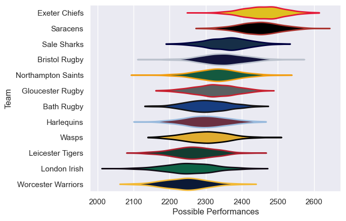

---  
title: "Gallagher Premiership 19/20"  
date: 2025-07-29 6:00:00 -0500  
categories: model review projection  
layout: article  
aside:  
    toc: true  
---
# Current Team Rankings

# Standings

## Current Standings

| Club               |   Played |   Wins |   Point Differential |   Losing Bonus Points |   Try Bonus Points |   Competition Points |
|:-------------------|---------:|-------:|---------------------:|----------------------:|-------------------:|---------------------:|
| Exeter Chiefs      |       13 |      8 |                  143 |                     4 |                  5 |                   43 |
| Saracens           |       13 |      9 |                   75 |                     2 |                  4 |                   42 |
| Sale Sharks        |       13 |      8 |                  144 |                     4 |                  4 |                   40 |
| Bristol Rugby      |       13 |      8 |                   25 |                     2 |                  2 |                   38 |
| Northampton Saints |       13 |      7 |                   -8 |                     3 |                  4 |                   35 |
| Wasps              |       13 |      6 |                   11 |                     3 |                  5 |                   32 |
| Bath Rugby         |       13 |      7 |                  -52 |                     1 |                  1 |                   30 |
| London Irish       |       13 |      5 |                  -78 |                     1 |                  5 |                   30 |
| Harlequins         |       13 |      5 |                  -52 |                     3 |                  2 |                   27 |
| Gloucester Rugby   |       13 |      4 |                  -14 |                     5 |                  5 |                   26 |
| Worcester Warriors |       13 |      4 |                  -99 |                     6 |                    |                   22 |
| Leicester Tigers   |       13 |      4 |                  -95 |                     1 |                  1 |                   20 |

# Completed Match Review

| Model | Percent Correct Predictions | Spread Error |
| ------ | ------ | ------ |
| Club Level | 62.8% | 12.1 |
| Player Level: Lineup | nan% | nan |
| Player Level: Minutes | nan% | nan |

