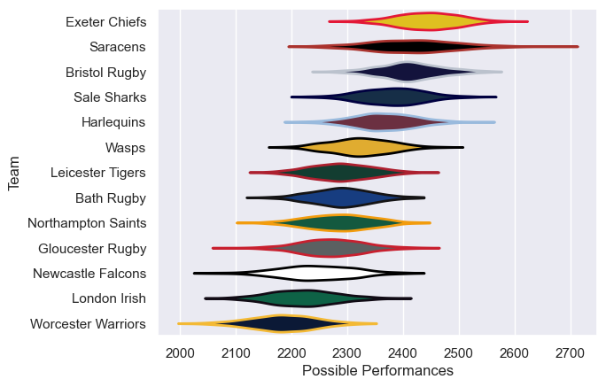

---  
title: "Gallagher Premiership 20/21 Status"  
date: 2025-07-28 6:00:00 -0500  
categories: model review projection  
layout: article  
aside:  
    toc: true  
---
# Current Team Rankings

# Standings

## Current Standings

| Club               |   Played |   Wins |   Point Differential |   Losing Bonus Points |   Try Bonus Points |   Competition Points |
|:-------------------|---------:|-------:|---------------------:|----------------------:|-------------------:|---------------------:|
| Exeter Chiefs      |       35 |     26 |                  338 |                     4 |                 18 |                  126 |
| Bristol Rugby      |       33 |     22 |                  231 |                     4 |                 19 |                  115 |
| Harlequins         |       33 |     20 |                  157 |                     4 |                 15 |                  103 |
| Sale Sharks        |       32 |     21 |                  153 |                     6 |                  8 |                   98 |
| Wasps              |       33 |     18 |                   86 |                     8 |                 13 |                   93 |
| Bath Rugby         |       31 |     15 |                  -24 |                     5 |                 14 |                   83 |
| Northampton Saints |       31 |     10 |                  -69 |                     7 |                  5 |                   60 |
| Leicester Tigers   |       31 |     12 |                 -154 |                     4 |                  4 |                   60 |
| Gloucester Rugby   |       30 |     10 |                  -72 |                     7 |                  8 |                   59 |
| London Irish       |       31 |      7 |                 -244 |                     6 |                  8 |                   52 |
| Newcastle Falcons  |       22 |      8 |                 -127 |                     2 |                  2 |                   42 |
| Worcester Warriors |       31 |      5 |                 -322 |                     8 |                  6 |                   40 |
| Saracens           |        9 |      4 |                   47 |                     2 |                  5 |                   25 |

# Completed Match Review

| Model | Percent Correct Predictions | Spread Error |
| ------ | ------ | ------ |
| Club Level | 64.4% | 12.0 |
| Player Level: Lineup | nan% | nan |
| Player Level: Minutes | nan% | nan |

