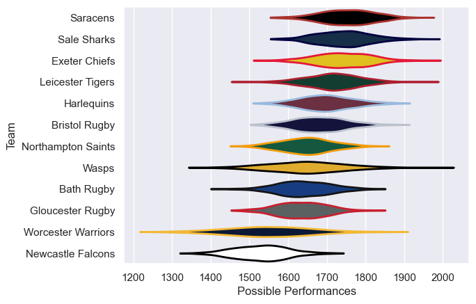
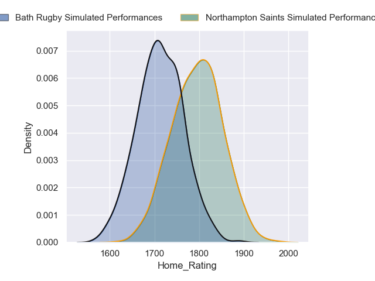
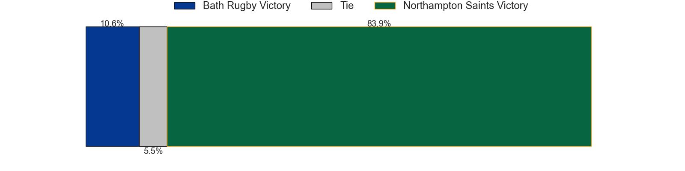
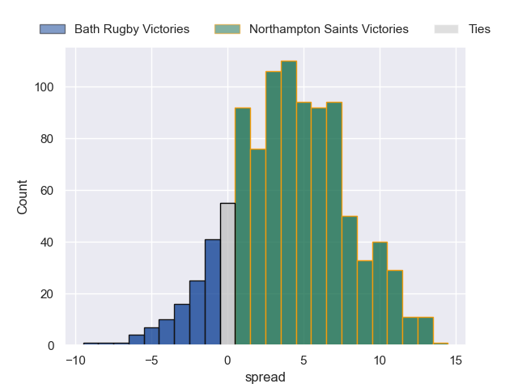

---  
title: "Gallagher Premiership 2023 Status"  
date: 2024-06-03 6:00:00 -0500  
categories: model review projection  
layout: article  
aside:  
    toc: true  
---
# Current Team Rankings

# Standings

## Current Standings

| Club               |   Played |   Wins |   Point Differential |   Losing Bonus Points |   Try Bonus Points |   Competition Points |
|:-------------------|---------:|-------:|---------------------:|----------------------:|-------------------:|---------------------:|
| Bath Rugby         |       20 |     12 |                  106 |                     5 |                nan |                   66 |
| Northampton Saints |       19 |     13 |                  104 |                     2 |                 10 |                   64 |
| Saracens           |       19 |     11 |                  133 |                     3 |                 10 |                   57 |
| Bristol Rugby      |       19 |     11 |                  144 |                     2 |                nan |                   56 |
| Sale Sharks        |       19 |     12 |                   18 |                     1 |                  7 |                   56 |
| Harlequins         |       19 |      9 |                  -34 |                     4 |                nan |                   53 |
| Exeter Chiefs      |       19 |     10 |                   75 |                     1 |                nan |                   52 |
| Leicester Tigers   |       19 |      9 |                   27 |                     4 |                nan |                   47 |
| Gloucester Rugby   |       19 |      5 |                 -195 |                     4 |                nan |                   34 |
| Worcester Warriors |        4 |      2 |                    0 |                     0 |                nan |                    8 |
| Newcastle Falcons  |       19 |      0 |                 -378 |                     4 |                nan |                    7 |
| Wasps              |        3 |      1 |                    0 |                     0 |                nan |                    6 |
| Jamaica            |        1 |      1 |                    5 |                     0 |                nan |                    4 |
| Bermuda            |        1 |      0 |                   -5 |                     1 |                nan |                    1 |

## Projected Remaining Table

| Club               |   Matches Remaining |   Wins |   Point Differential |   Losing Bonus Points |   Try Bonus Points |   Competition Points |
|:-------------------|--------------------:|-------:|---------------------:|----------------------:|-------------------:|---------------------:|
| Northampton Saints |                   1 |    0.9 |              4.12966 |                   0.1 |                0.2 |                  3.8 |
| Bath Rugby         |                   1 |    0.1 |             -4.12966 |                   0.6 |                0.3 |                  1.4 |

## Projected Total Table

| Club               |   Total Matches |   Wins |   Point Differential |   Losing Bonus Points |   Try Bonus Points |   Competition Points |
|:-------------------|----------------:|-------:|---------------------:|----------------------:|-------------------:|---------------------:|
| Northampton Saints |              20 |   13.9 |               108.13 |                   2.1 |               10.2 |                 67.8 |
| Bath Rugby         |              21 |   12.1 |               101.87 |                   5.6 |                0.3 |                 67.4 |
| Saracens           |              19 |   11   |               133    |                   3   |               10   |                 57   |
| Bristol Rugby      |              19 |   11   |               144    |                   2   |                0   |                 56   |
| Sale Sharks        |              19 |   12   |                18    |                   1   |                7   |                 56   |
| Harlequins         |              19 |    9   |               -34    |                   4   |                0   |                 53   |
| Exeter Chiefs      |              19 |   10   |                75    |                   1   |                0   |                 52   |
| Leicester Tigers   |              19 |    9   |                27    |                   4   |                0   |                 47   |
| Gloucester Rugby   |              19 |    5   |              -195    |                   4   |                0   |                 34   |
| Worcester Warriors |               4 |    2   |                 0    |                   0   |                0   |                  8   |
| Newcastle Falcons  |              19 |    0   |              -378    |                   4   |                0   |                  7   |
| Wasps              |               3 |    1   |                 0    |                   0   |                0   |                  6   |
| Jamaica            |               1 |    1   |                 5    |                   0   |                0   |                  4   |
| Bermuda            |               1 |    0   |                -5    |                   1   |                0   |                  1   |

# Completed Match Review

| Model | Percent Correct Predictions | Spread Error |
| ------ | ------ | ------ |
| Club Level | 64.0% | 13.4 |
| Player Level: Lineup | 67.8% | 13.0 |
| Player Level: Minutes | 65.5% | 13.0 |

# Future Predictions

## Week 21

### Northampton Saints V Bath Rugby on 2024/06/08

Average Margin: Northampton Saints by 4.1

Average Scoreline: 28-24

