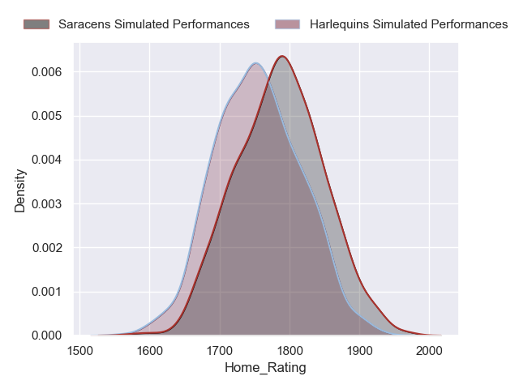
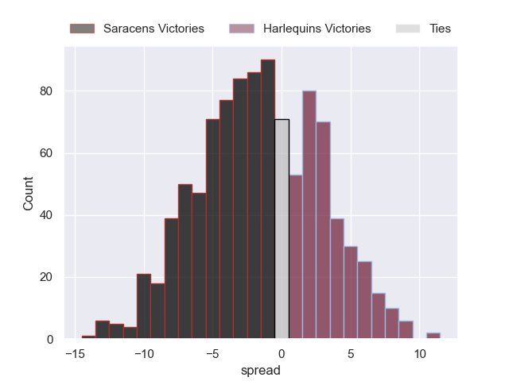
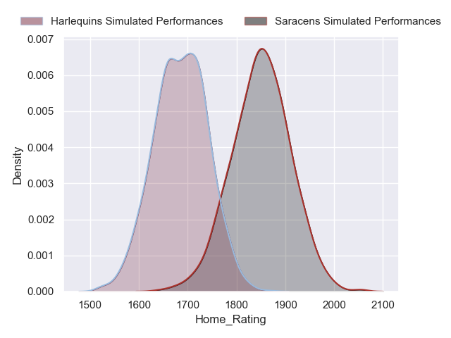
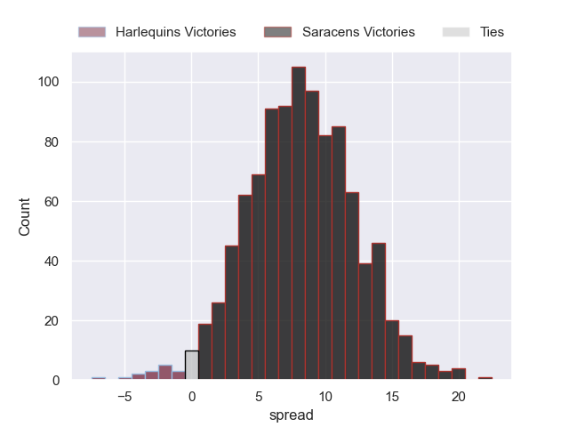

---  
title: "Gallagher Premiership 2023 Status"  
date: 2023-08-03 6:00:00 -0500  
categories: model review projection  
layout: article  
aside:  
    toc: true  
---
# Current Team Rankings

# Standings

## Projected Total Table

| Club               |   Total Matches |   Wins |   Point Differential |   Losing Bonus Points |   Try Bonus Points |   Competition Points |
|:-------------------|----------------:|-------:|---------------------:|----------------------:|-------------------:|---------------------:|
| Saracens           |              18 |   14.8 |                105.5 |                   2.9 |               14   |                 76.1 |
| Sale Sharks        |              18 |   13.3 |                 75.2 |                   4   |               12.6 |                 69.9 |
| Leicester Tigers   |              18 |   12.8 |                 65.9 |                   4.4 |               12   |                 67.4 |
| Exeter Chiefs      |              18 |   10.4 |                 25.7 |                   5.8 |                9.6 |                 56.9 |
| Harlequins         |              18 |    9.3 |                  6.2 |                   6.3 |                8.5 |                 51.9 |
| Bristol Rugby      |              18 |    8.3 |                -10.1 |                   6.7 |                7.7 |                 47.4 |
| Northampton Saints |              18 |    7.4 |                -22.9 |                   7   |                6.8 |                 43.5 |
| Gloucester Rugby   |              18 |    7.2 |                -27.7 |                   7   |                6.5 |                 42.5 |
| Bath Rugby         |              18 |    4.9 |                -69.6 |                   7.3 |                4.3 |                 31.1 |
| Newcastle Falcons  |              18 |    1.6 |               -148.2 |                   5.8 |                1.4 |                 13.8 |

# Future Predictions

## Week 9

### Bristol Rugby V Leicester Tigers on 2023/10/13

Average Margin: Leicester Tigers by 0.5

### Gloucester Rugby V Harlequins on 2023/10/14

Average Margin: Gloucester Rugby by 1.9

### Exeter Chiefs V Saracens on 2023/10/14

Average Margin: Saracens by 0.9

### Bath Rugby V Newcastle Falcons on 2023/10/14

Average Margin: Bath Rugby by 7.4

### Sale Sharks V Northampton Saints on 2023/10/15

Average Margin: Sale Sharks by 8.3

## Week 10

### Newcastle Falcons V Gloucester Rugby on 2023/10/20

Average Margin: Gloucester Rugby by 2.7

### Northampton Saints V Bristol Rugby on 2023/10/21

Average Margin: Northampton Saints by 2.7

### Saracens V Bath Rugby on 2023/10/21

Average Margin: Saracens by 12.3

### Leicester Tigers V Sale Sharks on 2023/10/21

Average Margin: Leicester Tigers by 3.0

### Harlequins V Exeter Chiefs on 2023/10/22

Average Margin: Harlequins by 2.2

## Week 11

### Gloucester Rugby V Saracens on 2023/10/27

Average Margin: Saracens by 3.4

### Bristol Rugby V Harlequins on 2023/10/28

Average Margin: Bristol Rugby by 2.6

### Exeter Chiefs V Sale Sharks on 2023/10/28

Average Margin: Exeter Chiefs by 1.0

### Bath Rugby V Leicester Tigers on 2023/10/28

Average Margin: Leicester Tigers by 3.5

### Newcastle Falcons V Northampton Saints on 2023/10/29

Average Margin: Northampton Saints by 2.9

## Week 12

### Sale Sharks V Gloucester Rugby on 2023/11/03

Average Margin: Sale Sharks by 8.6

### Harlequins V Newcastle Falcons on 2023/11/04

Average Margin: Harlequins by 11.2

### Saracens V Leicester Tigers on 2023/11/04

Average Margin: Saracens by 5.4

### Northampton Saints V Bath Rugby on 2023/11/04

Average Margin: Northampton Saints by 5.7

### Exeter Chiefs V Bristol Rugby on 2023/11/05

Average Margin: Exeter Chiefs by 5.2

## Week 13

### Gloucester Rugby V Bath Rugby on 2023/11/10

Average Margin: Gloucester Rugby by 5.5

### Bristol Rugby V Sale Sharks on 2023/11/11

Average Margin: Sale Sharks by 1.1

### Leicester Tigers V Harlequins on 2023/11/11

Average Margin: Leicester Tigers by 6.6

### Newcastle Falcons V Saracens on 2023/11/12

Average Margin: Saracens by 9.3

### Northampton Saints V Exeter Chiefs on 2023/11/12

Average Margin: Northampton Saints by 1.0

## Week 14

### Bath Rugby V Bristol Rugby on 2023/11/17

Average Margin: Bath Rugby by 0.5

### Sale Sharks V Newcastle Falcons on 2023/11/17

Average Margin: Sale Sharks by 14.7

### Leicester Tigers V Northampton Saints on 2023/11/18

Average Margin: Leicester Tigers by 7.9

### Harlequins V Saracens on 2023/11/18

Average Margin: Saracens by 1.5

### Exeter Chiefs V Gloucester Rugby on 2023/11/19

Average Margin: Exeter Chiefs by 6.2

## Week 15

### Northampton Saints V Harlequins on 2023/11/24

Average Margin: Northampton Saints by 1.8

### Sale Sharks V Bath Rugby on 2023/11/24

Average Margin: Sale Sharks by 10.8

### Saracens V Bristol Rugby on 2023/11/25

Average Margin: Saracens by 9.3

### Gloucester Rugby V Leicester Tigers on 2023/11/25

Average Margin: Leicester Tigers by 1.4

### Newcastle Falcons V Exeter Chiefs on 2023/11/26

Average Margin: Exeter Chiefs by 5.5

## Week 16

### Harlequins V Sale Sharks on 2023/12/01

Average Margin: Sale Sharks by 0.1

### Bristol Rugby V Gloucester Rugby on 2023/12/02

Average Margin: Bristol Rugby by 4.4

### Saracens V Northampton Saints on 2023/12/02

Average Margin: Saracens by 9.8

### Bath Rugby V Exeter Chiefs on 2023/12/02

Average Margin: Exeter Chiefs by 1.4

### Leicester Tigers V Newcastle Falcons on 2023/12/03

Average Margin: Leicester Tigers by 14.1

## Week 17

### Newcastle Falcons V Bristol Rugby on 2023/12/22

Average Margin: Bristol Rugby by 3.5

### Sale Sharks V Saracens on 2023/12/22

Average Margin: Sale Sharks by 1.9

### Bath Rugby V Harlequins on 2023/12/23

Average Margin: Harlequins by 0.4

### Gloucester Rugby V Northampton Saints on 2023/12/23

Average Margin: Gloucester Rugby by 3.2

### Exeter Chiefs V Leicester Tigers on 2023/12/23

Average Margin: Exeter Chiefs by 1.3

## Week 18

### Bristol Rugby V Exeter Chiefs on 2023/12/29

Average Margin: Bristol Rugby by 1.6

### Saracens V Newcastle Falcons on 2023/12/30

Average Margin: Saracens by 16.0

### Northampton Saints V Sale Sharks on 2023/12/30

Average Margin: Sale Sharks by 1.7

### Harlequins V Gloucester Rugby on 2023/12/30

Average Margin: Harlequins by 4.9

### Leicester Tigers V Bath Rugby on 2023/12/31

Average Margin: Leicester Tigers by 10.1

## Week 1

### Newcastle Falcons V Harlequins on 2024/01/05

Average Margin: Harlequins by 4.4

### Sale Sharks V Bristol Rugby on 2024/01/05

Average Margin: Sale Sharks by 7.5

### Exeter Chiefs V Northampton Saints on 2024/01/06

Average Margin: Exeter Chiefs by 5.9

### Leicester Tigers V Saracens on 2024/01/06

Average Margin: Leicester Tigers by 1.5

### Bath Rugby V Gloucester Rugby on 2024/01/07

Average Margin: Bath Rugby by 1.2

## Week 2

### Bristol Rugby V Bath Rugby on 2024/01/26

Average Margin: Bristol Rugby by 6.3

### Gloucester Rugby V Sale Sharks on 2024/01/26

Average Margin: Sale Sharks by 1.7

### Harlequins V Leicester Tigers on 2024/01/26

Average Margin: Harlequins by 0.4

### Northampton Saints V Newcastle Falcons on 2024/01/26

Average Margin: Northampton Saints by 9.7

### Saracens V Exeter Chiefs on 2024/01/26

Average Margin: Saracens by 7.2

## Week 3

### Leicester Tigers V Gloucester Rugby on 2024/03/22

Average Margin: Leicester Tigers by 7.9

### Bristol Rugby V Northampton Saints on 2024/03/22

Average Margin: Bristol Rugby by 4.1

### Bath Rugby V Sale Sharks on 2024/03/22

Average Margin: Sale Sharks by 3.9

### Saracens V Harlequins on 2024/03/22

Average Margin: Saracens by 8.2

### Exeter Chiefs V Newcastle Falcons on 2024/03/22

Average Margin: Exeter Chiefs by 12.1

## Week 4

### Sale Sharks V Exeter Chiefs on 2024/03/29

Average Margin: Sale Sharks by 5.9

### Northampton Saints V Saracens on 2024/03/29

Average Margin: Saracens by 3.1

### Newcastle Falcons V Leicester Tigers on 2024/03/29

Average Margin: Leicester Tigers by 7.4

### Harlequins V Bath Rugby on 2024/03/29

Average Margin: Harlequins by 7.3

### Gloucester Rugby V Bristol Rugby on 2024/03/29

Average Margin: Gloucester Rugby by 2.5

## Week 5

### Saracens V Gloucester Rugby on 2024/04/19

Average Margin: Saracens by 10.0

### Sale Sharks V Harlequins on 2024/04/19

Average Margin: Sale Sharks by 6.9

### Northampton Saints V Leicester Tigers on 2024/04/19

Average Margin: Leicester Tigers by 0.9

### Exeter Chiefs V Bath Rugby on 2024/04/19

Average Margin: Exeter Chiefs by 8.2

### Bristol Rugby V Newcastle Falcons on 2024/04/19

Average Margin: Bristol Rugby by 10.3

## Week 6

### Bath Rugby V Saracens on 2024/04/26

Average Margin: Saracens by 5.2

### Gloucester Rugby V Exeter Chiefs on 2024/04/26

Average Margin: Gloucester Rugby by 0.7

### Harlequins V Northampton Saints on 2024/04/26

Average Margin: Harlequins by 5.0

### Leicester Tigers V Bristol Rugby on 2024/04/26

Average Margin: Leicester Tigers by 7.0

### Newcastle Falcons V Sale Sharks on 2024/04/26

Average Margin: Sale Sharks by 7.7

## Week 7

### Sale Sharks V Leicester Tigers on 2024/05/10

Average Margin: Sale Sharks by 3.9

### Newcastle Falcons V Bath Rugby on 2024/05/10

Average Margin: Bath Rugby by 0.4

### Exeter Chiefs V Harlequins on 2024/05/10

Average Margin: Exeter Chiefs by 4.0

### Bristol Rugby V Saracens on 2024/05/10

Average Margin: Saracens by 2.5

### Northampton Saints V Gloucester Rugby on 2024/05/10

Average Margin: Northampton Saints by 3.9

## Week 8

### Gloucester Rugby V Newcastle Falcons on 2024/05/17

Average Margin: Gloucester Rugby by 9.3

### Saracens V Sale Sharks on 2024/05/17

Average Margin: Saracens by 4.9

### Leicester Tigers V Exeter Chiefs on 2024/05/17

Average Margin: Leicester Tigers by 5.4

### Harlequins V Bristol Rugby on 2024/05/17

Average Margin: Harlequins by 4.1

### Bath Rugby V Northampton Saints on 2024/05/17

Average Margin: Bath Rugby by 1.0

