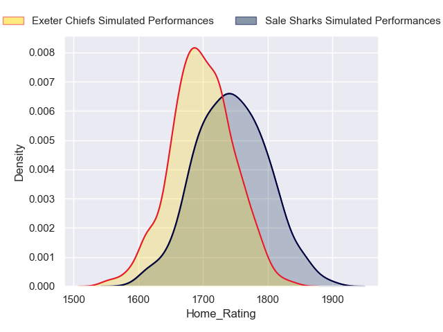
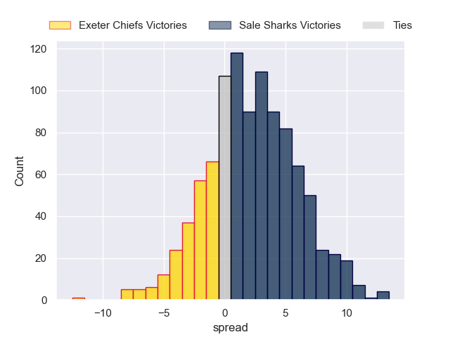
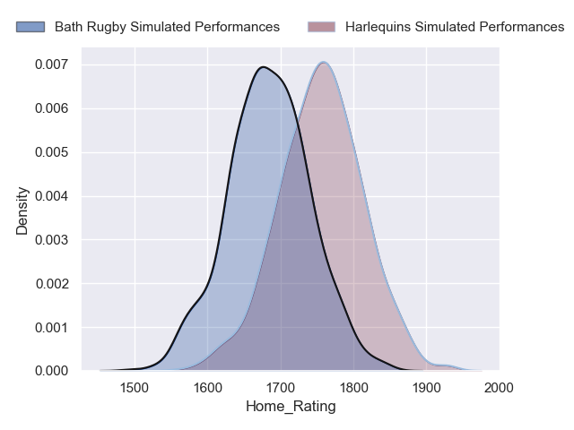
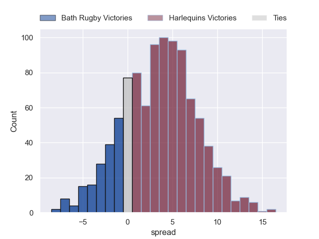
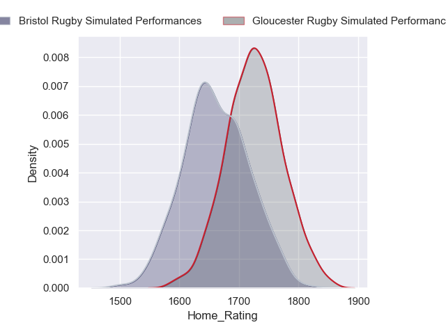
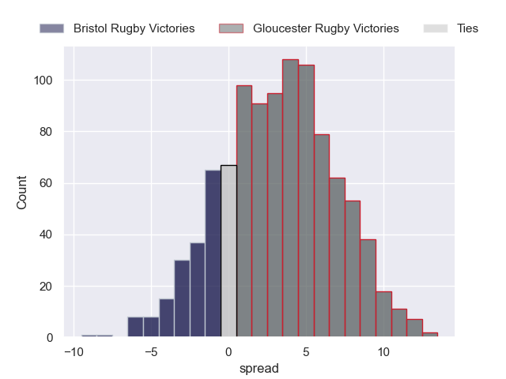

---  
title: "Gallagher Premiership 2023 Status"  
date: 2024-03-26 6:00:00 -0500  
categories: model review projection  
layout: article  
aside:  
    toc: true  
---
# Current Team Rankings

# Standings

## Current Standings

| Club               |   Played |   Wins |   Point Differential |   Losing Bonus Points |   Try Bonus Points |   Competition Points |
|:-------------------|---------:|-------:|---------------------:|----------------------:|-------------------:|---------------------:|
| Exeter Chiefs      |       15 |      9 |                   97 |                     1 |                nan |                   47 |
| Saracens           |       14 |      9 |                  155 |                     2 |                  8 |                   46 |
| Bath Rugby         |       14 |      8 |                   51 |                     3 |                nan |                   44 |
| Northampton Saints |       13 |      9 |                   18 |                     2 |                  6 |                   44 |
| Harlequins         |       15 |      7 |                  -29 |                     3 |                nan |                   39 |
| Bristol Rugby      |       14 |      7 |                   58 |                     2 |                nan |                   37 |
| Leicester Tigers   |       14 |      7 |                   37 |                     3 |                nan |                   37 |
| Sale Sharks        |       13 |      7 |                  -56 |                     1 |                  3 |                   32 |
| Gloucester Rugby   |       14 |      4 |                  -93 |                     4 |                nan |                   28 |
| Worcester Warriors |        4 |      2 |                    0 |                     0 |                nan |                    8 |
| Wasps              |        3 |      1 |                    0 |                     0 |                nan |                    6 |
| Newcastle Falcons  |       15 |      0 |                 -238 |                     3 |                nan |                    6 |

## Projected Remaining Table

| Club               |   Matches Remaining |   Wins |   Point Differential |   Losing Bonus Points |   Try Bonus Points |   Competition Points |
|:-------------------|--------------------:|-------:|---------------------:|----------------------:|-------------------:|---------------------:|
| Saracens           |                   5 |    3.6 |            17.3543   |                   1.3 |                1.4 |                 17.2 |
| Leicester Tigers   |                   5 |    3.2 |            10.6041   |                   1.6 |                2.7 |                 17.1 |
| Sale Sharks        |                   5 |    3.2 |             5.14286  |                   1.2 |                1.2 |                 15.2 |
| Northampton Saints |                   5 |    2.8 |             4.39944  |                   1.9 |                1.2 |                 14.5 |
| Harlequins         |                   5 |    2.8 |             4.31154  |                   1.9 |                1.3 |                 14.4 |
| Exeter Chiefs      |                   5 |    2.5 |             0.409474 |                   2.2 |                1.6 |                 13.6 |
| Bath Rugby         |                   5 |    2.5 |             0.111472 |                   2.1 |                1.3 |                 13.3 |
| Gloucester Rugby   |                   5 |    2.5 |             2.7829   |                   1.5 |                1.6 |                 13.2 |
| Bristol Rugby      |                   5 |    1.7 |            -3.77022  |                   2.5 |                2.1 |                 11.2 |
| Newcastle Falcons  |                   5 |    0.2 |           -41.3459   |                   1.8 |                0.6 |                  3.1 |

## Projected Total Table

| Club               |   Total Matches |   Wins |   Point Differential |   Losing Bonus Points |   Try Bonus Points |   Competition Points |
|:-------------------|----------------:|-------:|---------------------:|----------------------:|-------------------:|---------------------:|
| Saracens           |              19 |   12.6 |             172.354  |                   3.3 |                9.4 |                 63.2 |
| Exeter Chiefs      |              20 |   11.5 |              97.4095 |                   3.2 |                1.6 |                 60.6 |
| Northampton Saints |              18 |   11.8 |              22.3994 |                   3.9 |                7.2 |                 58.5 |
| Bath Rugby         |              19 |   10.5 |              51.1115 |                   5.1 |                1.3 |                 57.3 |
| Leicester Tigers   |              19 |   10.2 |              47.6041 |                   4.6 |                2.7 |                 54.1 |
| Harlequins         |              20 |    9.8 |             -24.6885 |                   4.9 |                1.3 |                 53.4 |
| Bristol Rugby      |              19 |    8.7 |              54.2298 |                   4.5 |                2.1 |                 48.2 |
| Sale Sharks        |              18 |   10.2 |             -50.8571 |                   2.2 |                4.2 |                 47.2 |
| Gloucester Rugby   |              19 |    6.5 |             -90.2171 |                   5.5 |                1.6 |                 41.2 |
| Newcastle Falcons  |              20 |    0.2 |            -279.346  |                   4.8 |                0.6 |                  9.1 |
| Worcester Warriors |               4 |    2   |               0      |                   0   |                0   |                  8   |
| Wasps              |               3 |    1   |               0      |                   0   |                0   |                  6   |

# Completed Match Review

| Model | Percent Correct Predictions | Spread Error |
| ------ | ------ | ------ |
| Club Level | 62.5% | 11.7 |
| Player Level: Lineup | 67.7% | 12.2 |
| Player Level: Minutes | 64.6% | 12.1 |

# Future Predictions

## Week 16

### Newcastle Falcons V Leicester Tigers on 2024/03/29

Average Margin: Leicester Tigers by 7.0

Average Scoreline: 35-28

### Northampton Saints V Saracens on 2024/03/29

Average Margin: Northampton Saints by 0.5

Average Scoreline: 27-27

### Sale Sharks V Exeter Chiefs on 2024/03/30

Average Margin: Sale Sharks by 2.3

Average Scoreline: 35-33

### Harlequins V Bath Rugby on 2024/03/30

Average Margin: Harlequins by 3.5

Average Scoreline: 34-31

### Gloucester Rugby V Bristol Rugby on 2024/03/30

Average Margin: Gloucester Rugby by 3.2

Average Scoreline: 44-40

## Week 17

### Northampton Saints V Leicester Tigers on 2024/04/19

Average Margin: Northampton Saints by 3.4

Average Scoreline: 33-30

### Exeter Chiefs V Bath Rugby on 2024/04/19

Average Margin: Exeter Chiefs by 3.9

Average Scoreline: 35-31

### Sale Sharks V Harlequins on 2024/04/19

Average Margin: Sale Sharks by 2.7

Average Scoreline: 31-28

### Bristol Rugby V Newcastle Falcons on 2024/04/19

Average Margin: Bristol Rugby by 11.4

Average Scoreline: 34-23

### Saracens V Gloucester Rugby on 2024/04/19

Average Margin: Saracens by 8.2

Average Scoreline: 32-23

## Week 18

### Harlequins V Northampton Saints on 2024/04/26

Average Margin: Harlequins by 2.7

Average Scoreline: 31-29

### Bath Rugby V Saracens on 2024/04/26

Average Margin: Saracens by 0.4

Average Scoreline: 28-27

### Leicester Tigers V Bristol Rugby on 2024/04/26

Average Margin: Leicester Tigers by 5.5

Average Scoreline: 41-36

### Newcastle Falcons V Sale Sharks on 2024/04/26

Average Margin: Sale Sharks by 5.6

Average Scoreline: 38-32

### Gloucester Rugby V Exeter Chiefs on 2024/04/26

Average Margin: Gloucester Rugby by 1.5

Average Scoreline: 33-32

## Week 19

### Newcastle Falcons V Bath Rugby on 2024/05/10

Average Margin: Bath Rugby by 5.8

Average Scoreline: 39-33

### Northampton Saints V Gloucester Rugby on 2024/05/10

Average Margin: Northampton Saints by 5.4

Average Scoreline: 35-29

### Exeter Chiefs V Harlequins on 2024/05/10

Average Margin: Exeter Chiefs by 4.0

Average Scoreline: 35-31

### Bristol Rugby V Saracens on 2024/05/10

Average Margin: Saracens by 1.7

Average Scoreline: 35-33

### Sale Sharks V Leicester Tigers on 2024/05/10

Average Margin: Sale Sharks by 2.1

Average Scoreline: 34-32

## Week 20

### Saracens V Sale Sharks on 2024/05/17

Average Margin: Saracens by 7.5

Average Scoreline: 27-20

### Harlequins V Bristol Rugby on 2024/05/17

Average Margin: Harlequins by 4.7

Average Scoreline: 37-32

### Bath Rugby V Northampton Saints on 2024/05/17

Average Margin: Bath Rugby by 2.2

Average Scoreline: 33-31

### Gloucester Rugby V Newcastle Falcons on 2024/05/17

Average Margin: Gloucester Rugby by 11.7

Average Scoreline: 38-26

### Leicester Tigers V Exeter Chiefs on 2024/05/17

Average Margin: Leicester Tigers by 3.7

Average Scoreline: 37-33

## Week 21
