---  
title: "Gallagher Premiership 2023 Status"  
date: 2024-04-22 6:00:00 -0500  
categories: model review projection  
layout: article  
aside:  
    toc: true  
---
# Current Team Rankings

# Standings

## Current Standings

| Club               |   Played |   Wins |   Point Differential |   Losing Bonus Points |   Try Bonus Points |   Competition Points |
|:-------------------|---------:|-------:|---------------------:|----------------------:|-------------------:|---------------------:|
| Northampton Saints |       15 |     11 |                   52 |                     2 |                  8 |                   54 |
| Saracens           |       16 |     10 |                  166 |                     2 |                 10 |                   52 |
| Bath Rugby         |       16 |      9 |                   59 |                     4 |                nan |                   51 |
| Bristol Rugby      |       16 |      9 |                  138 |                     2 |                nan |                   47 |
| Exeter Chiefs      |       17 |      9 |                   49 |                     1 |                nan |                   47 |
| Harlequins         |       17 |      8 |                  -31 |                     4 |                nan |                   46 |
| Sale Sharks        |       15 |      9 |                  -14 |                     1 |                  5 |                   42 |
| Leicester Tigers   |       16 |      8 |                   20 |                     3 |                nan |                   41 |
| Gloucester Rugby   |       16 |      4 |                 -124 |                     4 |                nan |                   29 |
| Worcester Warriors |        4 |      2 |                    0 |                     0 |                nan |                    8 |
| Newcastle Falcons  |       17 |      0 |                 -315 |                     4 |                nan |                    7 |
| Wasps              |        3 |      1 |                    0 |                     0 |                nan |                    6 |

## Projected Remaining Table

| Club               |   Matches Remaining |   Wins |   Point Differential |   Losing Bonus Points |   Try Bonus Points |   Competition Points |
|:-------------------|--------------------:|-------:|---------------------:|----------------------:|-------------------:|---------------------:|
| Bath Rugby         |                   3 |    2.3 |              9.82631 |                   0.7 |                0.9 |                 10.7 |
| Leicester Tigers   |                   3 |    2   |              5.99924 |                   0.9 |                1.2 |                 10.1 |
| Northampton Saints |                   3 |    1.7 |              5.58008 |                   1.2 |                1.1 |                  9.1 |
| Saracens           |                   3 |    1.8 |              4.80915 |                   1.1 |                0.7 |                  9   |
| Harlequins         |                   3 |    1.7 |              2.59374 |                   1.2 |                1   |                  9   |
| Sale Sharks        |                   3 |    1.8 |              2.87573 |                   0.8 |                0.9 |                  8.8 |
| Gloucester Rugby   |                   3 |    1.8 |              5.38699 |                   0.6 |                0.9 |                  8.6 |
| Exeter Chiefs      |                   3 |    1.1 |             -4.21652 |                   1.6 |                0.7 |                  6.7 |
| Bristol Rugby      |                   3 |    0.8 |             -8.41811 |                   1.7 |                1   |                  5.8 |
| Newcastle Falcons  |                   3 |    0.1 |            -24.4366  |                   1.1 |                0.3 |                  1.8 |

## Projected Total Table

| Club               |   Total Matches |   Wins |   Point Differential |   Losing Bonus Points |   Try Bonus Points |   Competition Points |
|:-------------------|----------------:|-------:|---------------------:|----------------------:|-------------------:|---------------------:|
| Northampton Saints |              18 |   12.7 |              57.5801 |                   3.2 |                9.1 |                 63.1 |
| Bath Rugby         |              19 |   11.3 |              68.8263 |                   4.7 |                0.9 |                 61.7 |
| Saracens           |              19 |   11.8 |             170.809  |                   3.1 |               10.7 |                 61   |
| Harlequins         |              20 |    9.7 |             -28.4063 |                   5.2 |                1   |                 55   |
| Exeter Chiefs      |              20 |   10.1 |              44.7835 |                   2.6 |                0.7 |                 53.7 |
| Bristol Rugby      |              19 |    9.8 |             129.582  |                   3.7 |                1   |                 52.8 |
| Leicester Tigers   |              19 |   10   |              25.9992 |                   3.9 |                1.2 |                 51.1 |
| Sale Sharks        |              18 |   10.8 |             -11.1243 |                   1.8 |                5.9 |                 50.8 |
| Gloucester Rugby   |              19 |    5.8 |            -118.613  |                   4.6 |                0.9 |                 37.6 |
| Newcastle Falcons  |              20 |    0.1 |            -339.437  |                   5.1 |                0.3 |                  8.8 |
| Worcester Warriors |               4 |    2   |               0      |                   0   |                0   |                  8   |
| Wasps              |               3 |    1   |               0      |                   0   |                0   |                  6   |

# Completed Match Review

| Model | Percent Correct Predictions | Spread Error |
| ------ | ------ | ------ |
| Club Level | 64.6% | 12.2 |
| Player Level: Lineup | 69.3% | 12.3 |
| Player Level: Minutes | 66.7% | 12.2 |

# Future Predictions

## Week 18

### Bath Rugby V Saracens on 2024/04/26

Average Margin: Bath Rugby by 1.3

Average Scoreline: 28-27

### Leicester Tigers V Bristol Rugby on 2024/04/27

Average Margin: Leicester Tigers by 4.3

Average Scoreline: 37-33

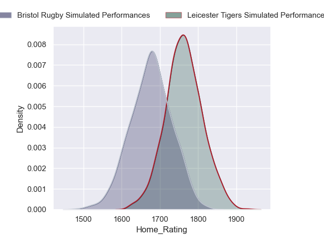
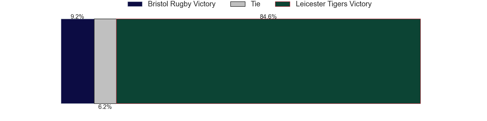
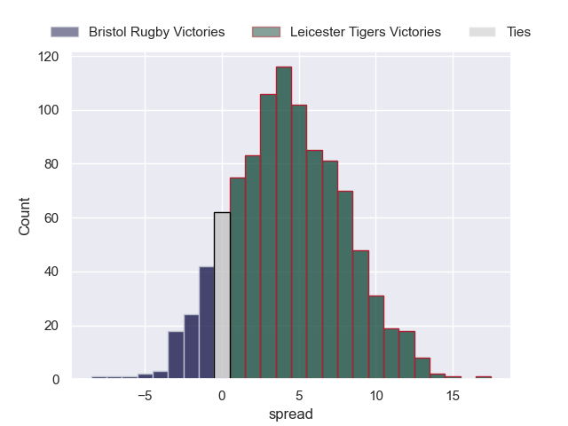

### Harlequins V Northampton Saints on 2024/04/27

Average Margin: Harlequins by 0.9

Average Scoreline: 31-30

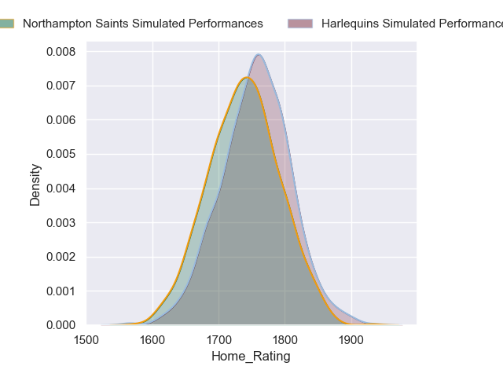
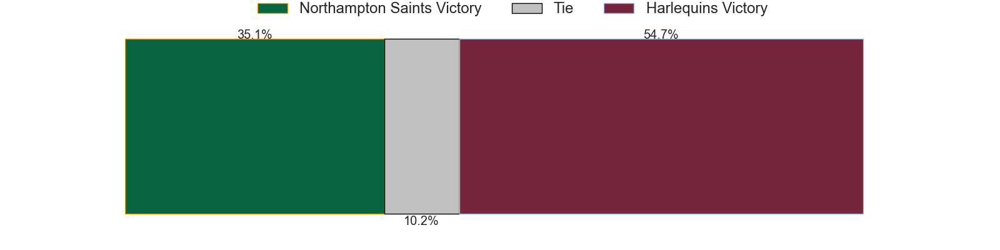
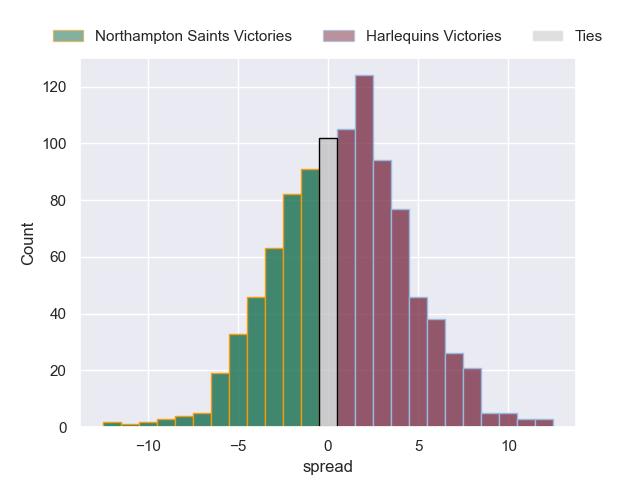

### Gloucester Rugby V Exeter Chiefs on 2024/04/28

Average Margin: Gloucester Rugby by 2.1

Average Scoreline: 42-40

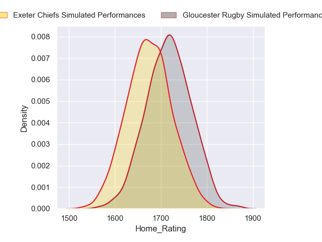
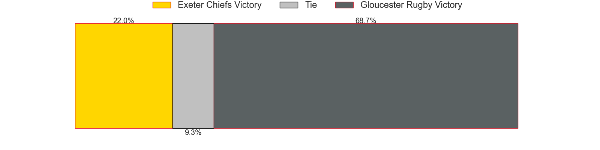
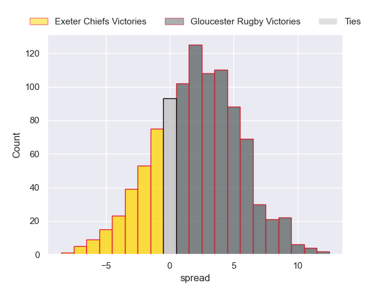

### Newcastle Falcons V Sale Sharks on 2024/04/28

Average Margin: Sale Sharks by 6.2

Average Scoreline: 29-23

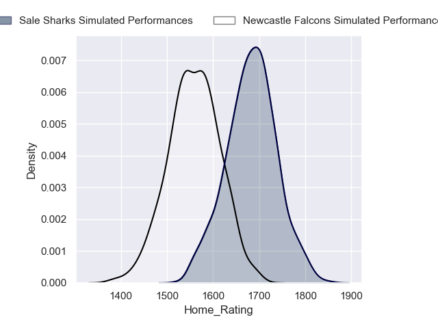

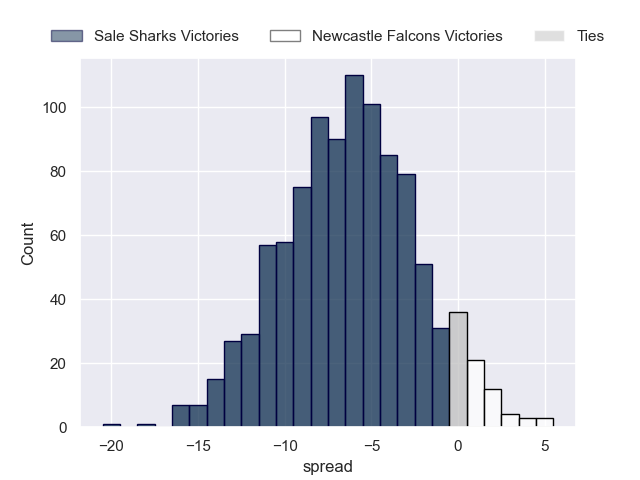

## Week 19

### Sale Sharks V Leicester Tigers on 2024/05/10

Average Margin: Sale Sharks by 2.8

Average Scoreline: 30-27

### Bristol Rugby V Saracens on 2024/05/10

Average Margin: Saracens by 0.0

Average Scoreline: 29-29

### Newcastle Falcons V Bath Rugby on 2024/05/10

Average Margin: Bath Rugby by 7.0

Average Scoreline: 28-22

### Northampton Saints V Gloucester Rugby on 2024/05/10

Average Margin: Northampton Saints by 8.0

Average Scoreline: 39-31

### Exeter Chiefs V Harlequins on 2024/05/10

Average Margin: Exeter Chiefs by 2.4

Average Scoreline: 42-39

## Week 20

### Harlequins V Bristol Rugby on 2024/05/17

Average Margin: Harlequins by 4.1

Average Scoreline: 36-32

### Leicester Tigers V Exeter Chiefs on 2024/05/17

Average Margin: Leicester Tigers by 4.5

Average Scoreline: 35-30

### Bath Rugby V Northampton Saints on 2024/05/17

Average Margin: Bath Rugby by 1.5

Average Scoreline: 25-24

### Saracens V Sale Sharks on 2024/05/17

Average Margin: Saracens by 6.2

Average Scoreline: 27-21

### Gloucester Rugby V Newcastle Falcons on 2024/05/17

Average Margin: Gloucester Rugby by 11.2

Average Scoreline: 37-26

