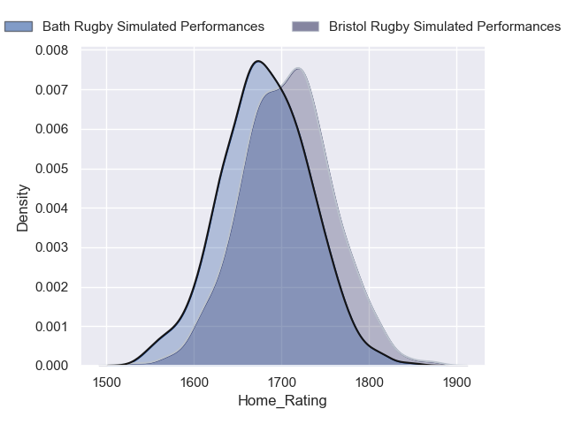
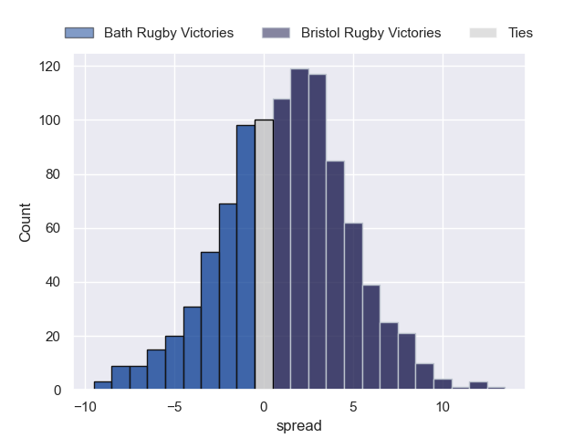
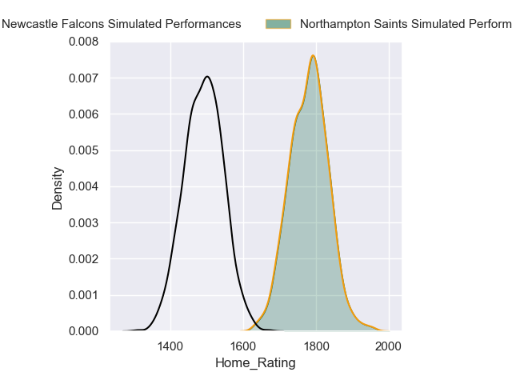
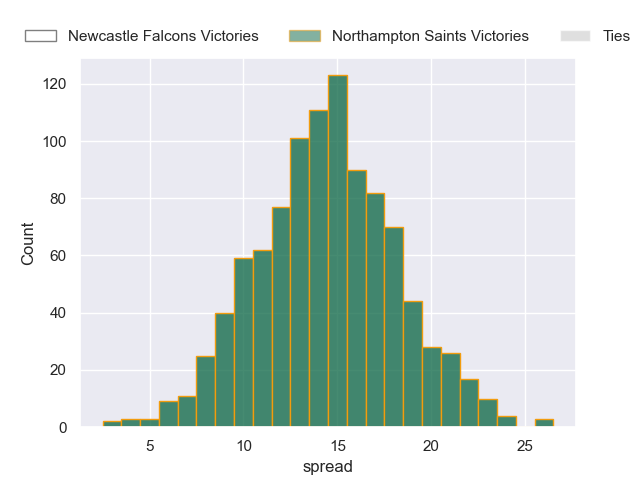
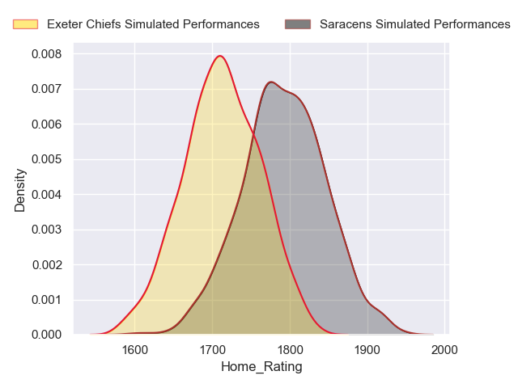
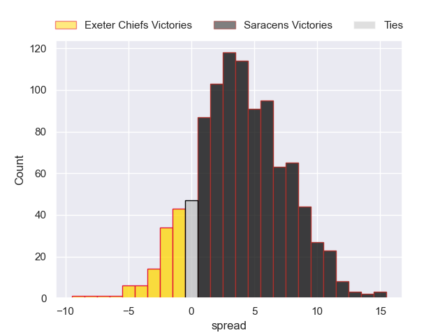
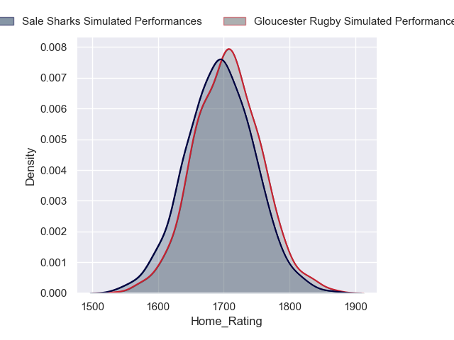
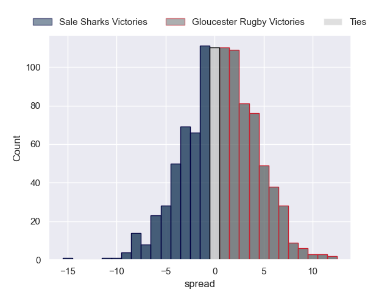

---  
title: "Gallagher Premiership 2023 Status"  
date: 2024-01-22 6:00:00 -0500  
categories: model review projection  
layout: article  
aside:  
    toc: true  
---
# Current Team Rankings

# Standings

## Current Standings

| Club               |   Played |   Wins |   Point Differential |   Losing Bonus Points |   Try Bonus Points |   Competition Points |
|:-------------------|---------:|-------:|---------------------:|----------------------:|-------------------:|---------------------:|
| Northampton Saints |       11 |      8 |                   24 |                     2 |                  5 |                   39 |
| Harlequins         |       12 |      7 |                   62 |                     2 |                nan |                   38 |
| Bath Rugby         |       12 |      7 |                   46 |                     3 |                nan |                   38 |
| Exeter Chiefs      |       12 |      7 |                   97 |                     1 |                nan |                   37 |
| Sale Sharks        |       11 |      7 |                  -26 |                     1 |                  3 |                   32 |
| Saracens           |       11 |      6 |                   47 |                     2 |                  5 |                   31 |
| Leicester Tigers   |       12 |      6 |                   38 |                     2 |                nan |                   31 |
| Bristol Rugby      |       12 |      5 |                   14 |                     2 |                nan |                   27 |
| Gloucester Rugby   |       12 |      2 |                 -107 |                     4 |                nan |                   19 |
| Worcester Warriors |        4 |      2 |                    0 |                     0 |                nan |                    8 |
| Wasps              |        3 |      1 |                    0 |                     0 |                nan |                    6 |
| Newcastle Falcons  |       12 |      0 |                 -195 |                     3 |                nan |                    6 |

## Projected Remaining Table

| Club               |   Matches Remaining |   Wins |   Point Differential |   Losing Bonus Points |   Try Bonus Points |   Competition Points |
|:-------------------|--------------------:|-------:|---------------------:|----------------------:|-------------------:|---------------------:|
| Saracens           |                   7 |    4.9 |           18.1129    |                   1.9 |                2   |                 23.5 |
| Northampton Saints |                   7 |    4.6 |           23.4814    |                   2.1 |                2.6 |                 23.2 |
| Leicester Tigers   |                   7 |    4.2 |           13.5715    |                   2.3 |                2.9 |                 22.1 |
| Exeter Chiefs      |                   7 |    3.9 |           13.6694    |                   2.6 |                3   |                 21.2 |
| Harlequins         |                   7 |    4.1 |            9.08969   |                   2.4 |                1.9 |                 20.8 |
| Sale Sharks        |                   7 |    4   |            5.8704    |                   2.6 |                1.8 |                 20.3 |
| Bath Rugby         |                   7 |    3.5 |            0.0783485 |                   2.8 |                2   |                 18.9 |
| Bristol Rugby      |                   7 |    2.7 |           -6.63931   |                   3.1 |                2   |                 15.9 |
| Gloucester Rugby   |                   7 |    2.9 |           -7.65432   |                   2.4 |                1.6 |                 15.7 |
| Newcastle Falcons  |                   7 |    0.1 |          -69.58      |                   1.8 |                1.1 |                  3.4 |

## Projected Total Table

| Club               |   Total Matches |   Wins |   Point Differential |   Losing Bonus Points |   Try Bonus Points |   Competition Points |
|:-------------------|----------------:|-------:|---------------------:|----------------------:|-------------------:|---------------------:|
| Northampton Saints |              18 |   12.6 |             47.4814  |                   4.1 |                7.6 |                 62.2 |
| Harlequins         |              19 |   11.1 |             71.0897  |                   4.4 |                1.9 |                 58.8 |
| Exeter Chiefs      |              19 |   10.9 |            110.669   |                   3.6 |                3   |                 58.2 |
| Bath Rugby         |              19 |   10.5 |             46.0783  |                   5.8 |                2   |                 56.9 |
| Saracens           |              18 |   10.9 |             65.1129  |                   3.9 |                7   |                 54.5 |
| Leicester Tigers   |              19 |   10.2 |             51.5715  |                   4.3 |                2.9 |                 53.1 |
| Sale Sharks        |              18 |   11   |            -20.1296  |                   3.6 |                4.8 |                 52.3 |
| Bristol Rugby      |              19 |    7.7 |              7.36069 |                   5.1 |                2   |                 42.9 |
| Gloucester Rugby   |              19 |    4.9 |           -114.654   |                   6.4 |                1.6 |                 34.7 |
| Newcastle Falcons  |              19 |    0.1 |           -264.58    |                   4.8 |                1.1 |                  9.4 |
| Worcester Warriors |               4 |    2   |              0       |                   0   |                0   |                  8   |
| Wasps              |               3 |    1   |              0       |                   0   |                0   |                  6   |

# Completed Match Review

| Model | Percent Correct Predictions | Spread Error |
| ------ | ------ | ------ |
| Club Level | 61.3% | 11.1 |
| Player Level: Lineup | 69.1% | 12.0 |
| Player Level: Minutes | 69.1% | 12.2 |

# Future Predictions

## Week 13

### Harlequins V Leicester Tigers on 2024/01/26

Average Margin: Harlequins by 3.6

Average Scoreline: 27-24

### Bristol Rugby V Bath Rugby on 2024/01/27

Average Margin: Bristol Rugby by 1.3

Average Scoreline: 29-28

### Northampton Saints V Newcastle Falcons on 2024/01/27

Average Margin: Northampton Saints by 14.4

Average Scoreline: 38-23

### Saracens V Exeter Chiefs on 2024/01/27

Average Margin: Saracens by 4.0

Average Scoreline: 24-20

### Gloucester Rugby V Sale Sharks on 2024/01/28

Average Margin: Gloucester Rugby by 0.6

Average Scoreline: 28-27

## Week 14

### Exeter Chiefs V Newcastle Falcons on 2024/03/22

Average Margin: Exeter Chiefs by 14.3

Average Scoreline: 34-20

### Leicester Tigers V Gloucester Rugby on 2024/03/22

Average Margin: Leicester Tigers by 6.7

Average Scoreline: 29-22

### Bath Rugby V Sale Sharks on 2024/03/22

Average Margin: Bath Rugby by 2.7

Average Scoreline: 28-26

### Saracens V Harlequins on 2024/03/22

Average Margin: Saracens by 4.1

Average Scoreline: 28-23

### Bristol Rugby V Northampton Saints on 2024/03/22

Average Margin: Northampton Saints by 0.3

Average Scoreline: 29-29

## Week 15

### Northampton Saints V Saracens on 2024/03/29

Average Margin: Northampton Saints by 2.7

Average Scoreline: 28-25

### Newcastle Falcons V Leicester Tigers on 2024/03/29

Average Margin: Leicester Tigers by 7.3

Average Scoreline: 29-21

### Sale Sharks V Exeter Chiefs on 2024/03/29

Average Margin: Sale Sharks by 2.4

Average Scoreline: 30-27

### Gloucester Rugby V Bristol Rugby on 2024/03/29

Average Margin: Gloucester Rugby by 3.3

Average Scoreline: 31-28

### Harlequins V Bath Rugby on 2024/03/29

Average Margin: Harlequins by 4.9

Average Scoreline: 29-24

## Week 16

### Exeter Chiefs V Bath Rugby on 2024/04/19

Average Margin: Exeter Chiefs by 5.0

Average Scoreline: 27-22

### Saracens V Gloucester Rugby on 2024/04/19

Average Margin: Saracens by 7.8

Average Scoreline: 31-23

### Sale Sharks V Harlequins on 2024/04/19

Average Margin: Sale Sharks by 2.2

Average Scoreline: 28-26

### Northampton Saints V Leicester Tigers on 2024/04/19

Average Margin: Northampton Saints by 3.8

Average Scoreline: 34-30

### Bristol Rugby V Newcastle Falcons on 2024/04/19

Average Margin: Bristol Rugby by 10.6

Average Scoreline: 37-26

## Week 17

### Leicester Tigers V Bristol Rugby on 2024/04/26

Average Margin: Leicester Tigers by 6.9

Average Scoreline: 35-28

### Gloucester Rugby V Exeter Chiefs on 2024/04/26

Average Margin: Exeter Chiefs by 0.2

Average Scoreline: 31-31

### Harlequins V Northampton Saints on 2024/04/26

Average Margin: Harlequins by 3.4

Average Scoreline: 31-28

### Bath Rugby V Saracens on 2024/04/26

Average Margin: Bath Rugby by 1.1

Average Scoreline: 27-26

### Newcastle Falcons V Sale Sharks on 2024/04/26

Average Margin: Sale Sharks by 6.6

Average Scoreline: 34-27

## Week 18

### Sale Sharks V Leicester Tigers on 2024/05/10

Average Margin: Sale Sharks by 2.8

Average Scoreline: 32-29

### Northampton Saints V Gloucester Rugby on 2024/05/10

Average Margin: Northampton Saints by 7.3

Average Scoreline: 33-26

### Exeter Chiefs V Harlequins on 2024/05/10

Average Margin: Exeter Chiefs by 3.5

Average Scoreline: 30-26

### Newcastle Falcons V Bath Rugby on 2024/05/10

Average Margin: Bath Rugby by 5.8

Average Scoreline: 27-21

### Bristol Rugby V Saracens on 2024/05/10

Average Margin: Saracens by 1.1

Average Scoreline: 28-27

## Week 19

### Harlequins V Bristol Rugby on 2024/05/17

Average Margin: Harlequins by 7.0

Average Scoreline: 32-25

### Bath Rugby V Northampton Saints on 2024/05/17

Average Margin: Bath Rugby by 1.6

Average Scoreline: 34-33

### Gloucester Rugby V Newcastle Falcons on 2024/05/17

Average Margin: Gloucester Rugby by 10.5

Average Scoreline: 36-25

### Saracens V Sale Sharks on 2024/05/17

Average Margin: Saracens by 4.9

Average Scoreline: 29-24

### Leicester Tigers V Exeter Chiefs on 2024/05/17

Average Margin: Leicester Tigers by 2.9

Average Scoreline: 31-28

## Week 20
