---  
title: "Gallagher Premiership 2023 Status"  
date: 2024-04-15 6:00:00 -0500  
categories: model review projection  
layout: article  
aside:  
    toc: true  
---
# Current Team Rankings

# Standings

## Current Standings

| Club               |   Played |   Wins |   Point Differential |   Losing Bonus Points |   Try Bonus Points |   Competition Points |
|:-------------------|---------:|-------:|---------------------:|----------------------:|-------------------:|---------------------:|
| Northampton Saints |       14 |     10 |                   29 |                     2 |                  7 |                   49 |
| Saracens           |       15 |      9 |                  144 |                     2 |                  9 |                   47 |
| Exeter Chiefs      |       16 |      9 |                   61 |                     1 |                nan |                   47 |
| Bath Rugby         |       15 |      8 |                   47 |                     4 |                nan |                   46 |
| Harlequins         |       16 |      8 |                  -25 |                     3 |                nan |                   44 |
| Bristol Rugby      |       15 |      8 |                   67 |                     2 |                nan |                   42 |
| Leicester Tigers   |       15 |      8 |                   43 |                     3 |                nan |                   41 |
| Sale Sharks        |       14 |      8 |                  -20 |                     1 |                  4 |                   37 |
| Gloucester Rugby   |       15 |      4 |                 -102 |                     4 |                nan |                   28 |
| Worcester Warriors |        4 |      2 |                    0 |                     0 |                nan |                    8 |
| Newcastle Falcons  |       16 |      0 |                 -244 |                     4 |                nan |                    7 |
| Wasps              |        3 |      1 |                    0 |                     0 |                nan |                    6 |

## Projected Remaining Table

| Club               |   Matches Remaining |   Wins |   Point Differential |   Losing Bonus Points |   Try Bonus Points |   Competition Points |
|:-------------------|--------------------:|-------:|---------------------:|----------------------:|-------------------:|---------------------:|
| Saracens           |                   4 |    2.8 |            12.9162   |                   1.1 |                1   |                 13.5 |
| Northampton Saints |                   4 |    2.6 |             9.04664  |                   1.3 |                1.3 |                 12.9 |
| Sale Sharks        |                   4 |    2.5 |             4.98438  |                   1   |                1.1 |                 12.2 |
| Bath Rugby         |                   4 |    2.3 |             4.75761  |                   1.5 |                1.1 |                 11.9 |
| Leicester Tigers   |                   4 |    2.1 |             2.12079  |                   1.5 |                1.6 |                 11.7 |
| Harlequins         |                   4 |    1.9 |            -0.28384  |                   1.8 |                1.2 |                 10.7 |
| Exeter Chiefs      |                   4 |    2   |            -0.209006 |                   1.7 |                0.9 |                 10.6 |
| Bristol Rugby      |                   4 |    1.8 |             3.24183  |                   1.7 |                1.7 |                 10.5 |
| Gloucester Rugby   |                   4 |    1.7 |            -1.76148  |                   1.2 |                1.1 |                  9.3 |
| Newcastle Falcons  |                   4 |    0.2 |           -34.8131   |                   1.4 |                0.5 |                  2.4 |

## Projected Total Table

| Club               |   Total Matches |   Wins |   Point Differential |   Losing Bonus Points |   Try Bonus Points |   Competition Points |
|:-------------------|----------------:|-------:|---------------------:|----------------------:|-------------------:|---------------------:|
| Northampton Saints |              18 |   12.6 |              38.0466 |                   3.3 |                8.3 |                 61.9 |
| Saracens           |              19 |   11.8 |             156.916  |                   3.1 |               10   |                 60.5 |
| Bath Rugby         |              19 |   10.3 |              51.7576 |                   5.5 |                1.1 |                 57.9 |
| Exeter Chiefs      |              20 |   11   |              60.791  |                   2.7 |                0.9 |                 57.6 |
| Harlequins         |              20 |    9.9 |             -25.2838 |                   4.8 |                1.2 |                 54.7 |
| Leicester Tigers   |              19 |   10.1 |              45.1208 |                   4.5 |                1.6 |                 52.7 |
| Bristol Rugby      |              19 |    9.8 |              70.2418 |                   3.7 |                1.7 |                 52.5 |
| Sale Sharks        |              18 |   10.5 |             -15.0156 |                   2   |                5.1 |                 49.2 |
| Gloucester Rugby   |              19 |    5.7 |            -103.761  |                   5.2 |                1.1 |                 37.3 |
| Newcastle Falcons  |              20 |    0.2 |            -278.813  |                   5.4 |                0.5 |                  9.4 |
| Worcester Warriors |               4 |    2   |               0      |                   0   |                0   |                  8   |
| Wasps              |               3 |    1   |               0      |                   0   |                0   |                  6   |

# Completed Match Review

| Model | Percent Correct Predictions | Spread Error |
| ------ | ------ | ------ |
| Club Level | 63.6% | 11.7 |
| Player Level: Lineup | 68.6% | 12.2 |
| Player Level: Minutes | 65.7% | 12.1 |

# Future Predictions

## Week 17

### Northampton Saints V Leicester Tigers on 2024/04/20

Average Margin: Northampton Saints by 4.6

Average Scoreline: 34-30

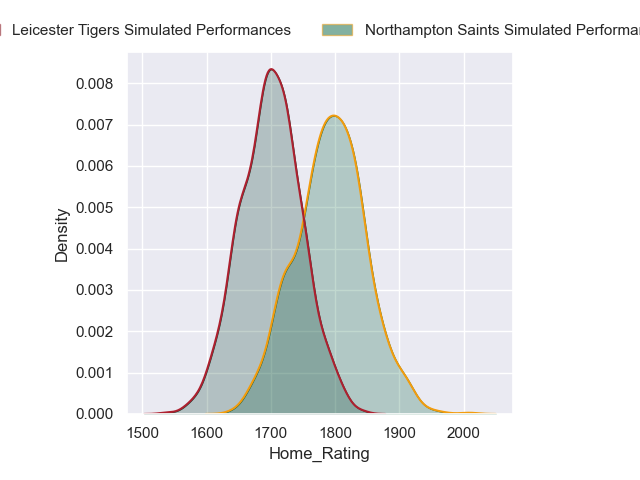
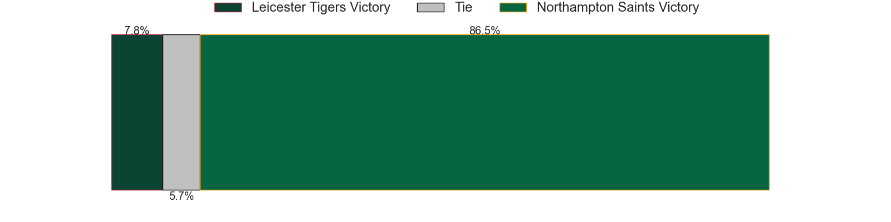
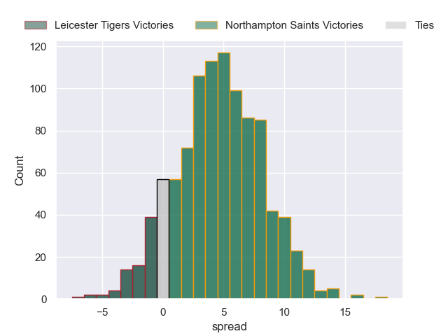

### Saracens V Gloucester Rugby on 2024/04/20

Average Margin: Saracens by 7.6

Average Scoreline: 34-27

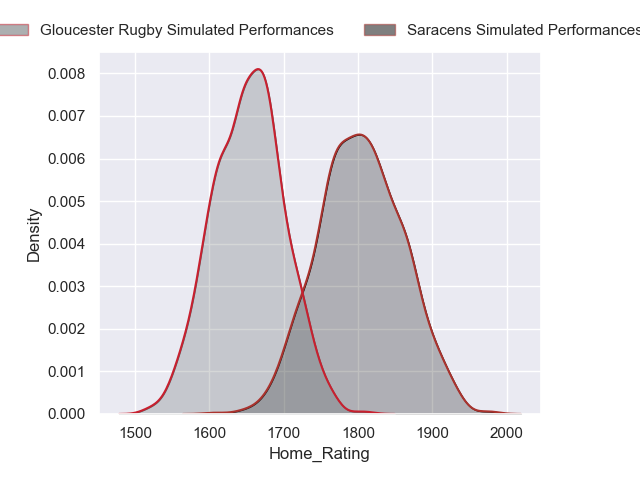

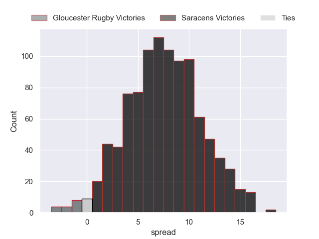

### Exeter Chiefs V Bath Rugby on 2024/04/20

Average Margin: Exeter Chiefs by 3.1

Average Scoreline: 38-34

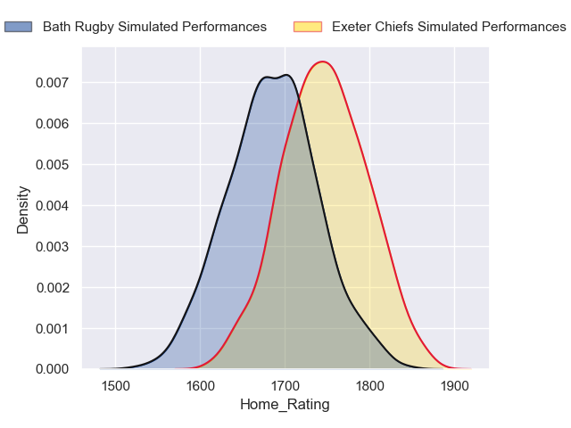
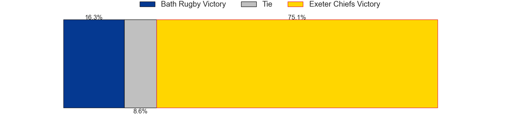
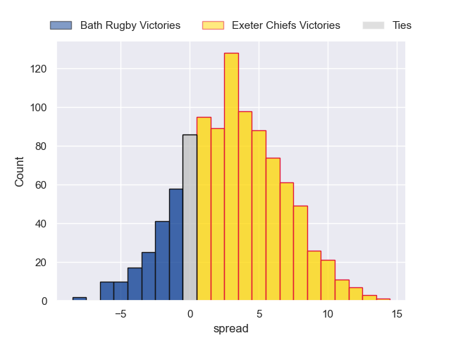

### Bristol Rugby V Newcastle Falcons on 2024/04/21

Average Margin: Bristol Rugby by 12.3

Average Scoreline: 30-17

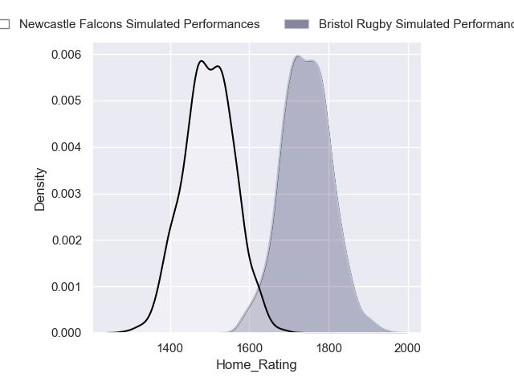

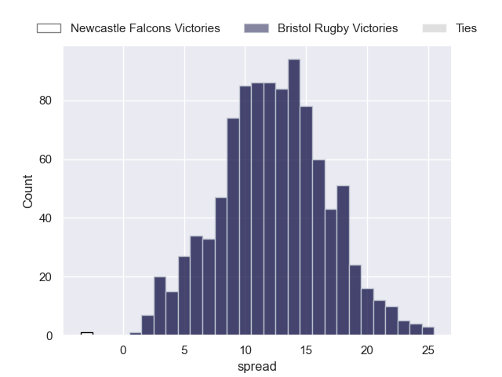

### Sale Sharks V Harlequins on 2024/04/21

Average Margin: Sale Sharks by 3.0

Average Scoreline: 32-29

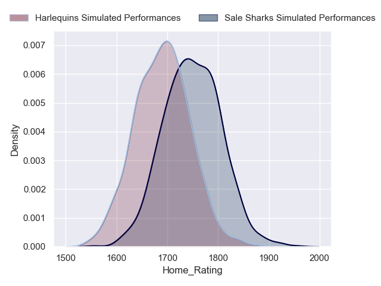

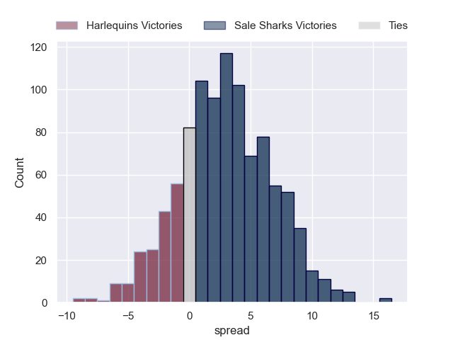

## Week 18

### Newcastle Falcons V Sale Sharks on 2024/04/26

Average Margin: Sale Sharks by 5.6

Average Scoreline: 35-30

### Gloucester Rugby V Exeter Chiefs on 2024/04/26

Average Margin: Gloucester Rugby by 1.8

Average Scoreline: 37-35

### Bath Rugby V Saracens on 2024/04/26

Average Margin: Bath Rugby by 0.7

Average Scoreline: 30-30

### Harlequins V Northampton Saints on 2024/04/26

Average Margin: Harlequins by 1.5

Average Scoreline: 32-30

### Leicester Tigers V Bristol Rugby on 2024/04/26

Average Margin: Leicester Tigers by 4.8

Average Scoreline: 42-37

## Week 19

### Exeter Chiefs V Harlequins on 2024/05/10

Average Margin: Exeter Chiefs by 3.0

Average Scoreline: 34-31

### Bristol Rugby V Saracens on 2024/05/10

Average Margin: Saracens by 0.0

Average Scoreline: 29-29

### Sale Sharks V Leicester Tigers on 2024/05/10

Average Margin: Sale Sharks by 2.5

Average Scoreline: 32-30

### Northampton Saints V Gloucester Rugby on 2024/05/10

Average Margin: Northampton Saints by 7.1

Average Scoreline: 38-30

### Newcastle Falcons V Bath Rugby on 2024/05/10

Average Margin: Bath Rugby by 5.9

Average Scoreline: 34-28

## Week 20

### Leicester Tigers V Exeter Chiefs on 2024/05/17

Average Margin: Leicester Tigers by 4.4

Average Scoreline: 35-30

### Bath Rugby V Northampton Saints on 2024/05/17

Average Margin: Bath Rugby by 1.2

Average Scoreline: 32-31

### Harlequins V Bristol Rugby on 2024/05/17

Average Margin: Harlequins by 4.2

Average Scoreline: 38-33

### Gloucester Rugby V Newcastle Falcons on 2024/05/17

Average Margin: Gloucester Rugby by 11.0

Average Scoreline: 32-21

### Saracens V Sale Sharks on 2024/05/17

Average Margin: Saracens by 6.1

Average Scoreline: 30-23

