---  
title: "Gallagher Premiership 2023 Status"  
date: 2024-05-13 6:00:00 -0500  
categories: model review projection  
layout: article  
aside:  
    toc: true  
---
# Current Team Rankings

# Standings

## Current Standings

| Club               |   Played |   Wins |   Point Differential |   Losing Bonus Points |   Try Bonus Points |   Competition Points |
|:-------------------|---------:|-------:|---------------------:|----------------------:|-------------------:|---------------------:|
| Northampton Saints |       17 |     12 |                  133 |                     2 |                 10 |                   60 |
| Bath Rugby         |       18 |     10 |                   67 |                     5 |                nan |                   57 |
| Saracens           |       17 |     11 |                  145 |                     2 |                 10 |                   56 |
| Exeter Chiefs      |       18 |     10 |                   93 |                     1 |                nan |                   52 |
| Sale Sharks        |       17 |     11 |                   16 |                     1 |                  7 |                   52 |
| Harlequins         |       18 |      9 |                   -9 |                     4 |                nan |                   52 |
| Bristol Rugby      |       18 |     10 |                  119 |                     2 |                nan |                   51 |
| Leicester Tigers   |       18 |      8 |                    9 |                     4 |                nan |                   42 |
| Gloucester Rugby   |       18 |      4 |                 -235 |                     4 |                nan |                   29 |
| Worcester Warriors |        4 |      2 |                    0 |                     0 |                nan |                    8 |
| Newcastle Falcons  |       18 |      0 |                 -338 |                     4 |                nan |                    7 |
| Wasps              |        3 |      1 |                    0 |                     0 |                nan |                    6 |

## Projected Remaining Table

| Club               |   Matches Remaining |   Wins |   Point Differential |   Losing Bonus Points |   Try Bonus Points |   Competition Points |
|:-------------------|--------------------:|-------:|---------------------:|----------------------:|-------------------:|---------------------:|
| Gloucester Rugby   |                   1 |    1   |            11.3383   |                   0   |                0.5 |                  4.5 |
| Saracens           |                   1 |    1   |             6.07949  |                   0   |                0.2 |                  4.1 |
| Harlequins         |                   1 |    0.9 |             4.38523  |                   0.1 |                0.5 |                  4.1 |
| Leicester Tigers   |                   1 |    0.8 |             3.02918  |                   0.2 |                0.3 |                  3.7 |
| Bath Rugby         |                   1 |    0.6 |             0.904065 |                   0.4 |                0.2 |                  3   |
| Northampton Saints |                   1 |    0.4 |            -0.904065 |                   0.6 |                0.3 |                  2.5 |
| Exeter Chiefs      |                   1 |    0.2 |            -3.02918  |                   0.7 |                0.2 |                  1.6 |
| Bristol Rugby      |                   1 |    0.1 |            -4.38523  |                   0.6 |                0.4 |                  1.5 |
| Sale Sharks        |                   1 |    0   |            -6.07949  |                   0.6 |                0.1 |                  0.9 |
| Newcastle Falcons  |                   1 |    0   |           -11.3383   |                   0.1 |                0.2 |                  0.3 |

## Projected Total Table

| Club               |   Total Matches |   Wins |   Point Differential |   Losing Bonus Points |   Try Bonus Points |   Competition Points |
|:-------------------|----------------:|-------:|---------------------:|----------------------:|-------------------:|---------------------:|
| Northampton Saints |              18 |   12.4 |            132.096   |                   2.6 |               10.3 |                 62.5 |
| Saracens           |              18 |   12   |            151.079   |                   2   |               10.2 |                 60.1 |
| Bath Rugby         |              19 |   10.6 |             67.9041  |                   5.4 |                0.2 |                 60   |
| Harlequins         |              19 |    9.9 |             -4.61477 |                   4.1 |                0.5 |                 56.1 |
| Exeter Chiefs      |              19 |   10.2 |             89.9708  |                   1.7 |                0.2 |                 53.6 |
| Sale Sharks        |              18 |   11   |              9.92051 |                   1.6 |                7.1 |                 52.9 |
| Bristol Rugby      |              19 |   10.1 |            114.615   |                   2.6 |                0.4 |                 52.5 |
| Leicester Tigers   |              19 |    8.8 |             12.0292  |                   4.2 |                0.3 |                 45.7 |
| Gloucester Rugby   |              19 |    5   |           -223.662   |                   4   |                0.5 |                 33.5 |
| Worcester Warriors |               4 |    2   |              0       |                   0   |                0   |                  8   |
| Newcastle Falcons  |              19 |    0   |           -349.338   |                   4.1 |                0.2 |                  7.3 |
| Wasps              |               3 |    1   |              0       |                   0   |                0   |                  6   |

# Completed Match Review

| Model | Percent Correct Predictions | Spread Error |
| ------ | ------ | ------ |
| Club Level | 63.0% | 13.1 |
| Player Level: Lineup | 68.2% | 13.1 |
| Player Level: Minutes | 64.7% | 13.2 |

# Future Predictions

## Week 19

### Gloucester Rugby V Newcastle Falcons on 2024/05/18

Average Margin: Gloucester Rugby by 11.3

Average Scoreline: 38-26

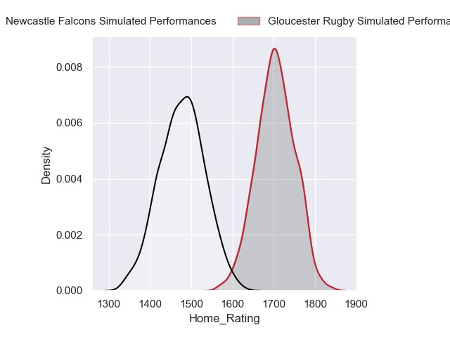
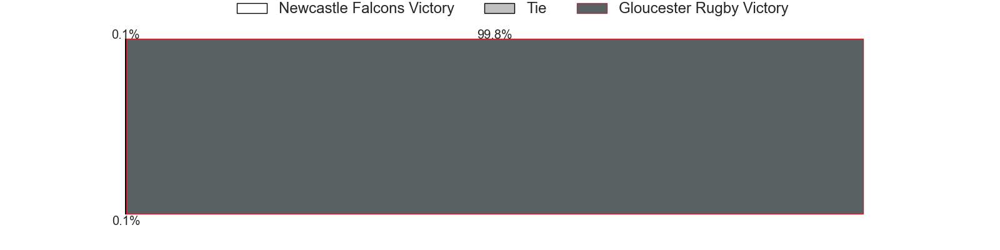
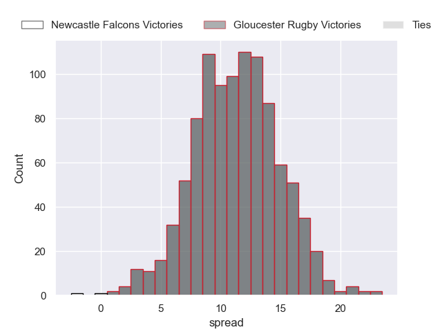

### Saracens V Sale Sharks on 2024/05/18

Average Margin: Saracens by 6.1

Average Scoreline: 31-25

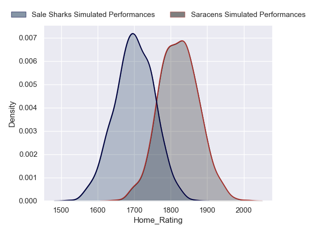

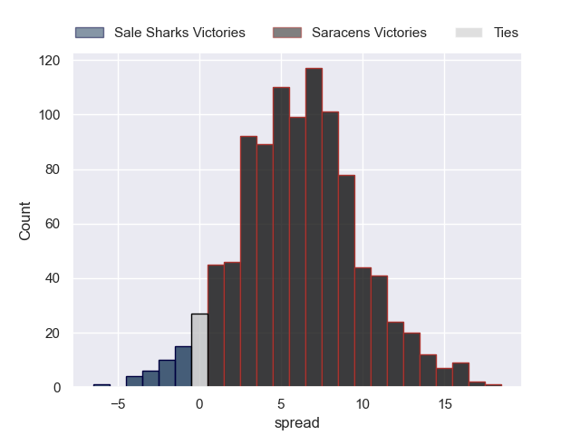

### Harlequins V Bristol Rugby on 2024/05/18

Average Margin: Harlequins by 4.4

Average Scoreline: 38-33

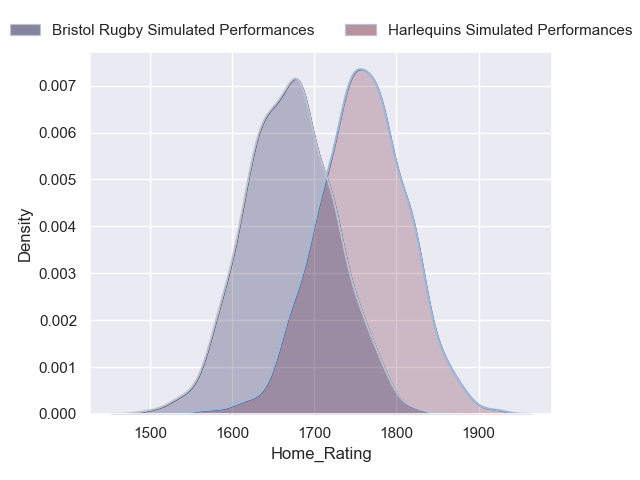

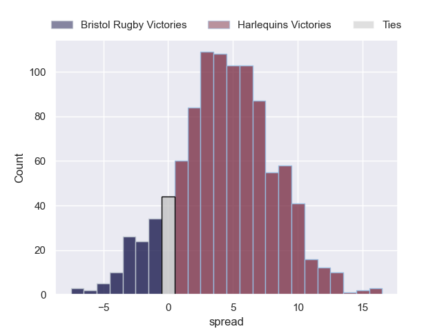

### Leicester Tigers V Exeter Chiefs on 2024/05/18

Average Margin: Leicester Tigers by 3.0

Average Scoreline: 35-32

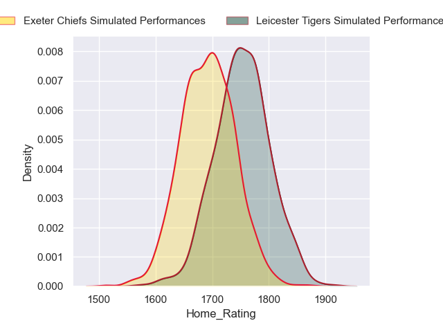
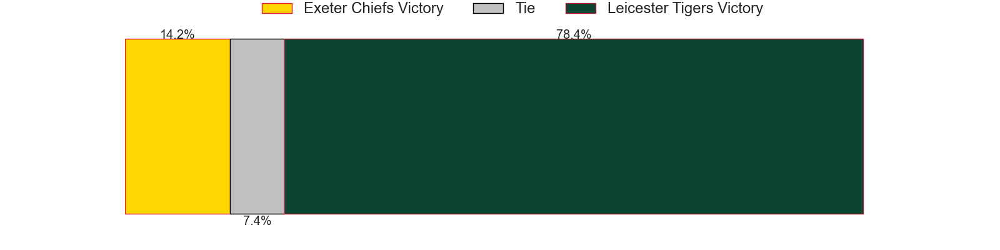
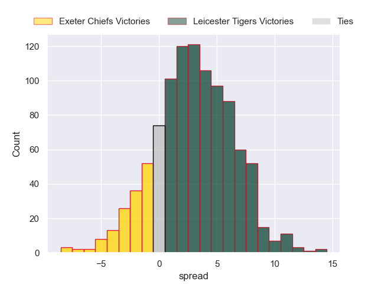

### Bath Rugby V Northampton Saints on 2024/05/18

Average Margin: Bath Rugby by 0.9

Average Scoreline: 29-28

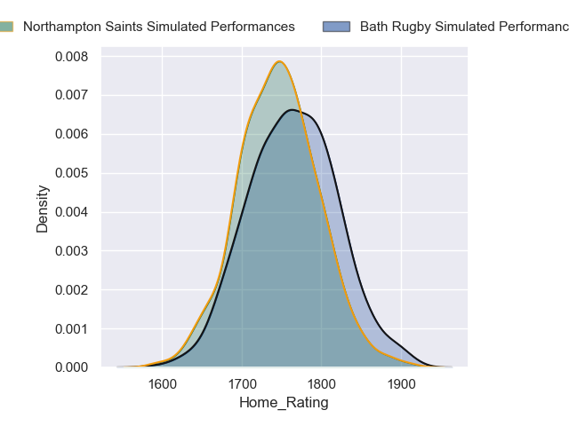
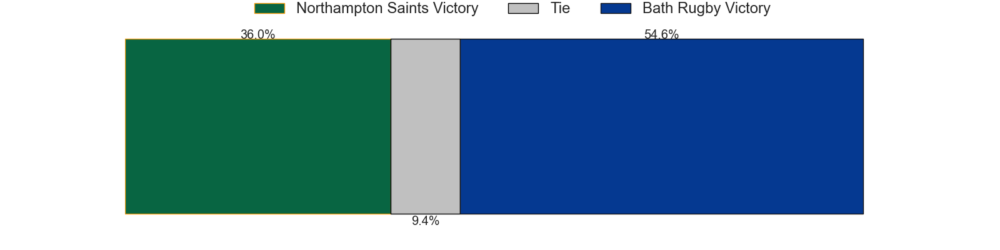
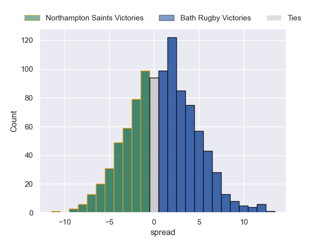

