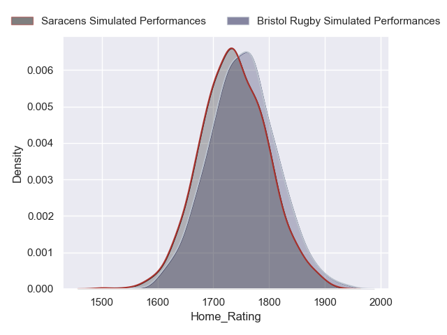
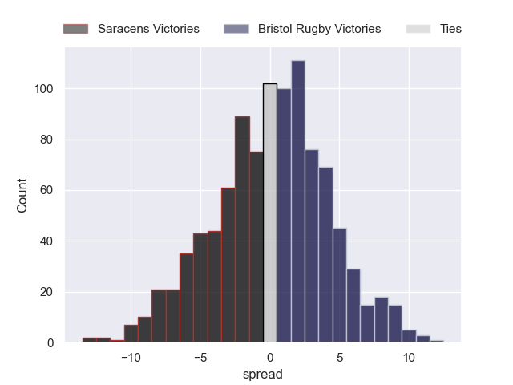
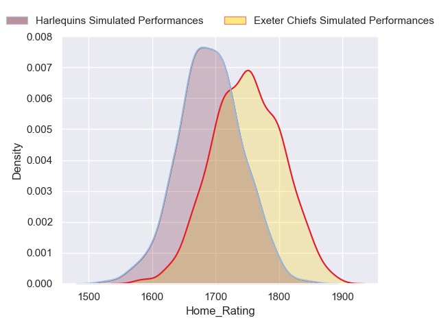
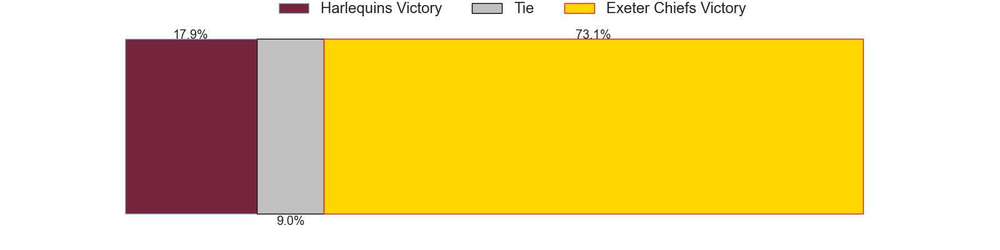
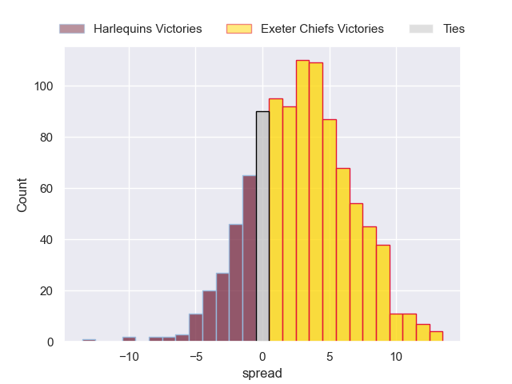

---  
title: "Gallagher Premiership 2023 Status"  
date: 2024-05-10 6:00:00 -0500  
categories: model review projection  
layout: article  
aside:  
    toc: true  
---
# Current Team Rankings

# Standings

## Current Standings

| Club               |   Played |   Wins |   Point Differential |   Losing Bonus Points |   Try Bonus Points |   Competition Points |
|:-------------------|---------:|-------:|---------------------:|----------------------:|-------------------:|---------------------:|
| Northampton Saints |       16 |     11 |                   43 |                     2 |                  9 |                   55 |
| Bath Rugby         |       17 |      9 |                   56 |                     5 |                nan |                   52 |
| Bristol Rugby      |       17 |     10 |                  140 |                     2 |                nan |                   51 |
| Saracens           |       16 |     10 |                  124 |                     2 |                  9 |                   51 |
| Harlequins         |       17 |      9 |                   23 |                     4 |                nan |                   51 |
| Exeter Chiefs      |       17 |      9 |                   61 |                     1 |                nan |                   47 |
| Sale Sharks        |       16 |     10 |                    7 |                     1 |                  6 |                   47 |
| Leicester Tigers   |       17 |      8 |                   18 |                     4 |                nan |                   42 |
| Gloucester Rugby   |       17 |      4 |                 -145 |                     4 |                nan |                   29 |
| Worcester Warriors |        4 |      2 |                    0 |                     0 |                nan |                    8 |
| Newcastle Falcons  |       17 |      0 |                 -327 |                     4 |                nan |                    7 |
| Wasps              |        3 |      1 |                    0 |                     0 |                nan |                    6 |

## Projected Remaining Table

| Club               |   Matches Remaining |   Wins |   Point Differential |   Losing Bonus Points |   Try Bonus Points |   Competition Points |
|:-------------------|--------------------:|-------:|---------------------:|----------------------:|-------------------:|---------------------:|
| Bath Rugby         |                   2 |    1.6 |             8.40487  |                   0.4 |                0.8 |                  7.6 |
| Northampton Saints |                   2 |    1.4 |             7.13411  |                   0.6 |                0.9 |                  7   |
| Saracens           |                   2 |    1.3 |             4.6065   |                   0.6 |                0.5 |                  6.4 |
| Harlequins         |                   2 |    1.1 |             1.74943  |                   0.8 |                0.8 |                  6   |
| Exeter Chiefs      |                   2 |    1   |            -0.718812 |                   0.8 |                0.5 |                  5.2 |
| Leicester Tigers   |                   2 |    1   |            -0.342493 |                   0.8 |                0.4 |                  5.1 |
| Gloucester Rugby   |                   2 |    1   |             3.37119  |                   0.4 |                0.6 |                  5   |
| Sale Sharks        |                   2 |    0.9 |            -1.64665  |                   0.7 |                0.3 |                  4.7 |
| Bristol Rugby      |                   2 |    0.7 |            -3.64798  |                   1   |                0.5 |                  4.3 |
| Newcastle Falcons  |                   2 |    0   |           -18.9102   |                   0.6 |                0.3 |                  1   |

## Projected Total Table

| Club               |   Total Matches |   Wins |   Point Differential |   Losing Bonus Points |   Try Bonus Points |   Competition Points |
|:-------------------|----------------:|-------:|---------------------:|----------------------:|-------------------:|---------------------:|
| Northampton Saints |              18 |   12.4 |             50.1341  |                   2.6 |                9.9 |                 62   |
| Bath Rugby         |              19 |   10.6 |             64.4049  |                   5.4 |                0.8 |                 59.6 |
| Saracens           |              18 |   11.3 |            128.607   |                   2.6 |                9.5 |                 57.4 |
| Harlequins         |              19 |   10.1 |             24.7494  |                   4.8 |                0.8 |                 57   |
| Bristol Rugby      |              19 |   10.7 |            136.352   |                   3   |                0.5 |                 55.3 |
| Exeter Chiefs      |              19 |   10   |             60.2812  |                   1.8 |                0.5 |                 52.2 |
| Sale Sharks        |              18 |   10.9 |              5.35335 |                   1.7 |                6.3 |                 51.7 |
| Leicester Tigers   |              19 |    9   |             17.6575  |                   4.8 |                0.4 |                 47.1 |
| Gloucester Rugby   |              19 |    5   |           -141.629   |                   4.4 |                0.6 |                 34   |
| Worcester Warriors |               4 |    2   |              0       |                   0   |                0   |                  8   |
| Newcastle Falcons  |              19 |    0   |           -345.91    |                   4.6 |                0.3 |                  8   |
| Wasps              |               3 |    1   |              0       |                   0   |                0   |                  6   |

# Completed Match Review

| Model | Percent Correct Predictions | Spread Error |
| ------ | ------ | ------ |
| Club Level | 62.1% | 12.2 |
| Player Level: Lineup | 63.5% | 12.3 |
| Player Level: Minutes | 63.7% | 12.4 |

# Future Predictions

## Week 18

### Sale Sharks V Leicester Tigers on 2024/05/10

Average Margin: Sale Sharks by 3.7

Average Scoreline: 26-23

### Newcastle Falcons V Bath Rugby on 2024/05/10

Average Margin: Bath Rugby by 7.4

Average Scoreline: 29-21

### Northampton Saints V Gloucester Rugby on 2024/05/11

Average Margin: Northampton Saints by 8.2

Average Scoreline: 36-28

### Bristol Rugby V Saracens on 2024/05/11

Average Margin: Bristol Rugby by 0.7

Average Scoreline: 20-20

### Exeter Chiefs V Harlequins on 2024/05/11

Average Margin: Exeter Chiefs by 2.6

Average Scoreline: 33-31

## Week 19

### Saracens V Sale Sharks on 2024/05/17

Average Margin: Saracens by 5.3

Average Scoreline: 27-22

### Gloucester Rugby V Newcastle Falcons on 2024/05/17

Average Margin: Gloucester Rugby by 11.6

Average Scoreline: 35-24

### Leicester Tigers V Exeter Chiefs on 2024/05/17

Average Margin: Leicester Tigers by 3.4

Average Scoreline: 30-26

### Bath Rugby V Northampton Saints on 2024/05/17

Average Margin: Bath Rugby by 1.0

Average Scoreline: 33-32

### Harlequins V Bristol Rugby on 2024/05/17

Average Margin: Harlequins by 4.4

Average Scoreline: 36-32

