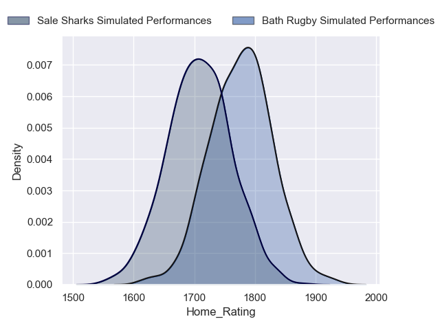
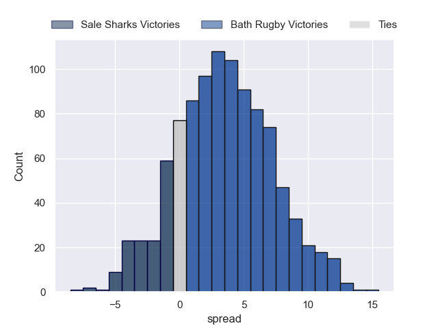

---  
title: "Gallagher Premiership 2023 Status"  
date: 2024-05-30 6:00:00 -0500  
categories: model review projection  
layout: article  
aside:  
    toc: true  
---
# Current Team Rankings

# Standings

## Current Standings

| Club               |   Played |   Wins |   Point Differential |   Losing Bonus Points |   Try Bonus Points |   Competition Points |
|:-------------------|---------:|-------:|---------------------:|----------------------:|-------------------:|---------------------:|
| Bath Rugby         |       19 |     11 |                   98 |                     5 |                nan |                   62 |
| Northampton Saints |       18 |     12 |                  102 |                     2 |                 10 |                   60 |
| Bristol Rugby      |       19 |     11 |                  144 |                     2 |                nan |                   56 |
| Saracens           |       18 |     11 |                  135 |                     2 |                 10 |                   56 |
| Sale Sharks        |       18 |     12 |                   26 |                     1 |                  7 |                   56 |
| Harlequins         |       19 |      9 |                  -34 |                     4 |                nan |                   53 |
| Exeter Chiefs      |       19 |     10 |                   75 |                     1 |                nan |                   52 |
| Leicester Tigers   |       19 |      9 |                   27 |                     4 |                nan |                   47 |
| Gloucester Rugby   |       19 |      5 |                 -195 |                     4 |                nan |                   34 |
| Worcester Warriors |        4 |      2 |                    0 |                     0 |                nan |                    8 |
| Newcastle Falcons  |       19 |      0 |                 -378 |                     4 |                nan |                    7 |
| Wasps              |        3 |      1 |                    0 |                     0 |                nan |                    6 |
| Jamaica            |        1 |      1 |                    5 |                     0 |                nan |                    4 |
| Bermuda            |        1 |      0 |                   -5 |                     1 |                nan |                    1 |

## Projected Remaining Table

| Club               |   Matches Remaining |   Wins |   Point Differential |   Losing Bonus Points |   Try Bonus Points |   Competition Points |
|:-------------------|--------------------:|-------:|---------------------:|----------------------:|-------------------:|---------------------:|
| Bath Rugby         |                   1 |    0.8 |              3.43827 |                   0.2 |                0.3 |                  3.8 |
| Northampton Saints |                   1 |    0.8 |              3.01406 |                   0.2 |                0.2 |                  3.5 |
| Saracens           |                   1 |    0.2 |             -3.01406 |                   0.6 |                0.2 |                  1.7 |
| Sale Sharks        |                   1 |    0.2 |             -3.43827 |                   0.6 |                0.3 |                  1.6 |

## Projected Total Table

| Club               |   Total Matches |   Wins |   Point Differential |   Losing Bonus Points |   Try Bonus Points |   Competition Points |
|:-------------------|----------------:|-------:|---------------------:|----------------------:|-------------------:|---------------------:|
| Bath Rugby         |              20 |   11.8 |             101.438  |                   5.2 |                0.3 |                 65.8 |
| Northampton Saints |              19 |   12.8 |             105.014  |                   2.2 |               10.2 |                 63.5 |
| Saracens           |              19 |   11.2 |             131.986  |                   2.6 |               10.2 |                 57.7 |
| Sale Sharks        |              19 |   12.2 |              22.5617 |                   1.6 |                7.3 |                 57.6 |
| Bristol Rugby      |              19 |   11   |             144      |                   2   |                0   |                 56   |
| Harlequins         |              19 |    9   |             -34      |                   4   |                0   |                 53   |
| Exeter Chiefs      |              19 |   10   |              75      |                   1   |                0   |                 52   |
| Leicester Tigers   |              19 |    9   |              27      |                   4   |                0   |                 47   |
| Gloucester Rugby   |              19 |    5   |            -195      |                   4   |                0   |                 34   |
| Worcester Warriors |               4 |    2   |               0      |                   0   |                0   |                  8   |
| Newcastle Falcons  |              19 |    0   |            -378      |                   4   |                0   |                  7   |
| Wasps              |               3 |    1   |               0      |                   0   |                0   |                  6   |
| Jamaica            |               1 |    1   |               5      |                   0   |                0   |                  4   |
| Bermuda            |               1 |    0   |              -5      |                   1   |                0   |                  1   |

# Completed Match Review

| Model | Percent Correct Predictions | Spread Error |
| ------ | ------ | ------ |
| Club Level | 63.3% | 13.6 |
| Player Level: Lineup | 67.1% | 13.1 |
| Player Level: Minutes | 64.7% | 13.2 |

# Future Predictions

## Week 20

### Northampton Saints V Saracens on 2024/05/31

Average Margin: Northampton Saints by 3.0

Average Scoreline: 27-24

### Bath Rugby V Sale Sharks on 2024/06/01

Average Margin: Bath Rugby by 3.4

Average Scoreline: 26-22

