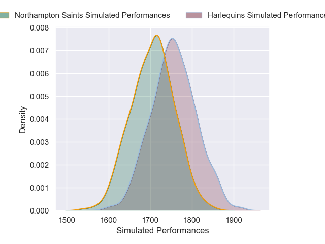
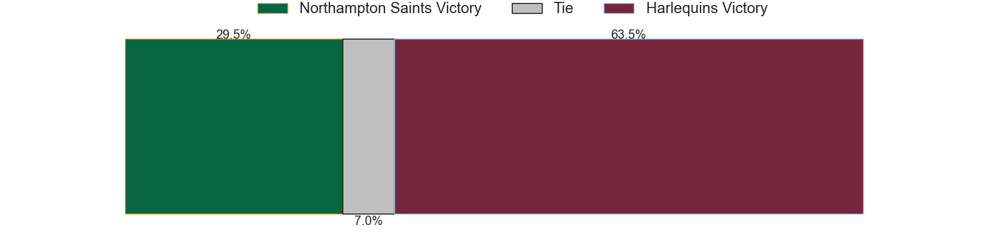
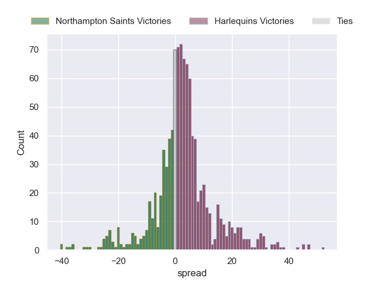
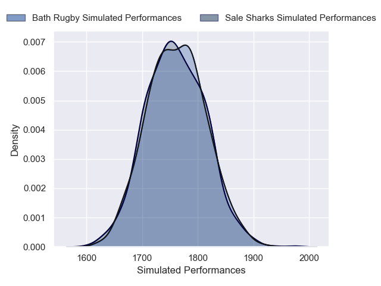
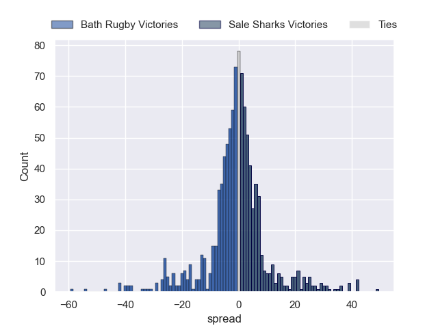
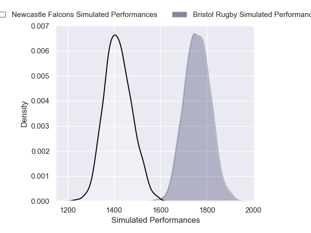
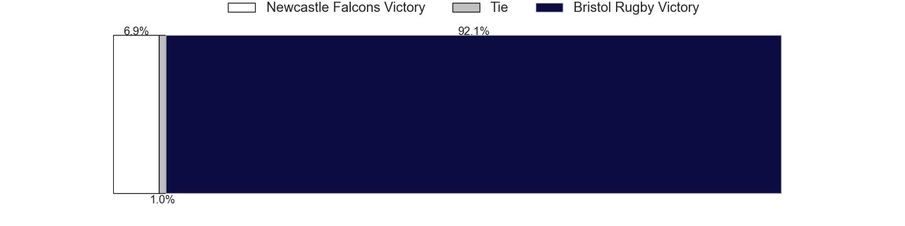
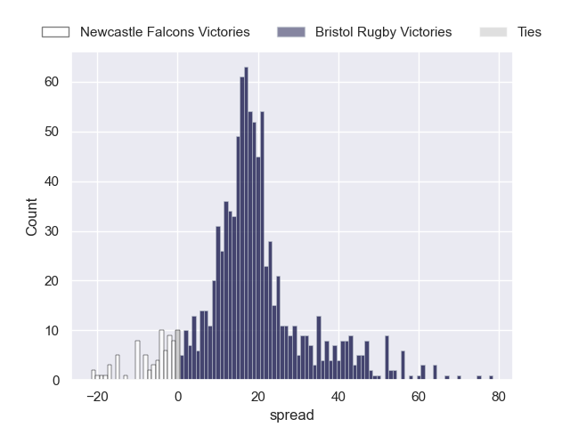

---  
title: "Gallagher Premiership 2024 Status"  
date: 2025-01-20 6:00:00 -0500  
categories: model review projection  
layout: article  
aside:  
    toc: true  
---
# Current Team Rankings

# Standings

## Current Standings

| Club               |   Played |   Wins |   Point Differential |   Losing Bonus Points |   Try Bonus Points |   Competition Points |
|:-------------------|---------:|-------:|---------------------:|----------------------:|-------------------:|---------------------:|
| Bath Rugby         |       10 |      8 |                  156 |                     1 |                  8 |                   41 |
| Bristol Rugby      |       10 |      6 |                   46 |                     2 |                  9 |                   35 |
| Saracens           |       10 |      6 |                   -4 |                     3 |                  7 |                   34 |
| Leicester Tigers   |       10 |      6 |                   21 |                     1 |                  6 |                   33 |
| Gloucester Rugby   |       10 |      5 |                   23 |                     3 |                  7 |                   30 |
| Sale Sharks        |       10 |      6 |                   16 |                     0 |                  5 |                   29 |
| Harlequins         |       10 |      4 |                   17 |                     3 |                  6 |                   27 |
| Northampton Saints |       10 |      5 |                   33 |                     0 |                  5 |                   25 |
| Exeter Chiefs      |       10 |      1 |                  -80 |                     5 |                  1 |                   10 |
| Newcastle Falcons  |       10 |      2 |                 -228 |                     0 |                  0 |                    8 |

## Projected Remaining Table

| Club               |   Matches Remaining |   Wins |   Point Differential |   Losing Bonus Points |   Try Bonus Points |   Competition Points |
|:-------------------|--------------------:|-------:|---------------------:|----------------------:|-------------------:|---------------------:|
| Bath Rugby         |                   8 |    5.8 |             52.2993  |                   1.5 |                3.3 |                 27.8 |
| Northampton Saints |                   8 |    5   |             21.6638  |                   2   |                3   |                 24.8 |
| Bristol Rugby      |                   8 |    4.7 |             25.144   |                   2.1 |                3.7 |                 24.6 |
| Saracens           |                   8 |    4.9 |             31.3847  |                   2.1 |                2.2 |                 23.9 |
| Sale Sharks        |                   8 |    4.5 |             11.4157  |                   2.3 |                2.6 |                 22.9 |
| Harlequins         |                   8 |    4.1 |              3.09571 |                   2.2 |                2.5 |                 21.1 |
| Leicester Tigers   |                   8 |    3.9 |              5.51798 |                   2.4 |                2.7 |                 20.8 |
| Gloucester Rugby   |                   8 |    3.6 |            -14.0436  |                   2.2 |                1.9 |                 18.3 |
| Exeter Chiefs      |                   8 |    2.8 |            -17.7111  |                   2.8 |                1.9 |                 16   |
| Newcastle Falcons  |                   8 |    0.7 |           -118.766   |                   1.2 |                0.6 |                  4.8 |

## Projected Total Table

| Club               |   Total Matches |   Wins |   Point Differential |   Losing Bonus Points |   Try Bonus Points |   Competition Points |
|:-------------------|----------------:|-------:|---------------------:|----------------------:|-------------------:|---------------------:|
| Bath Rugby         |              18 |   13.8 |            208.299   |                   2.5 |               11.3 |                 68.8 |
| Bristol Rugby      |              18 |   10.7 |             71.144   |                   4.1 |               12.7 |                 59.6 |
| Saracens           |              18 |   10.9 |             27.3847  |                   5.1 |                9.2 |                 57.9 |
| Leicester Tigers   |              18 |    9.9 |             26.518   |                   3.4 |                8.7 |                 53.8 |
| Sale Sharks        |              18 |   10.5 |             27.4157  |                   2.3 |                7.6 |                 51.9 |
| Northampton Saints |              18 |   10   |             54.6638  |                   2   |                8   |                 49.8 |
| Gloucester Rugby   |              18 |    8.6 |              8.95638 |                   5.2 |                8.9 |                 48.3 |
| Harlequins         |              18 |    8.1 |             20.0957  |                   5.2 |                8.5 |                 48.1 |
| Exeter Chiefs      |              18 |    3.8 |            -97.7111  |                   7.8 |                2.9 |                 26   |
| Newcastle Falcons  |              18 |    2.7 |           -346.766   |                   1.2 |                0.6 |                 12.8 |

# Completed Match Review

| Model | Percent Correct Predictions | Spread Error |
| ------ | ------ | ------ |
| Club Level | 68.0% | 13.7 |
| Player Level: Lineup | 52.9% | 18.3 |
| Player Level: Minutes | 47.1% | 20.6 |

# Future Predictions

## Week 11

### Harlequins V Northampton Saints on 2025/01/24

Average Margin: Harlequins by 3.0

Average Scoreline: 32-29

### Exeter Chiefs V Saracens on 2025/01/25

Average Margin: Saracens by 2.3

Average Scoreline: 24-22

### Gloucester Rugby V Leicester Tigers on 2025/01/25

Average Margin: Gloucester Rugby by 0.4

Average Scoreline: 22-21

### Sale Sharks V Bath Rugby on 2025/01/26

Average Margin: Bath Rugby by 0.7

Average Scoreline: 25-24

### Bristol Rugby V Newcastle Falcons on 2025/01/26

Average Margin: Bristol Rugby by 18.5

Average Scoreline: 34-15

## Week 12

### Saracens V Harlequins on 2025/03/22

Average Margin: Saracens by 5.2

Average Scoreline: 30-25

### Bristol Rugby V Exeter Chiefs on 2025/03/22

Average Margin: Bristol Rugby by 8.3

Average Scoreline: 36-28

### Bath Rugby V Gloucester Rugby on 2025/03/22

Average Margin: Bath Rugby by 11.3

Average Scoreline: 32-20

### Newcastle Falcons V Sale Sharks on 2025/03/22

Average Margin: Sale Sharks by 11.0

Average Scoreline: 25-14

### Northampton Saints V Leicester Tigers on 2025/03/22

Average Margin: Northampton Saints by 5.4

Average Scoreline: 27-22

## Week 13

### Gloucester Rugby V Bristol Rugby on 2025/03/29

Average Margin: Gloucester Rugby by 0.1

Average Scoreline: 31-31

### Bath Rugby V Harlequins on 2025/03/29

Average Margin: Bath Rugby by 8.0

Average Scoreline: 33-25

### Sale Sharks V Northampton Saints on 2025/03/29

Average Margin: Sale Sharks by 2.3

Average Scoreline: 28-26

### Exeter Chiefs V Newcastle Falcons on 2025/03/29

Average Margin: Exeter Chiefs by 13.6

Average Scoreline: 34-20

### Leicester Tigers V Saracens on 2025/03/29

Average Margin: Leicester Tigers by 1.3

Average Scoreline: 22-21

## Week 14

### Bristol Rugby V Leicester Tigers on 2025/04/19

Average Margin: Bristol Rugby by 4.2

Average Scoreline: 31-27

### Saracens V Gloucester Rugby on 2025/04/19

Average Margin: Saracens by 8.7

Average Scoreline: 29-20

### Harlequins V Sale Sharks on 2025/04/19

Average Margin: Harlequins by 4.3

Average Scoreline: 29-24

### Newcastle Falcons V Northampton Saints on 2025/04/19

Average Margin: Northampton Saints by 11.5

Average Scoreline: 26-14

### Exeter Chiefs V Bath Rugby on 2025/04/19

Average Margin: Bath Rugby by 4.6

Average Scoreline: 29-25

## Week 15

### Northampton Saints V Bristol Rugby on 2025/04/26

Average Margin: Northampton Saints by 5.3

Average Scoreline: 34-29

### Leicester Tigers V Harlequins on 2025/04/26

Average Margin: Leicester Tigers by 3.1

Average Scoreline: 29-26

### Bath Rugby V Newcastle Falcons on 2025/04/26

Average Margin: Bath Rugby by 21.0

Average Scoreline: 37-16

### Sale Sharks V Saracens on 2025/04/26

Average Margin: Sale Sharks by 1.9

Average Scoreline: 23-21

### Gloucester Rugby V Exeter Chiefs on 2025/04/26

Average Margin: Gloucester Rugby by 5.5

Average Scoreline: 31-26

## Week 16

### Leicester Tigers V Sale Sharks on 2025/05/10

Average Margin: Leicester Tigers by 3.1

Average Scoreline: 31-28

### Harlequins V Gloucester Rugby on 2025/05/10

Average Margin: Harlequins by 7.1

Average Scoreline: 35-28

### Exeter Chiefs V Northampton Saints on 2025/05/10

Average Margin: Northampton Saints by 1.9

Average Scoreline: 29-27

### Bristol Rugby V Bath Rugby on 2025/05/10

Average Margin: Bath Rugby by 0.0

Average Scoreline: 32-32

### Saracens V Newcastle Falcons on 2025/05/10

Average Margin: Saracens by 19.4

Average Scoreline: 35-15

## Week 17

### Bath Rugby V Leicester Tigers on 2025/05/17

Average Margin: Bath Rugby by 8.5

Average Scoreline: 35-27

### Harlequins V Exeter Chiefs on 2025/05/17

Average Margin: Harlequins by 8.1

Average Scoreline: 34-25

### Northampton Saints V Saracens on 2025/05/17

Average Margin: Northampton Saints by 2.7

Average Scoreline: 25-23

### Sale Sharks V Bristol Rugby on 2025/05/17

Average Margin: Sale Sharks by 3.7

Average Scoreline: 34-30

### Newcastle Falcons V Gloucester Rugby on 2025/05/17

Average Margin: Gloucester Rugby by 7.3

Average Scoreline: 25-18

## Week 18

### Exeter Chiefs V Sale Sharks on 2025/05/31

Average Margin: Sale Sharks by 0.6

Average Scoreline: 25-25

### Saracens V Bath Rugby on 2025/05/31

Average Margin: Saracens by 1.8

Average Scoreline: 24-22

### Leicester Tigers V Newcastle Falcons on 2025/05/31

Average Margin: Leicester Tigers by 16.4

Average Scoreline: 35-18

### Bristol Rugby V Harlequins on 2025/05/31

Average Margin: Bristol Rugby by 3.2

Average Scoreline: 36-32

### Gloucester Rugby V Northampton Saints on 2025/05/31

Average Margin: Northampton Saints by 0.2

Average Scoreline: 30-30

