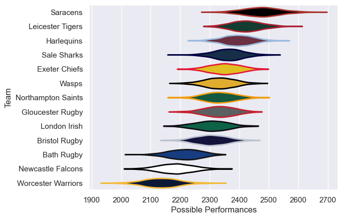

---  
title: "Gallagher Premiership 21/22"  
date: 2025-07-29 6:00:00 -0500  
categories: model review projection  
layout: article  
aside:  
    toc: true  
---
# Current Team Rankings

# Standings

## Current Standings

| Club               |   Played |   Wins |   Point Differential |   Losing Bonus Points |   Try Bonus Points |   Competition Points |
|:-------------------|---------:|-------:|---------------------:|----------------------:|-------------------:|---------------------:|
| Leicester Tigers   |       26 |     22 |                  290 |                     3 |                 11 |                  102 |
| Saracens           |       26 |     18 |                  274 |                     6 |                 12 |                   92 |
| Harlequins         |       25 |     15 |                   76 |                     6 |                 14 |                   80 |
| Northampton Saints |       25 |     14 |                  112 |                     5 |                 14 |                   75 |
| Gloucester Rugby   |       24 |     13 |                  160 |                     7 |                 10 |                   71 |
| Sale Sharks        |       24 |     12 |                   64 |                     3 |                 11 |                   70 |
| Exeter Chiefs      |       24 |     13 |                   50 |                     8 |                  9 |                   69 |
| London Irish       |       24 |      8 |                   -6 |                     3 |                 14 |                   61 |
| Wasps              |       24 |     11 |                   14 |                     6 |                  8 |                   60 |
| Bristol Rugby      |       24 |      8 |                 -145 |                     5 |                 11 |                   48 |
| Worcester Warriors |       24 |      6 |                 -363 |                     2 |                  7 |                   35 |
| Bath Rugby         |       24 |      5 |                 -302 |                     6 |                  4 |                   34 |
| Newcastle Falcons  |       24 |      5 |                 -224 |                     4 |                  3 |                   31 |

# Completed Match Review

| Model | Percent Correct Predictions | Spread Error |
| ------ | ------ | ------ |
| Club Level | 62.9% | 10.8 |
| Player Level: Lineup | nan% | nan |
| Player Level: Minutes | nan% | nan |

