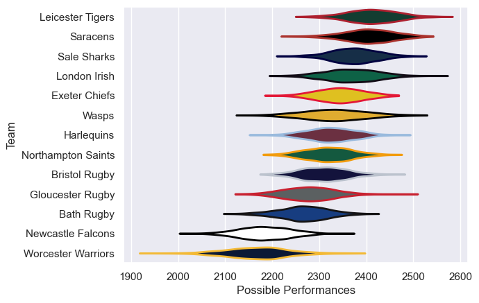

---  
title: "Gallagher Premiership 22/23 Status"  
date: 2025-07-28 6:00:00 -0500  
categories: model review projection  
layout: article  
aside:  
    toc: true  
---
# Current Team Rankings

# Standings

## Current Standings

| Club               |   Played |   Wins |   Point Differential |   Losing Bonus Points |   Try Bonus Points |   Competition Points |
|:-------------------|---------:|-------:|---------------------:|----------------------:|-------------------:|---------------------:|
| Sale Sharks        |       24 |     17 |                  223 |                     3 |                 12 |                   83 |
| Saracens           |       22 |     17 |                  142 |                     1 |                 14 |                   83 |
| London Irish       |       22 |     11 |                  100 |                     7 |                 10 |                   63 |
| Leicester Tigers   |       22 |     11 |                   62 |                     4 |                  9 |                   61 |
| Northampton Saints |       23 |     11 |                  -68 |                     3 |                 12 |                   61 |
| Harlequins         |       22 |      9 |                  -35 |                     4 |                 11 |                   53 |
| Bath Rugby         |       22 |      8 |                  -12 |                     7 |                  9 |                   52 |
| Exeter Chiefs      |       22 |     10 |                  -63 |                     4 |                  4 |                   52 |
| Bristol Rugby      |       22 |      8 |                  -21 |                     4 |                  9 |                   51 |
| Gloucester Rugby   |       22 |      7 |                  -69 |                     7 |                  6 |                   45 |
| Newcastle Falcons  |       22 |      6 |                 -217 |                     3 |                  4 |                   35 |
| Wasps              |        8 |      0 |                  -42 |                     0 |                  2 |                   16 |
| Worcester Warriors |        7 |      0 |                    0 |                     0 |                  1 |                   15 |

# Completed Match Review

| Model | Percent Correct Predictions | Spread Error |
| ------ | ------ | ------ |
| Club Level | 63.1% | 11.6 |
| Player Level: Lineup | nan% | nan |
| Player Level: Minutes | nan% | nan |

