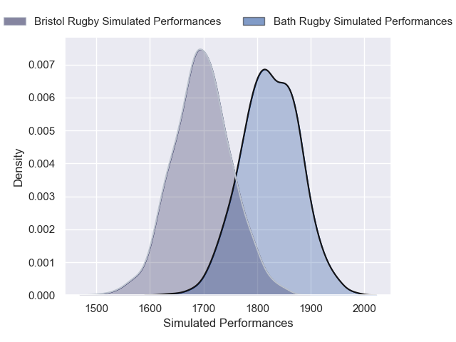
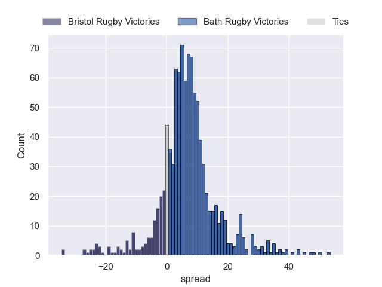
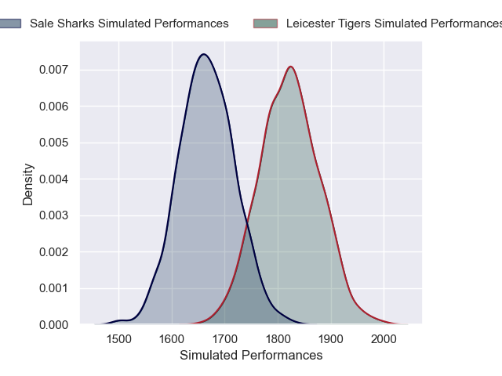
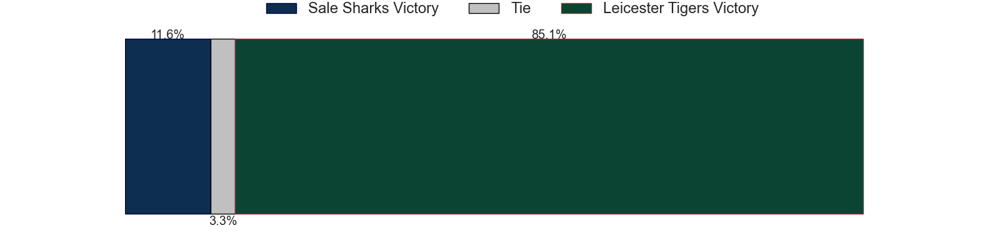
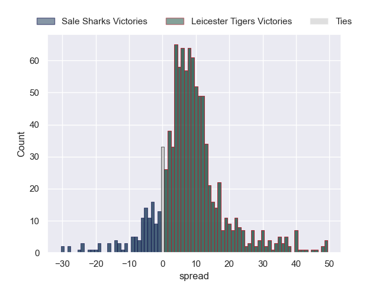

---  
title: "Gallagher Premiership 24/25 Status"  
date: 2025-06-02 6:00:00 -0500  
categories: model review projection  
layout: article  
aside:  
    toc: true  
---
# Current Team Rankings

# Standings

## Current Standings

| Club               |   Played |   Wins |   Point Differential |   Losing Bonus Points |   Try Bonus Points |   Competition Points |
|:-------------------|---------:|-------:|---------------------:|----------------------:|-------------------:|---------------------:|
| Leicester Tigers   |       18 |     12 |                  170 |                     3 |                 12 |                   65 |
| Bath Rugby         |       18 |     12 |                  121 |                     2 |                 15 |                   65 |
| Bristol Rugby      |       18 |     11 |                   95 |                     2 |                 16 |                   62 |
| Saracens           |       18 |     10 |                   58 |                     4 |                 12 |                   58 |
| Sale Sharks        |       18 |     11 |                   53 |                     0 |                 10 |                   56 |
| Gloucester Rugby   |       18 |      9 |                  -16 |                     3 |                 13 |                   52 |
| Harlequins         |       18 |      8 |                   -9 |                     4 |                 11 |                   49 |
| Northampton Saints |       18 |      7 |                  -58 |                     2 |                 10 |                   40 |
| Exeter Chiefs      |       18 |      5 |                  -59 |                     8 |                  5 |                   33 |
| Newcastle Falcons  |       18 |      3 |                 -355 |                     2 |                  3 |                   17 |

## Projected Remaining Table

| Club             |   Matches Remaining |   Wins |   Point Differential |   Losing Bonus Points |   Try Bonus Points |   Competition Points |
|:-----------------|--------------------:|-------:|---------------------:|----------------------:|-------------------:|---------------------:|
| Bath Rugby       |                   1 |    0.8 |              6.97142 |                   0.1 |                0.5 |                  4   |
| Leicester Tigers |                   1 |    0.9 |              8.53582 |                   0.1 |                0.3 |                  3.9 |
| Bristol Rugby    |                   1 |    0.2 |             -6.97142 |                   0.4 |                0.2 |                  1.2 |
| Sale Sharks      |                   1 |    0.1 |             -8.53582 |                   0.3 |                0.2 |                  1   |

## Projected Total Table

| Club               |   Total Matches |   Wins |   Point Differential |   Losing Bonus Points |   Try Bonus Points |   Competition Points |
|:-------------------|----------------:|-------:|---------------------:|----------------------:|-------------------:|---------------------:|
| Bath Rugby         |              19 |   12.8 |             127.971  |                   2.1 |               15.5 |                 69   |
| Leicester Tigers   |              19 |   12.9 |             178.536  |                   3.1 |               12.3 |                 68.9 |
| Bristol Rugby      |              19 |   11.2 |              88.0286 |                   2.4 |               16.2 |                 63.2 |
| Saracens           |              18 |   10   |              58      |                   4   |               12   |                 58   |
| Sale Sharks        |              19 |   11.1 |              44.4642 |                   0.3 |               10.2 |                 57   |
| Gloucester Rugby   |              18 |    9   |             -16      |                   3   |               13   |                 52   |
| Harlequins         |              18 |    8   |              -9      |                   4   |               11   |                 49   |
| Northampton Saints |              18 |    7   |             -58      |                   2   |               10   |                 40   |
| Exeter Chiefs      |              18 |    5   |             -59      |                   8   |                5   |                 33   |
| Newcastle Falcons  |              18 |    3   |            -355      |                   2   |                3   |                 17   |

# Completed Match Review

| Model | Percent Correct Predictions | Spread Error |
| ------ | ------ | ------ |
| Club Level | 65.6% | 13.7 |
| Player Level: Lineup | 43.5% | 15.3 |
| Player Level: Minutes | 52.2% | 19.4 |

# Future Predictions

## Week 19

### Bath Rugby V Bristol Rugby on 2025/06/06

Average Margin: Bath Rugby by 7.0

Average Scoreline: 34-27

### Leicester Tigers V Sale Sharks on 2025/06/07

Average Margin: Leicester Tigers by 8.5

Average Scoreline: 30-22

