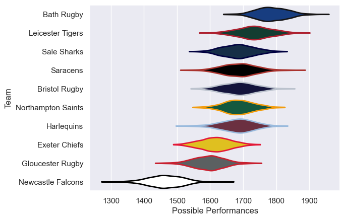

---  
title: "Gallagher Premiership 24/25 Status"  
date: 2025-05-22 6:00:00 -0500  
categories: model review projection  
layout: article  
aside:  
    toc: true  
---
# Current Team Rankings

# Standings

## Current Standings

| Club               |   Played |   Wins |   Point Differential |   Losing Bonus Points |   Try Bonus Points |   Competition Points |
|:-------------------|---------:|-------:|---------------------:|----------------------:|-------------------:|---------------------:|
| Bath Rugby         |       17 |     14 |                  216 |                     1 |                 14 |                   71 |
| Bristol Rugby      |       17 |     10 |                   60 |                     2 |                 15 |                   57 |
| Leicester Tigers   |       17 |     10 |                   71 |                     3 |                 11 |                   56 |
| Sale Sharks        |       17 |     11 |                   92 |                     1 |                 10 |                   55 |
| Saracens           |       17 |      9 |                   30 |                     4 |                 11 |                   51 |
| Harlequins         |       17 |      8 |                    6 |                     4 |                 10 |                   48 |
| Gloucester Rugby   |       17 |      7 |                    6 |                     3 |                 12 |                   43 |
| Northampton Saints |       17 |      8 |                  -14 |                     1 |                  9 |                   42 |
| Exeter Chiefs      |       17 |      4 |                 -121 |                     7 |                  4 |                   27 |
| Newcastle Falcons  |       17 |      3 |                 -346 |                     2 |                  3 |                   17 |

## Projected Remaining Table

| Club               |   Matches Remaining |   Wins |   Point Differential |   Losing Bonus Points |   Try Bonus Points |   Competition Points |
|:-------------------|--------------------:|-------:|---------------------:|----------------------:|-------------------:|---------------------:|
| Leicester Tigers   |                   1 |    0.9 |             18.612   |                   0   |                0.7 |                  4.5 |
| Bristol Rugby      |                   1 |    0.7 |              4.0202  |                   0.2 |                0.4 |                  3.5 |
| Bath Rugby         |                   1 |    0.6 |              2.27596 |                   0.2 |                0.3 |                  3.1 |
| Northampton Saints |                   1 |    0.6 |              1.11183 |                   0.3 |                0.3 |                  3   |
| Sale Sharks        |                   1 |    0.5 |              0.36592 |                   0.4 |                0.3 |                  2.7 |
| Exeter Chiefs      |                   1 |    0.5 |             -0.36592 |                   0.4 |                0.2 |                  2.6 |
| Gloucester Rugby   |                   1 |    0.4 |             -1.11183 |                   0.4 |                0.2 |                  2.2 |
| Saracens           |                   1 |    0.4 |             -2.27596 |                   0.4 |                0.1 |                  2   |
| Harlequins         |                   1 |    0.3 |             -4.0202  |                   0.5 |                0.5 |                  2   |
| Newcastle Falcons  |                   1 |    0.1 |            -18.612   |                   0.1 |                0.1 |                  0.4 |

## Projected Total Table

| Club               |   Total Matches |   Wins |   Point Differential |   Losing Bonus Points |   Try Bonus Points |   Competition Points |
|:-------------------|----------------:|-------:|---------------------:|----------------------:|-------------------:|---------------------:|
| Bath Rugby         |              18 |   14.6 |            218.276   |                   1.2 |               14.3 |                 74.1 |
| Leicester Tigers   |              18 |   10.9 |             89.612   |                   3   |               11.7 |                 60.5 |
| Bristol Rugby      |              18 |   10.7 |             64.0202  |                   2.2 |               15.4 |                 60.5 |
| Sale Sharks        |              18 |   11.5 |             92.3659  |                   1.4 |               10.3 |                 57.7 |
| Saracens           |              18 |    9.4 |             27.724   |                   4.4 |               11.1 |                 53   |
| Harlequins         |              18 |    8.3 |              1.9798  |                   4.5 |               10.5 |                 50   |
| Gloucester Rugby   |              18 |    7.4 |              4.88817 |                   3.4 |               12.2 |                 45.2 |
| Northampton Saints |              18 |    8.6 |            -12.8882  |                   1.3 |                9.3 |                 45   |
| Exeter Chiefs      |              18 |    4.5 |           -121.366   |                   7.4 |                4.2 |                 29.6 |
| Newcastle Falcons  |              18 |    3.1 |           -364.612   |                   2.1 |                3.1 |                 17.4 |

# Completed Match Review

| Model | Percent Correct Predictions | Spread Error |
| ------ | ------ | ------ |
| Club Level | 69.4% | 14.0 |
| Player Level: Lineup | 31.2% | 15.5 |
| Player Level: Minutes | 31.2% | 16.7 |

# Future Predictions

## Week 18

### Exeter Chiefs V Sale Sharks on 2025/05/31

Average Margin: Sale Sharks by 0.4

Average Scoreline: 35-34

### Leicester Tigers V Newcastle Falcons on 2025/05/31

Average Margin: Leicester Tigers by 18.6

Average Scoreline: 46-28

### Gloucester Rugby V Northampton Saints on 2025/05/31

Average Margin: Northampton Saints by 1.1

Average Scoreline: 35-34

### Bristol Rugby V Harlequins on 2025/05/31

Average Margin: Bristol Rugby by 4.0

Average Scoreline: 45-41

### Saracens V Bath Rugby on 2025/05/31

Average Margin: Bath Rugby by 2.3

Average Scoreline: 32-29

