---  
title: "Gallagher Premiership 24/25 Status"  
date: 2025-03-17 6:00:00 -0500  
categories: model review projection  
layout: article  
aside:  
    toc: true  
---
# Current Team Rankings

# Standings

## Current Standings

| Club               |   Played |   Wins |   Point Differential |   Losing Bonus Points |   Try Bonus Points |   Competition Points |
|:-------------------|---------:|-------:|---------------------:|----------------------:|-------------------:|---------------------:|
| Bath Rugby         |       11 |      9 |                  165 |                     1 |                  9 |                   46 |
| Bristol Rugby      |       11 |      7 |                   66 |                     2 |                 10 |                   40 |
| Gloucester Rugby   |       11 |      6 |                   30 |                     3 |                  8 |                   35 |
| Leicester Tigers   |       11 |      6 |                   14 |                     2 |                  7 |                   35 |
| Saracens           |       11 |      6 |                  -13 |                     3 |                  7 |                   34 |
| Harlequins         |       11 |      5 |                   20 |                     3 |                  7 |                   32 |
| Sale Sharks        |       11 |      6 |                    7 |                     0 |                  5 |                   29 |
| Northampton Saints |       11 |      5 |                   30 |                     1 |                  5 |                   26 |
| Exeter Chiefs      |       11 |      2 |                  -71 |                     5 |                  2 |                   15 |
| Newcastle Falcons  |       11 |      2 |                 -248 |                     0 |                  1 |                    9 |

## Projected Remaining Table

| Club               |   Matches Remaining |   Wins |   Point Differential |   Losing Bonus Points |   Try Bonus Points |   Competition Points |
|:-------------------|--------------------:|-------:|---------------------:|----------------------:|-------------------:|---------------------:|
| Bath Rugby         |                   7 |    5.4 |             53.7529  |                   1.1 |                3   |                 25.6 |
| Northampton Saints |                   7 |    4.4 |             19.7078  |                   1.8 |                2.4 |                 21.8 |
| Bristol Rugby      |                   7 |    3.8 |              7.19657 |                   2   |                2.6 |                 20   |
| Leicester Tigers   |                   7 |    3.9 |             15.4463  |                   1.8 |                2   |                 19.5 |
| Saracens           |                   7 |    4   |             19.7823  |                   1.9 |                1.3 |                 19.2 |
| Harlequins         |                   7 |    3.7 |              6.81711 |                   1.9 |                2.2 |                 18.8 |
| Sale Sharks        |                   7 |    3.3 |             -5.78737 |                   2.1 |                2   |                 17.3 |
| Exeter Chiefs      |                   7 |    2.8 |            -11.8393  |                   2.2 |                1.9 |                 15.5 |
| Gloucester Rugby   |                   7 |    2.8 |            -19.0961  |                   1.9 |                1.7 |                 14.8 |
| Newcastle Falcons  |                   7 |    0.8 |            -85.9802  |                   1.5 |                0.8 |                  5.6 |

## Projected Total Table

| Club               |   Total Matches |   Wins |   Point Differential |   Losing Bonus Points |   Try Bonus Points |   Competition Points |
|:-------------------|----------------:|-------:|---------------------:|----------------------:|-------------------:|---------------------:|
| Bath Rugby         |              18 |   14.4 |            218.753   |                   2.1 |               12   |                 71.6 |
| Bristol Rugby      |              18 |   10.8 |             73.1966  |                   4   |               12.6 |                 60   |
| Leicester Tigers   |              18 |    9.9 |             29.4463  |                   3.8 |                9   |                 54.5 |
| Saracens           |              18 |   10   |              6.78231 |                   4.9 |                8.3 |                 53.2 |
| Harlequins         |              18 |    8.7 |             26.8171  |                   4.9 |                9.2 |                 50.8 |
| Gloucester Rugby   |              18 |    8.8 |             10.9039  |                   4.9 |                9.7 |                 49.8 |
| Northampton Saints |              18 |    9.4 |             49.7078  |                   2.8 |                7.4 |                 47.8 |
| Sale Sharks        |              18 |    9.3 |              1.21263 |                   2.1 |                7   |                 46.3 |
| Exeter Chiefs      |              18 |    4.8 |            -82.8393  |                   7.2 |                3.9 |                 30.5 |
| Newcastle Falcons  |              18 |    2.8 |           -333.98    |                   1.5 |                1.8 |                 14.6 |

# Completed Match Review

| Model | Percent Correct Predictions | Spread Error |
| ------ | ------ | ------ |
| Club Level | 67.3% | 12.9 |
| Player Level: Lineup | 55.6% | 14.0 |
| Player Level: Minutes | 55.6% | 15.0 |

# Future Predictions

## Week 12

### Northampton Saints V Leicester Tigers on 2025/03/21

Average Margin: Northampton Saints by 3.3

Average Scoreline: 37-34

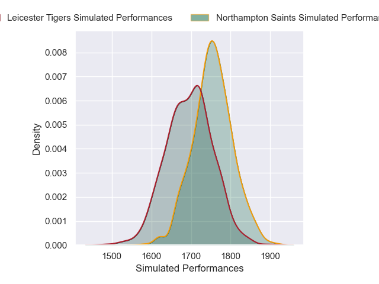

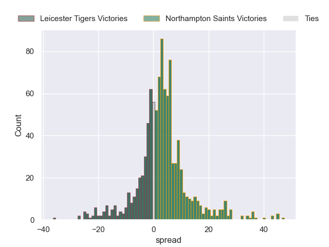

### Newcastle Falcons V Sale Sharks on 2025/03/21

Average Margin: Sale Sharks by 7.2

Average Scoreline: 43-36

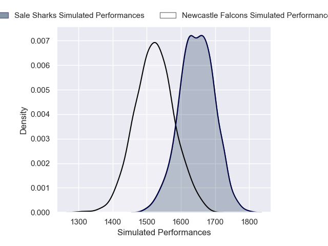

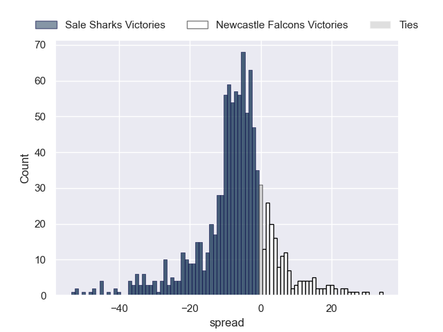

### Bristol Rugby V Exeter Chiefs on 2025/03/22

Average Margin: Bristol Rugby by 8.3

Average Scoreline: 40-32

### Saracens V Harlequins on 2025/03/22

Average Margin: Saracens by 3.4

Average Scoreline: 31-28

### Bath Rugby V Gloucester Rugby on 2025/03/23

Average Margin: Bath Rugby by 11.4

Average Scoreline: 35-24

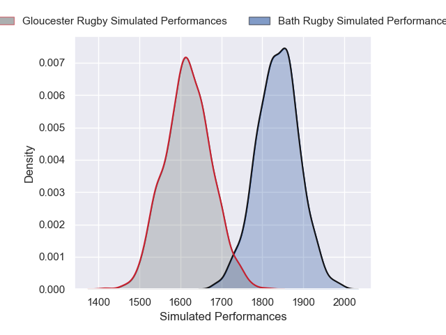
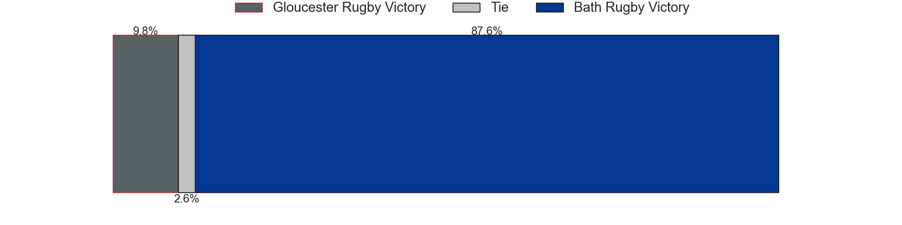
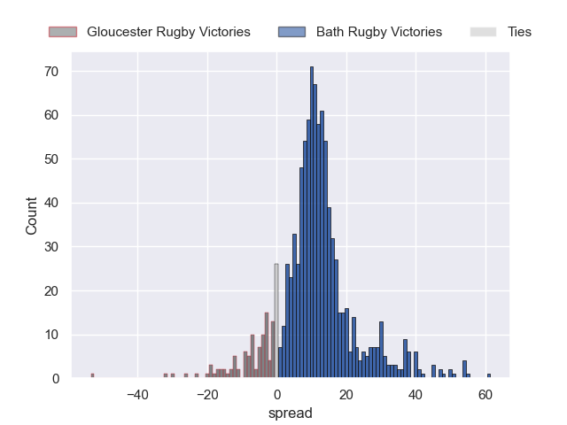

## Week 13

### Sale Sharks V Northampton Saints on 2025/03/28

Average Margin: Sale Sharks by 1.0

Average Scoreline: 29-28

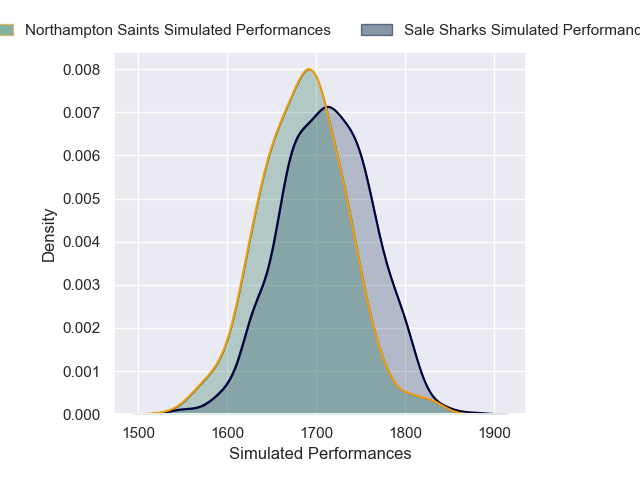

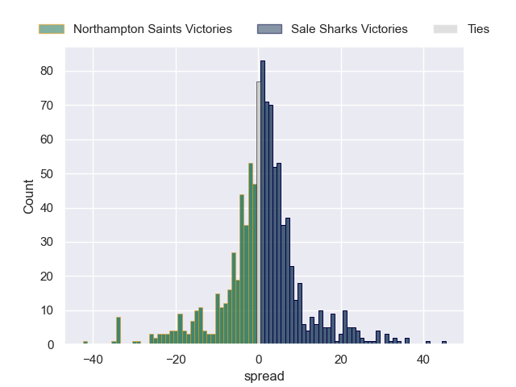

### Bath Rugby V Harlequins on 2025/03/29

Average Margin: Bath Rugby by 7.8

Average Scoreline: 35-27

### Gloucester Rugby V Bristol Rugby on 2025/03/29

Average Margin: Gloucester Rugby by 0.1

Average Scoreline: 32-32

### Exeter Chiefs V Newcastle Falcons on 2025/03/29

Average Margin: Exeter Chiefs by 12.2

Average Scoreline: 37-24

### Leicester Tigers V Saracens on 2025/03/30

Average Margin: Leicester Tigers by 4.3

Average Scoreline: 32-28

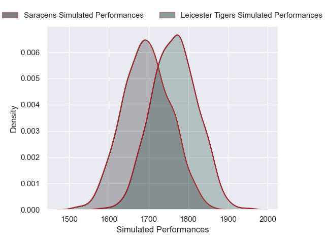

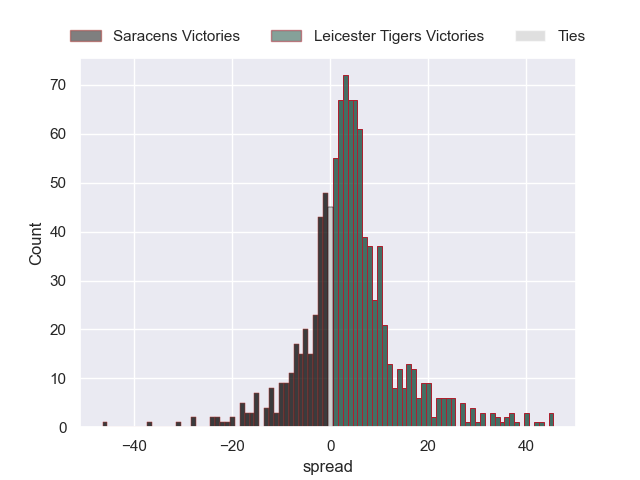

## Week 14

### Newcastle Falcons V Northampton Saints on 2025/04/18

Average Margin: Northampton Saints by 10.1

Average Scoreline: 42-32

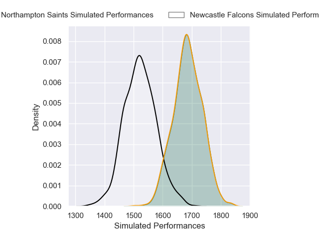

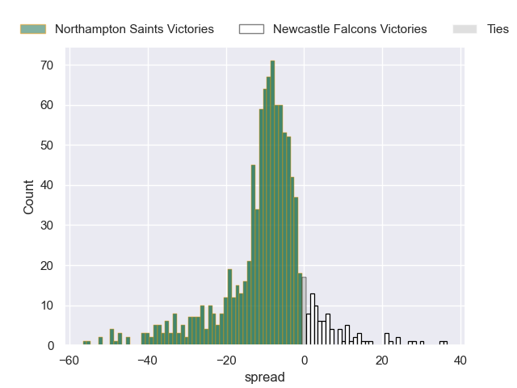

### Saracens V Gloucester Rugby on 2025/04/19

Average Margin: Saracens by 9.2

Average Scoreline: 34-25

### Harlequins V Sale Sharks on 2025/04/19

Average Margin: Harlequins by 7.6

Average Scoreline: 36-29

### Exeter Chiefs V Bath Rugby on 2025/04/19

Average Margin: Bath Rugby by 5.5

Average Scoreline: 37-32

### Bristol Rugby V Leicester Tigers on 2025/04/20

Average Margin: Bristol Rugby by 2.6

Average Scoreline: 34-31

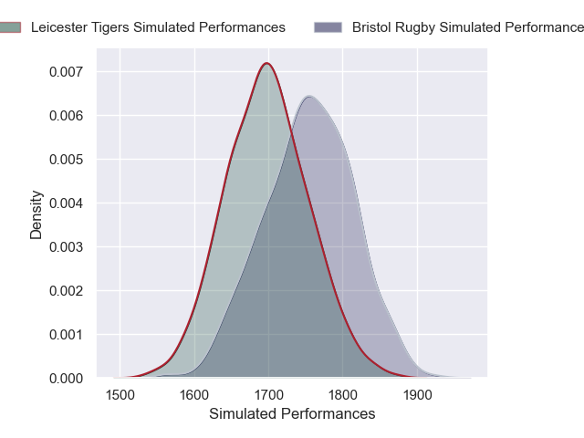

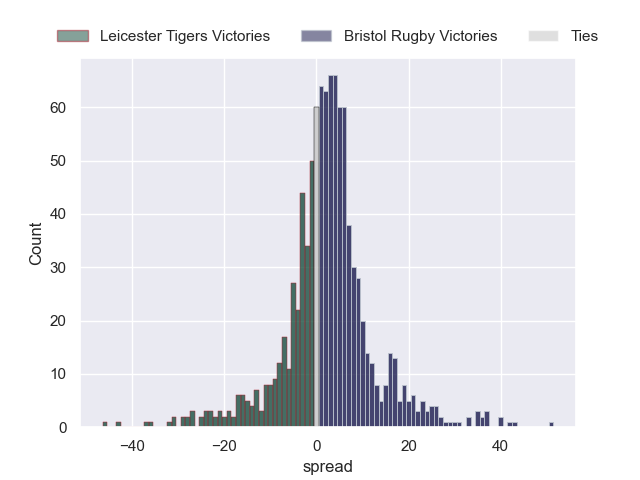

## Week 15

### Sale Sharks V Saracens on 2025/04/25

Average Margin: Sale Sharks by 0.3

Average Scoreline: 31-31

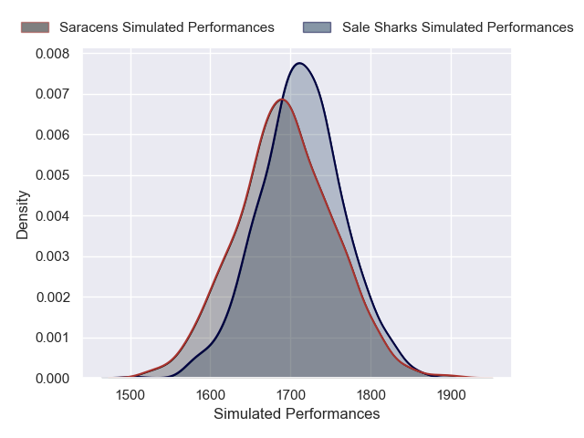

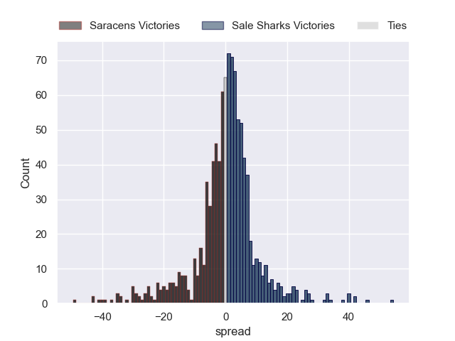

### Northampton Saints V Bristol Rugby on 2025/04/26

Average Margin: Northampton Saints by 3.9

Average Scoreline: 43-39

### Bath Rugby V Newcastle Falcons on 2025/04/26

Average Margin: Bath Rugby by 20.0

Average Scoreline: 47-27

### Leicester Tigers V Harlequins on 2025/04/26

Average Margin: Leicester Tigers by 3.0

Average Scoreline: 34-31

### Gloucester Rugby V Exeter Chiefs on 2025/04/27

Average Margin: Gloucester Rugby by 4.0

Average Scoreline: 33-29

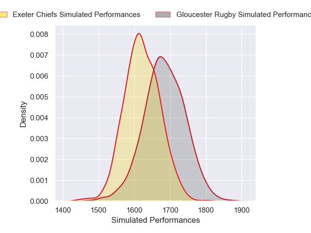
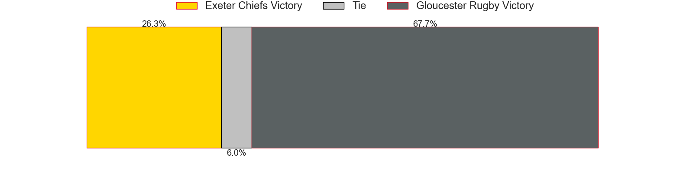
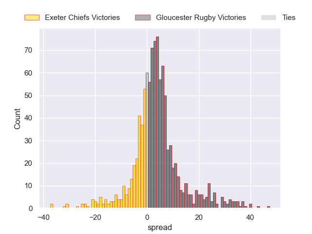

## Week 16

### Leicester Tigers V Sale Sharks on 2025/05/09

Average Margin: Leicester Tigers by 6.0

Average Scoreline: 33-28

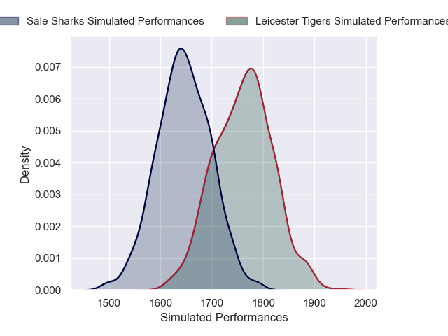
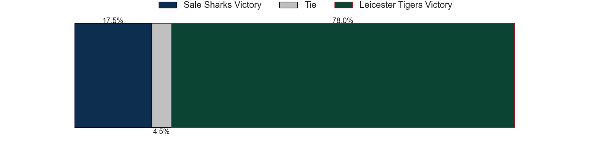
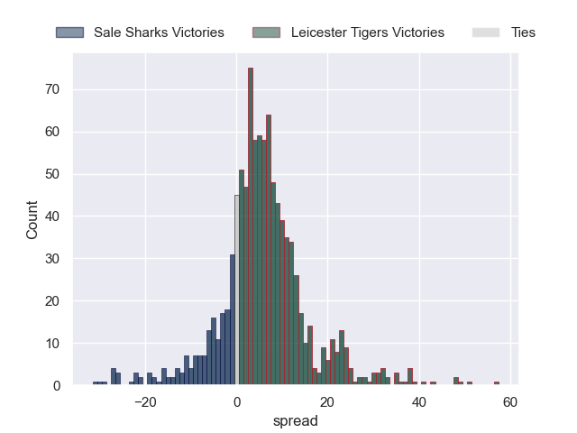

### Harlequins V Gloucester Rugby on 2025/05/10

Average Margin: Harlequins by 8.3

Average Scoreline: 36-28

### Saracens V Newcastle Falcons on 2025/05/10

Average Margin: Saracens by 15.8

Average Scoreline: 37-21

### Bristol Rugby V Bath Rugby on 2025/05/10

Average Margin: Bath Rugby by 1.1

Average Scoreline: 35-34

### Exeter Chiefs V Northampton Saints on 2025/05/11

Average Margin: Northampton Saints by 0.5

Average Scoreline: 37-36

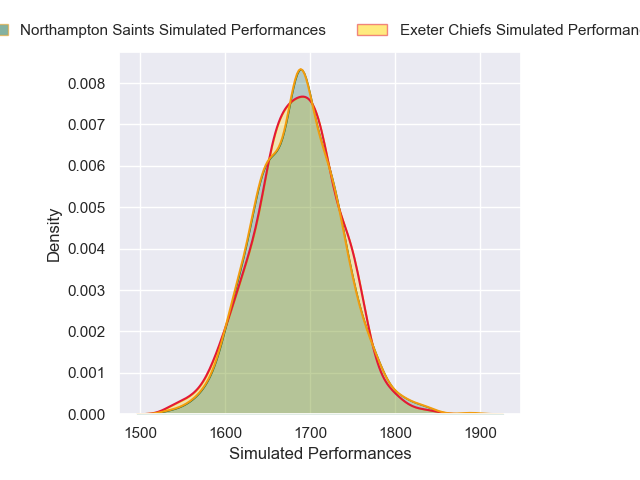

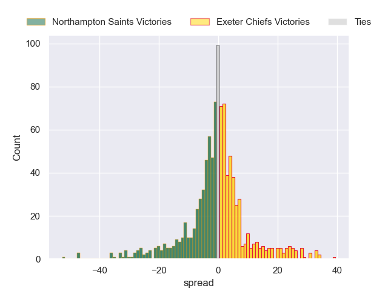

## Week 17

### Sale Sharks V Bristol Rugby on 2025/05/16

Average Margin: Sale Sharks by 2.0

Average Scoreline: 36-34

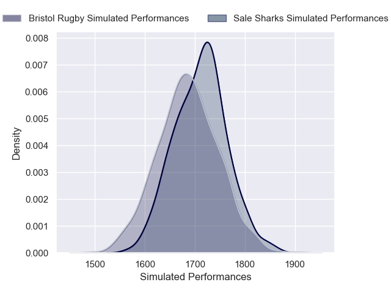

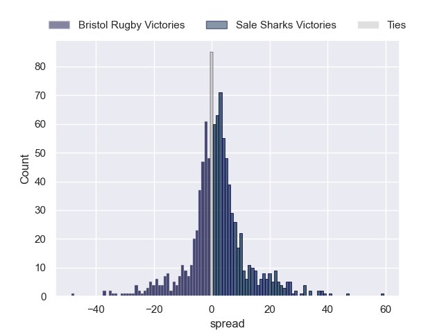

### Newcastle Falcons V Gloucester Rugby on 2025/05/16

Average Margin: Gloucester Rugby by 5.1

Average Scoreline: 40-35

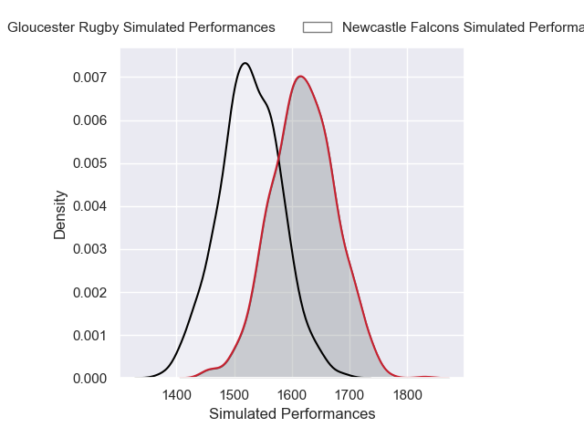

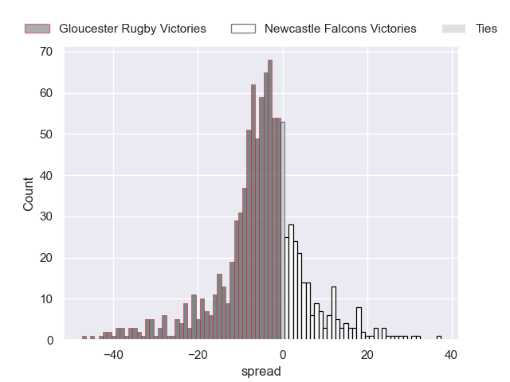

### Bath Rugby V Leicester Tigers on 2025/05/17

Average Margin: Bath Rugby by 7.5

Average Scoreline: 34-27

### Northampton Saints V Saracens on 2025/05/17

Average Margin: Northampton Saints by 3.5

Average Scoreline: 35-31

### Harlequins V Exeter Chiefs on 2025/05/18

Average Margin: Harlequins by 8.5

Average Scoreline: 36-28

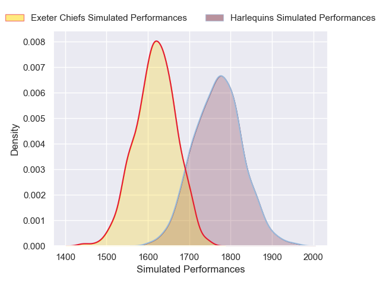

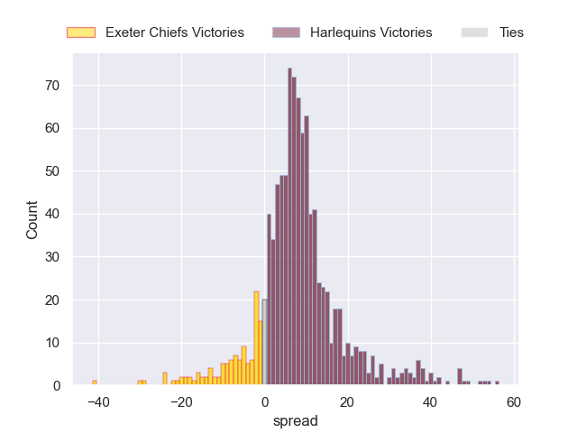

## Week 18

### Saracens V Bath Rugby on 2025/05/31

Average Margin: Bath Rugby by 0.5

Average Scoreline: 32-31

### Gloucester Rugby V Northampton Saints on 2025/05/31

Average Margin: Gloucester Rugby by 0.6

Average Scoreline: 35-34

### Leicester Tigers V Newcastle Falcons on 2025/05/31

Average Margin: Leicester Tigers by 15.6

Average Scoreline: 36-20

### Bristol Rugby V Harlequins on 2025/05/31

Average Margin: Bristol Rugby by 3.3

Average Scoreline: 35-31

### Exeter Chiefs V Sale Sharks on 2025/05/31

Average Margin: Exeter Chiefs by 2.7

Average Scoreline: 32-29

