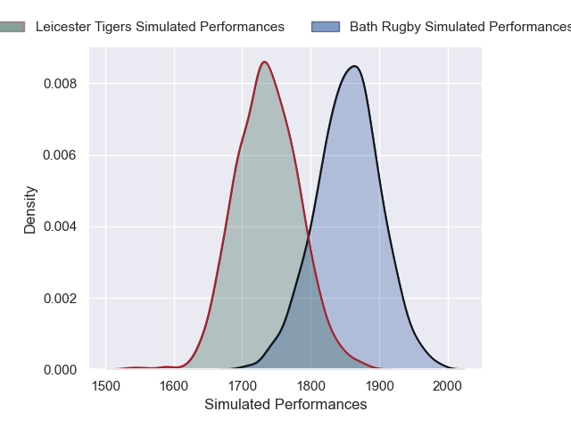
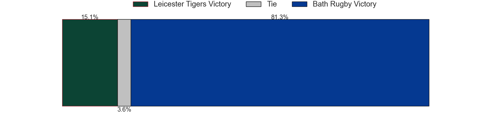
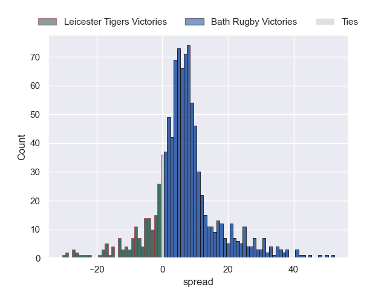

---  
title: "Gallagher Premiership 24/25 Status"  
date: 2025-06-13 6:00:00 -0500  
categories: model review projection  
layout: article  
aside:  
    toc: true  
---
# Current Team Rankings

# Standings

## Current Standings

| Club               |   Played |   Wins |   Point Differential |   Losing Bonus Points |   Try Bonus Points |   Competition Points |
|:-------------------|---------:|-------:|---------------------:|----------------------:|-------------------:|---------------------:|
| Bath Rugby         |       20 |     15 |                  231 |                     2 |                nan |                   78 |
| Leicester Tigers   |       20 |     12 |                  125 |                     3 |                nan |                   65 |
| Bristol Rugby      |       19 |     10 |                   69 |                     4 |                 16 |                   60 |
| Saracens           |       18 |     10 |                   60 |                     4 |                 12 |                   58 |
| Sale Sharks        |       19 |     11 |                    8 |                     1 |                 10 |                   57 |
| Gloucester Rugby   |       18 |     10 |                   81 |                     3 |                 13 |                   56 |
| Harlequins         |       18 |      9 |                    1 |                     3 |                 11 |                   52 |
| Northampton Saints |       18 |      8 |                  -41 |                     2 |                 10 |                   44 |
| Exeter Chiefs      |       18 |      4 |                 -134 |                     7 |                  5 |                   28 |
| Newcastle Falcons  |       18 |      2 |                 -400 |                     1 |                  3 |                   12 |

## Projected Remaining Table

| Club             |   Matches Remaining |   Wins |   Point Differential |   Losing Bonus Points |   Try Bonus Points |   Competition Points |
|:-----------------|--------------------:|-------:|---------------------:|----------------------:|-------------------:|---------------------:|
| Bath Rugby       |                   1 |    0.8 |              6.87117 |                   0.1 |                0.2 |                  3.7 |
| Leicester Tigers |                   1 |    0.2 |             -6.87117 |                   0.4 |                0.2 |                  1.3 |

## Projected Total Table

| Club               |   Total Matches |   Wins |   Point Differential |   Losing Bonus Points |   Try Bonus Points |   Competition Points |
|:-------------------|----------------:|-------:|---------------------:|----------------------:|-------------------:|---------------------:|
| Bath Rugby         |              21 |   15.8 |              237.871 |                   2.1 |                0.2 |                 81.7 |
| Leicester Tigers   |              21 |   12.2 |              118.129 |                   3.4 |                0.2 |                 66.3 |
| Bristol Rugby      |              19 |   10   |               69     |                   4   |               16   |                 60   |
| Saracens           |              18 |   10   |               60     |                   4   |               12   |                 58   |
| Sale Sharks        |              19 |   11   |                8     |                   1   |               10   |                 57   |
| Gloucester Rugby   |              18 |   10   |               81     |                   3   |               13   |                 56   |
| Harlequins         |              18 |    9   |                1     |                   3   |               11   |                 52   |
| Northampton Saints |              18 |    8   |              -41     |                   2   |               10   |                 44   |
| Exeter Chiefs      |              18 |    4   |             -134     |                   7   |                5   |                 28   |
| Newcastle Falcons  |              18 |    2   |             -400     |                   1   |                3   |                 12   |

# Completed Match Review

| Model | Percent Correct Predictions | Spread Error |
| ------ | ------ | ------ |
| Club Level | 71.0% | 13.4 |
| Player Level: Lineup | 48.0% | 14.3 |
| Player Level: Minutes | 56.0% | 18.2 |

# Future Predictions

## Week 21

### Bath Rugby V Leicester Tigers on 2025/06/14

Average Margin: Bath Rugby by 6.9

Average Scoreline: 37-31

