# Team Rankings

# Standings

## Current Standings

| Club               |   Played |   Wins |   Point Differential |   Losing Bonus Points |   Try Bonus Points |   Competition Points |
|:-------------------|---------:|-------:|---------------------:|----------------------:|-------------------:|---------------------:|
| Northampton Saints |        9 |      7 |                   94 |                     0 |                  8 |                   38 |
| Bath Rugby         |        9 |      7 |                  102 |                     1 |                  7 |                   36 |
| Exeter Chiefs      |        9 |      6 |                   98 |                     2 |                  6 |                   34 |
| Bristol Rugby      |        9 |      7 |                   50 |                     0 |                  5 |                   33 |
| Leicester Tigers   |        9 |      6 |                   36 |                     1 |                  6 |                   31 |
| Saracens           |        9 |      4 |                   76 |                     3 |                  8 |                   27 |
| Sale Sharks        |        9 |      3 |                    2 |                     3 |                  4 |                   19 |
| Harlequins         |        9 |      2 |                 -128 |                     0 |                  2 |                   10 |
| Gloucester Rugby   |        9 |      1 |                 -117 |                     2 |                  3 |                    9 |
| Newcastle Falcons  |        9 |      1 |                 -213 |                     0 |                  1 |                    5 |

## Projected Remaining Table

| Club               |   To Play |   Projected Wins |   Projected Differential |   Projected Losing Bonus Points | Projected Try Bonus Points   |   Projected Competition Points |
|:-------------------|----------:|-----------------:|-------------------------:|--------------------------------:|:-----------------------------|-------------------------------:|
| Bath Rugby         |         9 |            5.527 |                   29.087 |                           1.851 |                              |                         24.813 |
| Exeter Chiefs      |         9 |            4.865 |                   11.116 |                           2.222 |                              |                         22.676 |
| Sale Sharks        |         9 |            4.65  |                    6.475 |                           2.366 |                              |                         22.062 |
| Saracens           |         9 |            4.597 |                    9.74  |                           2.035 |                              |                         21.261 |
| Northampton Saints |         9 |            4.438 |                    8.035 |                           2.453 |                              |                         21.159 |
| Leicester Tigers   |         9 |            4.472 |                    5.757 |                           2.31  |                              |                         21.112 |
| Bristol Rugby      |         9 |            4.352 |                    2.971 |                           2.412 |                              |                         20.676 |
| Harlequins         |         9 |            3.802 |                  -10.372 |                           2.48  |                              |                         18.654 |
| Gloucester Rugby   |         9 |            3.464 |                  -17.012 |                           2.494 |                              |                         17.264 |
| Newcastle Falcons  |         9 |            2.548 |                  -45.797 |                           2.29  |                              |                         13.236 |

## Projected Total Table

| Club               |   Played |   Wins |   Point Differential |   Losing Bonus Points |   Try Bonus Points |   Competition Points |
|:-------------------|---------:|-------:|---------------------:|----------------------:|-------------------:|---------------------:|
| Bath Rugby         |       18 | 12.527 |              131.087 |                 2.851 |                  7 |               60.813 |
| Northampton Saints |       18 | 11.438 |              102.035 |                 2.453 |                  8 |               59.159 |
| Exeter Chiefs      |       18 | 10.865 |              109.116 |                 4.222 |                  6 |               56.676 |
| Bristol Rugby      |       18 | 11.352 |               52.971 |                 2.412 |                  5 |               53.676 |
| Leicester Tigers   |       18 | 10.472 |               41.757 |                 3.31  |                  6 |               52.112 |
| Saracens           |       18 |  8.597 |               85.74  |                 5.035 |                  8 |               48.261 |
| Sale Sharks        |       18 |  7.65  |                8.475 |                 5.366 |                  4 |               41.062 |
| Harlequins         |       18 |  5.802 |             -138.372 |                 2.48  |                  2 |               28.654 |
| Gloucester Rugby   |       18 |  4.464 |             -134.012 |                 4.494 |                  3 |               26.264 |
| Newcastle Falcons  |       18 |  3.548 |             -258.797 |                 2.29  |                  1 |               18.236 |

# Completed Match Review

| Model | Percent Correct Predictions | Spread Error |
| ------ | ------ | ------ |
| Club Level | 70.0% | 10.6 |
| Player Level: Lineup | nan% | nan |
| Player Level: Minutes | nan% | nan |

# Future Predictions

## Week 10

### Gloucester Rugby V Bath Rugby on 2026/01/23

Average Margin: Bath Rugby by 3.7

### Exeter Chiefs V Bristol Rugby on 2026/01/24

Average Margin: Exeter Chiefs by 3.6

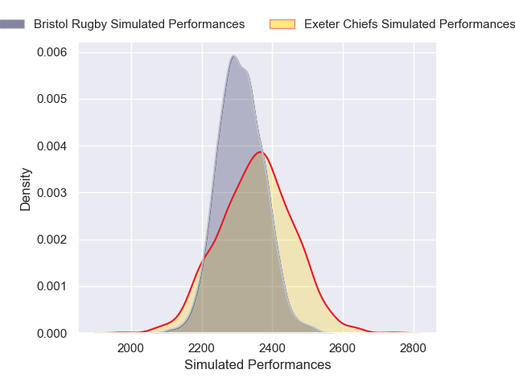

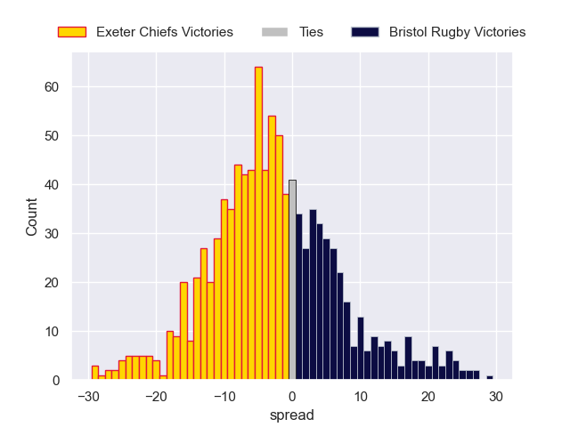

### Sale Sharks V Northampton Saints on 2026/01/24

Average Margin: Sale Sharks by 1.3

### Saracens V Newcastle Falcons on 2026/01/24

Average Margin: Saracens by 9.1

### Harlequins V Leicester Tigers on 2026/01/24

Average Margin: Leicester Tigers by 0.3

## Week 11

### Exeter Chiefs V Sale Sharks on 2026/03/21

Average Margin: Exeter Chiefs by 3.5

### Bath Rugby V Saracens on 2026/03/21

Average Margin: Bath Rugby by 5.4

### Leicester Tigers V Bristol Rugby on 2026/03/21

Average Margin: Leicester Tigers by 2.6

### Harlequins V Gloucester Rugby on 2026/03/21

Average Margin: Harlequins by 2.7

### Northampton Saints V Newcastle Falcons on 2026/03/21

Average Margin: Northampton Saints by 8.1

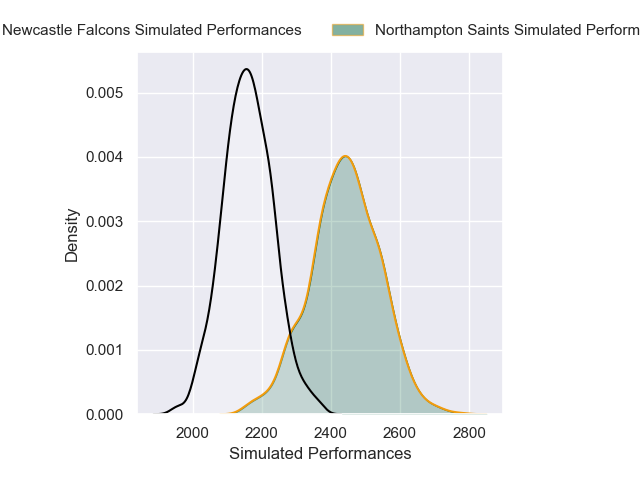

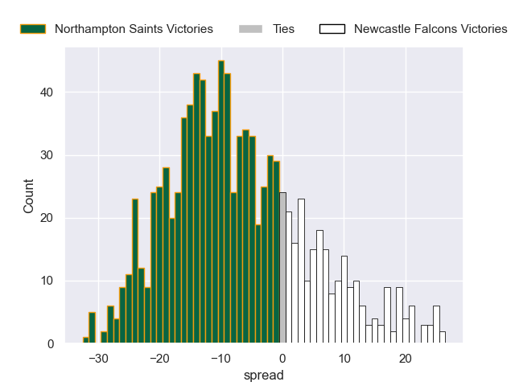

## Week 12

### Saracens V Northampton Saints on 2026/03/28

Average Margin: Saracens by 2.1

### Gloucester Rugby V Leicester Tigers on 2026/03/28

Average Margin: Gloucester Rugby by 0.3

### Sale Sharks V Bath Rugby on 2026/03/28

Average Margin: Bath Rugby by 0.7

### Bristol Rugby V Harlequins on 2026/03/28

Average Margin: Bristol Rugby by 3.9

### Newcastle Falcons V Exeter Chiefs on 2026/03/28

Average Margin: Exeter Chiefs by 2.7

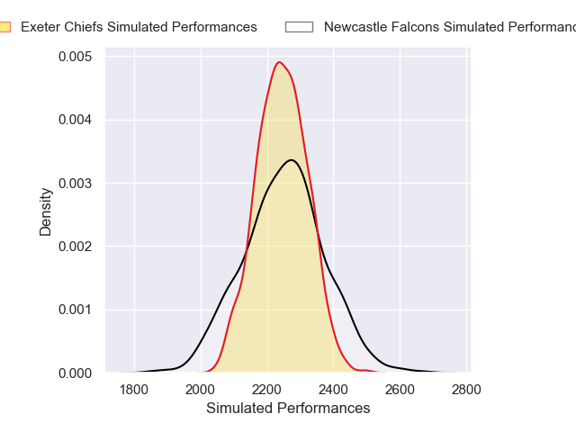

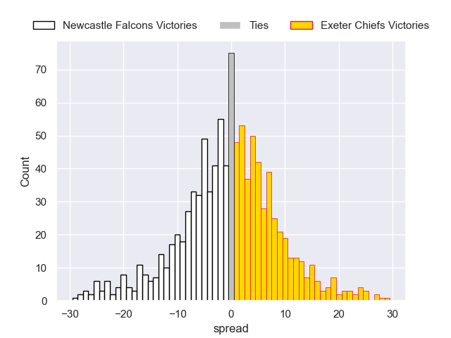

## Week 13

### Leicester Tigers V Newcastle Falcons on 2026/04/18

Average Margin: Leicester Tigers by 8.0

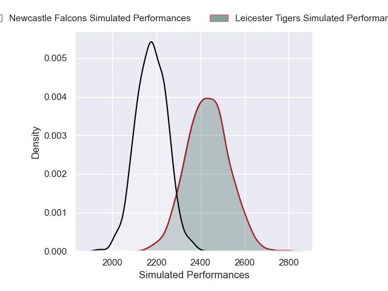
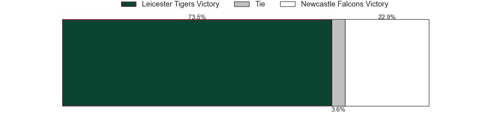
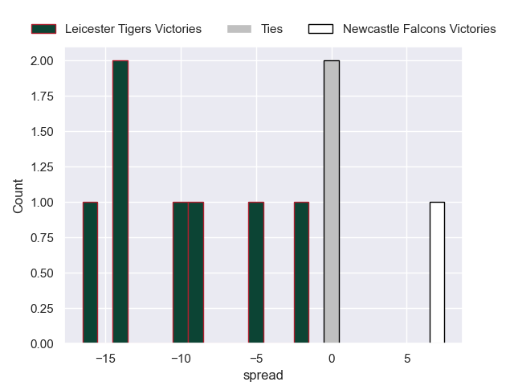

### Bristol Rugby V Gloucester Rugby on 2026/04/18

Average Margin: Bristol Rugby by 5.1

### Exeter Chiefs V Northampton Saints on 2026/04/18

Average Margin: Exeter Chiefs by 2.8

### Bath Rugby V Harlequins on 2026/04/18

Average Margin: Bath Rugby by 6.2

### Sale Sharks V Saracens on 2026/04/18

Average Margin: Sale Sharks by 2.8

## Week 14

### Northampton Saints V Bath Rugby on 2026/04/25

Average Margin: Northampton Saints by 0.3

### Saracens V Leicester Tigers on 2026/04/25

Average Margin: Saracens by 3.1

### Newcastle Falcons V Bristol Rugby on 2026/04/25

Average Margin: Bristol Rugby by 2.5

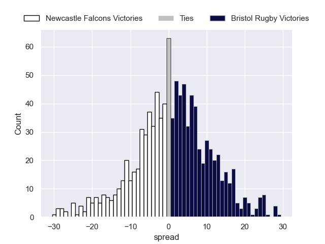

### Gloucester Rugby V Exeter Chiefs on 2026/04/25

Average Margin: Gloucester Rugby by 0.4

### Harlequins V Sale Sharks on 2026/04/25

Average Margin: Harlequins by 0.2

## Week 15

### Newcastle Falcons V Harlequins on 2026/05/09

Average Margin: Harlequins by 0.4

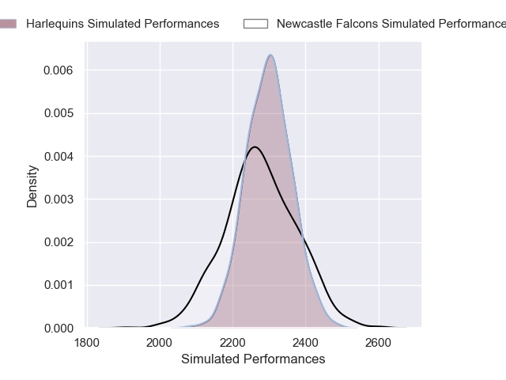

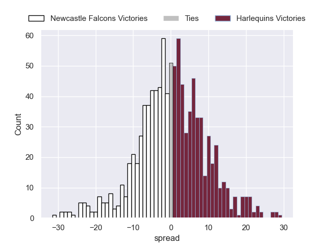

### Bristol Rugby V Saracens on 2026/05/09

Average Margin: Bristol Rugby by 3.1

### Exeter Chiefs V Bath Rugby on 2026/05/09

Average Margin: Exeter Chiefs by 0.1

### Gloucester Rugby V Sale Sharks on 2026/05/09

Average Margin: Gloucester Rugby by 0.4

### Leicester Tigers V Northampton Saints on 2026/05/09

Average Margin: Leicester Tigers by 2.8

## Week 16

### Bath Rugby V Newcastle Falcons on 2026/05/16

Average Margin: Bath Rugby by 8.7

### Harlequins V Exeter Chiefs on 2026/05/16

Average Margin: Harlequins by 0.8

### Sale Sharks V Leicester Tigers on 2026/05/16

Average Margin: Sale Sharks by 3.0

### Saracens V Gloucester Rugby on 2026/05/16

Average Margin: Saracens by 5.6

### Northampton Saints V Bristol Rugby on 2026/05/16

Average Margin: Northampton Saints by 3.2

## Week 17

### Bristol Rugby V Bath Rugby on 2026/05/30

Average Margin: Bristol Rugby by 0.3

### Northampton Saints V Gloucester Rugby on 2026/05/30

Average Margin: Northampton Saints by 5.4

### Saracens V Harlequins on 2026/05/30

Average Margin: Saracens by 4.2

### Newcastle Falcons V Sale Sharks on 2026/05/30

Average Margin: Sale Sharks by 1.6

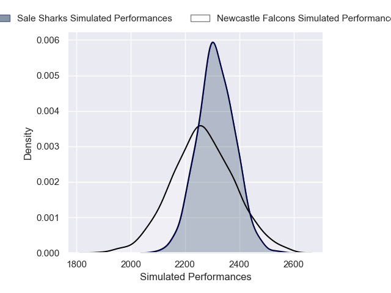

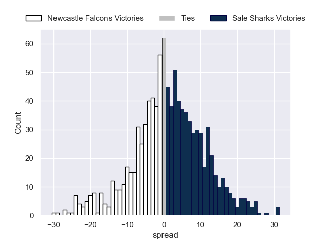

### Leicester Tigers V Exeter Chiefs on 2026/05/30

Average Margin: Leicester Tigers by 3.3

## Week 18

### Gloucester Rugby V Newcastle Falcons on 2026/06/06

Average Margin: Gloucester Rugby by 4.6

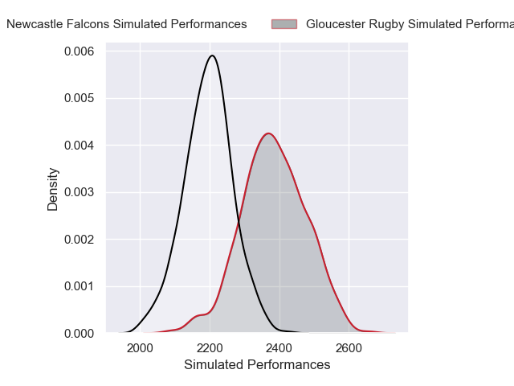

### Harlequins V Northampton Saints on 2026/06/06

Average Margin: Northampton Saints by 0.0

### Exeter Chiefs V Saracens on 2026/06/06

Average Margin: Exeter Chiefs by 3.0

### Bath Rugby V Leicester Tigers on 2026/06/06

Average Margin: Bath Rugby by 4.9

### Sale Sharks V Bristol Rugby on 2026/06/06

Average Margin: Sale Sharks by 2.6

