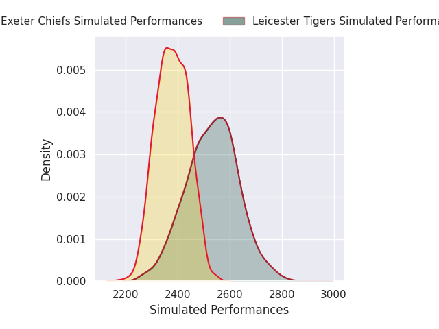
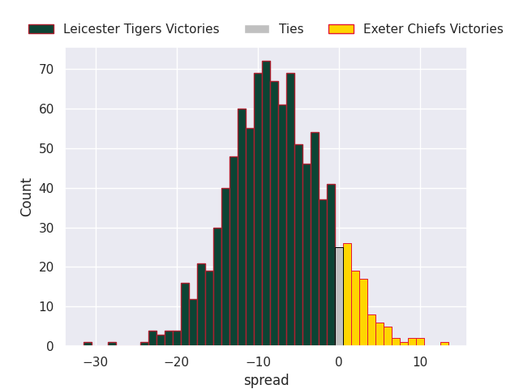

# Team Rankings

# Standings

## Current Standings

| Club                |   Played |   Wins |   Point Differential |   Losing Bonus Points |   Try Bonus Points |   Competition Points |
|:--------------------|---------:|-------:|---------------------:|----------------------:|-------------------:|---------------------:|
| Northampton Saints  |       16 |     13 |                  160 |                     0 |                 13 |                   67 |
| Bath Rugby          |       16 |     12 |                  222 |                     2 |                 13 |                   63 |
| Leicester Tigers    |       16 |     12 |                  189 |                     2 |                 12 |                   62 |
| Exeter Chiefs       |       16 |      9 |                  125 |                     5 |                 12 |                   55 |
| Saracens            |       16 |      9 |                  185 |                     4 |                 12 |                   52 |
| Bristol Rugby       |       16 |     10 |                   35 |                     1 |                  9 |                   50 |
| Sale Sharks         |       16 |      4 |                  -96 |                     5 |                  8 |                   29 |
| Harlequins          |       16 |      5 |                 -134 |                     1 |                  5 |                   26 |
| Gloucester Rugby    |       16 |      4 |                 -181 |                     3 |                  6 |                   25 |
| Newcastle Red Bulls |       16 |      1 |                 -505 |                     1 |                  1 |                    6 |

## Projected Remaining Table

| Club                |   To Play |   Projected Wins |   Projected Differential |   Projected Losing Bonus Points | Projected Try Bonus Points   |   Projected Competition Points |
|:--------------------|----------:|-----------------:|-------------------------:|--------------------------------:|:-----------------------------|-------------------------------:|
| Northampton Saints  |         2 |            1.742 |                   18.168 |                           0.19  |                              |                          7.258 |
| Sale Sharks         |         2 |            1.465 |                    9.053 |                           0.387 |                              |                          6.443 |
| Bath Rugby          |         2 |            1.445 |                    7.697 |                           0.399 |                              |                          6.349 |
| Leicester Tigers    |         2 |            1.128 |                    4.056 |                           0.495 |                              |                          5.121 |
| Saracens            |         2 |            1.111 |                    5.269 |                           0.468 |                              |                          5.002 |
| Gloucester Rugby    |         2 |            1     |                    0.341 |                           0.17  |                              |                          4.188 |
| Exeter Chiefs       |         2 |            0.885 |                   -2.751 |                           0.491 |                              |                          4.139 |
| Bristol Rugby       |         2 |            0.521 |                   -6.794 |                           0.886 |                              |                          3.164 |
| Harlequins          |         2 |            0.233 |                  -15.638 |                           0.685 |                              |                          1.721 |
| Newcastle Red Bulls |         2 |            0.172 |                  -19.401 |                           0.536 |                              |                          1.322 |

## Projected Total Table

| Club                |   Played |   Wins |   Point Differential |   Losing Bonus Points |   Try Bonus Points |   Competition Points |
|:--------------------|---------:|-------:|---------------------:|----------------------:|-------------------:|---------------------:|
| Northampton Saints  |       18 | 14.742 |              178.168 |                 0.19  |                 13 |               74.258 |
| Bath Rugby          |       18 | 13.445 |              229.697 |                 2.399 |                 13 |               69.349 |
| Leicester Tigers    |       18 | 13.128 |              193.056 |                 2.495 |                 12 |               67.121 |
| Exeter Chiefs       |       18 |  9.885 |              122.249 |                 5.491 |                 12 |               59.139 |
| Saracens            |       18 | 10.111 |              190.269 |                 4.468 |                 12 |               57.002 |
| Bristol Rugby       |       18 | 10.521 |               28.206 |                 1.886 |                  9 |               53.164 |
| Sale Sharks         |       18 |  5.465 |              -86.947 |                 5.387 |                  8 |               35.443 |
| Gloucester Rugby    |       18 |  5     |             -180.659 |                 3.17  |                  6 |               29.188 |
| Harlequins          |       18 |  5.233 |             -149.638 |                 1.685 |                  5 |               27.721 |
| Newcastle Red Bulls |       18 |  1.172 |             -524.401 |                 1.536 |                  1 |                7.322 |

# Completed Match Review

| Model | Percent Correct Predictions | Spread Error |
| ------ | ------ | ------ |
| Club Level | 80.0% | 15.5 |
| Player Level: Lineup | nan% | nan |
| Player Level: Minutes | nan% | nan |

# Future Predictions

## Week 17

### Bristol Bears V Bath Rugby on 2026/05/29

Average Margin: Bath Rugby by 3.4

### Newcastle Red Bulls V Sale Sharks on 2026/05/30

Average Margin: Sale Sharks by 5.7

### Northampton Saints V Gloucester Rugby on 2026/05/30

Average Margin: Northampton Saints by 13.4

### Saracens V Harlequins on 2026/05/30

Average Margin: Saracens by 10.9

### Leicester Tigers V Exeter Chiefs on 2026/05/31

Average Margin: Leicester Tigers by 8.3

## Week 18

### Harlequins V Northampton Saints on 2026/06/06

Average Margin: Northampton Saints by 4.8

### Sale Sharks V Bristol Rugby on 2026/06/06

Average Margin: Sale Sharks by 3.4

### Bath Rugby V Leicester Tigers on 2026/06/06

Average Margin: Bath Rugby by 4.3

### Gloucester Rugby V Newcastle Red Bulls on 2026/06/06

Average Margin: Gloucester Rugby by 13.7

### Exeter Chiefs V Saracens on 2026/06/06

Average Margin: Exeter Chiefs by 5.6

