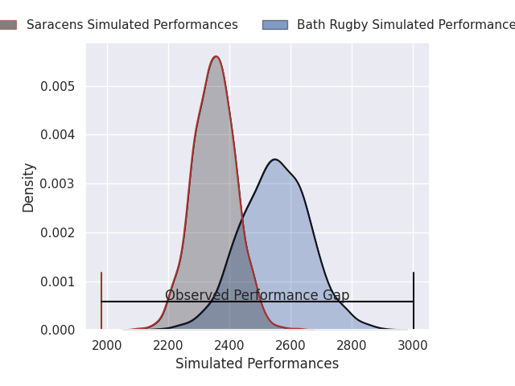
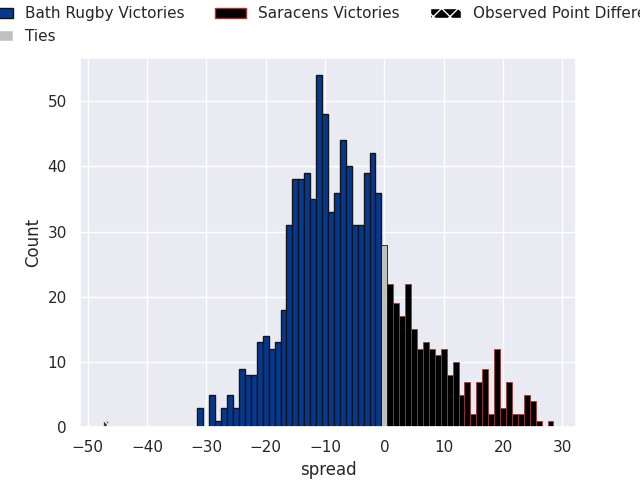
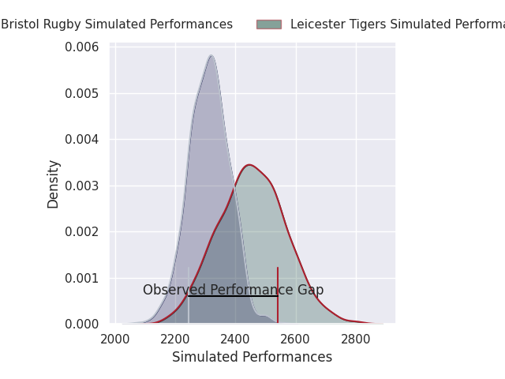
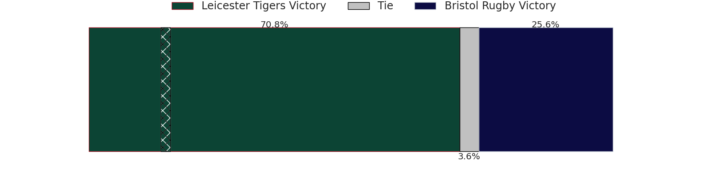
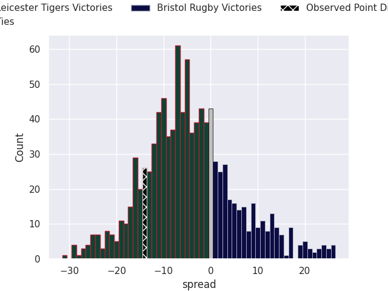

# Team Rankings

# Standings

## Current Standings

| Club                |   Played |   Wins |   Point Differential |   Losing Bonus Points |   Try Bonus Points |   Competition Points |
|:--------------------|---------:|-------:|---------------------:|----------------------:|-------------------:|---------------------:|
| Northampton Saints  |       10 |      8 |                  108 |                     0 |                  9 |                   43 |
| Bath Rugby          |       10 |      8 |                  106 |                     1 |                  8 |                   41 |
| Bristol Rugby       |       10 |      8 |                   55 |                     0 |                  5 |                   37 |
| Leicester Tigers    |       10 |      7 |                   63 |                     1 |                  7 |                   36 |
| Exeter Chiefs       |       10 |      6 |                   93 |                     3 |                  6 |                   35 |
| Saracens            |       10 |      5 |                  135 |                     3 |                  9 |                   32 |
| Sale Sharks         |       10 |      3 |                  -12 |                     3 |                  5 |                   20 |
| Gloucester Rugby    |       10 |      1 |                 -121 |                     3 |                  4 |                   11 |
| Harlequins          |       10 |      2 |                 -155 |                     0 |                  2 |                   10 |
| Newcastle Red Bulls |       10 |      1 |                 -272 |                     0 |                  1 |                    5 |

## Projected Remaining Table

| Club                |   To Play |   Projected Wins |   Projected Differential |   Projected Losing Bonus Points | Projected Try Bonus Points   |   Projected Competition Points |
|:--------------------|----------:|-----------------:|-------------------------:|--------------------------------:|:-----------------------------|-------------------------------:|
| Bath Rugby          |         8 |            4.783 |                   26.733 |                           1.582 |                              |                         21.46  |
| Exeter Chiefs       |         8 |            4.743 |                   21.52  |                           1.68  |                              |                         21.39  |
| Leicester Tigers    |         8 |            4.422 |                   18.424 |                           1.855 |                              |                         20.343 |
| Northampton Saints  |         8 |            4.384 |                   21.492 |                           1.818 |                              |                         20.168 |
| Saracens            |         8 |            3.852 |                    1.352 |                           1.936 |                              |                         18.056 |
| Bristol Rugby       |         8 |            3.603 |                   -4.186 |                           2.056 |                              |                         17.246 |
| Sale Sharks         |         8 |            3.474 |                   -8.898 |                           2.148 |                              |                         16.768 |
| Gloucester Rugby    |         8 |            3.274 |                  -11.432 |                           2.069 |                              |                         15.879 |
| Harlequins          |         8 |            3.247 |                  -13.098 |                           2.099 |                              |                         15.873 |
| Newcastle Red Bulls |         8 |            2.357 |                  -51.907 |                           1.684 |                              |                         11.744 |

## Projected Total Table

| Club                |   Played |   Wins |   Point Differential |   Losing Bonus Points |   Try Bonus Points |   Competition Points |
|:--------------------|---------:|-------:|---------------------:|----------------------:|-------------------:|---------------------:|
| Northampton Saints  |       18 | 12.384 |              129.492 |                 1.818 |                  9 |               63.168 |
| Bath Rugby          |       18 | 12.783 |              132.733 |                 2.582 |                  8 |               62.46  |
| Exeter Chiefs       |       18 | 10.743 |              114.52  |                 4.68  |                  6 |               56.39  |
| Leicester Tigers    |       18 | 11.422 |               81.424 |                 2.855 |                  7 |               56.343 |
| Bristol Rugby       |       18 | 11.603 |               50.814 |                 2.056 |                  5 |               54.246 |
| Saracens            |       18 |  8.852 |              136.352 |                 4.936 |                  9 |               50.056 |
| Sale Sharks         |       18 |  6.474 |              -20.898 |                 5.148 |                  5 |               36.768 |
| Gloucester Rugby    |       18 |  4.274 |             -132.432 |                 5.069 |                  4 |               26.879 |
| Harlequins          |       18 |  5.247 |             -168.098 |                 2.099 |                  2 |               25.873 |
| Newcastle Red Bulls |       18 |  3.357 |             -323.907 |                 1.684 |                  1 |               16.744 |

# Completed Match Review

| Model | Percent Correct Predictions | Spread Error |
| ------ | ------ | ------ |
| Club Level | 68.9% | 12.0 |
| Player Level: Lineup | nan% | nan |
| Player Level: Minutes | nan% | nan |

# Future Predictions

## Week 11

### Bath Rugby V Saracens on 2026/03/20

Average Margin: Bath Rugby by 6.2

### Northampton Saints V Newcastle Red Bulls on 2026/03/21

Average Margin: Northampton Saints by 12.5

### Exeter Chiefs V Sale Sharks on 2026/03/21

Average Margin: Exeter Chiefs by 7.3

### Harlequins V Gloucester Rugby on 2026/03/21

Average Margin: Harlequins by 2.8

### Leicester Tigers V Bristol Rugby on 2026/03/22

Average Margin: Leicester Tigers by 6.1

## Week 12

### Bristol Rugby V Harlequins on 2026/03/28

Average Margin: Bristol Rugby by 3.7

### Saracens V Northampton Saints on 2026/03/28

Average Margin: Saracens by 0.7

### Newcastle Red Bulls V Exeter Chiefs on 2026/03/28

Average Margin: Exeter Chiefs by 6.9

### Gloucester Rugby V Leicester Tigers on 2026/03/28

Average Margin: Leicester Tigers by 1.3

### Sale Sharks V Bath Rugby on 2026/03/28

Average Margin: Bath Rugby by 1.9

## Week 13

### Bath Rugby V Harlequins on 2026/04/18

Average Margin: Bath Rugby by 6.4

### Exeter Chiefs V Northampton Saints on 2026/04/18

Average Margin: Exeter Chiefs by 2.4

### Leicester Tigers V Newcastle Red Bulls on 2026/04/18

Average Margin: Leicester Tigers by 11.2

### Sale Sharks V Saracens on 2026/04/18

Average Margin: Sale Sharks by 0.9

### Bristol Rugby V Gloucester Rugby on 2026/04/18

Average Margin: Bristol Rugby by 3.1

## Week 14

### Northampton Saints V Bath Rugby on 2026/04/25

Average Margin: Northampton Saints by 1.5

### Harlequins V Sale Sharks on 2026/04/25

Average Margin: Harlequins by 1.5

### Saracens V Leicester Tigers on 2026/04/25

Average Margin: Saracens by 1.8

### Gloucester Rugby V Exeter Chiefs on 2026/04/25

Average Margin: Exeter Chiefs by 1.0

### Newcastle Red Bulls V Bristol Rugby on 2026/04/25

Average Margin: Bristol Rugby by 3.0

## Week 15

### Gloucester Rugby V Sale Sharks on 2026/05/09

Average Margin: Gloucester Rugby by 2.3

### Leicester Tigers V Northampton Saints on 2026/05/09

Average Margin: Leicester Tigers by 2.5

### Bristol Rugby V Saracens on 2026/05/09

Average Margin: Bristol Rugby by 0.7

### Newcastle Red Bulls V Harlequins on 2026/05/09

Average Margin: Harlequins by 0.8

### Exeter Chiefs V Bath Rugby on 2026/05/09

Average Margin: Exeter Chiefs by 2.0

## Week 16

### Northampton Saints V Bristol Rugby on 2026/05/16

Average Margin: Northampton Saints by 5.0

### Saracens V Gloucester Rugby on 2026/05/16

Average Margin: Saracens by 5.5

### Sale Sharks V Leicester Tigers on 2026/05/16

Average Margin: Sale Sharks by 0.8

### Bath Rugby V Newcastle Red Bulls on 2026/05/16

Average Margin: Bath Rugby by 10.8

### Harlequins V Exeter Chiefs on 2026/05/16

Average Margin: Exeter Chiefs by 0.9

## Week 17

### Leicester Tigers V Exeter Chiefs on 2026/05/30

Average Margin: Leicester Tigers by 3.1

### Bristol Rugby V Bath Rugby on 2026/05/30

Average Margin: Bath Rugby by 1.7

### Saracens V Harlequins on 2026/05/30

Average Margin: Saracens by 5.3

### Newcastle Red Bulls V Sale Sharks on 2026/05/30

Average Margin: Sale Sharks by 0.5

### Northampton Saints V Gloucester Rugby on 2026/05/30

Average Margin: Northampton Saints by 6.2

## Week 18

### Bath Rugby V Leicester Tigers on 2026/06/06

Average Margin: Bath Rugby by 3.3

### Exeter Chiefs V Saracens on 2026/06/06

Average Margin: Exeter Chiefs by 4.1

### Gloucester Rugby V Newcastle Red Bulls on 2026/06/06

Average Margin: Gloucester Rugby by 6.2

### Sale Sharks V Bristol Rugby on 2026/06/06

Average Margin: Sale Sharks by 1.9

### Harlequins V Northampton Saints on 2026/06/06

Average Margin: Northampton Saints by 1.9

