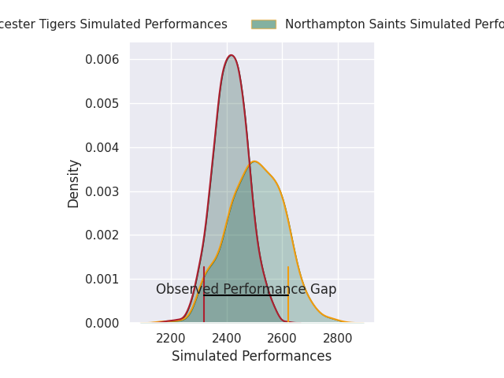
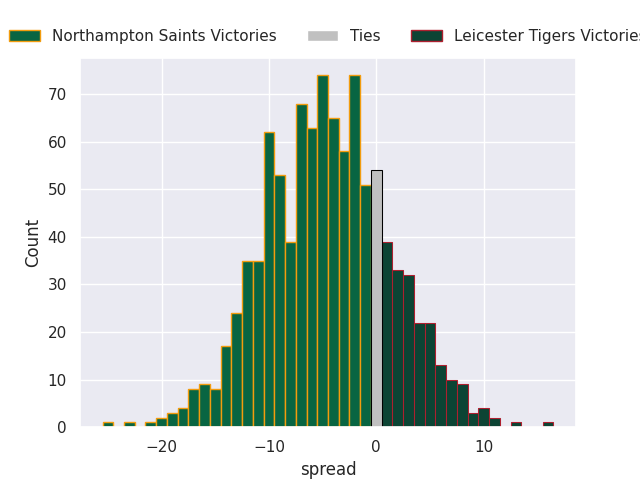
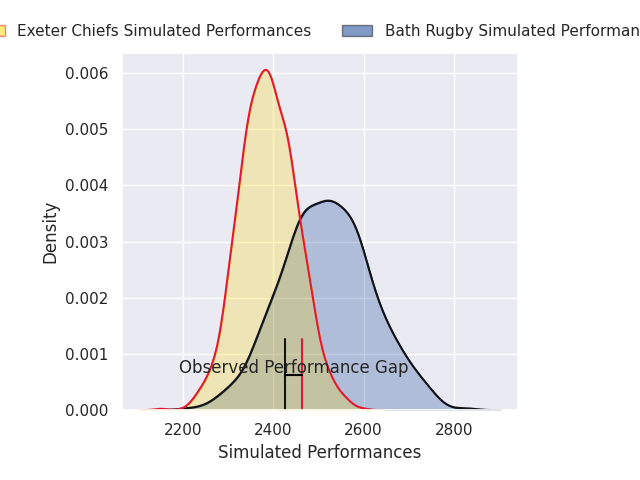
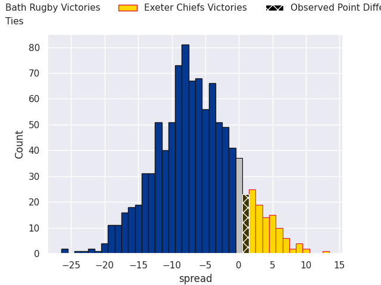

# Team Rankings

# Standings

## Current Standings

| Club                |   Played |   Wins |   Point Differential |   Losing Bonus Points |   Try Bonus Points |   Competition Points |
|:--------------------|---------:|-------:|---------------------:|----------------------:|-------------------:|---------------------:|
| Northampton Saints  |       18 |     14 |                  157 |                     1 |                 15 |                   74 |
| Bath Rugby          |       18 |     13 |                  222 |                     3 |                 14 |                   69 |
| Exeter Chiefs       |       18 |     11 |                  154 |                     5 |                 14 |                   65 |
| Leicester Tigers    |       18 |     12 |                  178 |                     3 |                 12 |                   63 |
| Saracens            |       18 |     10 |                  179 |                     4 |                 12 |                   56 |
| Bristol Rugby       |       18 |     11 |                   16 |                     1 |                  9 |                   54 |
| Sale Sharks         |       18 |      5 |                  -78 |                     6 |                 10 |                   36 |
| Gloucester Rugby    |       18 |      5 |                 -152 |                     4 |                  8 |                   32 |
| Harlequins          |       18 |      6 |                 -141 |                     1 |                  6 |                   31 |
| Newcastle Red Bulls |       18 |      2 |                 -535 |                     1 |                  1 |                   10 |

## Projected Remaining Table

| Club               |   To Play |   Projected Wins |   Projected Differential |   Projected Losing Bonus Points | Projected Try Bonus Points   |   Projected Competition Points |
|:-------------------|----------:|-----------------:|-------------------------:|--------------------------------:|:-----------------------------|-------------------------------:|
| Bath Rugby         |         1 |            0.808 |                    5.609 |                           0.136 |                              |                          3.442 |
| Northampton Saints |         1 |            0.698 |                    3.397 |                           0.215 |                              |                          3.109 |
| Leicester Tigers   |         1 |            0.251 |                   -3.397 |                           0.46  |                              |                          1.566 |
| Exeter Chiefs      |         1 |            0.155 |                   -5.609 |                           0.417 |                              |                          1.111 |

## Projected Total Table

| Club                |   Played |   Wins |   Point Differential |   Losing Bonus Points |   Try Bonus Points |   Competition Points |
|:--------------------|---------:|-------:|---------------------:|----------------------:|-------------------:|---------------------:|
| Northampton Saints  |       19 | 14.698 |              160.397 |                 1.215 |                 15 |               77.109 |
| Bath Rugby          |       19 | 13.808 |              227.609 |                 3.136 |                 14 |               72.442 |
| Exeter Chiefs       |       19 | 11.155 |              148.391 |                 5.417 |                 14 |               66.111 |
| Leicester Tigers    |       19 | 12.251 |              174.603 |                 3.46  |                 12 |               64.566 |
| Saracens            |       18 | 10     |              179     |                 4     |                 12 |               56     |
| Bristol Rugby       |       18 | 11     |               16     |                 1     |                  9 |               54     |
| Sale Sharks         |       18 |  5     |              -78     |                 6     |                 10 |               36     |
| Gloucester Rugby    |       18 |  5     |             -152     |                 4     |                  8 |               32     |
| Harlequins          |       18 |  6     |             -141     |                 1     |                  6 |               31     |
| Newcastle Red Bulls |       18 |  2     |             -535     |                 1     |                  1 |               10     |

# Completed Match Review

| Model | Percent Correct Predictions | Spread Error |
| ------ | ------ | ------ |
| Club Level | 78.3% | 15.7 |
| Player Level: Lineup | nan% | nan |
| Player Level: Minutes | nan% | nan |

# Future Predictions

## Week 19

### Northampton Saints V Leicester Tigers on 2026/06/12

Average Margin: Northampton Saints by 3.4

### Bath Rugby V Exeter Chiefs on 2026/06/13

Average Margin: Bath Rugby by 5.6

