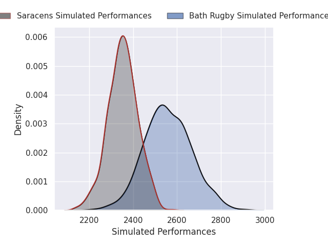
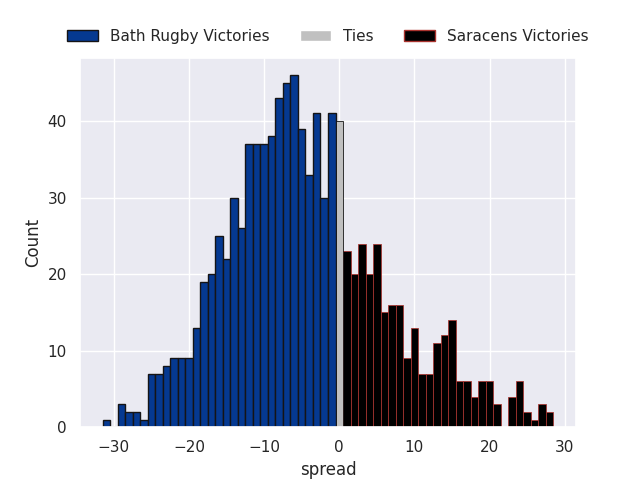
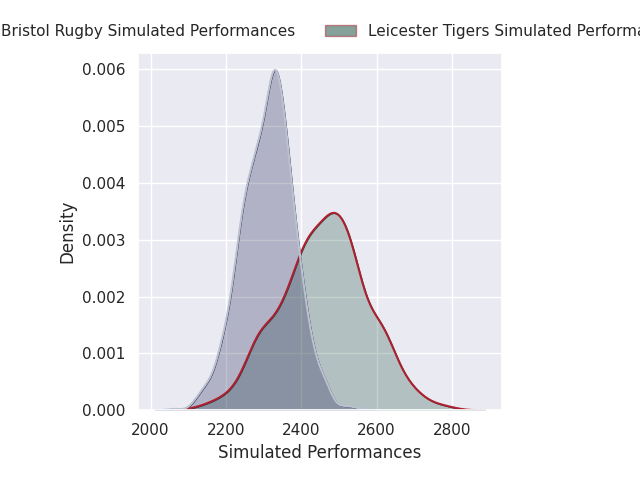
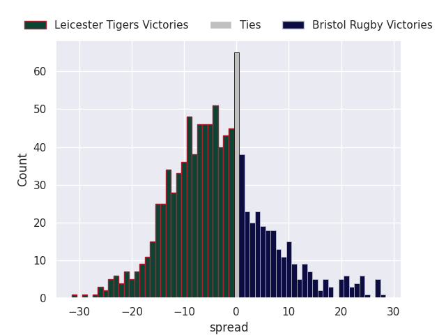
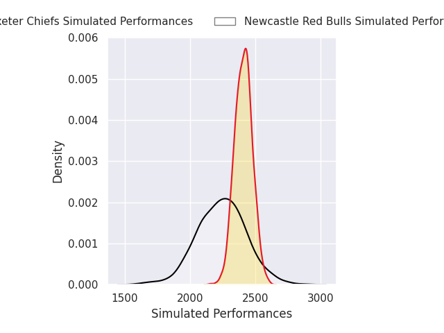
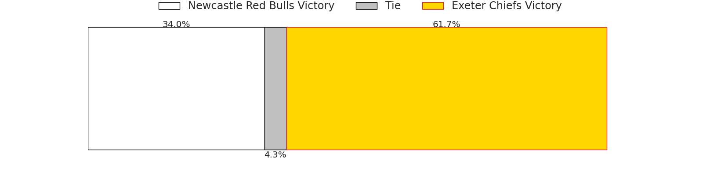
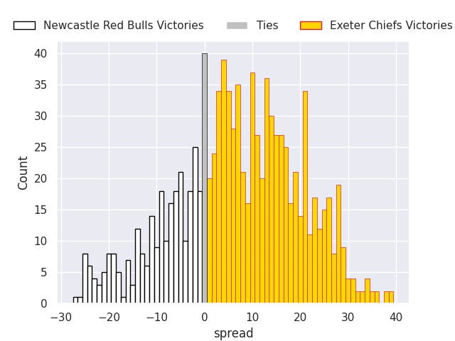
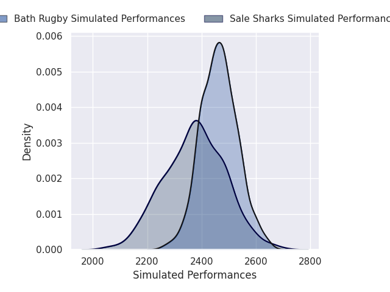
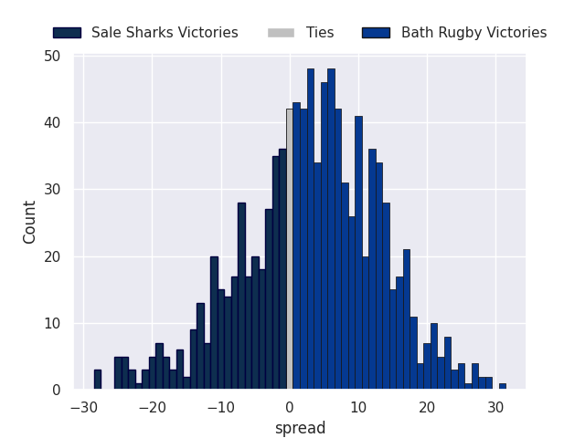

# Team Rankings

# Standings

## Current Standings

| Club                |   Played |   Wins |   Point Differential |   Losing Bonus Points |   Try Bonus Points |   Competition Points |
|:--------------------|---------:|-------:|---------------------:|----------------------:|-------------------:|---------------------:|
| Northampton Saints  |       10 |      8 |                  108 |                     0 |                  9 |                   43 |
| Bath Rugby          |       10 |      8 |                  106 |                     1 |                  8 |                   41 |
| Bristol Rugby       |       10 |      8 |                   55 |                     0 |                  5 |                   37 |
| Leicester Tigers    |       10 |      7 |                   63 |                     1 |                  7 |                   36 |
| Exeter Chiefs       |       10 |      6 |                   93 |                     3 |                  6 |                   35 |
| Saracens            |       10 |      5 |                  135 |                     3 |                  9 |                   32 |
| Sale Sharks         |       10 |      3 |                  -12 |                     3 |                  5 |                   20 |
| Gloucester Rugby    |       10 |      1 |                 -121 |                     3 |                  4 |                   11 |
| Harlequins          |       10 |      2 |                 -155 |                     0 |                  2 |                   10 |
| Newcastle Red Bulls |       10 |      1 |                 -272 |                     0 |                  1 |                    5 |

## Projected Remaining Table

| Club                |   To Play |   Projected Wins |   Projected Differential |   Projected Losing Bonus Points | Projected Try Bonus Points   |   Projected Competition Points |
|:--------------------|----------:|-----------------:|-------------------------:|--------------------------------:|:-----------------------------|-------------------------------:|
| Bath Rugby          |         8 |            4.787 |                   28.515 |                           1.621 |                              |                         21.493 |
| Exeter Chiefs       |         8 |            4.718 |                   22.617 |                           1.689 |                              |                         21.335 |
| Northampton Saints  |         8 |            4.474 |                   22.19  |                           1.801 |                              |                         20.439 |
| Leicester Tigers    |         8 |            3.981 |                    8.111 |                           1.975 |                              |                         18.617 |
| Saracens            |         8 |            3.978 |                    3.575 |                           1.898 |                              |                         18.582 |
| Bristol Rugby       |         8 |            3.677 |                   -2.895 |                           2.03  |                              |                         17.48  |
| Sale Sharks         |         8 |            3.51  |                   -8.525 |                           2.041 |                              |                         16.891 |
| Harlequins          |         8 |            3.287 |                  -12.595 |                           2.101 |                              |                         16.037 |
| Gloucester Rugby    |         8 |            3.282 |                  -10.473 |                           2.06  |                              |                         15.984 |
| Newcastle Red Bulls |         8 |            2.435 |                  -50.52  |                           1.651 |                              |                         12.009 |

## Projected Total Table

| Club                |   Played |   Wins |   Point Differential |   Losing Bonus Points |   Try Bonus Points |   Competition Points |
|:--------------------|---------:|-------:|---------------------:|----------------------:|-------------------:|---------------------:|
| Northampton Saints  |       18 | 12.474 |              130.19  |                 1.801 |                  9 |               63.439 |
| Bath Rugby          |       18 | 12.787 |              134.515 |                 2.621 |                  8 |               62.493 |
| Exeter Chiefs       |       18 | 10.718 |              115.617 |                 4.689 |                  6 |               56.335 |
| Leicester Tigers    |       18 | 10.981 |               71.111 |                 2.975 |                  7 |               54.617 |
| Bristol Rugby       |       18 | 11.677 |               52.105 |                 2.03  |                  5 |               54.48  |
| Saracens            |       18 |  8.978 |              138.575 |                 4.898 |                  9 |               50.582 |
| Sale Sharks         |       18 |  6.51  |              -20.525 |                 5.041 |                  5 |               36.891 |
| Gloucester Rugby    |       18 |  4.282 |             -131.473 |                 5.06  |                  4 |               26.984 |
| Harlequins          |       18 |  5.287 |             -167.595 |                 2.101 |                  2 |               26.037 |
| Newcastle Red Bulls |       18 |  3.435 |             -322.52  |                 1.651 |                  1 |               17.009 |

# Completed Match Review

| Model | Percent Correct Predictions | Spread Error |
| ------ | ------ | ------ |
| Club Level | 76.7% | 12.2 |
| Player Level: Lineup | nan% | nan |
| Player Level: Minutes | nan% | nan |

# Future Predictions

## Week 11

### Northampton Saints V Newcastle Red Bulls on 2026/03/21

Average Margin: Northampton Saints by 12.6

### Bath Rugby V Saracens on 2026/03/21

Average Margin: Bath Rugby by 5.5

### Harlequins V Gloucester Rugby on 2026/03/21

Average Margin: Harlequins by 2.3

### Exeter Chiefs V Sale Sharks on 2026/03/21

Average Margin: Exeter Chiefs by 7.3

### Leicester Tigers V Bristol Rugby on 2026/03/21

Average Margin: Leicester Tigers by 4.1

## Week 12

### Newcastle Red Bulls V Exeter Chiefs on 2026/03/28

Average Margin: Exeter Chiefs by 7.3

### Saracens V Northampton Saints on 2026/03/28

Average Margin: Saracens by 1.1

### Bristol Rugby V Harlequins on 2026/03/28

Average Margin: Bristol Rugby by 3.6

### Gloucester Rugby V Leicester Tigers on 2026/03/28

Average Margin: Leicester Tigers by 0.1

### Sale Sharks V Bath Rugby on 2026/03/28

Average Margin: Bath Rugby by 2.6

## Week 13

### Bath Rugby V Harlequins on 2026/04/18

Average Margin: Bath Rugby by 7.1

### Leicester Tigers V Newcastle Red Bulls on 2026/04/18

Average Margin: Leicester Tigers by 10.0

### Sale Sharks V Saracens on 2026/04/18

Average Margin: Sale Sharks by 1.0

### Bristol Rugby V Gloucester Rugby on 2026/04/18

Average Margin: Bristol Rugby by 3.5

### Exeter Chiefs V Northampton Saints on 2026/04/18

Average Margin: Exeter Chiefs by 2.9

## Week 14

### Gloucester Rugby V Exeter Chiefs on 2026/04/25

Average Margin: Exeter Chiefs by 0.7

### Saracens V Leicester Tigers on 2026/04/25

Average Margin: Saracens by 3.5

### Harlequins V Sale Sharks on 2026/04/25

Average Margin: Harlequins by 1.9

### Northampton Saints V Bath Rugby on 2026/04/25

Average Margin: Northampton Saints by 1.3

### Newcastle Red Bulls V Bristol Rugby on 2026/04/25

Average Margin: Bristol Rugby by 2.3

## Week 15

### Leicester Tigers V Northampton Saints on 2026/05/09

Average Margin: Leicester Tigers by 1.3

### Gloucester Rugby V Sale Sharks on 2026/05/09

Average Margin: Gloucester Rugby by 2.7

### Exeter Chiefs V Bath Rugby on 2026/05/09

Average Margin: Exeter Chiefs by 1.5

### Bristol Rugby V Saracens on 2026/05/09

Average Margin: Bristol Rugby by 1.2

### Newcastle Red Bulls V Harlequins on 2026/05/09

Average Margin: Harlequins by 0.7

## Week 16

### Sale Sharks V Leicester Tigers on 2026/05/16

Average Margin: Sale Sharks by 1.8

### Harlequins V Exeter Chiefs on 2026/05/16

Average Margin: Exeter Chiefs by 1.2

### Saracens V Gloucester Rugby on 2026/05/16

Average Margin: Saracens by 5.9

### Bath Rugby V Newcastle Red Bulls on 2026/05/16

Average Margin: Bath Rugby by 10.5

### Northampton Saints V Bristol Rugby on 2026/05/16

Average Margin: Northampton Saints by 5.7

## Week 17

### Leicester Tigers V Exeter Chiefs on 2026/05/30

Average Margin: Leicester Tigers by 2.3

### Saracens V Harlequins on 2026/05/30

Average Margin: Saracens by 4.8

### Northampton Saints V Gloucester Rugby on 2026/05/30

Average Margin: Northampton Saints by 6.8

### Bristol Rugby V Bath Rugby on 2026/05/30

Average Margin: Bath Rugby by 1.5

### Newcastle Red Bulls V Sale Sharks on 2026/05/30

Average Margin: Sale Sharks by 1.0

## Week 18

### Bath Rugby V Leicester Tigers on 2026/06/06

Average Margin: Bath Rugby by 4.3

### Harlequins V Northampton Saints on 2026/06/06

Average Margin: Northampton Saints by 0.9

### Gloucester Rugby V Newcastle Red Bulls on 2026/06/06

Average Margin: Gloucester Rugby by 6.1

### Sale Sharks V Bristol Rugby on 2026/06/06

Average Margin: Sale Sharks by 2.2

### Exeter Chiefs V Saracens on 2026/06/06

Average Margin: Exeter Chiefs by 4.0

