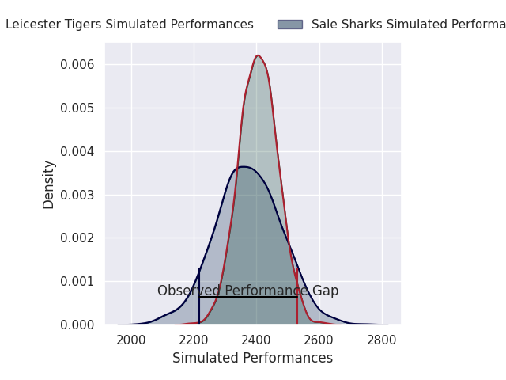
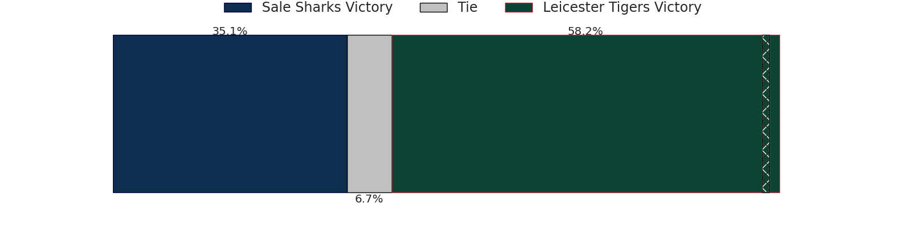
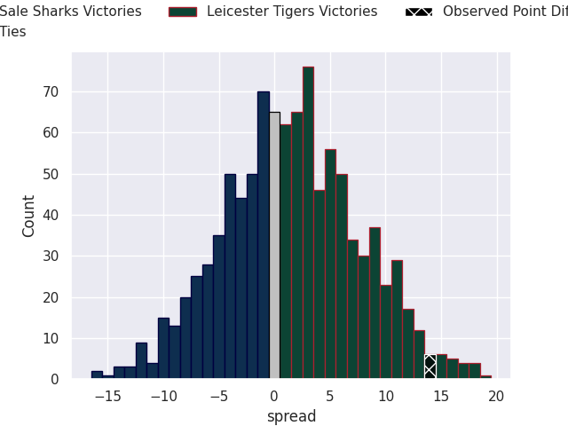

# Team Rankings

# Standings

## Current Standings

| Club                |   Played |   Wins |   Point Differential |   Losing Bonus Points |   Try Bonus Points |   Competition Points |
|:--------------------|---------:|-------:|---------------------:|----------------------:|-------------------:|---------------------:|
| Northampton Saints  |       15 |     12 |                   99 |                     0 |                 12 |                   62 |
| Bath Rugby          |       15 |     11 |                  165 |                     2 |                 12 |                   58 |
| Leicester Tigers    |       15 |     11 |                  175 |                     2 |                 11 |                   57 |
| Exeter Chiefs       |       15 |      9 |                  142 |                     5 |                 11 |                   54 |
| Bristol Rugby       |       15 |     10 |                   96 |                     1 |                  8 |                   49 |
| Saracens            |       15 |      8 |                  169 |                     4 |                 11 |                   47 |
| Sale Sharks         |       15 |      4 |                  -82 |                     5 |                  7 |                   28 |
| Gloucester Rugby    |       15 |      4 |                 -165 |                     3 |                  6 |                   25 |
| Harlequins          |       15 |      4 |                 -151 |                     1 |                  4 |                   21 |
| Newcastle Red Bulls |       15 |      1 |                 -448 |                     1 |                  1 |                    6 |

## Projected Remaining Table

| Club                |   To Play |   Projected Wins |   Projected Differential |   Projected Losing Bonus Points | Projected Try Bonus Points   |   Projected Competition Points |
|:--------------------|----------:|-----------------:|-------------------------:|--------------------------------:|:-----------------------------|-------------------------------:|
| Northampton Saints  |         3 |            2.713 |                   28.144 |                           0.204 |                              |                         11.182 |
| Bath Rugby          |         3 |            2.429 |                   30.555 |                           0.393 |                              |                         10.367 |
| Saracens            |         3 |            2.034 |                   16.312 |                           0.443 |                              |                          8.697 |
| Sale Sharks         |         3 |            1.852 |                    7.602 |                           0.74  |                              |                          8.444 |
| Exeter Chiefs       |         3 |            1.754 |                    5.519 |                           0.683 |                              |                          7.925 |
| Leicester Tigers    |         3 |            1.623 |                    3.742 |                           0.845 |                              |                          7.615 |
| Gloucester Rugby    |         3 |            1.022 |                  -10.491 |                           0.42  |                              |                          4.566 |
| Bristol Rugby       |         3 |            0.55  |                  -16.936 |                           1.161 |                              |                          3.649 |
| Harlequins          |         3 |            0.384 |                  -21.93  |                           1.087 |                              |                          2.795 |
| Newcastle Red Bulls |         3 |            0.16  |                  -42.517 |                           0.551 |                              |                          1.287 |

## Projected Total Table

| Club                |   Played |   Wins |   Point Differential |   Losing Bonus Points |   Try Bonus Points |   Competition Points |
|:--------------------|---------:|-------:|---------------------:|----------------------:|-------------------:|---------------------:|
| Northampton Saints  |       18 | 14.713 |              127.144 |                 0.204 |                 12 |               73.182 |
| Bath Rugby          |       18 | 13.429 |              195.555 |                 2.393 |                 12 |               68.367 |
| Leicester Tigers    |       18 | 12.623 |              178.742 |                 2.845 |                 11 |               64.615 |
| Exeter Chiefs       |       18 | 10.754 |              147.519 |                 5.683 |                 11 |               61.925 |
| Saracens            |       18 | 10.034 |              185.312 |                 4.443 |                 11 |               55.697 |
| Bristol Rugby       |       18 | 10.55  |               79.064 |                 2.161 |                  8 |               52.649 |
| Sale Sharks         |       18 |  5.852 |              -74.398 |                 5.74  |                  7 |               36.444 |
| Gloucester Rugby    |       18 |  5.022 |             -175.491 |                 3.42  |                  6 |               29.566 |
| Harlequins          |       18 |  4.384 |             -172.93  |                 2.087 |                  4 |               23.795 |
| Newcastle Red Bulls |       18 |  1.16  |             -490.517 |                 1.551 |                  1 |                7.287 |

# Completed Match Review

| Model | Percent Correct Predictions | Spread Error |
| ------ | ------ | ------ |
| Club Level | 81.1% | 14.1 |
| Player Level: Lineup | nan% | nan |
| Player Level: Minutes | nan% | nan |

# Future Predictions

## Week 16

### Northampton Saints V Bristol Bears on 2026/05/15

Average Margin: Northampton Saints by 10.0

### Saracens V Gloucester Rugby on 2026/05/16

Average Margin: Saracens by 11.6

### Harlequins V Exeter Chiefs on 2026/05/16

Average Margin: Exeter Chiefs by 4.9

### Bath Rugby V Newcastle Red Bulls on 2026/05/16

Average Margin: Bath Rugby by 22.7

### Sale Sharks V Leicester Tigers on 2026/05/17

Average Margin: Leicester Tigers by 2.3

## Week 17

### Bristol Rugby V Bath Rugby on 2026/05/29

Average Margin: Bath Rugby by 3.0

### Northampton Saints V Gloucester Rugby on 2026/05/30

Average Margin: Northampton Saints by 12.7

### Leicester Tigers V Exeter Chiefs on 2026/05/30

Average Margin: Leicester Tigers by 6.3

### Saracens V Harlequins on 2026/05/30

Average Margin: Saracens by 11.6

### Newcastle Red Bulls V Sale Sharks on 2026/05/30

Average Margin: Sale Sharks by 6.0

## Week 18

### Gloucester Rugby V Newcastle Red Bulls on 2026/06/06

Average Margin: Gloucester Rugby by 13.8

### Sale Sharks V Bristol Rugby on 2026/06/06

Average Margin: Sale Sharks by 3.9

### Harlequins V Northampton Saints on 2026/06/06

Average Margin: Northampton Saints by 5.4

### Bath Rugby V Leicester Tigers on 2026/06/06

Average Margin: Bath Rugby by 4.9

### Exeter Chiefs V Saracens on 2026/06/06

Average Margin: Exeter Chiefs by 6.9

