# Team Rankings

# Standings

## Current Standings

| Club                |   Played |   Wins |   Point Differential |   Losing Bonus Points |   Try Bonus Points |   Competition Points |
|:--------------------|---------:|-------:|---------------------:|----------------------:|-------------------:|---------------------:|
| Northampton Saints  |       11 |      9 |                  109 |                     0 |                 10 |                   48 |
| Bath Rugby          |       11 |      9 |                  153 |                     1 |                  9 |                   46 |
| Leicester Tigers    |       11 |      8 |                   77 |                     1 |                  8 |                   41 |
| Exeter Chiefs       |       11 |      7 |                  105 |                     3 |                  7 |                   40 |
| Bristol Rugby       |       11 |      8 |                   41 |                     0 |                  5 |                   37 |
| Saracens            |       11 |      5 |                   88 |                     3 |                  9 |                   32 |
| Sale Sharks         |       11 |      3 |                  -24 |                     3 |                  5 |                   20 |
| Gloucester Rugby    |       11 |      2 |                 -114 |                     3 |                  5 |                   16 |
| Harlequins          |       11 |      2 |                 -162 |                     1 |                  2 |                   11 |
| Newcastle Red Bulls |       11 |      1 |                 -273 |                     1 |                  1 |                    6 |

## Projected Remaining Table

| Club                |   To Play |   Projected Wins |   Projected Differential |   Projected Losing Bonus Points | Projected Try Bonus Points   |   Projected Competition Points |
|:--------------------|----------:|-----------------:|-------------------------:|--------------------------------:|:-----------------------------|-------------------------------:|
| Bath Rugby          |         7 |            4.109 |                   22.843 |                           1.513 |                              |                         18.631 |
| Exeter Chiefs       |         7 |            3.98  |                   15.877 |                           1.546 |                              |                         18.124 |
| Leicester Tigers    |         7 |            3.806 |                   13.476 |                           1.592 |                              |                         17.522 |
| Northampton Saints  |         7 |            3.591 |                    7.126 |                           1.672 |                              |                         16.76  |
| Saracens            |         7 |            3.52  |                    3.428 |                           1.712 |                              |                         16.518 |
| Bristol Rugby       |         7 |            3.351 |                    0.396 |                           1.794 |                              |                         15.862 |
| Sale Sharks         |         7 |            3.063 |                   -4.361 |                           2.031 |                              |                         15.051 |
| Gloucester Rugby    |         7 |            2.973 |                   -5.502 |                           1.887 |                              |                         14.467 |
| Harlequins          |         7 |            2.547 |                  -18.101 |                           1.902 |                              |                         12.776 |
| Newcastle Red Bulls |         7 |            2.352 |                  -35.182 |                           1.473 |                              |                         11.411 |

## Projected Total Table

| Club                |   Played |   Wins |   Point Differential |   Losing Bonus Points |   Try Bonus Points |   Competition Points |
|:--------------------|---------:|-------:|---------------------:|----------------------:|-------------------:|---------------------:|
| Northampton Saints  |       18 | 12.591 |              116.126 |                 1.672 |                 10 |               64.76  |
| Bath Rugby          |       18 | 13.109 |              175.843 |                 2.513 |                  9 |               64.631 |
| Leicester Tigers    |       18 | 11.806 |               90.476 |                 2.592 |                  8 |               58.522 |
| Exeter Chiefs       |       18 | 10.98  |              120.877 |                 4.546 |                  7 |               58.124 |
| Bristol Rugby       |       18 | 11.351 |               41.396 |                 1.794 |                  5 |               52.862 |
| Saracens            |       18 |  8.52  |               91.428 |                 4.712 |                  9 |               48.518 |
| Sale Sharks         |       18 |  6.063 |              -28.361 |                 5.031 |                  5 |               35.051 |
| Gloucester Rugby    |       18 |  4.973 |             -119.502 |                 4.887 |                  5 |               30.467 |
| Harlequins          |       18 |  4.547 |             -180.101 |                 2.902 |                  2 |               23.776 |
| Newcastle Red Bulls |       18 |  3.352 |             -308.182 |                 2.473 |                  1 |               17.411 |

# Completed Match Review

| Model | Percent Correct Predictions | Spread Error |
| ------ | ------ | ------ |
| Club Level | 76.7% | 12.0 |
| Player Level: Lineup | nan% | nan |
| Player Level: Minutes | nan% | nan |

# Future Predictions

## Week 12

### Newcastle Red Bulls V Exeter Chiefs on 2026/03/27

Average Margin: Exeter Chiefs by 6.9

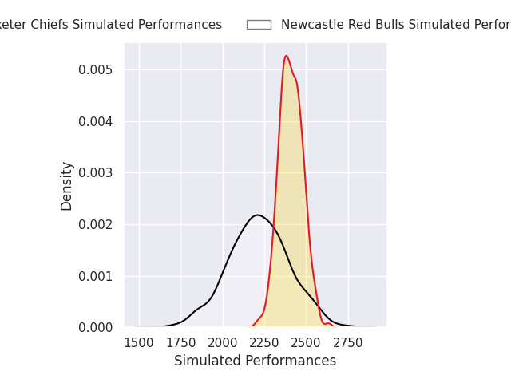
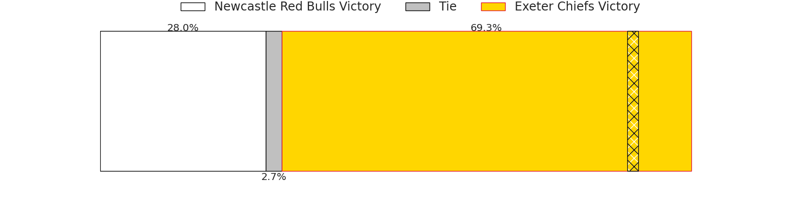
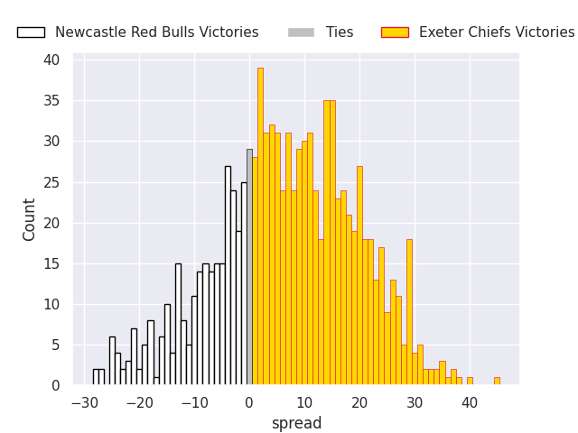

### Saracens V Northampton Saints on 2026/03/28

Average Margin: Saracens by 0.5

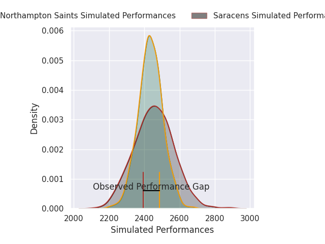

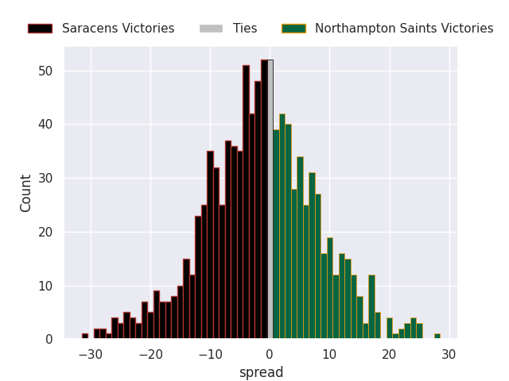

### Bristol Rugby V Harlequins on 2026/03/28

Average Margin: Bristol Rugby by 4.0

### Gloucester Rugby V Leicester Tigers on 2026/03/28

Average Margin: Leicester Tigers by 0.9

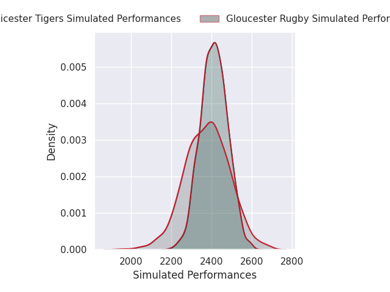

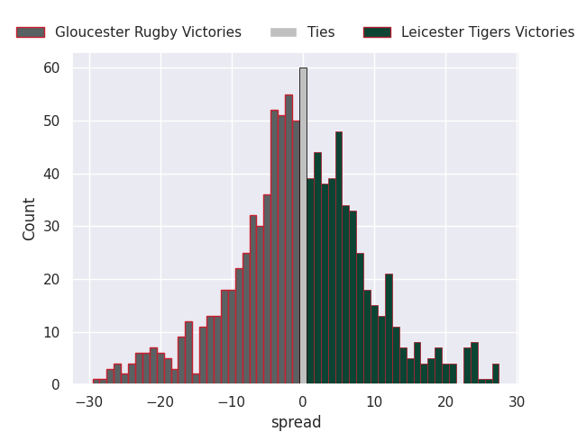

### Sale Sharks V Bath Rugby on 2026/03/29

Average Margin: Bath Rugby by 2.2

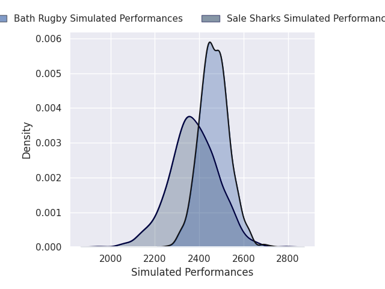

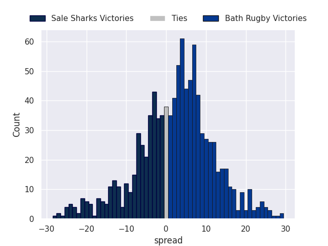

## Week 13

### Leicester Tigers V Newcastle Red Bulls on 2026/04/18

Average Margin: Leicester Tigers by 10.6

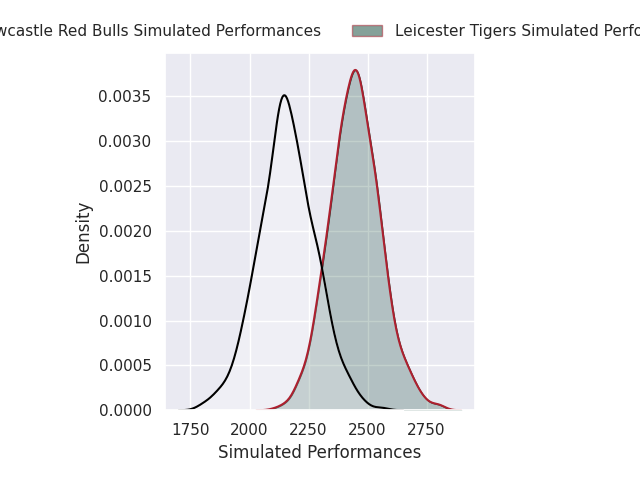

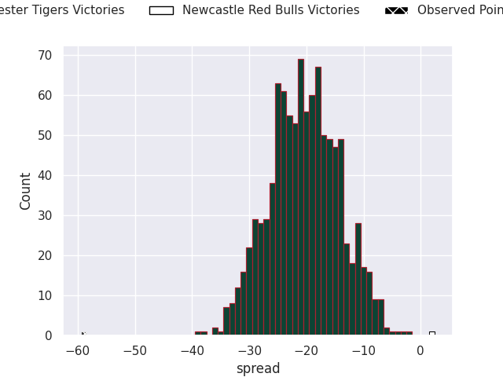

### Exeter Chiefs V Northampton Saints on 2026/04/18

Average Margin: Exeter Chiefs by 3.2

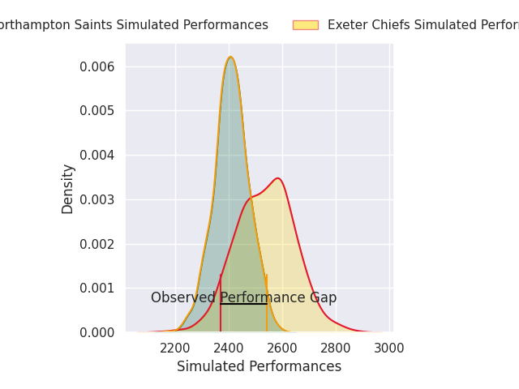
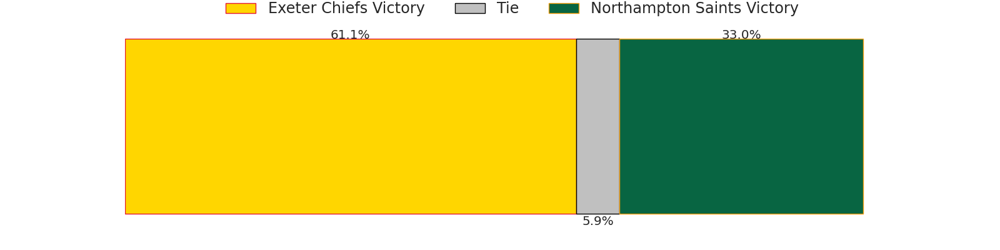
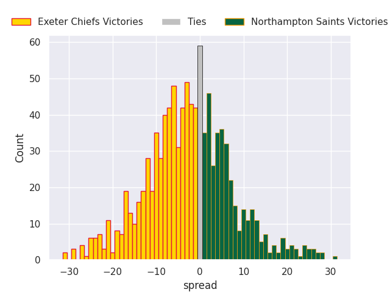

### Bristol Rugby V Gloucester Rugby on 2026/04/18

Average Margin: Bristol Rugby by 2.7

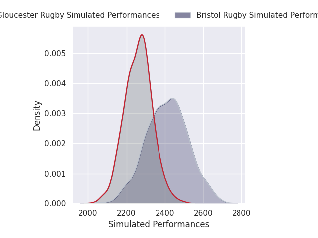

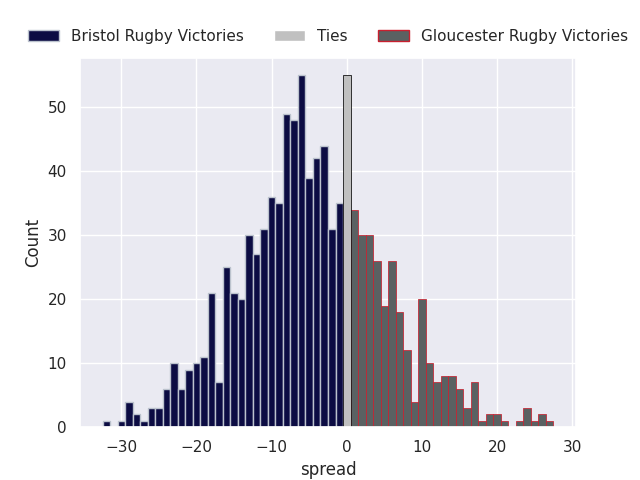

### Sale Sharks V Saracens on 2026/04/18

Average Margin: Sale Sharks by 1.1

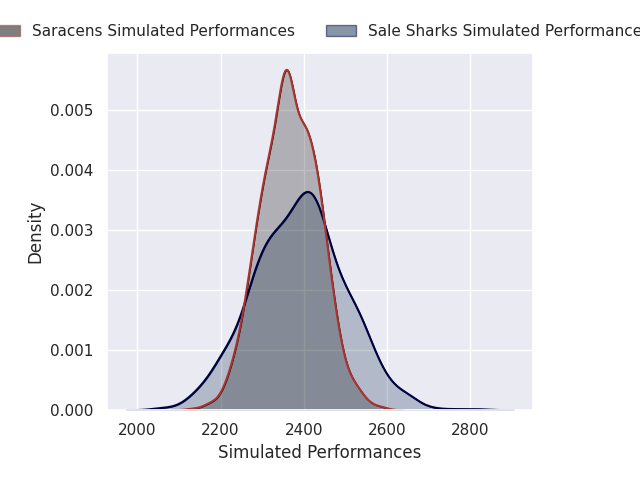

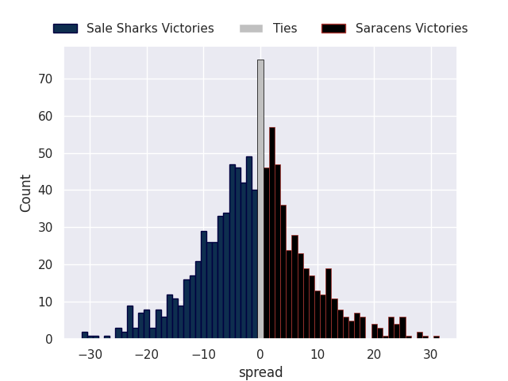

### Bath Rugby V Harlequins on 2026/04/18

Average Margin: Bath Rugby by 7.8

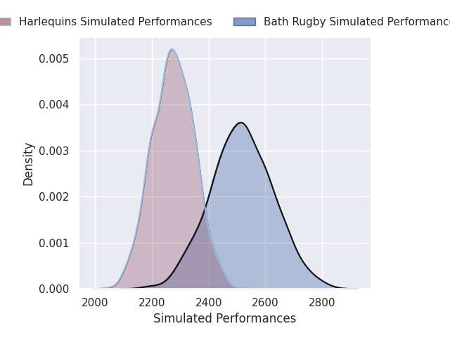

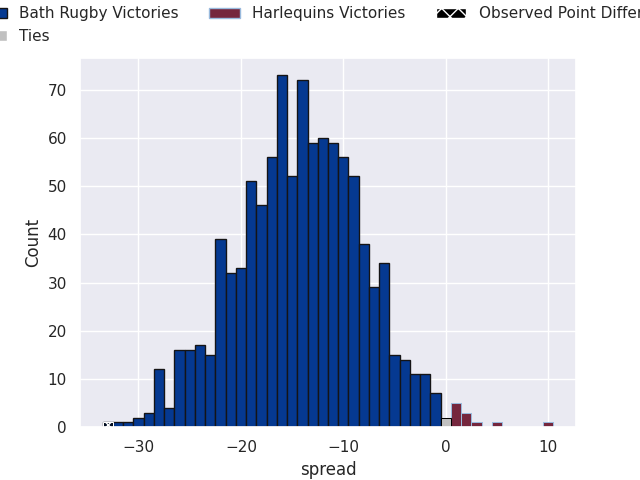

## Week 14

### Saracens V Leicester Tigers on 2026/04/25

Average Margin: Saracens by 0.8

### Northampton Saints V Bath Rugby on 2026/04/25

Average Margin: Northampton Saints by 0.7

### Harlequins V Sale Sharks on 2026/04/25

Average Margin: Harlequins by 1.5

### Gloucester Rugby V Exeter Chiefs on 2026/04/25

Average Margin: Exeter Chiefs by 0.7

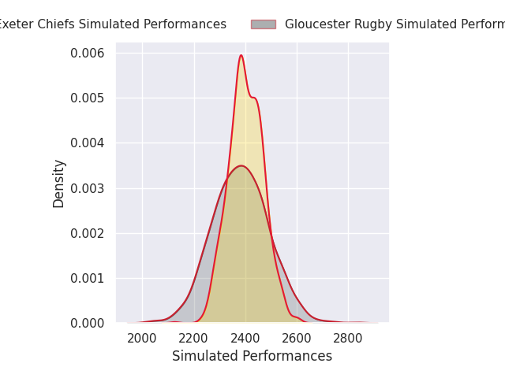

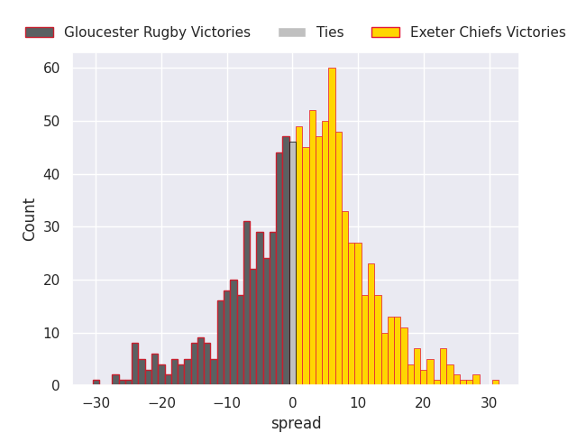

### Newcastle Red Bulls V Bristol Rugby on 2026/04/25

Average Margin: Bristol Rugby by 1.5

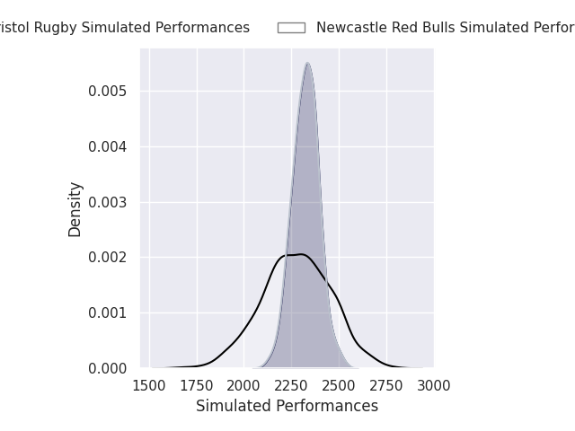

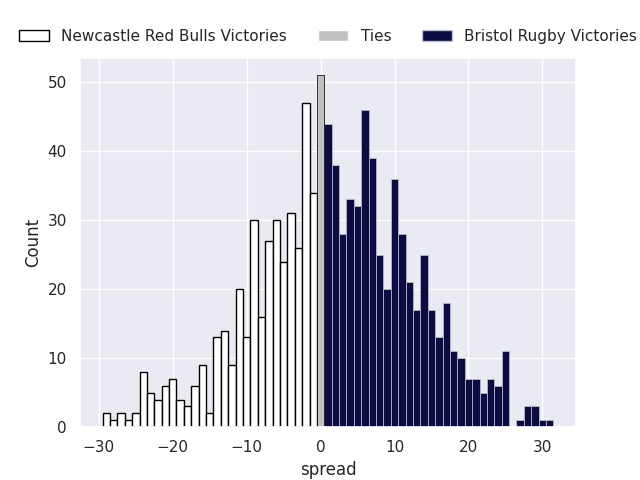

## Week 15

### Gloucester Rugby V Sale Sharks on 2026/05/09

Average Margin: Gloucester Rugby by 3.0

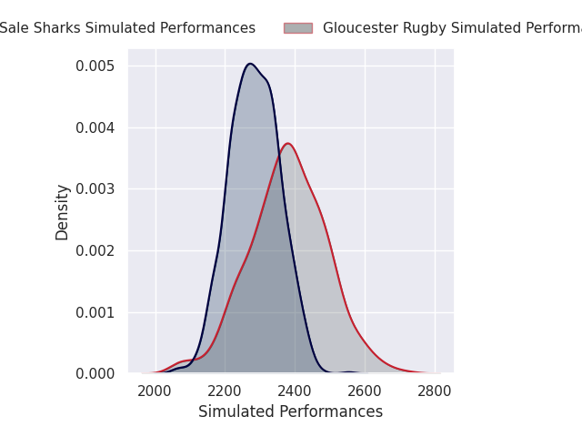

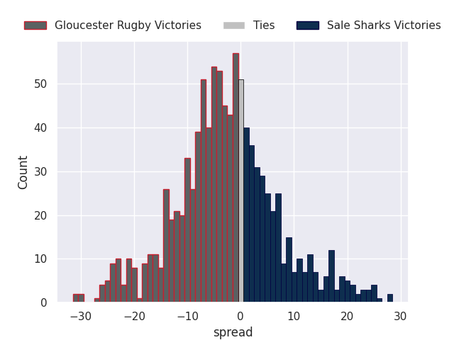

### Leicester Tigers V Northampton Saints on 2026/05/09

Average Margin: Leicester Tigers by 2.5

### Newcastle Red Bulls V Harlequins on 2026/05/09

Average Margin: Harlequins by 0.0

### Exeter Chiefs V Bath Rugby on 2026/05/09

Average Margin: Exeter Chiefs by 1.8

### Bristol Rugby V Saracens on 2026/05/09

Average Margin: Bristol Rugby by 1.1

## Week 16

### Northampton Saints V Bristol Rugby on 2026/05/16

Average Margin: Northampton Saints by 5.6

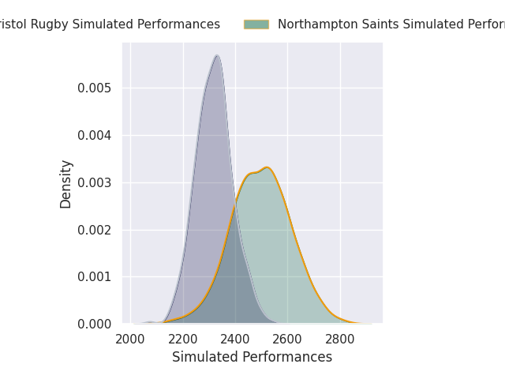
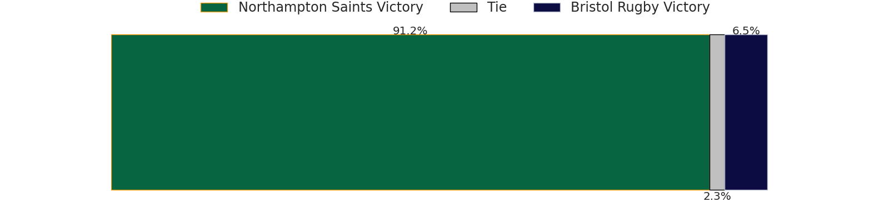
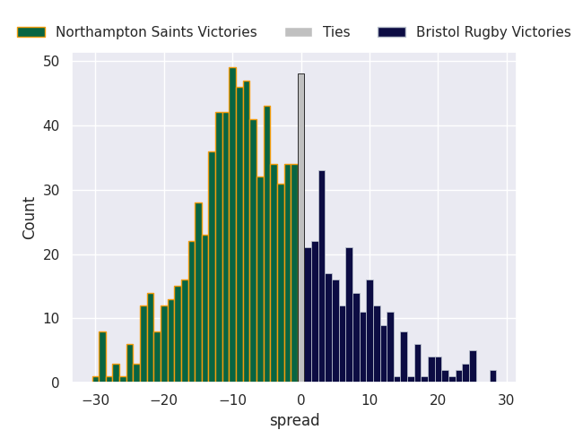

### Sale Sharks V Leicester Tigers on 2026/05/16

Average Margin: Leicester Tigers by 0.5

### Bath Rugby V Newcastle Red Bulls on 2026/05/16

Average Margin: Bath Rugby by 10.7

### Saracens V Gloucester Rugby on 2026/05/16

Average Margin: Saracens by 4.4

### Harlequins V Exeter Chiefs on 2026/05/16

Average Margin: Exeter Chiefs by 1.6

## Week 17

### Saracens V Harlequins on 2026/05/30

Average Margin: Saracens by 4.8

### Northampton Saints V Gloucester Rugby on 2026/05/30

Average Margin: Northampton Saints by 5.5

### Newcastle Red Bulls V Sale Sharks on 2026/05/30

Average Margin: Newcastle Red Bulls by 0.3

### Bristol Rugby V Bath Rugby on 2026/05/30

Average Margin: Bath Rugby by 1.2

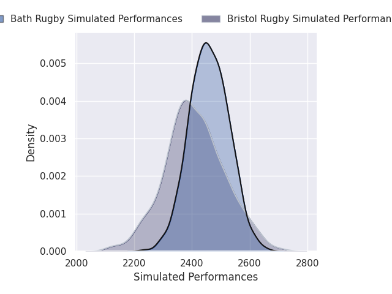

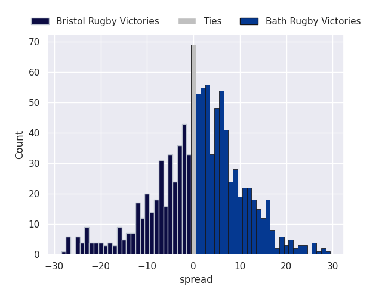

### Leicester Tigers V Exeter Chiefs on 2026/05/30

Average Margin: Leicester Tigers by 3.3

## Week 18

### Bath Rugby V Leicester Tigers on 2026/06/06

Average Margin: Bath Rugby by 3.5

### Sale Sharks V Bristol Rugby on 2026/06/06

Average Margin: Sale Sharks by 2.1

### Harlequins V Northampton Saints on 2026/06/06

Average Margin: Northampton Saints by 1.4

### Gloucester Rugby V Newcastle Red Bulls on 2026/06/06

Average Margin: Gloucester Rugby by 5.8

### Exeter Chiefs V Saracens on 2026/06/06

Average Margin: Exeter Chiefs by 4.9

