# Team Rankings

# Standings

## Current Standings

| Club                |   Played |   Wins |   Point Differential |   Losing Bonus Points |   Try Bonus Points |   Competition Points |
|:--------------------|---------:|-------:|---------------------:|----------------------:|-------------------:|---------------------:|
| Northampton Saints  |       13 |     11 |                  120 |                     0 |                 11 |                   57 |
| Bath Rugby          |       13 |     11 |                  191 |                     1 |                 11 |                   56 |
| Leicester Tigers    |       13 |     10 |                  155 |                     1 |                 10 |                   51 |
| Exeter Chiefs       |       13 |      8 |                  122 |                     4 |                  9 |                   47 |
| Bristol Rugby       |       13 |      9 |                   78 |                     1 |                  6 |                   43 |
| Saracens            |       13 |      6 |                  150 |                     4 |                 10 |                   38 |
| Sale Sharks         |       13 |      3 |                  -95 |                     4 |                  6 |                   22 |
| Gloucester Rugby    |       13 |      2 |                 -174 |                     3 |                  5 |                   16 |
| Harlequins          |       13 |      3 |                 -191 |                     1 |                  2 |                   15 |
| Newcastle Red Bulls |       13 |      1 |                 -356 |                     1 |                  1 |                    6 |

## Projected Remaining Table

| Club                |   To Play |   Projected Wins |   Projected Differential |   Projected Losing Bonus Points | Projected Try Bonus Points   |   Projected Competition Points |
|:--------------------|----------:|-----------------:|-------------------------:|--------------------------------:|:-----------------------------|-------------------------------:|
| Northampton Saints  |         5 |            3.661 |                   29.84  |                           0.82  |                              |                         15.776 |
| Bath Rugby          |         5 |            3.16  |                   26.55  |                           1.165 |                              |                         14.193 |
| Exeter Chiefs       |         5 |            3.124 |                   13.131 |                           1.159 |                              |                         14.101 |
| Saracens            |         5 |            2.958 |                   14.67  |                           1.127 |                              |                         13.289 |
| Leicester Tigers    |         5 |            2.653 |                    4.89  |                           1.397 |                              |                         12.471 |
| Sale Sharks         |         5 |            2.104 |                   -4.621 |                           1.737 |                              |                         10.725 |
| Bristol Rugby       |         5 |            1.849 |                  -11.364 |                           1.588 |                              |                          9.444 |
| Gloucester Rugby    |         5 |            1.999 |                  -13.58  |                           0.969 |                              |                          9.241 |
| Harlequins          |         5 |            1.661 |                  -15.964 |                           1.606 |                              |                          8.674 |
| Newcastle Red Bulls |         5 |            0.837 |                  -43.552 |                           1.464 |                              |                          5.118 |

## Projected Total Table

| Club                |   Played |   Wins |   Point Differential |   Losing Bonus Points |   Try Bonus Points |   Competition Points |
|:--------------------|---------:|-------:|---------------------:|----------------------:|-------------------:|---------------------:|
| Northampton Saints  |       18 | 14.661 |              149.84  |                 0.82  |                 11 |               72.776 |
| Bath Rugby          |       18 | 14.16  |              217.55  |                 2.165 |                 11 |               70.193 |
| Leicester Tigers    |       18 | 12.653 |              159.89  |                 2.397 |                 10 |               63.471 |
| Exeter Chiefs       |       18 | 11.124 |              135.131 |                 5.159 |                  9 |               61.101 |
| Bristol Rugby       |       18 | 10.849 |               66.636 |                 2.588 |                  6 |               52.444 |
| Saracens            |       18 |  8.958 |              164.67  |                 5.127 |                 10 |               51.289 |
| Sale Sharks         |       18 |  5.104 |              -99.621 |                 5.737 |                  6 |               32.725 |
| Gloucester Rugby    |       18 |  3.999 |             -187.58  |                 3.969 |                  5 |               25.241 |
| Harlequins          |       18 |  4.661 |             -206.964 |                 2.606 |                  2 |               23.674 |
| Newcastle Red Bulls |       18 |  1.837 |             -399.552 |                 2.464 |                  1 |               11.118 |

# Completed Match Review

| Model | Percent Correct Predictions | Spread Error |
| ------ | ------ | ------ |
| Club Level | 84.4% | 12.6 |
| Player Level: Lineup | nan% | nan |
| Player Level: Minutes | nan% | nan |

# Future Predictions

## Week 14

### Newcastle Red Bulls V Bristol Bears on 2026/04/24

Average Margin: Bristol Rugby by 5.3

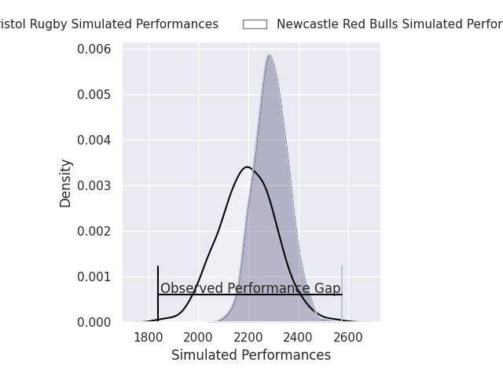
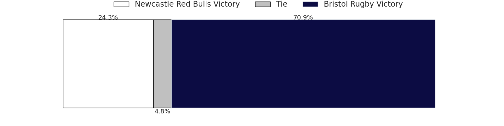
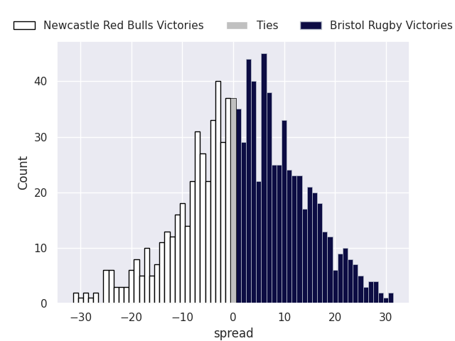

### Harlequins V Sale Sharks on 2026/04/25

Average Margin: Harlequins by 2.7

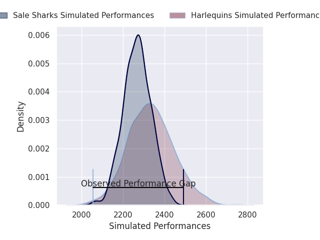

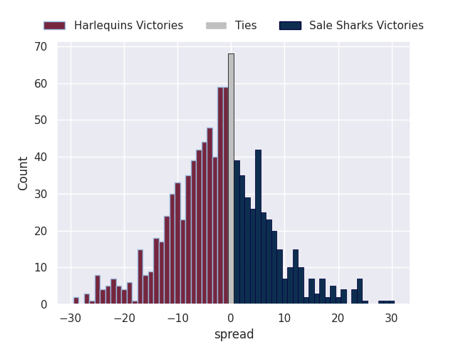

### Northampton Saints V Bath Rugby on 2026/04/25

Average Margin: Northampton Saints by 2.9

### Saracens V Leicester Tigers on 2026/04/25

Average Margin: Saracens by 2.1

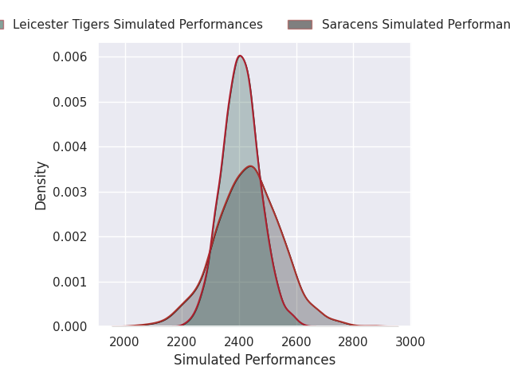

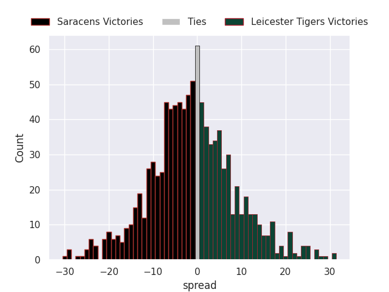

### Gloucester Rugby V Exeter Chiefs on 2026/04/26

Average Margin: Exeter Chiefs by 3.8

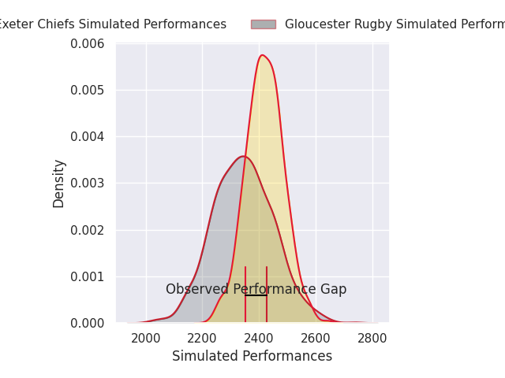
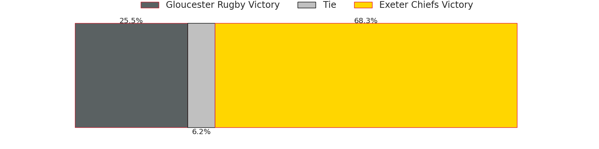
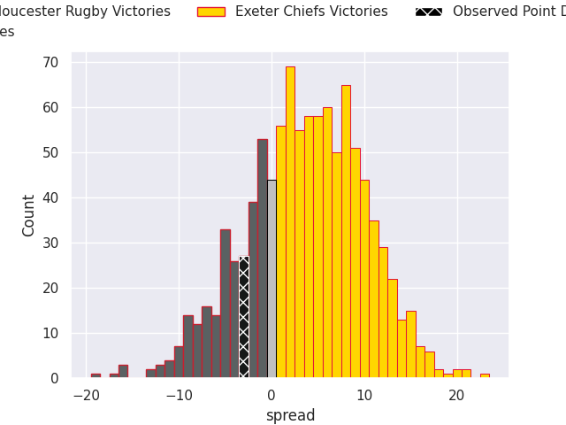

## Week 15

### Gloucester Rugby V Sale Sharks on 2026/05/08

Average Margin: Gloucester Rugby by 4.2

### Leicester Tigers V Northampton Saints on 2026/05/09

Average Margin: Leicester Tigers by 4.1

### Newcastle Red Bulls V Harlequins on 2026/05/09

Average Margin: Harlequins by 2.7

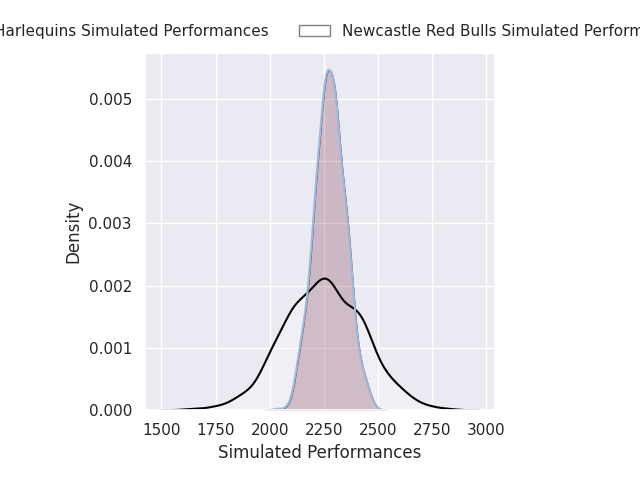

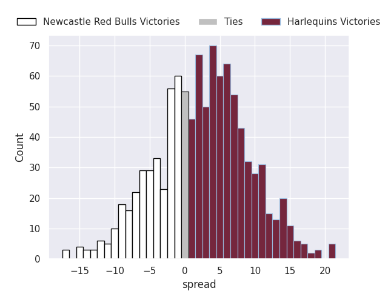

### Exeter Chiefs V Bath Rugby on 2026/05/09

Average Margin: Exeter Chiefs by 2.6

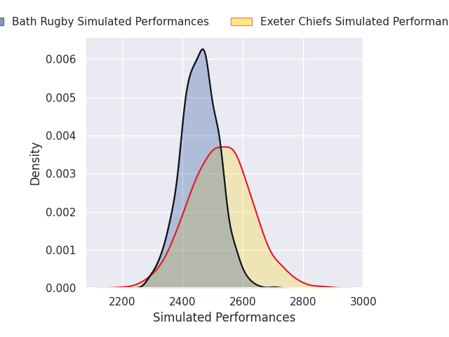

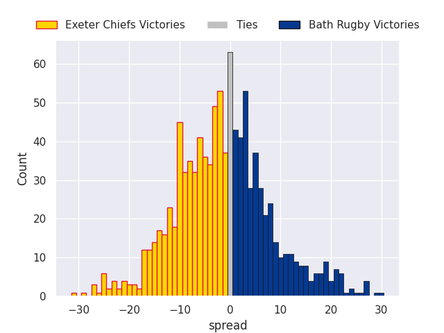

### Bristol Rugby V Saracens on 2026/05/09

Average Margin: Bristol Rugby by 1.1

## Week 16

### Northampton Saints V Bristol Rugby on 2026/05/15

Average Margin: Northampton Saints by 11.0

### Sale Sharks V Leicester Tigers on 2026/05/16

Average Margin: Leicester Tigers by 3.2

### Saracens V Gloucester Rugby on 2026/05/16

Average Margin: Saracens by 11.0

### Harlequins V Exeter Chiefs on 2026/05/16

Average Margin: Exeter Chiefs by 4.7

### Bath Rugby V Newcastle Red Bulls on 2026/05/16

Average Margin: Bath Rugby by 21.6

## Week 17

### Bristol Rugby V Bath Rugby on 2026/05/29

Average Margin: Bath Rugby by 4.1

### Leicester Tigers V Exeter Chiefs on 2026/05/30

Average Margin: Leicester Tigers by 5.9

### Saracens V Harlequins on 2026/05/30

Average Margin: Saracens by 10.5

### Northampton Saints V Gloucester Rugby on 2026/05/30

Average Margin: Northampton Saints by 14.1

### Newcastle Red Bulls V Sale Sharks on 2026/05/30

Average Margin: Sale Sharks by 2.8

## Week 18

### Gloucester Rugby V Newcastle Red Bulls on 2026/06/06

Average Margin: Gloucester Rugby by 11.2

### Sale Sharks V Bristol Rugby on 2026/06/06

Average Margin: Sale Sharks by 2.7

### Bath Rugby V Leicester Tigers on 2026/06/06

Average Margin: Bath Rugby by 6.3

### Exeter Chiefs V Saracens on 2026/06/06

Average Margin: Exeter Chiefs by 7.9

### Harlequins V Northampton Saints on 2026/06/06

Average Margin: Northampton Saints by 6.0

