# Team Rankings

# Standings

## Current Standings

| Club                |   Played |   Wins |   Point Differential |   Losing Bonus Points |   Try Bonus Points |   Competition Points |
|:--------------------|---------:|-------:|---------------------:|----------------------:|-------------------:|---------------------:|
| Northampton Saints  |       10 |      8 |                  108 |                     0 |                  9 |                   43 |
| Bath Rugby          |       10 |      8 |                  106 |                     1 |                  8 |                   41 |
| Bristol Rugby       |       10 |      8 |                   55 |                     0 |                  5 |                   37 |
| Leicester Tigers    |       10 |      7 |                   63 |                     1 |                  7 |                   36 |
| Exeter Chiefs       |       10 |      6 |                   93 |                     3 |                  6 |                   35 |
| Saracens            |       10 |      5 |                  135 |                     3 |                  9 |                   32 |
| Sale Sharks         |       10 |      3 |                  -12 |                     3 |                  5 |                   20 |
| Gloucester Rugby    |       10 |      1 |                 -121 |                     3 |                  4 |                   11 |
| Harlequins          |       10 |      2 |                 -155 |                     0 |                  2 |                   10 |
| Newcastle Red Bulls |       10 |      1 |                 -272 |                     0 |                  1 |                    5 |

## Projected Remaining Table

| Club                |   To Play |   Projected Wins |   Projected Differential |   Projected Losing Bonus Points | Projected Try Bonus Points   |   Projected Competition Points |
|:--------------------|----------:|-----------------:|-------------------------:|--------------------------------:|:-----------------------------|-------------------------------:|
| Bath Rugby          |         8 |            4.681 |                   23.188 |                           1.673 |                              |                         21.157 |
| Exeter Chiefs       |         8 |            4.421 |                   13.98  |                           1.837 |                              |                         20.357 |
| Northampton Saints  |         8 |            4.397 |                   18.883 |                           1.798 |                              |                         20.198 |
| Saracens            |         8 |            4.019 |                    6.479 |                           1.92  |                              |                         18.776 |
| Bristol Rugby       |         8 |            3.859 |                    2.118 |                           2.033 |                              |                         18.297 |
| Leicester Tigers    |         8 |            3.863 |                    3.427 |                           2.009 |                              |                         18.229 |
| Sale Sharks         |         8 |            3.736 |                   -2.679 |                           2.049 |                              |                         17.849 |
| Gloucester Rugby    |         8 |            3.241 |                  -12.604 |                           2.048 |                              |                         15.81  |
| Harlequins          |         8 |            3.095 |                  -16.62  |                           2.151 |                              |                         15.333 |
| Newcastle Red Bulls |         8 |            2.708 |                  -36.172 |                           1.765 |                              |                         13.277 |

## Projected Total Table

| Club                |   Played |   Wins |   Point Differential |   Losing Bonus Points |   Try Bonus Points |   Competition Points |
|:--------------------|---------:|-------:|---------------------:|----------------------:|-------------------:|---------------------:|
| Northampton Saints  |       18 | 12.397 |              126.883 |                 1.798 |                  9 |               63.198 |
| Bath Rugby          |       18 | 12.681 |              129.188 |                 2.673 |                  8 |               62.157 |
| Exeter Chiefs       |       18 | 10.421 |              106.98  |                 4.837 |                  6 |               55.357 |
| Bristol Rugby       |       18 | 11.859 |               57.118 |                 2.033 |                  5 |               55.297 |
| Leicester Tigers    |       18 | 10.863 |               66.427 |                 3.009 |                  7 |               54.229 |
| Saracens            |       18 |  9.019 |              141.479 |                 4.92  |                  9 |               50.776 |
| Sale Sharks         |       18 |  6.736 |              -14.679 |                 5.049 |                  5 |               37.849 |
| Gloucester Rugby    |       18 |  4.241 |             -133.604 |                 5.048 |                  4 |               26.81  |
| Harlequins          |       18 |  5.095 |             -171.62  |                 2.151 |                  2 |               25.333 |
| Newcastle Red Bulls |       18 |  3.708 |             -308.172 |                 1.765 |                  1 |               18.277 |

# Completed Match Review

| Model | Percent Correct Predictions | Spread Error |
| ------ | ------ | ------ |
| Club Level | 76.7% | 10.8 |
| Player Level: Lineup | nan% | nan |
| Player Level: Minutes | nan% | nan |

# Future Predictions

## Week 11

### Harlequins V Gloucester Rugby on 2026/03/21

Average Margin: Harlequins by 2.5

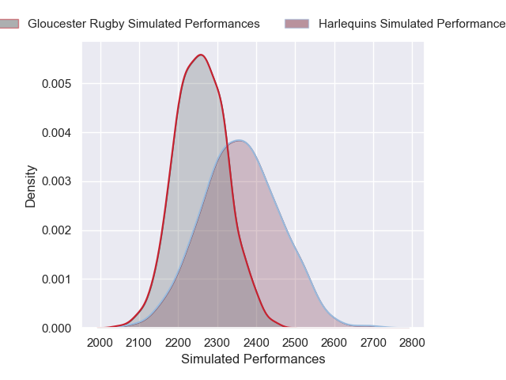

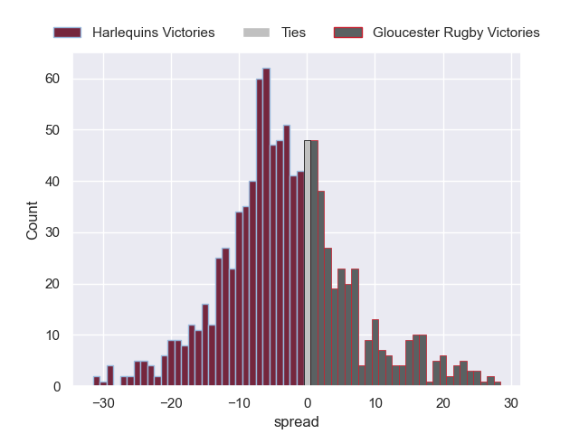

### Exeter Chiefs V Sale Sharks on 2026/03/21

Average Margin: Exeter Chiefs by 5.8

### Northampton Saints V Newcastle Red Bulls on 2026/03/21

Average Margin: Northampton Saints by 10.5

### Bath Rugby V Saracens on 2026/03/21

Average Margin: Bath Rugby by 4.2

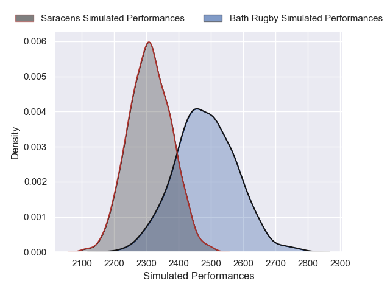

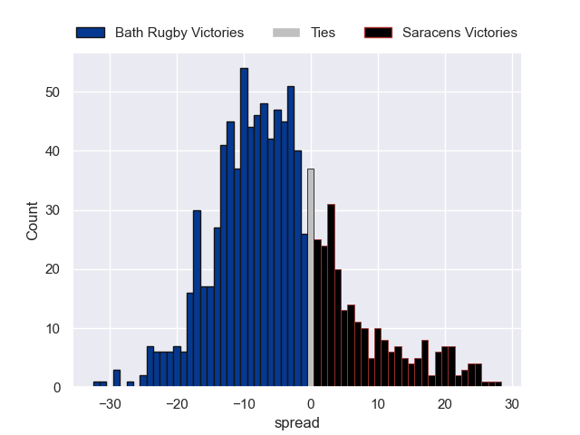

### Leicester Tigers V Bristol Rugby on 2026/03/21

Average Margin: Leicester Tigers by 3.5

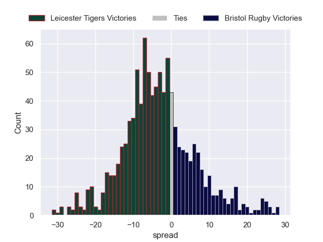

## Week 12

### Saracens V Northampton Saints on 2026/03/28

Average Margin: Saracens by 1.7

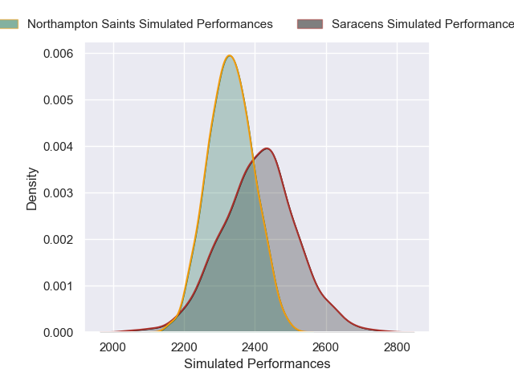

### Newcastle Red Bulls V Exeter Chiefs on 2026/03/28

Average Margin: Exeter Chiefs by 3.4

### Gloucester Rugby V Leicester Tigers on 2026/03/28

Average Margin: Gloucester Rugby by 0.6

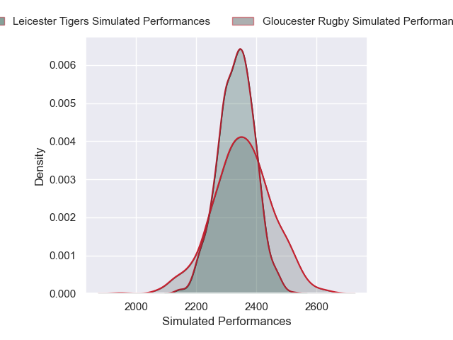

### Sale Sharks V Bath Rugby on 2026/03/28

Average Margin: Bath Rugby by 1.1

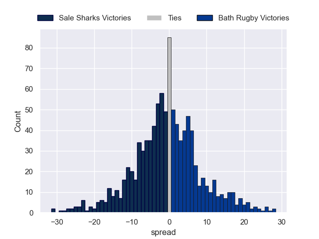

### Bristol Rugby V Harlequins on 2026/03/28

Average Margin: Bristol Rugby by 4.4

## Week 13

### Bristol Rugby V Gloucester Rugby on 2026/04/18

Average Margin: Bristol Rugby by 4.8

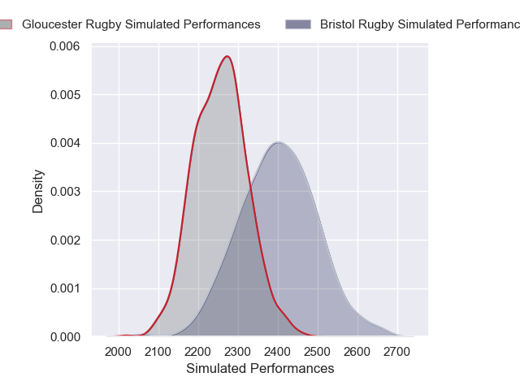

### Exeter Chiefs V Northampton Saints on 2026/04/18

Average Margin: Exeter Chiefs by 1.8

### Sale Sharks V Saracens on 2026/04/18

Average Margin: Sale Sharks by 1.6

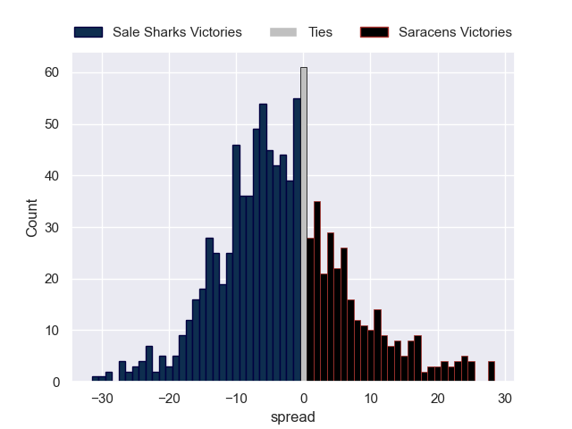

### Leicester Tigers V Newcastle Red Bulls on 2026/04/18

Average Margin: Leicester Tigers by 7.7

### Bath Rugby V Harlequins on 2026/04/18

Average Margin: Bath Rugby by 6.5

## Week 14

### Gloucester Rugby V Exeter Chiefs on 2026/04/25

Average Margin: Exeter Chiefs by 0.0

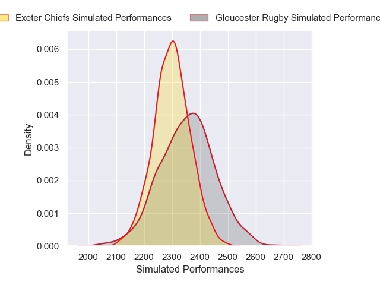

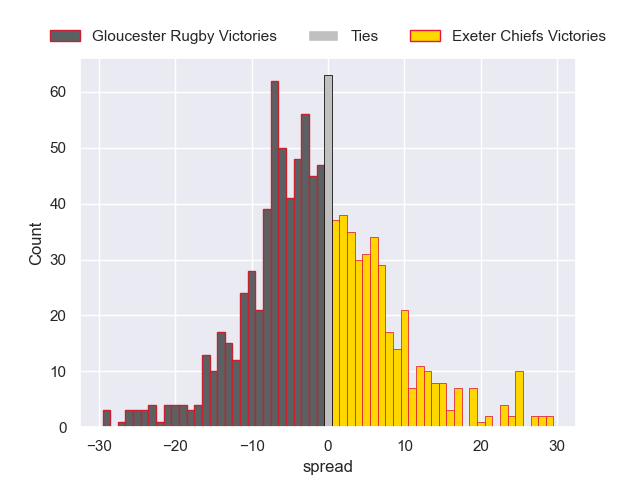

### Northampton Saints V Bath Rugby on 2026/04/25

Average Margin: Northampton Saints by 1.4

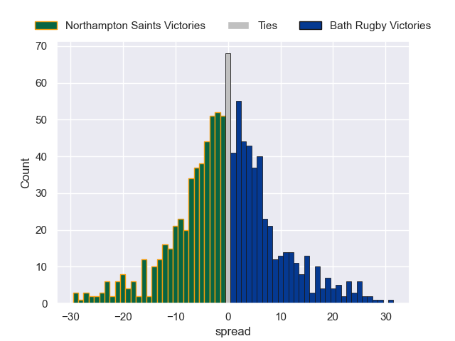

### Saracens V Leicester Tigers on 2026/04/25

Average Margin: Saracens by 3.3

### Harlequins V Sale Sharks on 2026/04/25

Average Margin: Harlequins by 0.5

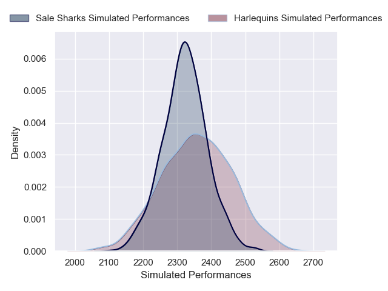

### Newcastle Red Bulls V Bristol Rugby on 2026/04/25

Average Margin: Bristol Rugby by 1.6

## Week 15

### Newcastle Red Bulls V Harlequins on 2026/05/09

Average Margin: Newcastle Red Bulls by 1.3

### Gloucester Rugby V Sale Sharks on 2026/05/09

Average Margin: Gloucester Rugby by 1.8

### Bristol Rugby V Saracens on 2026/05/09

Average Margin: Bristol Rugby by 1.3

### Exeter Chiefs V Bath Rugby on 2026/05/09

Average Margin: Exeter Chiefs by 1.5

### Leicester Tigers V Northampton Saints on 2026/05/09

Average Margin: Leicester Tigers by 1.1

## Week 16

### Bath Rugby V Newcastle Red Bulls on 2026/05/16

Average Margin: Bath Rugby by 9.1

### Northampton Saints V Bristol Rugby on 2026/05/16

Average Margin: Northampton Saints by 4.4

### Harlequins V Exeter Chiefs on 2026/05/16

Average Margin: Exeter Chiefs by 0.6

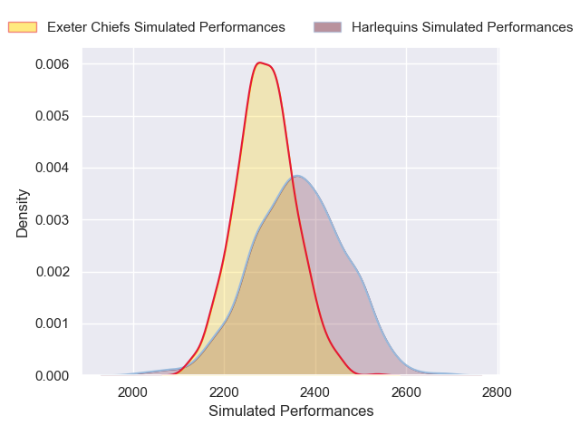

### Sale Sharks V Leicester Tigers on 2026/05/16

Average Margin: Sale Sharks by 2.4

### Saracens V Gloucester Rugby on 2026/05/16

Average Margin: Saracens by 6.3

## Week 17

### Bristol Rugby V Bath Rugby on 2026/05/30

Average Margin: Bath Rugby by 0.3

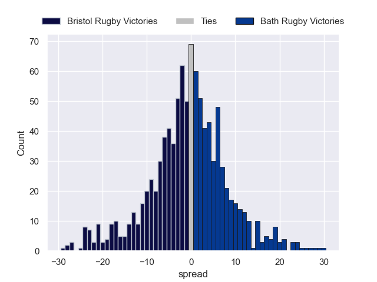

### Newcastle Red Bulls V Sale Sharks on 2026/05/30

Average Margin: Sale Sharks by 0.5

### Saracens V Harlequins on 2026/05/30

Average Margin: Saracens by 5.7

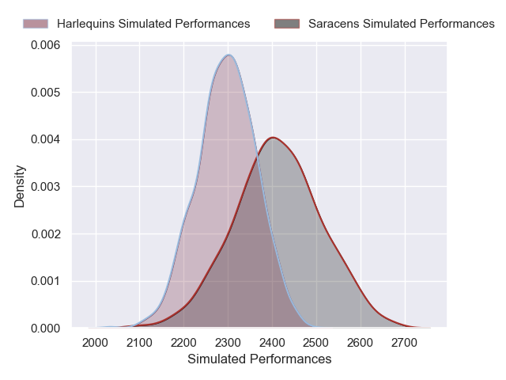

### Northampton Saints V Gloucester Rugby on 2026/05/30

Average Margin: Northampton Saints by 6.1

### Leicester Tigers V Exeter Chiefs on 2026/05/30

Average Margin: Leicester Tigers by 2.5

## Week 18

### Bath Rugby V Leicester Tigers on 2026/06/06

Average Margin: Bath Rugby by 4.9

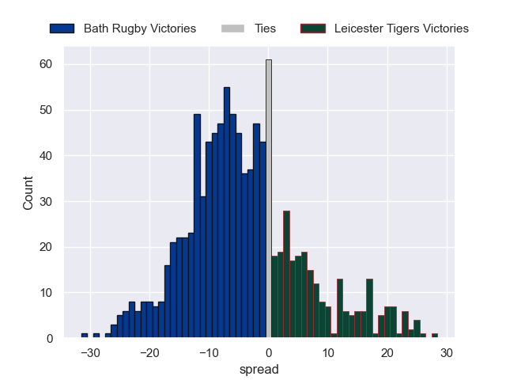

### Sale Sharks V Bristol Rugby on 2026/06/06

Average Margin: Sale Sharks by 1.9

### Harlequins V Northampton Saints on 2026/06/06

Average Margin: Northampton Saints by 1.1

### Exeter Chiefs V Saracens on 2026/06/06

Average Margin: Exeter Chiefs by 3.4

### Gloucester Rugby V Newcastle Red Bulls on 2026/06/06

Average Margin: Gloucester Rugby by 4.7

