# Team Rankings

# Standings

## Current Standings

| Club               |   Played |   Wins |   Point Differential |   Losing Bonus Points |   Try Bonus Points |   Competition Points |
|:-------------------|---------:|-------:|---------------------:|----------------------:|-------------------:|---------------------:|
| Northampton Saints |       10 |      8 |                  108 |                     0 |                  9 |                   43 |
| Bath Rugby         |       10 |      8 |                  106 |                     1 |                  8 |                   41 |
| Bristol Rugby      |       10 |      8 |                   55 |                     0 |                  5 |                   37 |
| Leicester Tigers   |       10 |      7 |                   63 |                     1 |                  7 |                   36 |
| Exeter Chiefs      |       10 |      6 |                   93 |                     3 |                  6 |                   35 |
| Saracens           |       10 |      5 |                  135 |                     3 |                  9 |                   32 |
| Sale Sharks        |       10 |      3 |                  -12 |                     3 |                  5 |                   20 |
| Gloucester Rugby   |       10 |      1 |                 -121 |                     3 |                  4 |                   11 |
| Harlequins         |       10 |      2 |                 -155 |                     0 |                  2 |                   10 |
| Newcastle Falcons  |       10 |      1 |                 -272 |                     0 |                  1 |                    5 |

## Projected Remaining Table

| Club               |   To Play |   Projected Wins |   Projected Differential |   Projected Losing Bonus Points | Projected Try Bonus Points   |   Projected Competition Points |
|:-------------------|----------:|-----------------:|-------------------------:|--------------------------------:|:-----------------------------|-------------------------------:|
| Bath Rugby         |         8 |            4.895 |                   26.638 |                           1.579 |                              |                         21.957 |
| Exeter Chiefs      |         8 |            4.141 |                    7.045 |                           2.031 |                              |                         19.559 |
| Northampton Saints |         8 |            4.162 |                   12.33  |                           1.993 |                              |                         19.489 |
| Leicester Tigers   |         8 |            4.079 |                    8.935 |                           1.968 |                              |                         19.152 |
| Sale Sharks        |         8 |            3.93  |                    2.253 |                           2.186 |                              |                         18.904 |
| Bristol Rugby      |         8 |            4.007 |                    5.866 |                           2.074 |                              |                         18.868 |
| Saracens           |         8 |            3.896 |                    3.366 |                           2.022 |                              |                         18.418 |
| Gloucester Rugby   |         8 |            3.307 |                  -11.32  |                           2.049 |                              |                         16.085 |
| Harlequins         |         8 |            3.153 |                  -14.844 |                           2.2   |                              |                         15.718 |
| Newcastle Falcons  |         8 |            2.309 |                  -40.269 |                           2.047 |                              |                         11.999 |

## Projected Total Table

| Club               |   Played |   Wins |   Point Differential |   Losing Bonus Points |   Try Bonus Points |   Competition Points |
|:-------------------|---------:|-------:|---------------------:|----------------------:|-------------------:|---------------------:|
| Bath Rugby         |       18 | 12.895 |              132.638 |                 2.579 |                  8 |               62.957 |
| Northampton Saints |       18 | 12.162 |              120.33  |                 1.993 |                  9 |               62.489 |
| Bristol Rugby      |       18 | 12.007 |               60.866 |                 2.074 |                  5 |               55.868 |
| Leicester Tigers   |       18 | 11.079 |               71.935 |                 2.968 |                  7 |               55.152 |
| Exeter Chiefs      |       18 | 10.141 |              100.045 |                 5.031 |                  6 |               54.559 |
| Saracens           |       18 |  8.896 |              138.366 |                 5.022 |                  9 |               50.418 |
| Sale Sharks        |       18 |  6.93  |               -9.747 |                 5.186 |                  5 |               38.904 |
| Gloucester Rugby   |       18 |  4.307 |             -132.32  |                 5.049 |                  4 |               27.085 |
| Harlequins         |       18 |  5.153 |             -169.844 |                 2.2   |                  2 |               25.718 |
| Newcastle Falcons  |       18 |  3.309 |             -312.269 |                 2.047 |                  1 |               16.999 |

# Completed Match Review

| Model | Percent Correct Predictions | Spread Error |
| ------ | ------ | ------ |
| Club Level | 75.6% | 11.5 |
| Player Level: Lineup | nan% | nan |
| Player Level: Minutes | nan% | nan |

# Future Predictions

## Week 11

### Harlequins V Gloucester Rugby on 2026/03/21

Average Margin: Harlequins by 2.4

### Leicester Tigers V Bristol Rugby on 2026/03/21

Average Margin: Leicester Tigers by 2.8

### Exeter Chiefs V Sale Sharks on 2026/03/21

Average Margin: Exeter Chiefs by 3.6

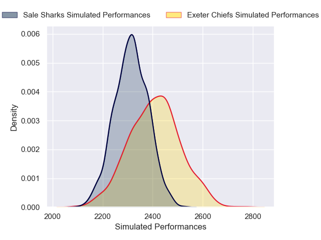

### Bath Rugby V Saracens on 2026/03/21

Average Margin: Bath Rugby by 5.1

### Northampton Saints V Newcastle Falcons on 2026/03/21

Average Margin: Northampton Saints by 8.6

## Week 12

### Bristol Rugby V Harlequins on 2026/03/28

Average Margin: Bristol Rugby by 4.9

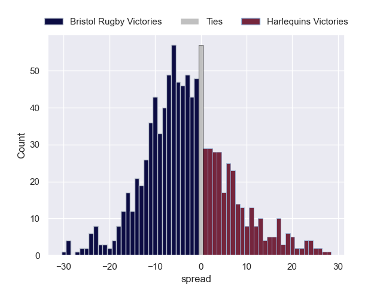

### Sale Sharks V Bath Rugby on 2026/03/28

Average Margin: Bath Rugby by 0.6

### Saracens V Northampton Saints on 2026/03/28

Average Margin: Saracens by 2.0

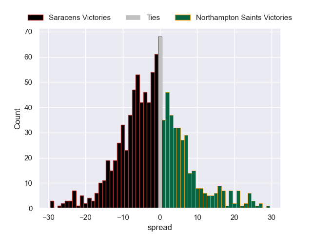

### Newcastle Falcons V Exeter Chiefs on 2026/03/28

Average Margin: Exeter Chiefs by 3.2

### Gloucester Rugby V Leicester Tigers on 2026/03/28

Average Margin: Leicester Tigers by 0.8

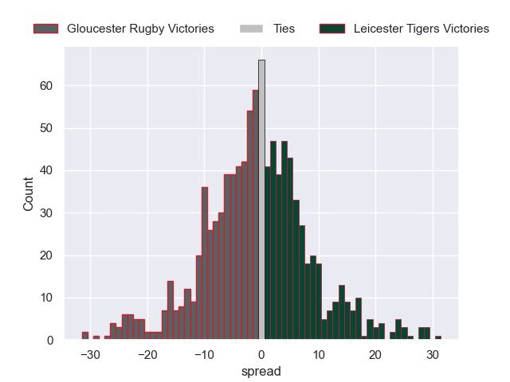

## Week 13

### Leicester Tigers V Newcastle Falcons on 2026/04/18

Average Margin: Leicester Tigers by 8.8

### Bristol Rugby V Gloucester Rugby on 2026/04/18

Average Margin: Bristol Rugby by 4.6

### Exeter Chiefs V Northampton Saints on 2026/04/18

Average Margin: Exeter Chiefs by 2.0

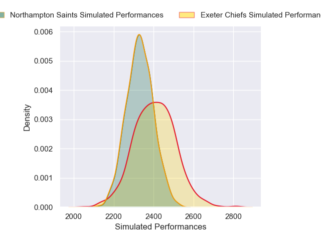

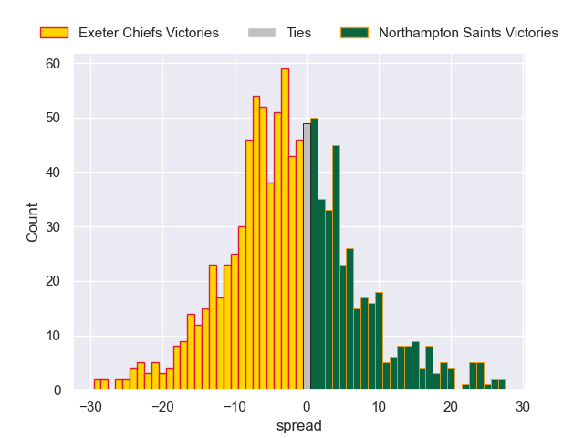

### Sale Sharks V Saracens on 2026/04/18

Average Margin: Sale Sharks by 2.4

### Bath Rugby V Harlequins on 2026/04/18

Average Margin: Bath Rugby by 7.5

## Week 14

### Northampton Saints V Bath Rugby on 2026/04/25

Average Margin: Northampton Saints by 0.4

### Harlequins V Sale Sharks on 2026/04/25

Average Margin: Harlequins by 0.5

### Newcastle Falcons V Bristol Rugby on 2026/04/25

Average Margin: Bristol Rugby by 3.2

### Gloucester Rugby V Exeter Chiefs on 2026/04/25

Average Margin: Gloucester Rugby by 0.7

### Saracens V Leicester Tigers on 2026/04/25

Average Margin: Saracens by 2.8

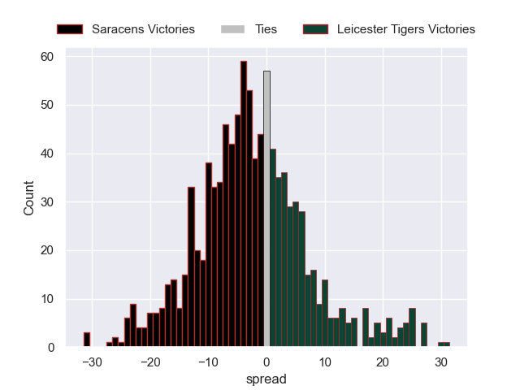

## Week 15

### Gloucester Rugby V Sale Sharks on 2026/05/09

Average Margin: Gloucester Rugby by 1.5

### Exeter Chiefs V Bath Rugby on 2026/05/09

Average Margin: Bath Rugby by 0.0

### Leicester Tigers V Northampton Saints on 2026/05/09

Average Margin: Leicester Tigers by 2.3

### Newcastle Falcons V Harlequins on 2026/05/09

Average Margin: Harlequins by 0.1

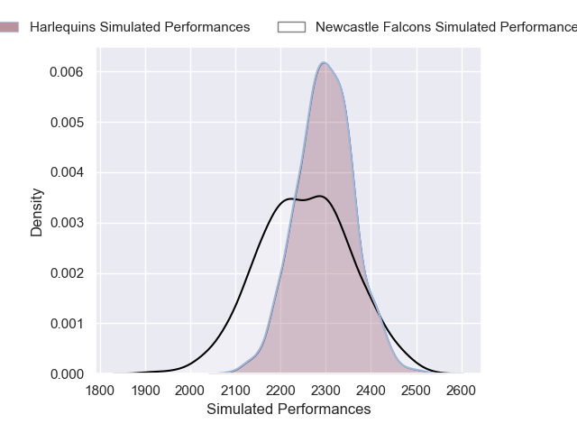

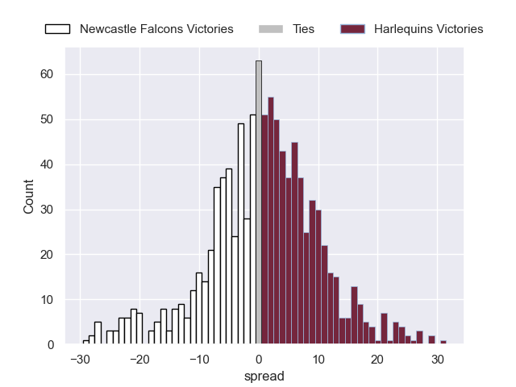

### Bristol Rugby V Saracens on 2026/05/09

Average Margin: Bristol Rugby by 2.0

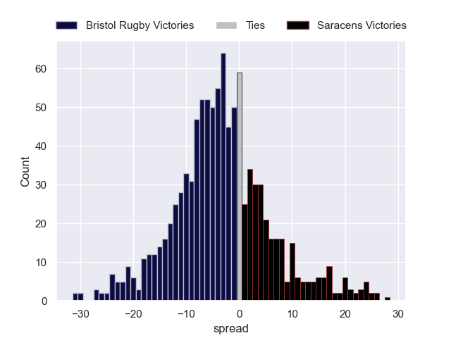

## Week 16

### Northampton Saints V Bristol Rugby on 2026/05/16

Average Margin: Northampton Saints by 3.5

### Harlequins V Exeter Chiefs on 2026/05/16

Average Margin: Harlequins by 0.2

### Bath Rugby V Newcastle Falcons on 2026/05/16

Average Margin: Bath Rugby by 9.4

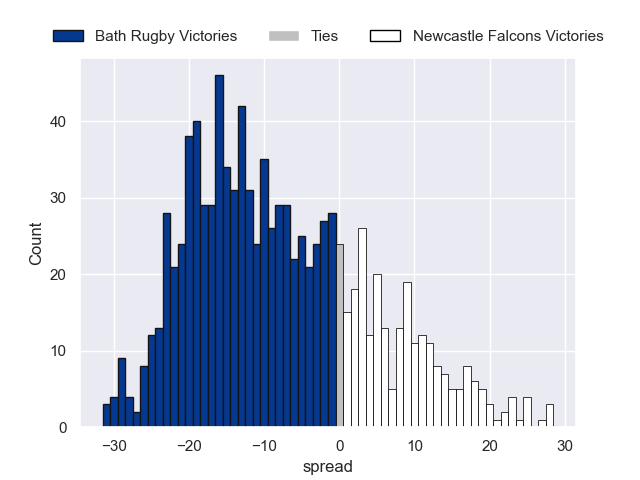

### Sale Sharks V Leicester Tigers on 2026/05/16

Average Margin: Sale Sharks by 2.3

### Saracens V Gloucester Rugby on 2026/05/16

Average Margin: Saracens by 5.5

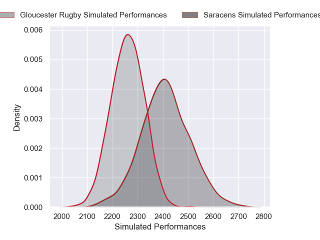

## Week 17

### Newcastle Falcons V Sale Sharks on 2026/05/30

Average Margin: Sale Sharks by 1.5

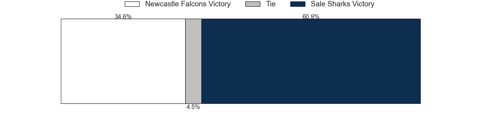

### Leicester Tigers V Exeter Chiefs on 2026/05/30

Average Margin: Leicester Tigers by 3.6

### Bristol Rugby V Bath Rugby on 2026/05/30

Average Margin: Bath Rugby by 0.2

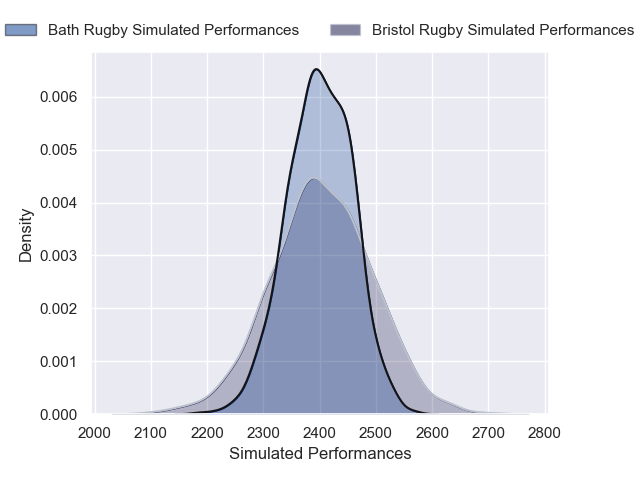

### Saracens V Harlequins on 2026/05/30

Average Margin: Saracens by 5.2

### Northampton Saints V Gloucester Rugby on 2026/05/30

Average Margin: Northampton Saints by 5.6

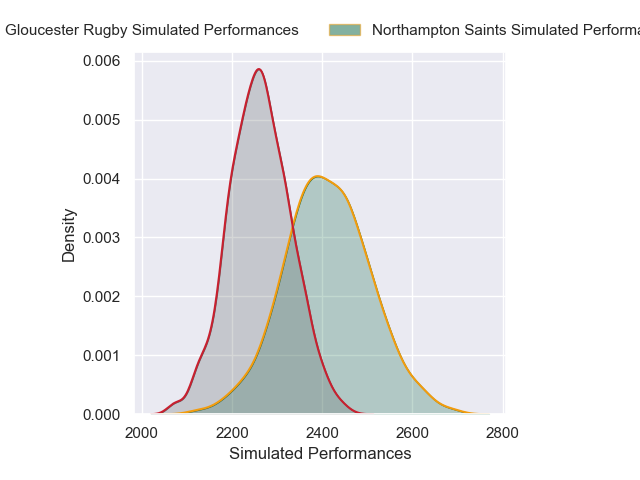

## Week 18

### Gloucester Rugby V Newcastle Falcons on 2026/06/06

Average Margin: Gloucester Rugby by 5.5

### Harlequins V Northampton Saints on 2026/06/06

Average Margin: Northampton Saints by 0.5

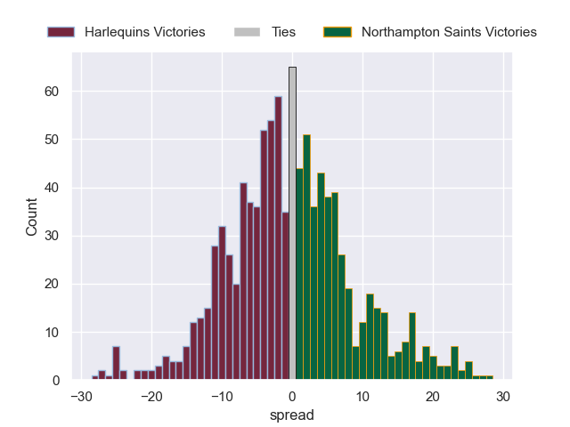

### Exeter Chiefs V Saracens on 2026/06/06

Average Margin: Exeter Chiefs by 2.7

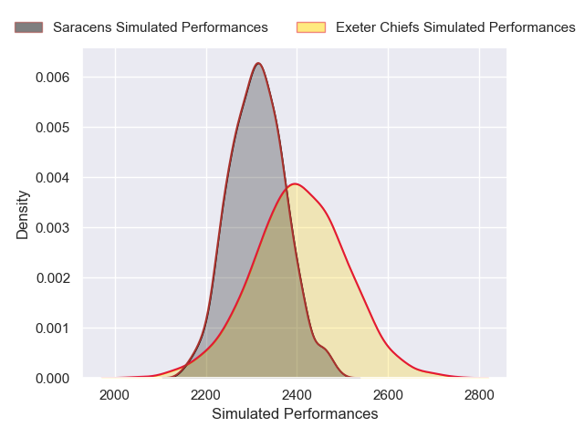

### Bath Rugby V Leicester Tigers on 2026/06/06

Average Margin: Bath Rugby by 4.3

### Sale Sharks V Bristol Rugby on 2026/06/06

Average Margin: Sale Sharks by 2.2

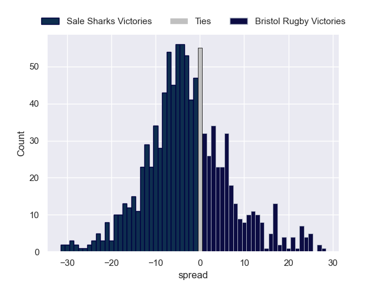

