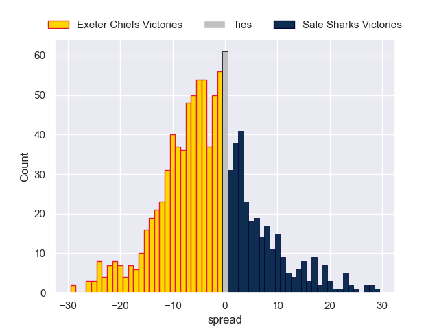
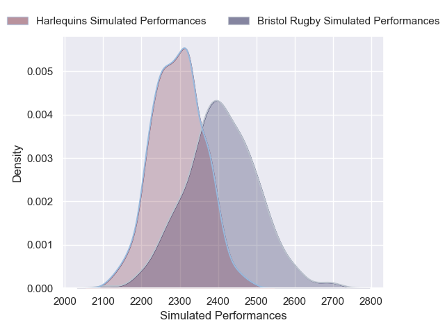
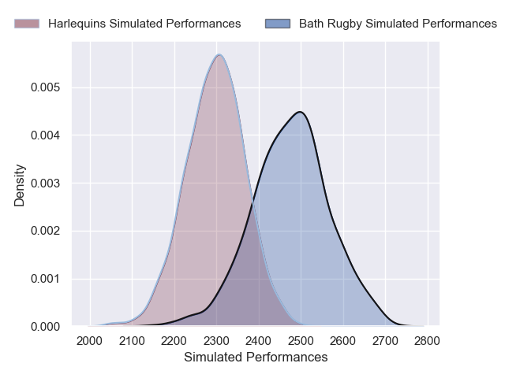
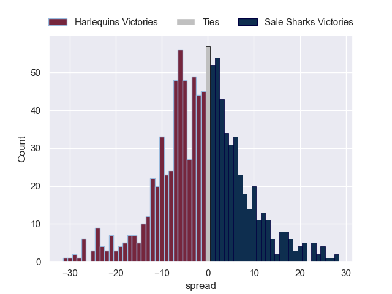
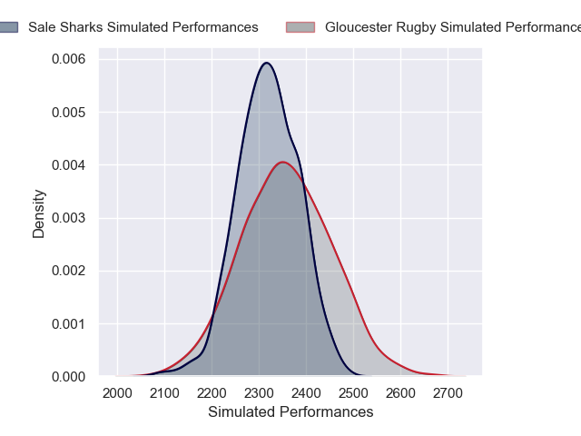
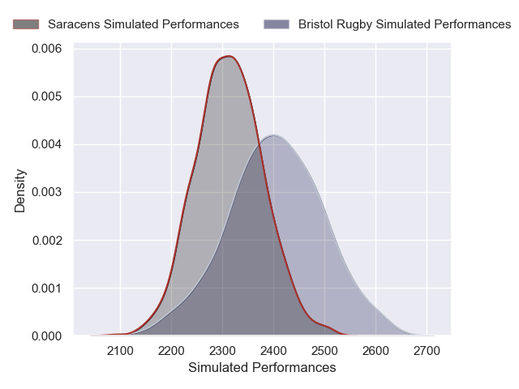
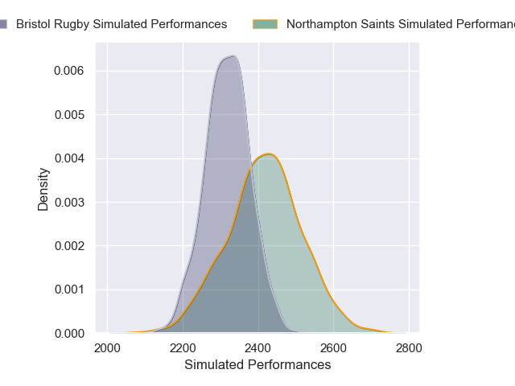
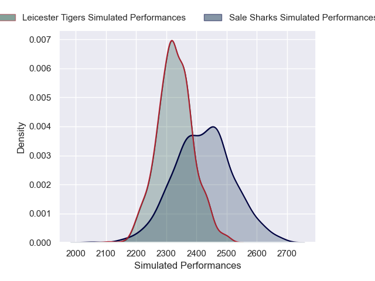
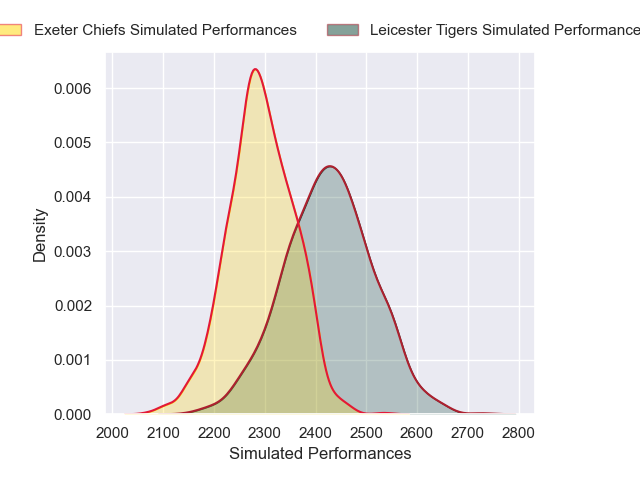
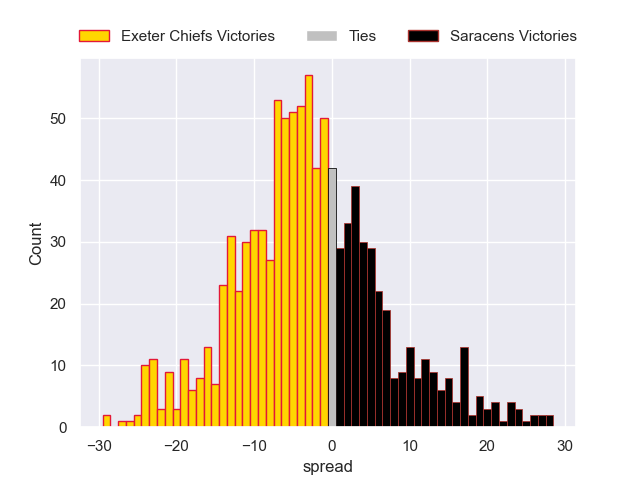

# Team Rankings

# Standings

## Current Standings

| Club                |   Played |   Wins |   Point Differential |   Losing Bonus Points |   Try Bonus Points |   Competition Points |
|:--------------------|---------:|-------:|---------------------:|----------------------:|-------------------:|---------------------:|
| Northampton Saints  |       10 |      8 |                  108 |                     0 |                  9 |                   43 |
| Bath Rugby          |       10 |      8 |                  106 |                     1 |                  8 |                   41 |
| Bristol Rugby       |       10 |      8 |                   55 |                     0 |                  5 |                   37 |
| Leicester Tigers    |       10 |      7 |                   63 |                     1 |                  7 |                   36 |
| Exeter Chiefs       |       10 |      6 |                   93 |                     3 |                  6 |                   35 |
| Saracens            |       10 |      5 |                  135 |                     3 |                  9 |                   32 |
| Sale Sharks         |       10 |      3 |                  -12 |                     3 |                  5 |                   20 |
| Gloucester Rugby    |       10 |      1 |                 -121 |                     3 |                  4 |                   11 |
| Harlequins          |       10 |      2 |                 -155 |                     0 |                  2 |                   10 |
| Newcastle Red Bulls |       10 |      1 |                 -272 |                     0 |                  1 |                    5 |

## Projected Remaining Table

| Club                |   To Play |   Projected Wins |   Projected Differential |   Projected Losing Bonus Points | Projected Try Bonus Points   |   Projected Competition Points |
|:--------------------|----------:|-----------------:|-------------------------:|--------------------------------:|:-----------------------------|-------------------------------:|
| Bath Rugby          |         8 |            4.683 |                   23.812 |                           1.639 |                              |                         21.209 |
| Exeter Chiefs       |         8 |            4.357 |                   12.748 |                           1.88  |                              |                         20.09  |
| Northampton Saints  |         8 |            4.216 |                   14.448 |                           1.915 |                              |                         19.543 |
| Saracens            |         8 |            4.024 |                    6.695 |                           1.897 |                              |                         18.733 |
| Bristol Rugby       |         8 |            3.95  |                    5.318 |                           1.971 |                              |                         18.593 |
| Leicester Tigers    |         8 |            3.864 |                    2.634 |                           2.003 |                              |                         18.221 |
| Sale Sharks         |         8 |            3.659 |                   -3.445 |                           2.18  |                              |                         17.614 |
| Gloucester Rugby    |         8 |            3.347 |                  -11.18  |                           2.029 |                              |                         16.187 |
| Harlequins          |         8 |            3.174 |                  -17.094 |                           2.042 |                              |                         15.446 |
| Newcastle Red Bulls |         8 |            2.823 |                  -33.936 |                           1.751 |                              |                         13.671 |

## Projected Total Table

| Club                |   Played |   Wins |   Point Differential |   Losing Bonus Points |   Try Bonus Points |   Competition Points |
|:--------------------|---------:|-------:|---------------------:|----------------------:|-------------------:|---------------------:|
| Northampton Saints  |       18 | 12.216 |              122.448 |                 1.915 |                  9 |               62.543 |
| Bath Rugby          |       18 | 12.683 |              129.812 |                 2.639 |                  8 |               62.209 |
| Bristol Rugby       |       18 | 11.95  |               60.318 |                 1.971 |                  5 |               55.593 |
| Exeter Chiefs       |       18 | 10.357 |              105.748 |                 4.88  |                  6 |               55.09  |
| Leicester Tigers    |       18 | 10.864 |               65.634 |                 3.003 |                  7 |               54.221 |
| Saracens            |       18 |  9.024 |              141.695 |                 4.897 |                  9 |               50.733 |
| Sale Sharks         |       18 |  6.659 |              -15.445 |                 5.18  |                  5 |               37.614 |
| Gloucester Rugby    |       18 |  4.347 |             -132.18  |                 5.029 |                  4 |               27.187 |
| Harlequins          |       18 |  5.174 |             -172.094 |                 2.042 |                  2 |               25.446 |
| Newcastle Red Bulls |       18 |  3.823 |             -305.936 |                 1.751 |                  1 |               18.671 |

# Completed Match Review

| Model | Percent Correct Predictions | Spread Error |
| ------ | ------ | ------ |
| Club Level | 78.9% | 11.4 |
| Player Level: Lineup | nan% | nan |
| Player Level: Minutes | nan% | nan |

# Future Predictions

## Week 11

### Exeter Chiefs V Sale Sharks on 2026/03/21

Average Margin: Exeter Chiefs by 5.3

### Northampton Saints V Newcastle Red Bulls on 2026/03/21

Average Margin: Northampton Saints by 9.5

### Bath Rugby V Saracens on 2026/03/21

Average Margin: Bath Rugby by 4.1

### Leicester Tigers V Bristol Rugby on 2026/03/21

Average Margin: Leicester Tigers by 2.1

### Harlequins V Gloucester Rugby on 2026/03/21

Average Margin: Harlequins by 1.7

## Week 12

### Saracens V Northampton Saints on 2026/03/28

Average Margin: Saracens by 2.1

### Newcastle Red Bulls V Exeter Chiefs on 2026/03/28

Average Margin: Exeter Chiefs by 3.3

### Gloucester Rugby V Leicester Tigers on 2026/03/28

Average Margin: Gloucester Rugby by 0.6

### Sale Sharks V Bath Rugby on 2026/03/28

Average Margin: Bath Rugby by 1.1

### Bristol Rugby V Harlequins on 2026/03/28

Average Margin: Bristol Rugby by 4.5

## Week 13

### Bristol Rugby V Gloucester Rugby on 2026/04/18

Average Margin: Bristol Rugby by 4.7

### Exeter Chiefs V Northampton Saints on 2026/04/18

Average Margin: Exeter Chiefs by 2.0

### Sale Sharks V Saracens on 2026/04/18

Average Margin: Sale Sharks by 1.6

### Leicester Tigers V Newcastle Red Bulls on 2026/04/18

Average Margin: Leicester Tigers by 7.6

### Bath Rugby V Harlequins on 2026/04/18

Average Margin: Bath Rugby by 6.4

## Week 14

### Harlequins V Sale Sharks on 2026/04/25

Average Margin: Harlequins by 0.9

### Newcastle Red Bulls V Bristol Rugby on 2026/04/25

Average Margin: Bristol Rugby by 1.6

### Gloucester Rugby V Exeter Chiefs on 2026/04/25

Average Margin: Exeter Chiefs by 0.1

### Northampton Saints V Bath Rugby on 2026/04/25

Average Margin: Northampton Saints by 0.9

### Saracens V Leicester Tigers on 2026/04/25

Average Margin: Saracens by 3.8

## Week 15

### Exeter Chiefs V Bath Rugby on 2026/05/09

Average Margin: Exeter Chiefs by 1.1

### Leicester Tigers V Northampton Saints on 2026/05/09

Average Margin: Leicester Tigers by 1.7

### Newcastle Red Bulls V Harlequins on 2026/05/09

Average Margin: Newcastle Red Bulls by 1.8

### Gloucester Rugby V Sale Sharks on 2026/05/09

Average Margin: Gloucester Rugby by 1.6

### Bristol Rugby V Saracens on 2026/05/09

Average Margin: Bristol Rugby by 1.7

## Week 16

### Bath Rugby V Newcastle Red Bulls on 2026/05/16

Average Margin: Bath Rugby by 9.4

### Northampton Saints V Bristol Rugby on 2026/05/16

Average Margin: Northampton Saints by 3.3

### Saracens V Gloucester Rugby on 2026/05/16

Average Margin: Saracens by 5.7

### Sale Sharks V Leicester Tigers on 2026/05/16

Average Margin: Sale Sharks by 2.1

### Harlequins V Exeter Chiefs on 2026/05/16

Average Margin: Exeter Chiefs by 0.2

## Week 17

### Newcastle Red Bulls V Sale Sharks on 2026/05/30

Average Margin: Newcastle Red Bulls by 0.1

### Saracens V Harlequins on 2026/05/30

Average Margin: Saracens by 5.9

### Leicester Tigers V Exeter Chiefs on 2026/05/30

Average Margin: Leicester Tigers by 2.5

### Northampton Saints V Gloucester Rugby on 2026/05/30

Average Margin: Northampton Saints by 5.5

### Bristol Rugby V Bath Rugby on 2026/05/30

Average Margin: Bristol Rugby by 0.1

## Week 18

### Harlequins V Northampton Saints on 2026/06/06

Average Margin: Northampton Saints by 1.0

### Sale Sharks V Bristol Rugby on 2026/06/06

Average Margin: Sale Sharks by 1.8

### Exeter Chiefs V Saracens on 2026/06/06

Average Margin: Exeter Chiefs by 3.3

### Gloucester Rugby V Newcastle Red Bulls on 2026/06/06

Average Margin: Gloucester Rugby by 4.4

### Bath Rugby V Leicester Tigers on 2026/06/06

Average Margin: Bath Rugby by 4.8

