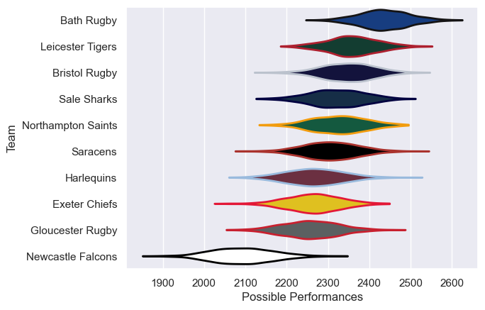

---  
title: "Gallagher Premiership 25/26"  
date: 2025-10-20 6:00:00 -0500  
categories: model review projection  
layout: article  
aside:  
    toc: true  
---
# Team Rankings

# Standings

## Current Standings

| Club               |   Played |   Wins |   Point Differential |   Losing Bonus Points |   Try Bonus Points |   Competition Points |
|:-------------------|---------:|-------:|---------------------:|----------------------:|-------------------:|---------------------:|
| Northampton Saints |        4 |      3 |                   25 |                     0 |                  4 |                   18 |
| Saracens           |        4 |      3 |                  100 |                     1 |                  3 |                   16 |
| Bath Rugby         |        4 |      3 |                   47 |                     1 |                  3 |                   16 |
| Exeter Chiefs      |        4 |      2 |                   57 |                     1 |                  3 |                   14 |
| Bristol Rugby      |        4 |      3 |                    4 |                     0 |                  2 |                   14 |
| Leicester Tigers   |        4 |      2 |                  -12 |                     1 |                  2 |                   11 |
| Sale Sharks        |        4 |      2 |                    6 |                     0 |                  2 |                   10 |
| Harlequins         |        4 |      1 |                  -58 |                     0 |                  1 |                    5 |
| Gloucester Rugby   |        4 |      0 |                  -55 |                     1 |                  2 |                    3 |
| Newcastle Falcons  |        4 |      0 |                 -114 |                     0 |                    |                    0 |

## Projected Remaining Table

| Club               |   To Play |   Projected Wins |   Projected Differential |   Projected Losing Bonus Points | Projected Try Bonus Points   |   Projected Competition Points |
|:-------------------|----------:|-----------------:|-------------------------:|--------------------------------:|:-----------------------------|-------------------------------:|
| Bath Rugby         |        14 |            8.578 |                   44.187 |                           2.834 |                              |                         38.566 |
| Leicester Tigers   |        14 |            7.756 |                   24.103 |                           3.16  |                              |                         35.598 |
| Bristol Rugby      |        14 |            7.124 |                   12.125 |                           3.461 |                              |                         33.437 |
| Sale Sharks        |        14 |            7.037 |                    6.56  |                           3.615 |                              |                         33.293 |
| Northampton Saints |        14 |            6.778 |                    6.839 |                           3.675 |                              |                         32.219 |
| Saracens           |        14 |            6.779 |                    5.436 |                           3.567 |                              |                         32.183 |
| Exeter Chiefs      |        14 |            6.313 |                   -7.321 |                           3.678 |                              |                         30.472 |
| Gloucester Rugby   |        14 |            6.019 |                  -13.009 |                           3.802 |                              |                         29.32  |
| Harlequins         |        14 |            5.964 |                  -12.183 |                           3.916 |                              |                         29.142 |
| Newcastle Falcons  |        14 |            4.083 |                  -66.737 |                           3.598 |                              |                         21.076 |

## Projected Total Table

| Club               |   Played |   Wins |   Point Differential |   Losing Bonus Points |   Try Bonus Points |   Competition Points |
|:-------------------|---------:|-------:|---------------------:|----------------------:|-------------------:|---------------------:|
| Bath Rugby         |       18 | 11.578 |               91.187 |                 3.834 |                  3 |               54.566 |
| Northampton Saints |       18 |  9.778 |               31.839 |                 3.675 |                  4 |               50.219 |
| Saracens           |       18 |  9.779 |              105.436 |                 4.567 |                  3 |               48.183 |
| Bristol Rugby      |       18 | 10.124 |               16.125 |                 3.461 |                  2 |               47.437 |
| Leicester Tigers   |       18 |  9.756 |               12.103 |                 4.16  |                  2 |               46.598 |
| Exeter Chiefs      |       18 |  8.313 |               49.679 |                 4.678 |                  3 |               44.472 |
| Sale Sharks        |       18 |  9.037 |               12.56  |                 3.615 |                  2 |               43.293 |
| Harlequins         |       18 |  6.964 |              -70.183 |                 3.916 |                  1 |               34.142 |
| Gloucester Rugby   |       18 |  6.019 |              -68.009 |                 4.802 |                  2 |               32.32  |
| Newcastle Falcons  |       18 |  4.083 |             -180.737 |                 3.598 |                    |               21.076 |

# Completed Match Review

| Model | Percent Correct Predictions | Spread Error |
| ------ | ------ | ------ |
| Club Level | 63.3% | 9.0 |
| Player Level: Lineup | nan% | nan |
| Player Level: Minutes | nan% | nan |

# Future Predictions

## Week 5

### Northampton Saints V Saracens on 2025/10/24

Average Margin: Northampton Saints by 2.5

### Harlequins V Newcastle Falcons on 2025/10/25

Average Margin: Harlequins by 6.4

### Leicester Tigers V Sale Sharks on 2025/10/25

Average Margin: Leicester Tigers by 4.3

### Bath Rugby V Bristol Bears on 2025/10/25

Average Margin: Bath Rugby by 5.1

### Exeter Chiefs V Gloucester Rugby on 2025/10/25

Average Margin: Exeter Chiefs by 4.8

## Week 6

### Sale Sharks V Exeter Chiefs on 2025/11/28

Average Margin: Sale Sharks by 4.2

### Newcastle Falcons V Leicester Tigers on 2025/11/28

Average Margin: Leicester Tigers by 5.3

### Bristol Rugby V Northampton Saints on 2025/11/29

Average Margin: Bristol Rugby by 2.8

### Gloucester Rugby V Harlequins on 2025/11/29

Average Margin: Gloucester Rugby by 2.6

### Saracens V Bath Rugby on 2025/11/30

Average Margin: Bath Rugby by 0.1

## Week 7

### Leicester Tigers V Gloucester Rugby on 2025/12/19

Average Margin: Leicester Tigers by 5.2

### Saracens V Exeter Chiefs on 2025/12/20

Average Margin: Saracens by 3.8

### Harlequins V Bristol Rugby on 2025/12/20

Average Margin: Bristol Rugby by 0.5

### Northampton Saints V Sale Sharks on 2025/12/20

Average Margin: Northampton Saints by 3.3

### Newcastle Falcons V Bath Rugby on 2025/12/21

Average Margin: Bath Rugby by 5.7

## Week 8

### Sale Sharks V Harlequins on 2025/12/26

Average Margin: Sale Sharks by 4.5

### Bath Rugby V Northampton Saints on 2025/12/27

Average Margin: Bath Rugby by 4.8

### Bristol Rugby V Newcastle Falcons on 2025/12/27

Average Margin: Bristol Rugby by 8.4

### Gloucester Rugby V Saracens on 2025/12/27

Average Margin: Gloucester Rugby by 0.1

### Exeter Chiefs V Leicester Tigers on 2025/12/28

Average Margin: Exeter Chiefs by 1.5

## Week 9

### Bristol Rugby V Sale Sharks on 2026/01/02

Average Margin: Bristol Rugby by 3.0

### Newcastle Falcons V Gloucester Rugby on 2026/01/02

Average Margin: Gloucester Rugby by 0.3

### Bath Rugby V Exeter Chiefs on 2026/01/03

Average Margin: Bath Rugby by 6.3

### Northampton Saints V Harlequins on 2026/01/03

Average Margin: Northampton Saints by 4.4

### Leicester Tigers V Saracens on 2026/01/04

Average Margin: Leicester Tigers by 3.2

## Week 10

### Saracens V Newcastle Falcons on 2026/01/24

Average Margin: Saracens by 7.7

### Harlequins V Leicester Tigers on 2026/01/24

Average Margin: Leicester Tigers by 0.2

### Gloucester Rugby V Bath Rugby on 2026/01/24

Average Margin: Bath Rugby by 1.4

### Exeter Chiefs V Bristol Rugby on 2026/01/24

Average Margin: Exeter Chiefs by 1.6

### Sale Sharks V Northampton Saints on 2026/01/24

Average Margin: Sale Sharks by 2.4

## Week 11

### Leicester Tigers V Bristol Rugby on 2026/03/21

Average Margin: Leicester Tigers by 2.8

### Bath Rugby V Saracens on 2026/03/21

Average Margin: Bath Rugby by 4.9

### Northampton Saints V Newcastle Falcons on 2026/03/21

Average Margin: Northampton Saints by 7.2

### Exeter Chiefs V Sale Sharks on 2026/03/21

Average Margin: Exeter Chiefs by 2.4

### Harlequins V Gloucester Rugby on 2026/03/21

Average Margin: Harlequins by 2.4

## Week 12

### Bristol Rugby V Harlequins on 2026/03/28

Average Margin: Bristol Rugby by 3.9

### Sale Sharks V Bath Rugby on 2026/03/28

Average Margin: Sale Sharks by 0.9

### Saracens V Northampton Saints on 2026/03/28

Average Margin: Saracens by 2.3

### Gloucester Rugby V Leicester Tigers on 2026/03/28

Average Margin: Gloucester Rugby by 0.7

### Newcastle Falcons V Exeter Chiefs on 2026/03/28

Average Margin: Exeter Chiefs by 1.0

## Week 13

### Exeter Chiefs V Northampton Saints on 2026/04/18

Average Margin: Exeter Chiefs by 1.6

### Bristol Rugby V Gloucester Rugby on 2026/04/18

Average Margin: Bristol Rugby by 3.7

### Sale Sharks V Saracens on 2026/04/18

Average Margin: Sale Sharks by 2.9

### Bath Rugby V Harlequins on 2026/04/18

Average Margin: Bath Rugby by 6.1

### Leicester Tigers V Newcastle Falcons on 2026/04/18

Average Margin: Leicester Tigers by 7.3

## Week 14

### Harlequins V Sale Sharks on 2026/04/25

Average Margin: Harlequins by 1.1

### Saracens V Leicester Tigers on 2026/04/25

Average Margin: Saracens by 2.3

### Gloucester Rugby V Exeter Chiefs on 2026/04/25

Average Margin: Gloucester Rugby by 2.3

### Newcastle Falcons V Bristol Rugby on 2026/04/25

Average Margin: Bristol Rugby by 1.6

### Northampton Saints V Bath Rugby on 2026/04/25

Average Margin: Northampton Saints by 0.4

## Week 15

### Gloucester Rugby V Sale Sharks on 2026/05/09

Average Margin: Gloucester Rugby by 1.3

### Leicester Tigers V Northampton Saints on 2026/05/09

Average Margin: Leicester Tigers by 2.8

### Bristol Rugby V Saracens on 2026/05/09

Average Margin: Bristol Rugby by 2.7

### Newcastle Falcons V Harlequins on 2026/05/09

Average Margin: Harlequins by 0.6

### Exeter Chiefs V Bath Rugby on 2026/05/09

Average Margin: Exeter Chiefs by 0.3

## Week 16

### Northampton Saints V Bristol Rugby on 2026/05/16

Average Margin: Northampton Saints by 2.6

### Harlequins V Exeter Chiefs on 2026/05/16

Average Margin: Harlequins by 2.3

### Bath Rugby V Newcastle Falcons on 2026/05/16

Average Margin: Bath Rugby by 8.1

### Saracens V Gloucester Rugby on 2026/05/16

Average Margin: Saracens by 4.1

### Sale Sharks V Leicester Tigers on 2026/05/16

Average Margin: Sale Sharks by 2.8

## Week 17

### Saracens V Harlequins on 2026/05/30

Average Margin: Saracens by 3.7

### Northampton Saints V Gloucester Rugby on 2026/05/30

Average Margin: Northampton Saints by 4.0

### Leicester Tigers V Exeter Chiefs on 2026/05/30

Average Margin: Leicester Tigers by 3.8

### Bristol Rugby V Bath Rugby on 2026/05/30

Average Margin: Bristol Rugby by 0.4

### Newcastle Falcons V Sale Sharks on 2026/05/30

Average Margin: Sale Sharks by 1.6

## Week 18

### Bath Rugby V Leicester Tigers on 2026/06/06

Average Margin: Bath Rugby by 3.7

### Exeter Chiefs V Saracens on 2026/06/06

Average Margin: Exeter Chiefs by 2.0

### Gloucester Rugby V Newcastle Falcons on 2026/06/06

Average Margin: Gloucester Rugby by 5.4

### Harlequins V Northampton Saints on 2026/06/06

Average Margin: Harlequins by 0.8

### Sale Sharks V Bristol Rugby on 2026/06/06

Average Margin: Sale Sharks by 2.7

