# Team Rankings

# Standings

## Current Standings

| Club               |   Played |   Wins |   Point Differential |   Losing Bonus Points |   Try Bonus Points |   Competition Points |
|:-------------------|---------:|-------:|---------------------:|----------------------:|-------------------:|---------------------:|
| Northampton Saints |        9 |      7 |                   94 |                     0 |                  8 |                   38 |
| Bath Rugby         |        9 |      7 |                  102 |                     1 |                  7 |                   36 |
| Exeter Chiefs      |        9 |      6 |                   98 |                     2 |                  6 |                   34 |
| Bristol Rugby      |        9 |      7 |                   50 |                     0 |                  5 |                   33 |
| Leicester Tigers   |        9 |      6 |                   36 |                     1 |                  6 |                   31 |
| Saracens           |        9 |      4 |                   76 |                     3 |                  8 |                   27 |
| Sale Sharks        |        9 |      3 |                    2 |                     3 |                  4 |                   19 |
| Harlequins         |        9 |      2 |                 -128 |                     0 |                  2 |                   10 |
| Gloucester Rugby   |        9 |      1 |                 -117 |                     2 |                  3 |                    9 |
| Newcastle Falcons  |        9 |      1 |                 -213 |                     0 |                  1 |                    5 |

## Projected Remaining Table

| Club               |   To Play |   Projected Wins |   Projected Differential |   Projected Losing Bonus Points | Projected Try Bonus Points   |   Projected Competition Points |
|:-------------------|----------:|-----------------:|-------------------------:|--------------------------------:|:-----------------------------|-------------------------------:|
| Bath Rugby         |         9 |            5.314 |                   25.657 |                           1.95  |                              |                         24.148 |
| Exeter Chiefs      |         9 |            4.783 |                    9.25  |                           2.237 |                              |                         22.501 |
| Sale Sharks        |         9 |            4.694 |                    7.392 |                           2.336 |                              |                         22.13  |
| Northampton Saints |         9 |            4.533 |                    9.515 |                           2.437 |                              |                         21.527 |
| Saracens           |         9 |            4.625 |                   10.103 |                           2.117 |                              |                         21.475 |
| Leicester Tigers   |         9 |            4.509 |                    5.491 |                           2.284 |                              |                         21.256 |
| Bristol Rugby      |         9 |            4.436 |                    5.779 |                           2.351 |                              |                         21.107 |
| Gloucester Rugby   |         9 |            3.69  |                  -11.699 |                           2.47  |                              |                         18.108 |
| Harlequins         |         9 |            3.364 |                  -19.471 |                           2.596 |                              |                         16.966 |
| Newcastle Falcons  |         9 |            2.685 |                  -42.017 |                           2.253 |                              |                         13.813 |

## Projected Total Table

| Club               |   Played |   Wins |   Point Differential |   Losing Bonus Points |   Try Bonus Points |   Competition Points |
|:-------------------|---------:|-------:|---------------------:|----------------------:|-------------------:|---------------------:|
| Bath Rugby         |       18 | 12.314 |              127.657 |                 2.95  |                  7 |               60.148 |
| Northampton Saints |       18 | 11.533 |              103.515 |                 2.437 |                  8 |               59.527 |
| Exeter Chiefs      |       18 | 10.783 |              107.25  |                 4.237 |                  6 |               56.501 |
| Bristol Rugby      |       18 | 11.436 |               55.779 |                 2.351 |                  5 |               54.107 |
| Leicester Tigers   |       18 | 10.509 |               41.491 |                 3.284 |                  6 |               52.256 |
| Saracens           |       18 |  8.625 |               86.103 |                 5.117 |                  8 |               48.475 |
| Sale Sharks        |       18 |  7.694 |                9.392 |                 5.336 |                  4 |               41.13  |
| Gloucester Rugby   |       18 |  4.69  |             -128.699 |                 4.47  |                  3 |               27.108 |
| Harlequins         |       18 |  5.364 |             -147.471 |                 2.596 |                  2 |               26.966 |
| Newcastle Falcons  |       18 |  3.685 |             -255.017 |                 2.253 |                  1 |               18.813 |

# Completed Match Review

| Model | Percent Correct Predictions | Spread Error |
| ------ | ------ | ------ |
| Club Level | 73.3% | 10.8 |
| Player Level: Lineup | nan% | nan |
| Player Level: Minutes | nan% | nan |

# Future Predictions

## Week 10

### Saracens V Newcastle Falcons on 2026/01/24

Average Margin: Saracens by 8.4

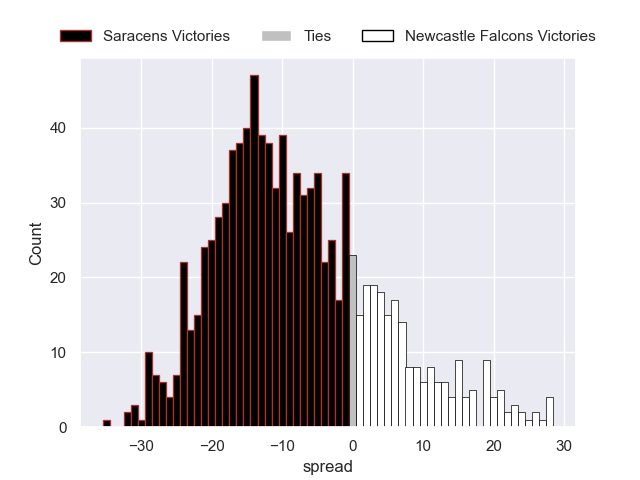

### Sale Sharks V Northampton Saints on 2026/01/24

Average Margin: Sale Sharks by 1.9

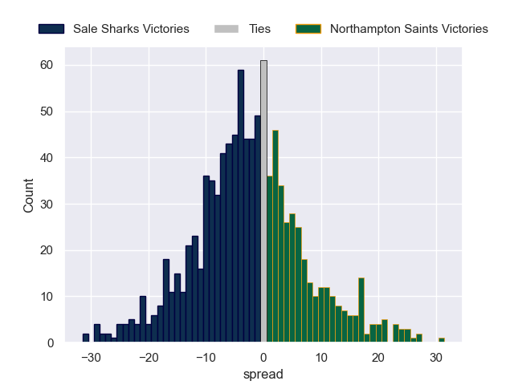

### Exeter Chiefs V Bristol Rugby on 2026/01/24

Average Margin: Exeter Chiefs by 2.7

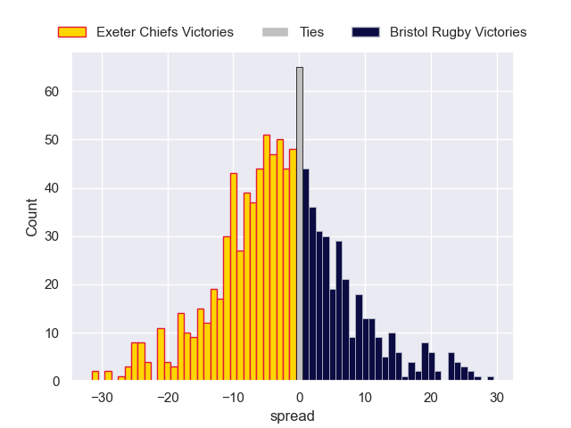

### Harlequins V Leicester Tigers on 2026/01/24

Average Margin: Leicester Tigers by 1.4

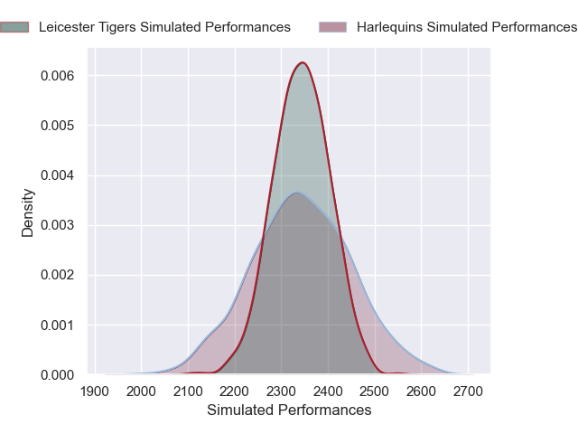

### Gloucester Rugby V Bath Rugby on 2026/01/24

Average Margin: Bath Rugby by 2.9

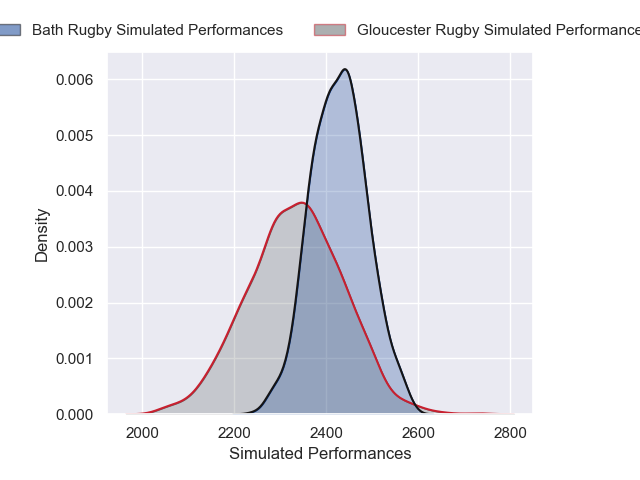
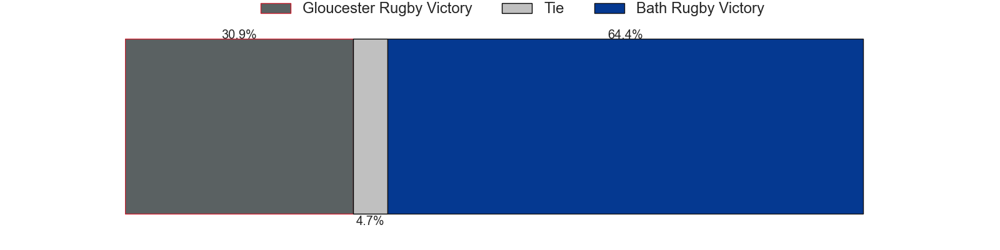
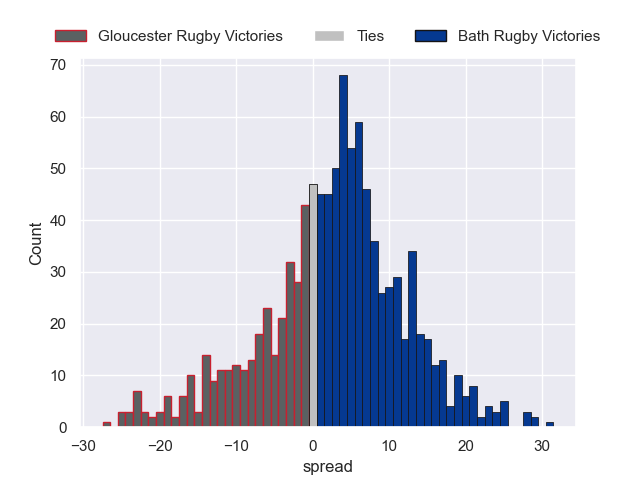

## Week 11

### Harlequins V Gloucester Rugby on 2026/03/21

Average Margin: Harlequins by 1.5

### Leicester Tigers V Bristol Rugby on 2026/03/21

Average Margin: Leicester Tigers by 2.4

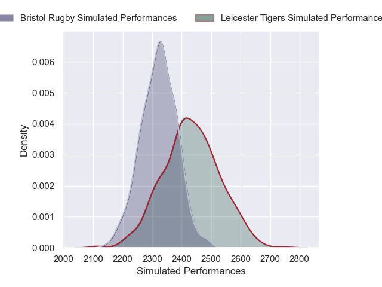

### Northampton Saints V Newcastle Falcons on 2026/03/21

Average Margin: Northampton Saints by 7.7

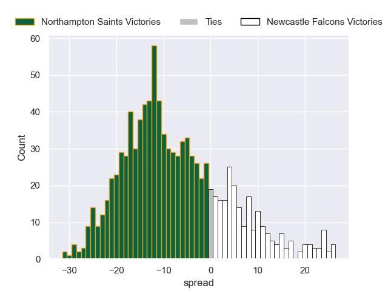

### Exeter Chiefs V Sale Sharks on 2026/03/21

Average Margin: Exeter Chiefs by 3.0

### Bath Rugby V Saracens on 2026/03/21

Average Margin: Bath Rugby by 5.1

## Week 12

### Sale Sharks V Bath Rugby on 2026/03/28

Average Margin: Bath Rugby by 0.2

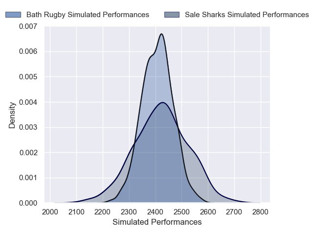

### Bristol Rugby V Harlequins on 2026/03/28

Average Margin: Bristol Rugby by 5.6

### Saracens V Northampton Saints on 2026/03/28

Average Margin: Saracens by 2.0

### Newcastle Falcons V Exeter Chiefs on 2026/03/28

Average Margin: Exeter Chiefs by 1.8

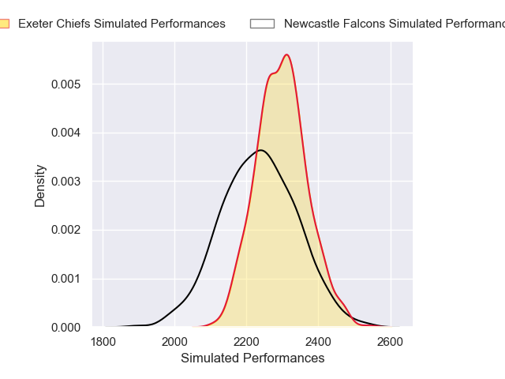

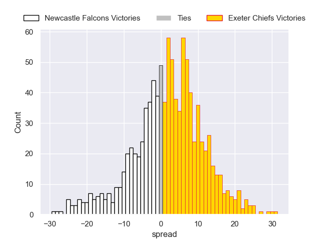

### Gloucester Rugby V Leicester Tigers on 2026/03/28

Average Margin: Gloucester Rugby by 0.5

## Week 13

### Bristol Rugby V Gloucester Rugby on 2026/04/18

Average Margin: Bristol Rugby by 5.1

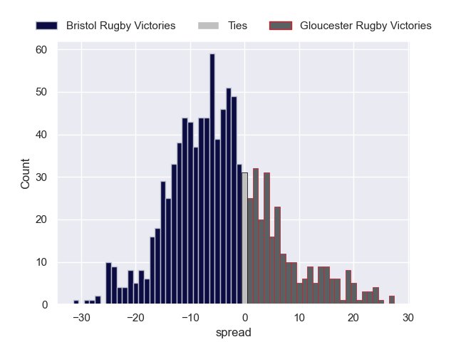

### Exeter Chiefs V Northampton Saints on 2026/04/18

Average Margin: Exeter Chiefs by 2.4

### Sale Sharks V Saracens on 2026/04/18

Average Margin: Sale Sharks by 3.2

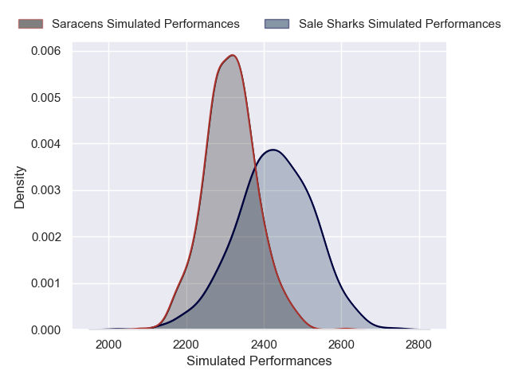

### Bath Rugby V Harlequins on 2026/04/18

Average Margin: Bath Rugby by 6.8

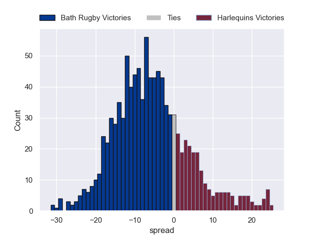

### Leicester Tigers V Newcastle Falcons on 2026/04/18

Average Margin: Leicester Tigers by 6.9

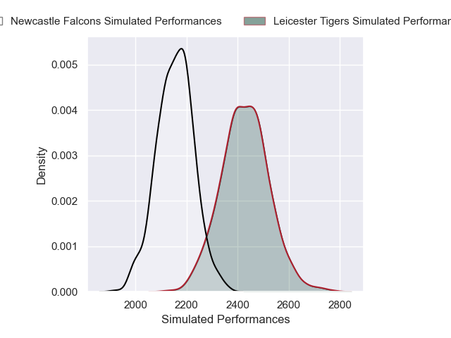

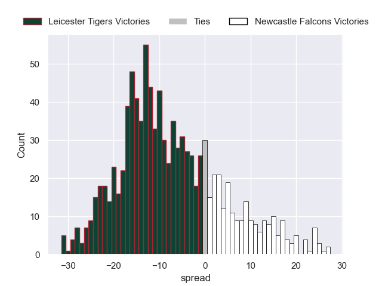

## Week 14

### Newcastle Falcons V Bristol Rugby on 2026/04/25

Average Margin: Bristol Rugby by 2.6

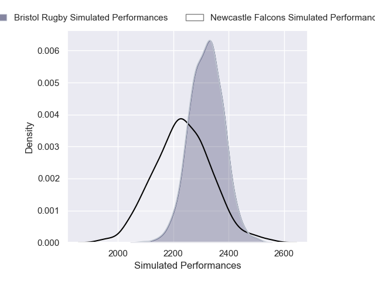
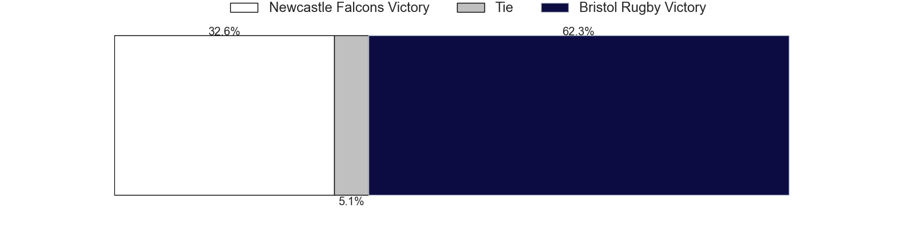
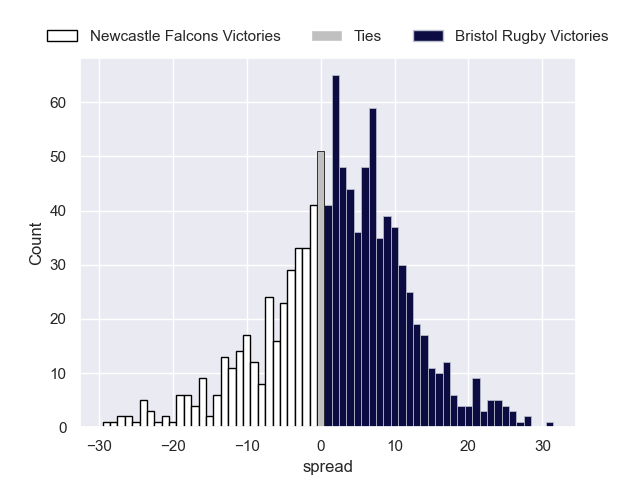

### Gloucester Rugby V Exeter Chiefs on 2026/04/25

Average Margin: Gloucester Rugby by 0.7

### Northampton Saints V Bath Rugby on 2026/04/25

Average Margin: Northampton Saints by 1.0

### Harlequins V Sale Sharks on 2026/04/25

Average Margin: Sale Sharks by 0.4

### Saracens V Leicester Tigers on 2026/04/25

Average Margin: Saracens by 2.9

## Week 15

### Exeter Chiefs V Bath Rugby on 2026/05/09

Average Margin: Exeter Chiefs by 0.6

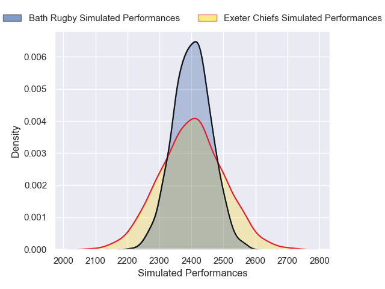

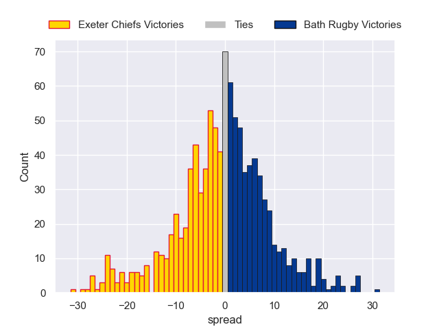

### Gloucester Rugby V Sale Sharks on 2026/05/09

Average Margin: Gloucester Rugby by 1.6

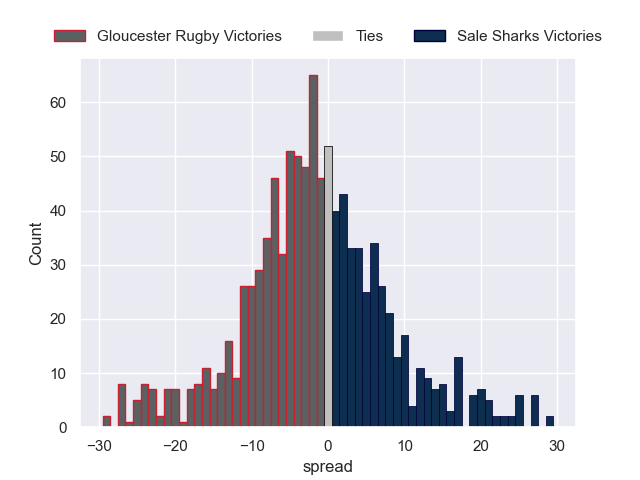

### Leicester Tigers V Northampton Saints on 2026/05/09

Average Margin: Leicester Tigers by 2.2

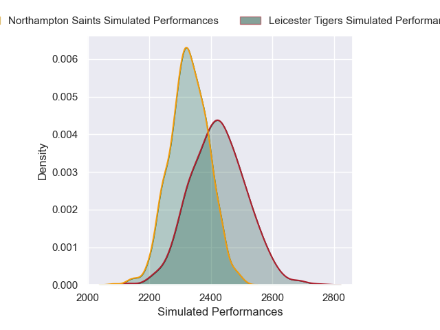

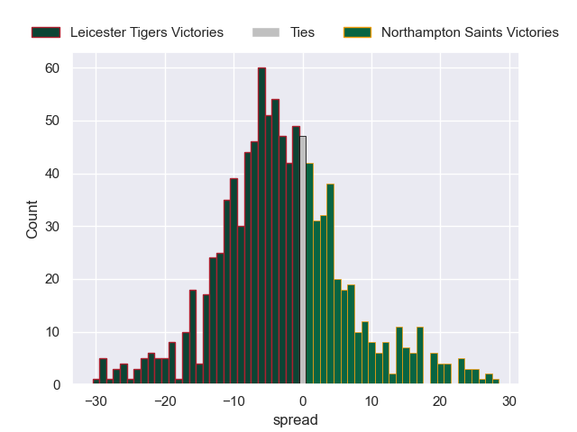

### Newcastle Falcons V Harlequins on 2026/05/09

Average Margin: Newcastle Falcons by 0.7

### Bristol Rugby V Saracens on 2026/05/09

Average Margin: Bristol Rugby by 2.1

## Week 16

### Harlequins V Exeter Chiefs on 2026/05/16

Average Margin: Exeter Chiefs by 0.1

### Sale Sharks V Leicester Tigers on 2026/05/16

Average Margin: Sale Sharks by 2.8

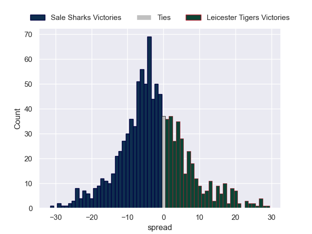

### Bath Rugby V Newcastle Falcons on 2026/05/16

Average Margin: Bath Rugby by 8.5

### Saracens V Gloucester Rugby on 2026/05/16

Average Margin: Saracens by 5.2

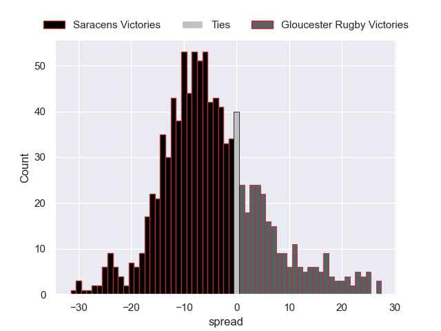

### Northampton Saints V Bristol Rugby on 2026/05/16

Average Margin: Northampton Saints by 2.7

## Week 17

### Northampton Saints V Gloucester Rugby on 2026/05/30

Average Margin: Northampton Saints by 5.3

### Newcastle Falcons V Sale Sharks on 2026/05/30

Average Margin: Sale Sharks by 1.1

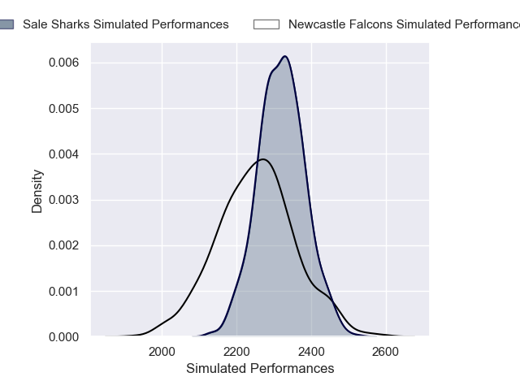

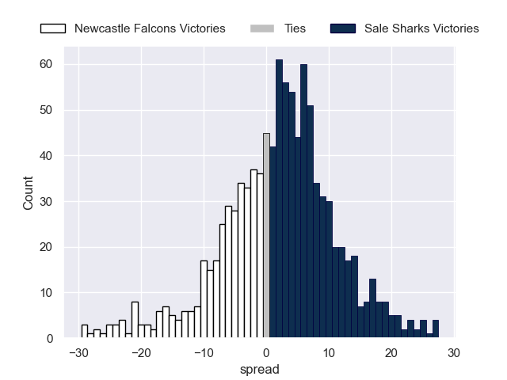

### Leicester Tigers V Exeter Chiefs on 2026/05/30

Average Margin: Leicester Tigers by 3.3

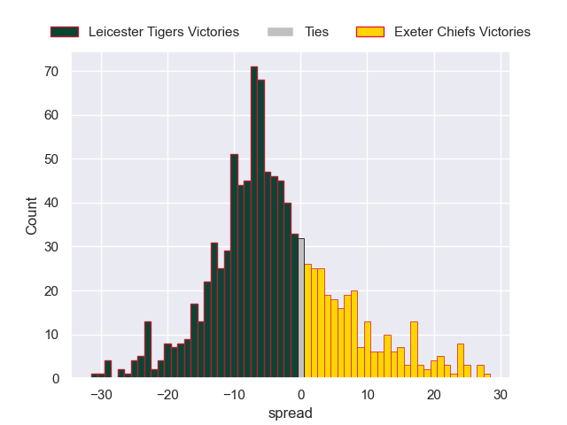

### Bristol Rugby V Bath Rugby on 2026/05/30

Average Margin: Bristol Rugby by 0.9

### Saracens V Harlequins on 2026/05/30

Average Margin: Saracens by 4.8

## Week 18

### Exeter Chiefs V Saracens on 2026/06/06

Average Margin: Exeter Chiefs by 2.8

### Harlequins V Northampton Saints on 2026/06/06

Average Margin: Northampton Saints by 1.2

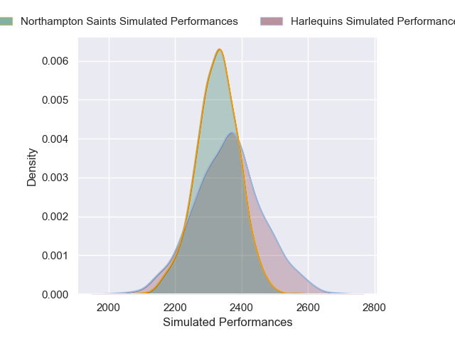

### Gloucester Rugby V Newcastle Falcons on 2026/06/06

Average Margin: Gloucester Rugby by 5.6

### Bath Rugby V Leicester Tigers on 2026/06/06

Average Margin: Bath Rugby by 4.5

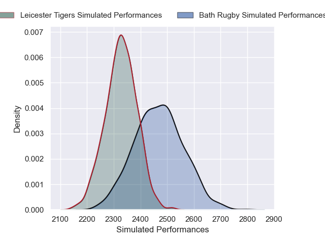

### Sale Sharks V Bristol Rugby on 2026/06/06

Average Margin: Sale Sharks by 2.8

