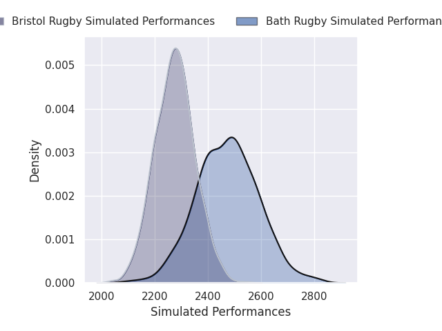
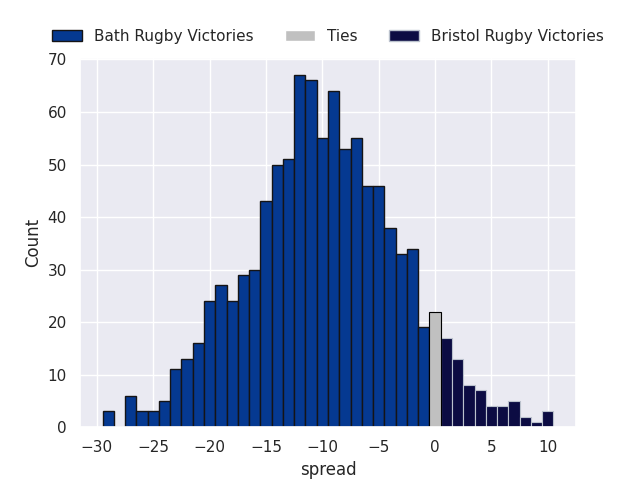
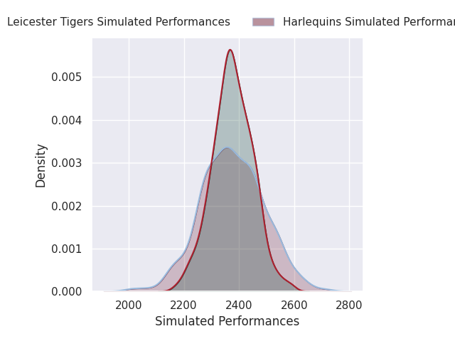
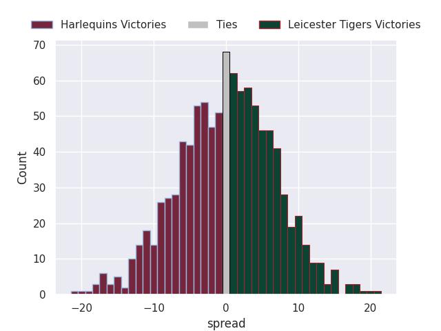
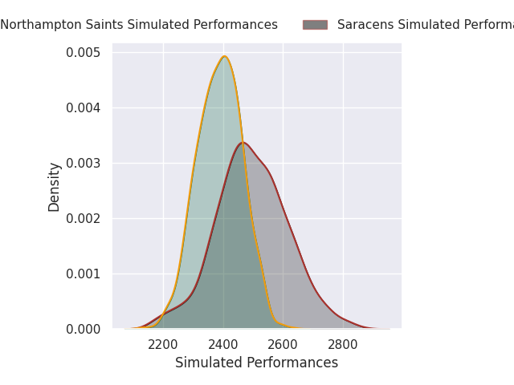
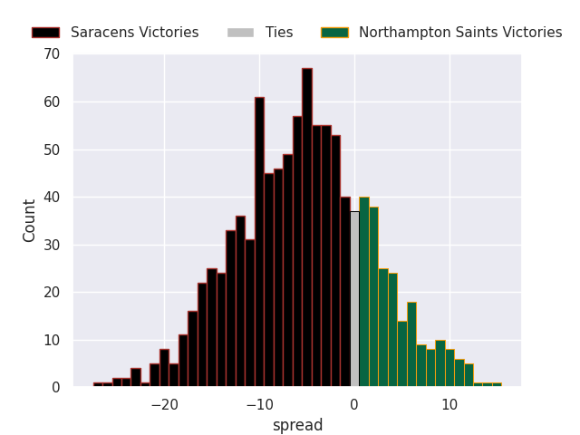
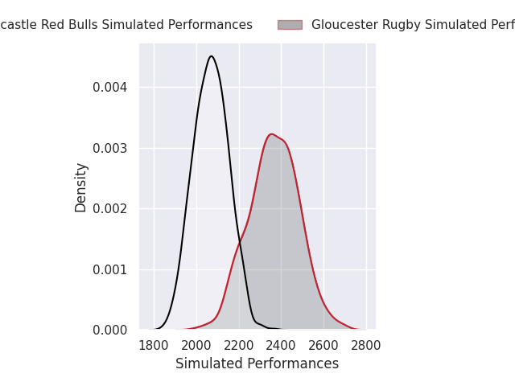
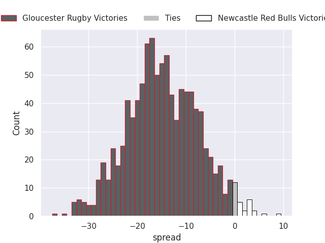

# Team Rankings

# Standings

## Projected Remaining Table

| Club                |   To Play |   Projected Wins |   Projected Differential |   Projected Losing Bonus Points | Projected Try Bonus Points   |   Projected Competition Points |
|:--------------------|----------:|-----------------:|-------------------------:|--------------------------------:|:-----------------------------|-------------------------------:|
| Leicester Tigers    |         6 |            4.399 |                   33.699 |                           1.076 |                              |                         19.098 |
| Saracens            |         6 |            4.411 |                   44.864 |                           0.964 |                              |                         18.93  |
| Bath Rugby          |         6 |            3.85  |                   21.52  |                           1.318 |                              |                         17.238 |
| Northampton Saints  |         6 |            3.651 |                   27.489 |                           1.265 |                              |                         16.275 |
| Exeter Chiefs       |         5 |            3.824 |                   45.855 |                           0.705 |                              |                         16.267 |
| Sale Sharks         |         5 |            2.464 |                   -3.027 |                           1.011 |                              |                         11.181 |
| Harlequins          |         6 |            1.871 |                  -20.097 |                           2.159 |                              |                         10.191 |
| Gloucester Rugby    |         6 |            2.05  |                  -19.769 |                           1.343 |                              |                          9.817 |
| Bristol Rugby       |         6 |            1.348 |                  -32.279 |                           2.082 |                              |                          7.956 |
| Newcastle Red Bulls |         6 |            0.211 |                  -98.255 |                           0.775 |                              |                          1.745 |

## Projected Total Table

| Club                |   Played |   Wins |   Point Differential |   Losing Bonus Points | Try Bonus Points   |   Competition Points |
|:--------------------|---------:|-------:|---------------------:|----------------------:|:-------------------|---------------------:|
| Leicester Tigers    |        6 |  4.399 |               33.699 |                 1.076 |                    |               19.098 |
| Saracens            |        6 |  4.411 |               44.864 |                 0.964 |                    |               18.93  |
| Bath Rugby          |        6 |  3.85  |               21.52  |                 1.318 |                    |               17.238 |
| Northampton Saints  |        6 |  3.651 |               27.489 |                 1.265 |                    |               16.275 |
| Exeter Chiefs       |        5 |  3.824 |               45.855 |                 0.705 |                    |               16.267 |
| Sale Sharks         |        5 |  2.464 |               -3.027 |                 1.011 |                    |               11.181 |
| Harlequins          |        6 |  1.871 |              -20.097 |                 2.159 |                    |               10.191 |
| Gloucester Rugby    |        6 |  2.05  |              -19.769 |                 1.343 |                    |                9.817 |
| Bristol Rugby       |        6 |  1.348 |              -32.279 |                 2.082 |                    |                7.956 |
| Newcastle Red Bulls |        6 |  0.211 |              -98.255 |                 0.775 |                    |                1.745 |

# Future Predictions

## Week 1

### Harlequins V Bath Rugby on 2026/09/25

Average Margin: Bath Rugby by 1.3

### Northampton Saints V Newcastle Red Bulls on 2026/09/25

Average Margin: Northampton Saints by 21.0

### Sale Sharks V Bristol Rugby on 2026/09/26

Average Margin: Sale Sharks by 6.1

### Exeter Chiefs V Gloucester Rugby on 2026/09/26

Average Margin: Exeter Chiefs by 13.2

### Leicester Tigers V Saracens on 2026/09/27

Average Margin: Leicester Tigers by 4.5

## Week 2

### Bath Rugby V Exeter Chiefs on 2026/10/02

Average Margin: Bath Rugby by 2.9

### Newcastle Red Bulls V Leicester Tigers on 2026/10/03

Average Margin: Leicester Tigers by 11.5

### Gloucester Rugby V Harlequins on 2026/10/03

Average Margin: Gloucester Rugby by 2.7

### Bristol Rugby V Northampton Saints on 2026/10/03

Average Margin: Northampton Saints by 1.8

### Saracens V Sale Sharks on 2026/10/04

Average Margin: Saracens by 10.6

## Week 3

### Leicester Tigers V Gloucester Rugby on 2026/10/09

Average Margin: Leicester Tigers by 11.4

### Saracens V Bristol Rugby on 2026/10/10

Average Margin: Saracens by 11.0

### Northampton Saints V Bath Rugby on 2026/10/10

Average Margin: Northampton Saints by 4.1

### Sale Sharks V Harlequins on 2026/10/11

Average Margin: Sale Sharks by 4.4

### Exeter Chiefs V Newcastle Red Bulls on 2026/10/11

Average Margin: Exeter Chiefs by 22.7

## Week 4

### Newcastle Red Bulls V Sale Sharks on 2026/10/23

Average Margin: Sale Sharks by 6.9

### Gloucester Rugby V Bath Rugby on 2026/10/23

Average Margin: Bath Rugby by 1.7

### Bristol Rugby V Exeter Chiefs on 2026/10/24

Average Margin: Exeter Chiefs by 2.3

### Leicester Tigers V Northampton Saints on 2026/10/24

Average Margin: Leicester Tigers by 5.1

### Harlequins V Saracens on 2026/10/25

Average Margin: Saracens by 1.1

## Week 5

### Bristol Rugby V Leicester Tigers on 2026/10/30

Average Margin: Leicester Tigers by 1.2

### Saracens V Newcastle Red Bulls on 2026/10/31

Average Margin: Saracens by 21.3

### Northampton Saints V Gloucester Rugby on 2026/10/31

Average Margin: Northampton Saints by 10.9

### Bath Rugby V Sale Sharks on 2026/10/31

Average Margin: Bath Rugby by 9.9

### Exeter Chiefs V Harlequins on 2026/10/31

Average Margin: Exeter Chiefs by 10.6

## Week 6

### Bath Rugby V Bristol Rugby on 2026/12/04

Average Margin: Bath Rugby by 9.9

### Harlequins V Leicester Tigers on 2026/12/05

Average Margin: Leicester Tigers by 0.0

### Saracens V Northampton Saints on 2026/12/05

Average Margin: Saracens by 5.4

### Gloucester Rugby V Newcastle Red Bulls on 2026/12/05

Average Margin: Gloucester Rugby by 14.8

