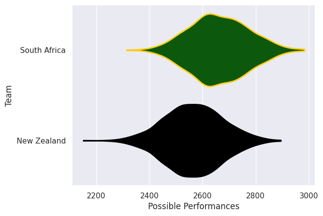

# Team Rankings

# Standings

## Current Standings

| Club         |   Played |   Wins |   Point Differential |   Losing Bonus Points |   Try Bonus Points |   Competition Points |
|:-------------|---------:|-------:|---------------------:|----------------------:|-------------------:|---------------------:|
| New Zealand  |        2 |      1 |                   10 |                     1 |                  2 |                    7 |
| South Africa |        2 |      1 |                  -10 |                     0 |                  1 |                    5 |

## Projected Remaining Table

| Club         |   To Play |   Projected Wins |   Projected Differential |   Projected Losing Bonus Points | Projected Try Bonus Points   |   Projected Competition Points |
|:-------------|----------:|-----------------:|-------------------------:|--------------------------------:|:-----------------------------|-------------------------------:|
| South Africa |         1 |            0.569 |                     2.04 |                           0.231 |                              |                          2.583 |
| New Zealand  |         1 |            0.393 |                    -2.04 |                           0.287 |                              |                          1.935 |

## Projected Total Table

| Club         |   Played |   Wins |   Point Differential |   Losing Bonus Points |   Try Bonus Points |   Competition Points |
|:-------------|---------:|-------:|---------------------:|----------------------:|-------------------:|---------------------:|
| New Zealand  |        3 |  1.393 |                 7.96 |                 1.287 |                  2 |                8.935 |
| South Africa |        3 |  1.569 |                -7.96 |                 0.231 |                  1 |                7.583 |

# Completed Match Review

| Model | Percent Correct Predictions | Spread Error |
| ------ | ------ | ------ |
| Club Level | 33.3% | 10.7 |
| Player Level: Lineup | nan% | nan |
| Player Level: Minutes | nan% | nan |

# Future Predictions

## Week 3

### South Africa V New Zealand on 2026/09/05

Average Margin: South Africa by 2.0

