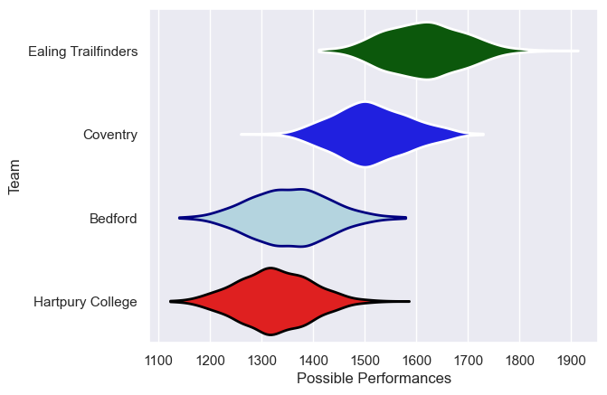
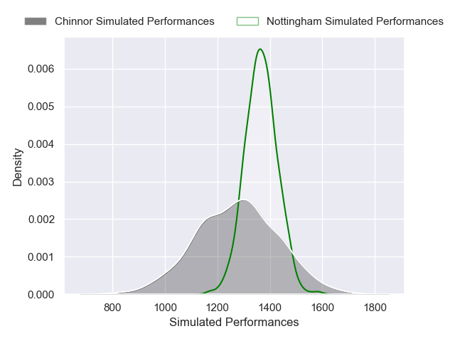
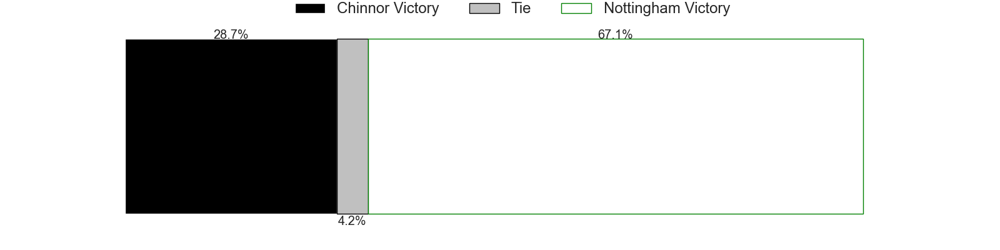
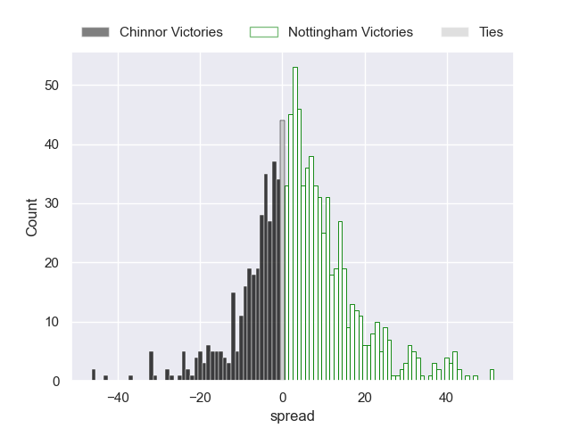

---  
title: "Greene King IPA Championship 2024 Status"  
date: 2024-12-13 6:00:00 -0500  
categories: model review projection  
layout: article  
aside:  
    toc: true  
---
# Current Team Rankings

# Standings

## Projected Total Table

| Club       |   Total Matches |   Wins |   Point Differential |   Losing Bonus Points |   Try Bonus Points |   Competition Points |
|:-----------|----------------:|-------:|---------------------:|----------------------:|-------------------:|---------------------:|
| Nottingham |               1 |    0.7 |              4.73184 |                   0.2 |                0.4 |                  3.4 |
| Chinnor    |               1 |    0.3 |             -4.73184 |                   0.3 |                0.2 |                  1.8 |

# Future Predictions

## Week 1

### Nottingham V Chinnor on 2024/12/13

Average Margin: Nottingham by 4.7

Average Scoreline: 28-23

