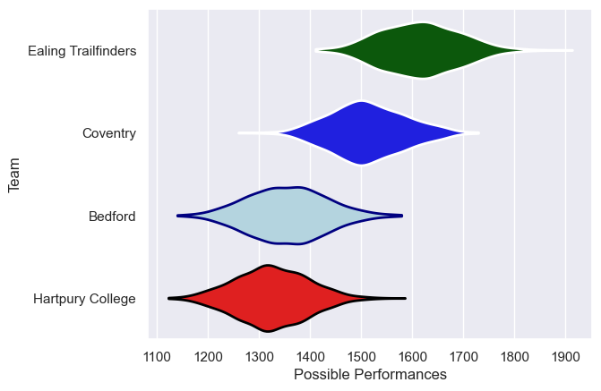
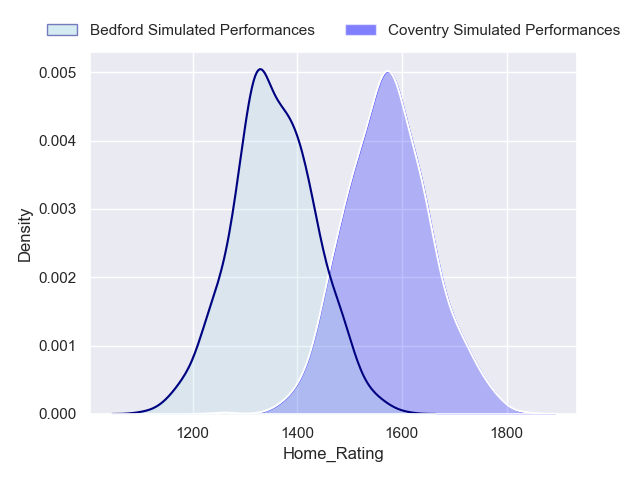
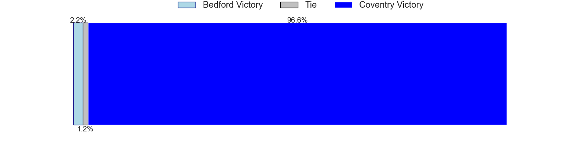
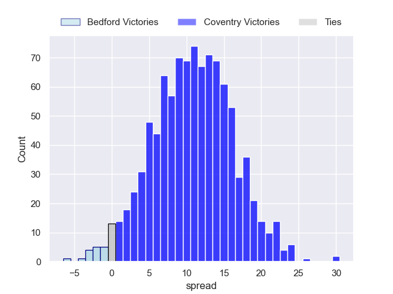

---  
title: "Greene King IPA Championship 2024 Status"  
date: 2024-09-27 6:00:00 -0500  
categories: model review projection  
layout: article  
aside:  
    toc: true  
---
# Current Team Rankings

# Standings

## Current Standings

| Club                |   Played |   Wins |   Point Differential |   Losing Bonus Points |   Try Bonus Points |   Competition Points |
|:--------------------|---------:|-------:|---------------------:|----------------------:|-------------------:|---------------------:|
| Ealing Trailfinders |        1 |      1 |                   34 |                     0 |                nan |                    4 |
| Hartpury College    |        1 |      0 |                  -34 |                     0 |                nan |                    0 |

## Projected Remaining Table

| Club     |   Matches Remaining |   Wins |   Point Differential |   Losing Bonus Points |   Try Bonus Points |   Competition Points |
|:---------|--------------------:|-------:|---------------------:|----------------------:|-------------------:|---------------------:|
| Coventry |                   4 |    3.9 |              44.9934 |                   0.1 |                3.1 |                 18.9 |
| Bedford  |                   4 |    0.1 |             -44.9934 |                   0.8 |                0.6 |                  1.7 |

## Projected Total Table

| Club                |   Total Matches |   Wins |   Point Differential |   Losing Bonus Points |   Try Bonus Points |   Competition Points |
|:--------------------|----------------:|-------:|---------------------:|----------------------:|-------------------:|---------------------:|
| Coventry            |               4 |    3.9 |              44.9934 |                   0.1 |                3.1 |                 18.9 |
| Ealing Trailfinders |               1 |    1   |              34      |                   0   |                0   |                  4   |
| Bedford             |               4 |    0.1 |             -44.9934 |                   0.8 |                0.6 |                  1.7 |
| Hartpury College    |               1 |    0   |             -34      |                   0   |                0   |                  0   |

# Completed Match Review

| Model | Percent Correct Predictions | Spread Error |
| ------ | ------ | ------ |
| Club Level | 100.0% | 16.4 |
| Player Level: Lineup | nan% | nan |
| Player Level: Minutes | nan% | nan |

# Future Predictions

## Week 2

### Coventry V Bedford on 2024/09/28

Average Margin: Coventry by 11.2

Average Scoreline: 29-18

### Coventry V Bedford on 2024/09/28

Average Margin: Coventry by 11.2

Average Scoreline: 29-18

### Coventry V Bedford on 2024/09/28

Average Margin: Coventry by 11.2

Average Scoreline: 29-18

### Coventry V Bedford on 2024/09/28

Average Margin: Coventry by 11.2

Average Scoreline: 29-18

