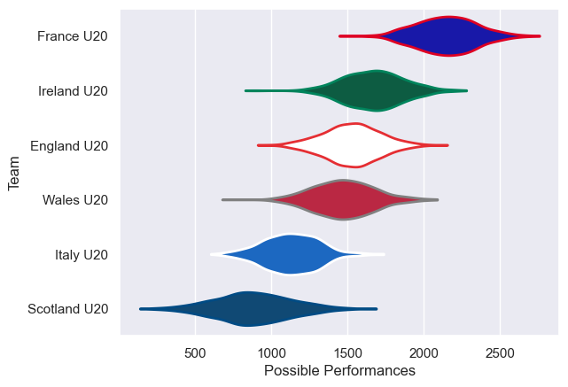
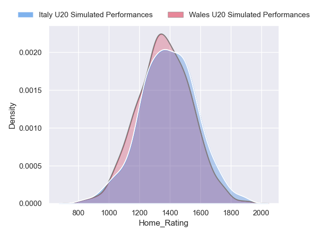
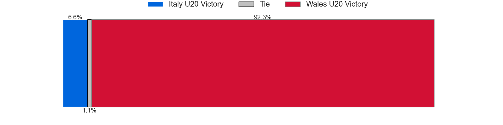
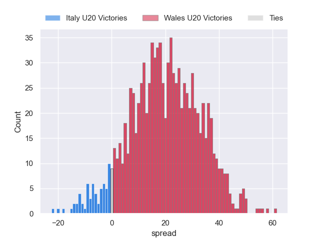
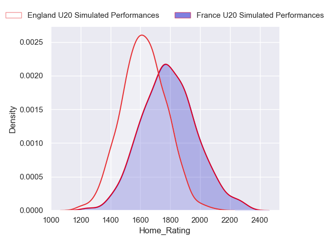
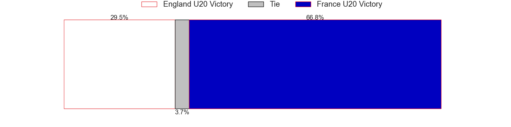
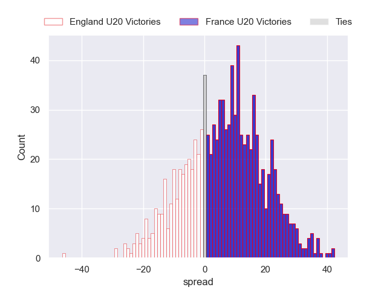
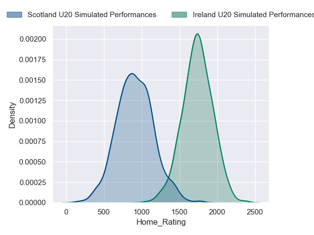

---  
title: "Guinness U20 Six Nations 2024 Status"  
date: 2024-03-11 6:00:00 -0500  
categories: model review projection  
layout: article  
aside:  
    toc: true  
---
# Current Team Rankings

# Standings

## Current Standings

| Club         |   Played |   Wins |   Point Differential |   Losing Bonus Points |   Try Bonus Points |   Competition Points |
|:-------------|---------:|-------:|---------------------:|----------------------:|-------------------:|---------------------:|
| England U20  |        4 |      3 |                   59 |                     0 |                nan |                   14 |
| Ireland U20  |        4 |      3 |                   42 |                     0 |                nan |                   14 |
| France U20   |        4 |      2 |                   39 |                     2 |                nan |                   10 |
| Italy U20    |        4 |      2 |                   10 |                     1 |                nan |                    9 |
| Wales U20    |        4 |      1 |                  -81 |                     0 |                nan |                    4 |
| Scotland U20 |        4 |      0 |                  -69 |                     0 |                nan |                    0 |

## Projected Remaining Table

| Club         |   Matches Remaining |   Wins |   Point Differential |   Losing Bonus Points |   Try Bonus Points |   Competition Points |
|:-------------|--------------------:|-------:|---------------------:|----------------------:|-------------------:|---------------------:|
| Ireland U20  |                   1 |    1   |             36.0213  |                   0   |                0.9 |                  4.9 |
| France U20   |                   1 |    0.8 |              8.38624 |                   0.1 |                0.3 |                  3.5 |
| Italy U20    |                   1 |    0.7 |              5.76138 |                   0.2 |                0.4 |                  3.3 |
| Wales U20    |                   1 |    0.3 |             -5.76138 |                   0.2 |                0.3 |                  1.7 |
| England U20  |                   1 |    0.2 |             -8.38624 |                   0.2 |                0.2 |                  1.4 |
| Scotland U20 |                   1 |    0   |            -36.0213  |                   0   |                0.1 |                  0.1 |

## Projected Total Table

| Club         |   Total Matches |   Wins |   Point Differential |   Losing Bonus Points |   Try Bonus Points |   Competition Points |
|:-------------|----------------:|-------:|---------------------:|----------------------:|-------------------:|---------------------:|
| Ireland U20  |               5 |    4   |              78.0213 |                   0   |                0.9 |                 18.9 |
| England U20  |               5 |    3.2 |              50.6138 |                   0.2 |                0.2 |                 15.4 |
| France U20   |               5 |    2.8 |              47.3862 |                   2.1 |                0.3 |                 13.5 |
| Italy U20    |               5 |    2.7 |              15.7614 |                   1.2 |                0.4 |                 12.3 |
| Wales U20    |               5 |    1.3 |             -86.7614 |                   0.2 |                0.3 |                  5.7 |
| Scotland U20 |               5 |    0   |            -105.021  |                   0   |                0.1 |                  0.1 |

# Completed Match Review

| Model | Percent Correct Predictions | Spread Error |
| ------ | ------ | ------ |
| Club Level | 75.0% | 24.4 |
| Player Level: Lineup | nan% | nan |
| Player Level: Minutes | nan% | nan |

# Future Predictions

## Week 5

### Wales U20 V Italy U20 on 2024/03/15

Average Margin: Italy U20 by 5.8

Average Scoreline: 31-25

### France U20 V England U20 on 2024/03/15

Average Margin: France U20 by 8.4

Average Scoreline: 28-20

### Ireland U20 V Scotland U20 on 2024/03/15

Average Margin: Ireland U20 by 36.0

Average Scoreline: 45-9

